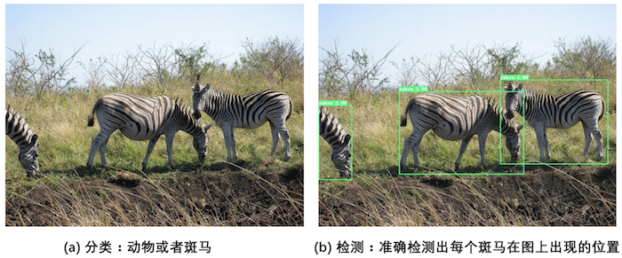
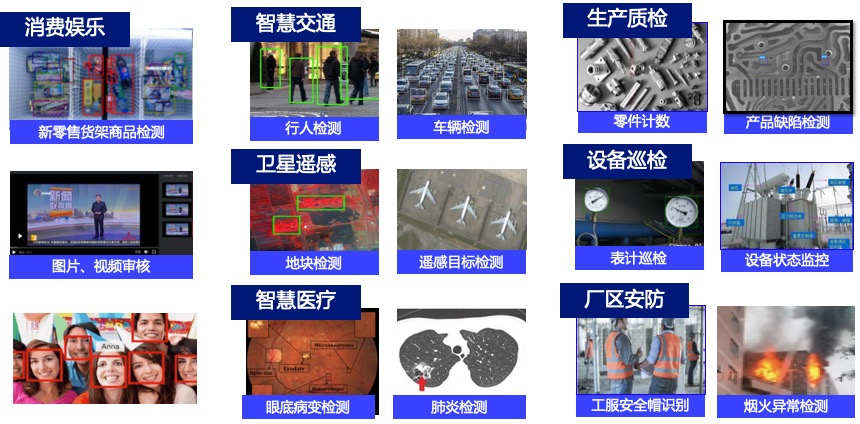
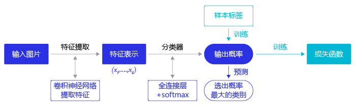
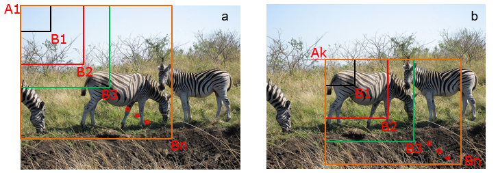
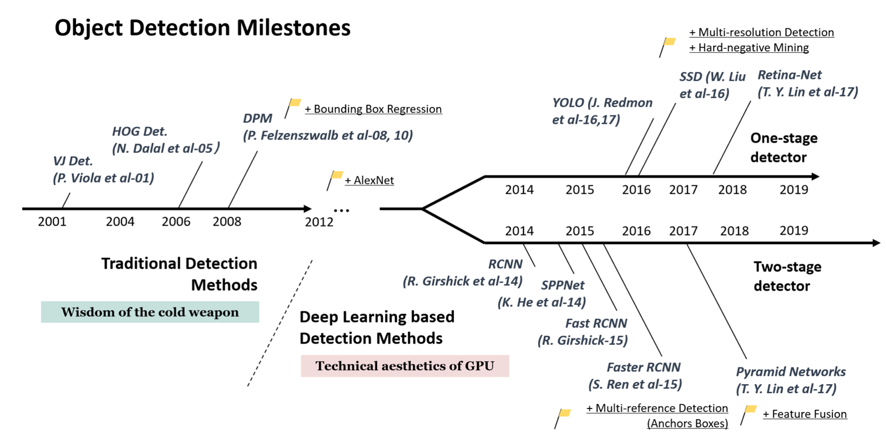
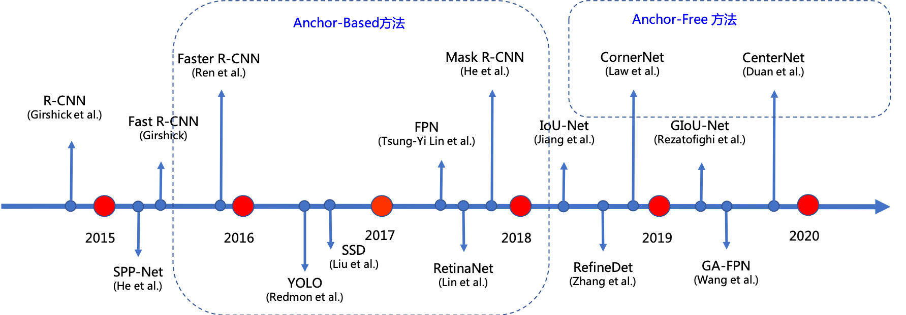

# 目标检测

对计算机而言，能够“看到”的是图像被编码之后的数字，它很难理解高层语义概念，比如图像或者视频帧中出现的目标是人还是物体，更无法定位目标出现在图像中哪个区域。目标检测的主要目的是让计算机可以自动识别图片或者视频帧中所有目标的类别，并在该目标周围绘制边界框，标示出每个目标的位置，如 **图1** 所示。

图1 图像分类和目标检测示意图

* 图1(a)是图像分类任务，只需对这张图片进行类别识别。 
* 图1(b)是目标检测任务，不仅要识别出这一张图片中的类别为斑马，还要标出图中斑马的位置。

## 应用场景

如 **图2** 所示，如今的目标检测不论在日常生活中还是工业生产中都有着非常多的应用场景。

- 消费娱乐：智能手机的人脸解锁以及支付APP中的人脸支付；自动售货机使用的商品检测；视频网站中图片、视频审核等；

- 智慧交通：自动驾驶中的行人检测、车辆检测、红绿灯检测等；

- 工业生产：工业生产中的零件计数、缺陷检测；设备巡检场景下的设备状态监控；厂区中的烟火检测、安全帽检测等；

- 智慧医疗：眼底、肺部等器官病变检测；新冠疫情中的口罩检测等。

  

图2 目标检测应用场景

## 目标检测发展历程

在图像分类任务中，我们会先使用卷积神经网络提取图像特征，然后再用这些特征预测分类概率，根据训练样本标签建立起分类损失函数，开启端到端的训练，如 **图3** 所示。

图3 图像分类流程示意图

但对于目标检测问题，按照 **图3** 的流程则行不通。因为在对整张图提取特征的过程中无法体现出不同目标之间的区别，最终也就没法分别标示出每个物体所在的位置。

为了解决这个问题，结合图片分类任务取得的成功经验，我们可以将目标检测任务进行拆分。假设我们使用某种方式在输入图片上生成一系列可能包含物体的区域，这些区域称为候选区域。对于每个候选区域，可以单独当成一幅图像来看待，使用图像分类模型对候选区域进行分类，看它属于哪个类别或者背景（即不包含任何物体的类别）。上一节我们已经学过如何解决图像分类任务，使用卷积神经网络对一幅图像进行分类不再是一件困难的事情。

那么，现在问题的关键就是如何产生候选区域？比如我们可以使用穷举法来产生候选区域，如 **图4** 所示。

图4 候选区域

A为图像上的某个像素点，B为A右下方另外一个像素点，A、B两点可以确定一个矩形框，记作AB。

* 如图4(a)所示：A在图片左上角位置，B遍历除A之外的所有位置，生成矩形框$A_1B_1, …, A_1B_n, …$
* 如图4(b)所示：A在图片中间某个位置，B遍历A右下方所有位置，生成矩形框$A_kB_1, …, A_kB_n, …$

当A遍历图像上所有像素点，B则遍历它右下方所有的像素点，最终生成的矩形框集合${A_iB_j}$将会包含图像上所有可以选择的区域。

只要我们对每个候选区域的分类足够的准确，则一定能找到跟实际物体足够接近的区域来。穷举法也许能得到正确的预测结果，但其计算量也是非常巨大的，其所生成的总候选区域数目约为$\frac{W^2 H^2}{4}$，假设$H=W=100$，总数将会达到$2.5 \times 10^{7}$个，如此多的候选区域使得这种方法几乎没有什么实用性。但是通过这种方式，我们可以看出，假设分类任务完成的足够完美，从理论上来讲检测任务也是可以解决的，亟待解决的问题是如何设计出合适的方法来产生候选区域。

科学家们开始思考，是否可以应用传统图像算法先产生候选区域，然后再用卷积神经网络对这些区域进行分类？

* 2013年，Ross Girshick等人于首次将CNN的方法应用在目标检测任务上，他们使用传统图像算法Selective Search产生候选区域，取得了极大的成功，这就是对目标检测领域影响深远的区域卷积神经网络(R-CNN[1])模型。
* 2015年，Ross Girshick对此方法进行了改进，提出了Fast R-CNN[2]模型。通过将不同区域的物体共用卷积层的计算，大大缩减了计算量，提高了处理速度，而且还引入了调整目标物体位置的回归方法，进一步提高了位置预测的准确性。
* 2015年，Shaoqing Ren等人提出了Faster R-CNN[3]模型，提出了RPN的方法来产生物体的候选区域，这一方法不再需要使用传统的图像处理算法来产生候选区域，进一步提升了处理速度。
* 2017年，Kaiming He等人提出了Mask R-CNN[4]模型，只需要在Faster R-CNN模型上添加比较少的计算量，就可以同时实现目标检测和物体实例分割两个任务。

以上都是基于R-CNN系列的著名模型，对目标检测方向的发展有着较大的影响力。此外，还有一些其他模型，比如SSD[5]、YOLO[6,7,8]、R-FCN[9]等也都是目标检测领域流行的模型结构。**图5** 为目标检测综述文章[10]中的一幅图，梳理了近些年目标检测算法的发展流程。

图5 目标检测算法发展流程

其中，由于上文所述的R-CNN的系列算法将目标检测任务分成两个阶段，先在图像上产生候选区域，再对候选区域进行分类并预测目标物体位置，所以它们通常被叫做**两阶段检测算法**。而SSD和YOLO系列算法则是使用一个网络同时产生候选区域并预测出物体的类别和位置，所以它们通常被叫做**单阶段检测算法**。

上文中提到，穷举法来获取候选区域是不现实的。因此在后来的经典算法中，常用的一个思路是使用Anchor提取候选目标框，Anchor是预先设定好比例的一组候选框集合，在图片上进行滑动就可以获取候选区域了。

由于这类算法都是使用Anchor提取候选目标框。在特征图的每一个点上，对Anchor进行分类和回归。所以这些算法也统称为基于Anchor的算法。

但是这种基于Anchor的方法，在实际应用中存在一些问题:
- Anchor是人为手工设计的，那我们换个数据集，应该设置多少？设置多大？长宽比如何设置？
- Anchor这种密集框，数量多，训练时如何选择正负样本？
- Anchor设置也导致超参数较多，实际业务扩展中，相对来说，就有点麻烦。

由于上述缺点的存在，近些年研究者们还提出了另外一类效果优异的算法，这些算法不再使用anchor回归预测框，因此也称作Anchor-free的算法，例如：CornerNet[11]和CenterNet[12]等。**图6** 为大家简单罗列了经典的Anchor-base和Anchor-free的算法。

图6 基于深度学习的目标检测算法发展流程

Anchor-base和Anchor-free的算法也各具优势，下表为大家简单对比了几类算法各自的优缺点。

| | Anchor-Based单阶段| Anchor-Based两阶段| Anchor-Free|
| -------- | -------- | -------- | -------- |
| 网络结构| 简单| 复杂| 简单|
| 精度| 优| 更优| 较优|
| 预测速度| 快| 稍慢| 快|
| 超参数| 较多| 多| 相对少|
| 扩展性| 一般| 一般| 较好|

## 常用数据集
在目标检测领域，常用的开源数据集主要包含以下4个：Pascal VOC[13]、COCO[14]、Object365[15]、OpenImages[16]。这些数据集的类别数、图片数、目标框的总数量各不相同，因此难易也各不相同。这里整理了4个数据集的具体情况，如下表所示。

| 数据集 | 类别数 | train图片数，box数 | val图片数，box数 | boxes/Image |
| -------- | -------- | -------- | -------- | -------- |
|Pascal VOC-2012 |20|5717, 1.3万+| 5823， 1.3万+|2.4|
|COCO|80|118287， 4万+     |5000，3.6万+|7.3|
|Object365|365|600k, 9623k|38k, 479k|16|
|OpenImages18|500|1643042, 86万+|100000，69.6万+|7.0|

- Pascal VOC-2012：VOC数据集是 PASCAL VOC挑战赛使用的数据集，包含了20种常见类别的图片，是目标检测领域的经典学术数据集之一。
- COCO：COCO数据集是一个经典的大规模目标检测、分割、姿态估计数据集，图片数据主要从复杂的日常场景中截取，共80类。目前的学术论文经常会使用COCO数据集进行精度评测。
- Object365：旷世科技发布的大规模通用物体检测数据集，共365类。
- OpenImages18：谷歌发布的超大规模数据集，共500类。

## 参考文献

[1] [Rich feature hierarchies for accurate object detection and semantic segmentation](https://arxiv.org/abs/1311.2524) 

[2] [Fast R-CNN](https://arxiv.org/abs/1504.08083) 

[3] [Faster R-CNN: Towards Real-Time Object Detection with Region Proposal Networks](https://arxiv.org/abs/1506.01497) 

[4] [Mask R-CNN](https://arxiv.org/abs/1703.06870) 

[5] [SSD: Single Shot MultiBox Detector](https://arxiv.org/abs/1512.02325)

[6] [You Only Look Once: Unified, Real-Time Object Detection](https://arxiv.org/abs/1506.02640v5)

[7] [YOLO9000: Better, Faster, Stronger](https://arxiv.org/abs/1612.08242)

[8] [YOLOv3: An Incremental Improvement](https://arxiv.org/abs/1804.02767)

[9] [R-FCN: Object Detection via Region-based Fully Convolutional Networks](https://arxiv.org/abs/1605.06409)

[10] [Object Detection in 20 Years: A Survey ](https://arxiv.org/abs/1905.05055)

[11] [CornerNet: Detecting Objects as Paired Keypoints](https://arxiv.org/abs/1808.01244)

[12] [Objects as Points](https://arxiv.org/pdf/1904.07850.pdf)

[13] [Pascal VOC](http://host.robots.ox.ac.uk/pascal/VOC/voc2012/index.html)

[14] [COCO](http://cocodataset.org/#home)

[15] [Object365](http://www.objects365.org/download.html)

[16] [OpenImages](http://storage.googleapis.com/openimages/web/download.html)

