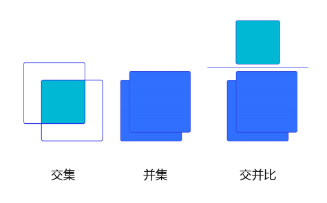
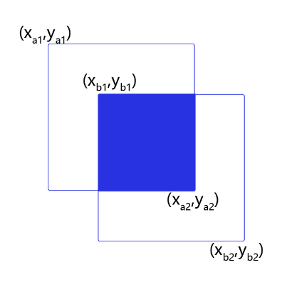
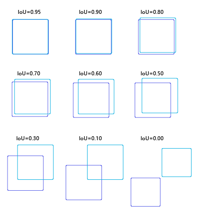

# 交并比

在目标检测任务中，通常会使用交并比（Intersection of Union，IoU）作为衡量指标，来衡量两个矩形框之间的关系。例如在基于锚框的目标检测算法中，我们知道当锚框中包含物体时，我们需要预测物体类别并微调锚框的坐标，从而获得最终的预测框。此时，判断锚框中是否包含物体就需要用到交并比，当锚框与真实框交并比足够大时，我们就可以认为锚框中包含了该物体；而锚框与真实框交并比很小时，我们就可以认为锚框中不包含该物体。此外，在后面NMS的计算过程中，同样也要使用交并比来判断不同矩形框是否重叠。

交并比这一概念来源于数学中的集合，用来描述两个集合$A$和$B$之间的关系，它等于两个集合的交集里面所包含的元素个数，除以它们的并集里面所包含的元素个数，具体计算公式如下：

$$IoU = \frac{A\cap B}{A \cup B}$$

我们将用这个概念来描述两个框之间的重合度。两个框可以看成是两个像素的集合，它们的交并比等于两个框重合部分的面积除以它们合并起来的面积。下图“交集”中青色区域是两个框的重合面积，下图“并集”中蓝色区域是两个框的相并面积。用这两个面积相除即可得到它们之间的交并比，如 **图1** 所示。



图1 交并比

假设两个矩形框A和B的位置分别为：

$$A:  [x_{a1}, y_{a1}, x_{a2}, y_{a2}]$$

$$B:  [x_{b1}, y_{b1}, x_{b2}, y_{b2}]$$

假如位置关系如 **图2** 所示：



图2 计算交并比

如果二者有相交部分，则相交部分左上角坐标为：

$$x_1 = max(x_{a1}, x_{b1}), \ \ \ \ \ y_1 = max(y_{a1}, y_{b1})$$

相交部分右下角坐标为：

$$x_2 = min(x_{a2}, x_{b2}), \ \ \ \ \ y_2 = min(y_{a2}, y_{b2})$$

计算先交部分面积：

$$intersection = max(x_2 - x_1 + 1.0, 0) \cdot max(y_2 - y_1 + 1.0, 0)$$

矩形框A和B的面积分别是：

$$S_A = (x_{a2} - x_{a1} + 1.0) \cdot (y_{a2} - y_{a1} + 1.0)$$

$$S_B = (x_{b2} - x_{b1} + 1.0) \cdot (y_{b2} - y_{b1} + 1.0)$$

计算相并部分面积：

$$union = S_A + S_B - intersection$$

计算交并比：


$$IoU = \frac{intersection}{union}$$

交并比实现代码如下：

- 当矩形框的坐标形式为xyxy时


```python
import numpy as np

# 计算IoU，矩形框的坐标形式为xyxy
def box_iou_xyxy(box1, box2):
    # 获取box1左上角和右下角的坐标
    x1min, y1min, x1max, y1max = box1[0], box1[1], box1[2], box1[3]
    # 计算box1的面积
    s1 = (y1max - y1min + 1.) * (x1max - x1min + 1.)
    # 获取box2左上角和右下角的坐标
    x2min, y2min, x2max, y2max = box2[0], box2[1], box2[2], box2[3]
    # 计算box2的面积
    s2 = (y2max - y2min + 1.) * (x2max - x2min + 1.)
    
    # 计算相交矩形框的坐标
    xmin = np.maximum(x1min, x2min)
    ymin = np.maximum(y1min, y2min)
    xmax = np.minimum(x1max, x2max)
    ymax = np.minimum(y1max, y2max)
    # 计算相交矩形行的高度、宽度、面积
    inter_h = np.maximum(ymax - ymin + 1., 0.)
    inter_w = np.maximum(xmax - xmin + 1., 0.)
    intersection = inter_h * inter_w
    # 计算相并面积
    union = s1 + s2 - intersection
    # 计算交并比
    iou = intersection / union
    return iou


bbox1 = [100., 100., 200., 200.]
bbox2 = [120., 120., 220., 220.]
iou = box_iou_xyxy(bbox1, bbox2)
print('IoU is {}'.format(iou))  
```

- 当矩形框的坐标形式为xywh时

```Python
import numpy as np

# 计算IoU，矩形框的坐标形式为xywh
def box_iou_xywh(box1, box2):
    x1min, y1min = box1[0] - box1[2]/2.0, box1[1] - box1[3]/2.0
    x1max, y1max = box1[0] + box1[2]/2.0, box1[1] + box1[3]/2.0
    s1 = box1[2] * box1[3]

    x2min, y2min = box2[0] - box2[2]/2.0, box2[1] - box2[3]/2.0
    x2max, y2max = box2[0] + box2[2]/2.0, box2[1] + box2[3]/2.0
    s2 = box2[2] * box2[3]

    xmin = np.maximum(x1min, x2min)
    ymin = np.maximum(y1min, y2min)
    xmax = np.minimum(x1max, x2max)
    ymax = np.minimum(y1max, y2max)
    inter_h = np.maximum(ymax - ymin, 0.)
    inter_w = np.maximum(xmax - xmin, 0.)
    intersection = inter_h * inter_w

    union = s1 + s2 - intersection
    iou = intersection / union
    return iou

bbox1 = [100., 100., 200., 200.]
bbox2 = [120., 120., 220., 220.]
iou = box_iou_xywh(bbox1, bbox2)
print('IoU is {}'.format(iou))  
```

为了直观的展示交并比的大小跟重合程度之间的关系，**图3** 示意了不同交并比下两个框之间的相对位置关系，从 IoU = 0.95 到 IoU = 0。



图3 不同交并比下两个框之间相对位置示意图

------

**问题：**

1. 什么情况下两个矩形框的IoU等于1？ 

   答案：两个矩形框完全重合。

1. 什么情况下两个矩形框的IoU等于0？

   答案：两个矩形框完全不相交。

