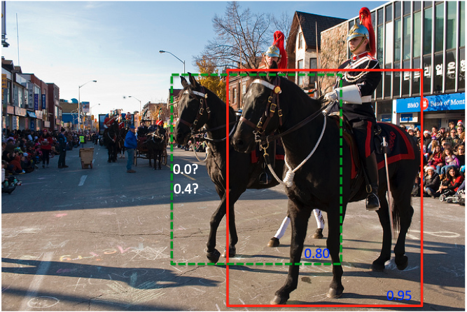

# Soft NMS

## Soft NMS 提出背景

NMS（非极大值抑制）方法是目标检测任务中常用的后处理方法，其基本思想是：如果有多个预测框都对应同一个物体，则只选出得分最高的那个预测框，剩下的预测框被丢弃掉。在这种方法的处理下，可以有效地减少冗余的检测框。但是，传统的 NMS 算法会存在以下缺点：IOU阈值难以确定，阈值太小，则容易发生漏检现象，当两个相同类别的物体重叠非常多的时候，类别得分较低的物体则会被舍弃；阈值太大，则难以消除大部分冗余框。

因此，在《Improving Object Detection With One Line of Code》[1]论文中，作者提出了 Soft NMS 方法来有效减轻上述问题。

## Soft NMS 算法流程

假设当前得分最高的检测框为$M$，对于另一个类别得分为 $s_i$ 的检测框 $b_i$，传统的 NMS 算法的计算方式可以表示为下式：

$$
s_i = \{\begin{matrix}
 s_i,iou(M,b_i)<N_t\\ 
 0,iou(M,b_i)\ge N_t
\end{matrix}
$$
其中，$N_t$ 为设定好的IOU阈值。

而 Soft NMS 算法的计算方式可以表示为下式：

$$
s_i = \{\begin{matrix} 
 s_i,iou(M,b_i)<N_t\\ 
 s_i(1-iou(M,b_i)),iou(M,b_i)\ge N_t
 \end{matrix}
$$
这里其实我们就可以看出两个方法的区别了。传统的 NMS 算法中，如果得分较低的检测框与得分最高的检测框的IOU大于阈值，则得分较低的检测框就会直接被舍弃掉；而 Soft NMS 算法中，没有将得分较低的检测框得分直接置0，而是将其降低。具体来说，Soft NMS 算法中，最终的边框得分是依赖原始得分与IOU结果共同决定的，对原始得分进行了线性衰减。

但是，如果使用上述公式进行 Soft NMS 的计算，当IOU大于阈值时，边框得分会发生一个较大的变化。此时，检测结果有可能会也就会因此受到较大的影响。因此， Soft NMS 算法中，还提出了另一种边框得分的计算方式，如下式所示。
$$
s_i = s_ie^{-\frac {{iou(M,b_i)^2}}{\sigma}},\forall b_i\notin D
$$
此时，新的边界框得分变化较小，在后续的计算过程中也就又有了被计算为正确检测框的机会。

## Soft NMS 算法示例

这里使用一个简单示例来说明 Soft NMS 算法的计算过程以及其与标准NMS算法的差异。

图1 SoftNMS算法示例

假设使用马匹检测模型对上述图像进行预测，得到如上的两个检测结果。其中红色检测框中的马匹类别得分为0.95，绿色虚线检测框中的马匹类别得分为0.8。可以看到，距离镜头更近的马匹几乎将距离镜头远的马匹完全遮挡住了，此时，两个检测框的IOU是非常大的。

在传统NMS算法中，对于这种检测框的IOU非常大，超过预先设定的阈值的情况，会仅仅保留得分最大的检测框，将得分较小的检测框的得分直接置0。此时，绿色虚线框中的马匹也就直接被舍弃掉了。但是，这两个检测框本身分别对应了两个不同的马匹，因此，这种NMS的方法会造成漏检的现象。

而在SoftNMS算法中，绿色虚线的检测框对应的新得分则不会被置0，而是使用上文中提到的两种计算方式进行计算。此时，绿色虚线框中的马匹不会直接被舍弃掉，而是降低了类别得分，继续参与后续计算。对应原图中的情况，两个马匹则有很大的概率在最后同时被保留，避免了漏检现象的发生。

## 参考文献

[1] [《Improving Object Detection With One Line of Code》](https://link.zhihu.com/?target=http%3A//cn.arxiv.org/abs/1704.04503)