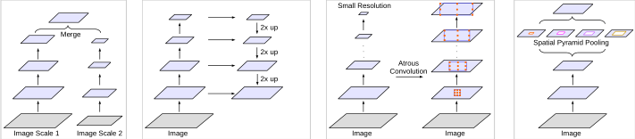
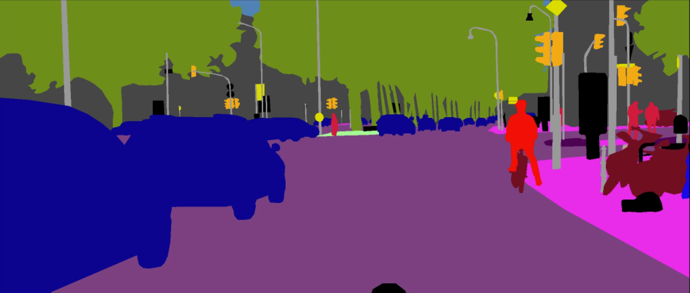
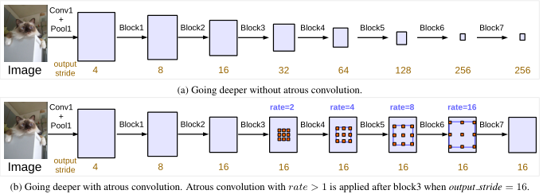
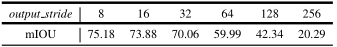
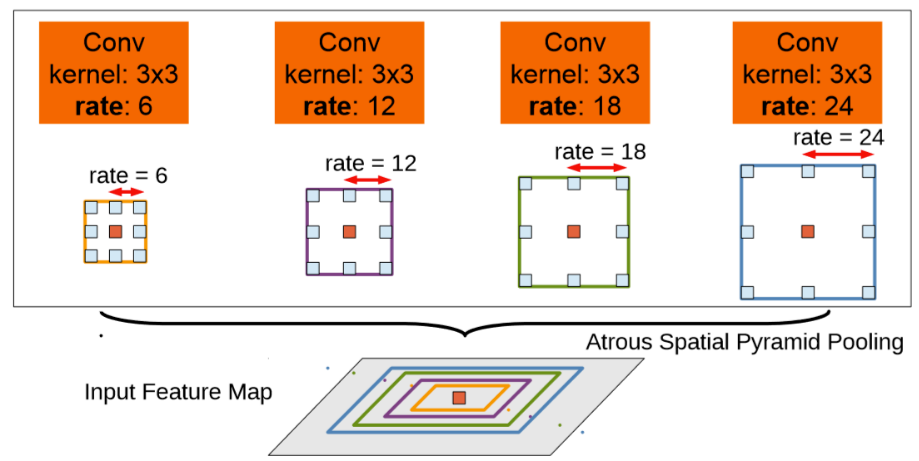
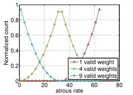
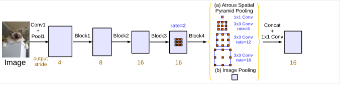
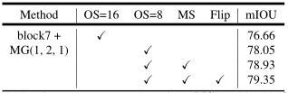
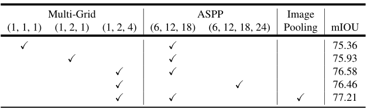
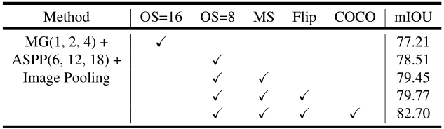

# DeepLabV3深入解读

## 1、DeepLab系列简介

### 1.1.DeepLabV1

作者发现Deep Convolutional Neural Networks (DCNNs) 能够很好的处理的图像级别的分类问题，因为它具有很好的平移不变性（空间细节信息已高度抽象），但是DCNNs很难处理像素级别的分类问题，例如姿态估计和语义分割，它们需要准确的位置信息。

#### **1.1.1创新点：**

- 将深度神经网络DCNN与全连接CRF结合起来，提高图像分割的分割精度。
- 提出空洞卷积的思想。
- 应用尝试了多尺度、多层次的信息融合。

#### **1.1.2. 动机：**

DCNN应用在语义分割任务上存在两个缺陷：

- 重复堆叠的**池化**和**下采样**操作导致分辨率大幅下降，位置信息丢失难以恢复。
- 从分类器获得以对象为中心的决策需要空间转换的不变性，忽略对细节处的把控，这从本质上限制了DCNN模型的空间准确性。

分类任务具有空间不变性，图像的仿射变换不会影响最后的分类结果，而且恰恰通过仿射变换等操作（数据增广）可以增加数据量，提高模型的精度；但是像分割和检测这类问题，不具有空间不变性。

#### 1.1.3. 应对策略：

- 空洞卷积
- Fully-connected Conditional Random Field (CRF)

### 1.2.DeepLabV2

#### **1.2.1.创新点：**

- **空洞卷积，作为密集预测任务的强大工具**。空洞卷积能够明确地控制DCNN内计算特征响应的分辨率。它还允许我们有效地扩大滤波器的视野以并入较大的上下文，而不增加参数的数量或计算量。
- **提出了空洞空间卷积池化金字塔(atrous spatial pyramid pooling (ASPP))，以多尺度的信息得到更精确的分割结果**。ASPP并行的采用多个采样率的空洞卷积层来探测，以多个比例捕捉对象以及图像上下文。
- **通过组合DCNN和概率图模型（CRF），改进分割边界结果**。在DCNN中最大池化和下采样组合实现可平移不变性，但这对精度是有影响的。通过将最终的DCNN层响应与全连接的CRF结合来克服这个问题。

#### **1.2.2.动机**

DCNNs中语义分割存在三个挑战：

- 连续下采样和池化操作，导致最后特征图分辨率低。
- 图像中存在多尺度的物体（**相比V1而言提出的新的挑战**） 
- 空间不变性导致细节信息丢失

#### 1.2.3. 应对策略：

- 移除部分池化操作，使用空洞卷积。 
- 利用不同膨胀因子的空洞卷积融合多尺度信息—atrous spatial pyramid pooling(ASPP)（**新的创新点**）
- 全连接CRF。

### 1.3.DeepLabV3

#### **1.3.1创新点：**

- 增加了多尺度(multiple scales)分割物体的模块
- 设计了串行和并行的空洞卷积模块，采用多种不同的atrous rates（采样率）来获取多尺度的内容信息

#### **1.3.2. 动机：**

DCNN中语义分割存在三个挑战：

- 连续下采用和重复池化，导致最后特征图分辨率低
- 图像中存在多尺度的物体


#### 1.3.3. 应对策略：

- 使用空洞卷积，防止分辨率过低情况
- 串联不同膨胀率的空洞卷积或者并行不同膨胀率的空洞卷积（v2的ASPP），来获取更多上下文信息

#### 1.3.4. 主要贡献：

- 重新讨论了空洞卷积的使用，这让我们在级联模块和空间金字塔池化的框架下，能够获取更大的感受野从而获取多尺度信息
- 改进了ASPP模块：由不同采样率的空洞卷积和BN层组成，我们尝试以级联或并行的方式布局模块
- 讨论了一个重要问题：使用大采样率的3×3的空洞卷积，因为图像边界的原因无法捕捉远距离信息，会退化为1×1的卷积, 作者提出将图像级特征融合到ASPP模块中
-  阐述了训练细节并分享了训练经验，论文提出的"DeepLabv3"改进了以前的工作，获得了很好的结果

### 1.4.DeepLabV3+

#### **1.4.1.创新点：**

- 更深的Xception结构，不同的地方在于不修改entry flow network的结构，为了快速计算和有效的使用内存
- 所有的max pooling结构被stride=2的深度可分离卷积代替
- 每个3x3的depthwise convolution都跟BN和Relu
- 将改进后的Xception作为encodet主干网络，替换原本DeepLabv3的ResNet101

#### **1.4.2. 动机：**

语义分割主要面临两个问题：

- 物体的多尺度问题（DeepLabV3解决）
- DCNN的多次下采样会造成特征图分辨率变小，导致预测精度降低，边界信息丢失（DeepLabV3+解决目标）

#### 1.4.3. 应对策略：

- 改进Xception，层数增加
- 将所有最大值池化层替换为带步长的深度可分离卷积层

## 2、DeepLabV3详解

### **2.1.提出问题**

首先，语义分割问题存在两大挑战：

- 第一个挑战：连续池化操作或卷积中的stride导致的特征分辨率降低。这使得DCNN能够学习更抽象的特征表示。然而，这种不变性可能会阻碍密集预测任务，因为不变性也导致了详细空间信息的不确定。为了克服这个问题，提倡使用空洞卷积。
- 第二个挑战：多尺度物体的存在。几种方法已经被提出来处理这个问题，在本文中我们主要考虑了这些工作中的四种类型，如图1所示。



<center>图1 用于捕获多尺度上下文的代替体系结构</center><br></br>


- 第一种：Image Pyramid，将输入图片放缩成不同比例，分别应用在DCNN上，将预测结果融合得到最终输出
- 第二种：Encoder-Decoder，将Encoder阶段的多尺度特征运用到Decoder阶段上来恢复空间分辨率
- 第三种：在原始模型的顶端叠加额外的模块，以捕捉像素间长距离信息。例如Dense CRF，或者叠加一些其他的卷积层
- 第四种：Spatial Pyramid Pooling空间金字塔池化，使用不同采样率和多种视野的卷积核，以捕捉多尺度对象

DeepLabV3的提出是为了解决多尺度下的目标分割问题。如图2所示，不同目标在图中的尺寸大小不同，这也导致模型考虑不同尺寸的分割精度。



<center>图2 多尺度目标分割示例</center><br></br>


### **2.2.提出解决方案**

#### 	2.2.1.用级联的方式设计了空洞卷积模块

具体而言，DeepLabV3取ResNet中最后一个block(ResNet的block4)，并将他们级联到了一起，如图3所示。



<center>图3 带Atrous和不带Atrous卷积的级联模块</center><br></br>


有三个3×3卷积在这些块中，除了最后一个块，其余的模块中最后的一个卷积步长为2，类似于原来的ResNet。这么做背后的动机是，引入的stride使得更深的模块更容易捕获长距离的信息。如图3(a)，整个图像的特征都可以汇聚在最后一个小分辨率的特征图中。

然而，我们发现连续的stride对语义分割是有害的，会造成细节信息的丢失(如下表)。



<center>表1 使用ResNet-50和block7 和不同的输出步长的更深层空洞卷积</center><br></br>


从表中看得出，输出步长out_stride = 8时占用更多的内存，但同时带来了更好的性能。例如图3(b)中，输出步长为out_stride = 16。这样不增加参数量和计算量的同时有效的缩小了步幅。

#### 2.2.2. 使用了Multi-Grid 策略

受到了采用不同大小网格层次结构的多重网格方法的启发，我们提出的模型在block4和block7中采用了不同的空洞率。

特别的，我们定义$ Multi\_Grid = ({r_1},{r_2},{r_3}) $为block4到block7内三个卷积层的unit rates。卷积层的最终空洞率等于unit rate和corresponding rate的乘积。例如，当$  output\_stride = 16,Multi\_Grid = (1,2,4)$，三个卷积就会在block4有。$  rates = 2 \cdot (1,2,4) = (2,4,8)$

#### *2.2.3.将 batch normalization 加入到 ASPP模块.*

#### Atrous Spatial Pyramid Pooling(ASPP):



<center>图6 Deeplab系列ASPP结构</center><br></br>


上图是DeeplabV2中的ASPP，在特征顶部映射图使用了四中不同采样率的空洞卷积。我这表明以不同尺度采样时有效的，在Deeolabv3中向ASPP中添加了BN层。不同采样率的空洞卷积可以有效捕获多尺度信息，但会发现随着采样率的增加，滤波器有效权重（权重有效的应用在特征区域，而不是填充0）逐渐变小。

当output_stride=8时，加倍了采样率。所有特征通过1x1级联到一起，生成最终的分数。

ASPPModule代码：

```python
class ASPPModule(nn.Layer):
    """
    Atrous Spatial Pyramid Pooling.
    Args:
        aspp_ratios (tuple): The dilation rate using in ASSP module.
        in_channels (int): The number of input channels.
        out_channels (int): The number of output channels.
        align_corners (bool): An argument of F.interpolate. It should be set to False when the output size of feature
            is even, e.g. 1024x512, otherwise it is True, e.g. 769x769.
        use_sep_conv (bool, optional): If using separable conv in ASPP module. Default: False.
        image_pooling (bool, optional): If augmented with image-level features. Default: False
    """

    def __init__(self,
                 aspp_ratios,
                 in_channels,
                 out_channels,
                 align_corners,
                 use_sep_conv=False,
                 image_pooling=False,
                 data_format='NCHW'):
        super().__init__()

        self.align_corners = align_corners
        self.data_format = data_format
        self.aspp_blocks = nn.LayerList()

        for ratio in aspp_ratios:
            if use_sep_conv and ratio > 1:
                conv_func = layers.SeparableConvBNReLU
            else:
                conv_func = layers.ConvBNReLU

            block = conv_func(
                in_channels=in_channels,
                out_channels=out_channels,
                kernel_size=1 if ratio == 1 else 3,
                dilation=ratio,
                padding=0 if ratio == 1 else ratio,
                data_format=data_format)
            self.aspp_blocks.append(block)

        out_size = len(self.aspp_blocks)

        if image_pooling:
            self.global_avg_pool = nn.Sequential(
                nn.AdaptiveAvgPool2D(
                    output_size=(1, 1), data_format=data_format),
                layers.ConvBNReLU(
                    in_channels,
                    out_channels,
                    kernel_size=1,
                    bias_attr=False,
                    data_format=data_format))
            out_size += 1
        self.image_pooling = image_pooling

        self.conv_bn_relu = layers.ConvBNReLU(
            in_channels=out_channels * out_size,
            out_channels=out_channels,
            kernel_size=1,
            data_format=data_format)

        self.dropout = nn.Dropout(p=0.1)  # drop rate

    def forward(self, x):
        outputs = []
        if self.data_format == 'NCHW':
            interpolate_shape = paddle.shape(x)[2:]
            axis = 1
        else:
            interpolate_shape = paddle.shape(x)[1:3]
            axis = -1
        for block in self.aspp_blocks:
            y = block(x)
            y = F.interpolate(
                y,
                interpolate_shape,
                mode='bilinear',
                align_corners=self.align_corners,
                data_format=self.data_format)
            outputs.append(y)

        if self.image_pooling:
            img_avg = self.global_avg_pool(x)
            img_avg = F.interpolate(
                img_avg,
                interpolate_shape,
                mode='bilinear',
                align_corners=self.align_corners,
                data_format=self.data_format)
            outputs.append(img_avg)

        x = paddle.concat(outputs, axis=axis)
        x = self.conv_bn_relu(x)
        x = self.dropout(x)

        return x
```

#### **2.2.4.将全局上下文信息纳入模型**

具有不同 atrous rates 的 ASPP 能够有效的捕获多尺度信息。不过，论文发现，随着sampling rate的增加，有效filter特征权重(即有效特征区域，而不是补零区域的权重)的数量会变小，极端情况下，当空洞卷积的 rate 和 feature map 的大小一致时，$ 3~\times 3 $ 卷积会退化成 $ 1~\times 1 $ ：



<center>图4 在65x65尺寸特征图上使用3x3卷积时标准化计数随空洞率的变化</center><br></br>


为了克服这个问题，并将全局上下文信息纳入模型，采用了图像级特征。具体来说，在模型的最后一个特征图采用全局平均池化，将重新生成的图像级别的特征提供给带256个滤波器(和BN)的1×1卷积，然后双线性插值将特征提升到所需的空间维度。

最后改进后的ASPP包括：

- (a)一个 $ 1~\times 1 $的卷积与三个$ 3~\times 3 $ 的$ rates = (6,12,18) $的空洞卷积，滤波器数量都为256，包含BN层。针对output_stride=16的情况
- (b)图像级特征，如图5所示。当output_stride=8时，加倍了采样率。然后将所有分支的特征图通过一个$ 1~\times 1 $卷积(有256个滤波器和BN)concatenate起来，送入最后的1×1卷积以产生最终分数.



<center>图5 ASPP，增加了多级特征图</center><br></br>

**2.2.5.取消DenseCRF**

​	**CRF**

CRF的全称是Conditional Random Field.它的形式如下所示：


$$
{\rm{P}}(Y|X) = \frac{1}{{Z(X)}}\tilde P(Y,X)
$$

$$
\tilde P(Y,X) = \exp (\sum\limits_i {{w_i} * {f_i}(Y,X)} )
$$

$$
Z(X) = \sum\limits_Y {\exp (\sum\limits_i {{w_i} * {f_i}(Y,X)} )}
$$

可以看出，条件随机场在建模的时候同样需要计算联合概率，只不过这一次参与计算的有两部分随机变量——X和Y。一般来说，我们把X称作观察变量，也就是已知的变量；Y称作目标变量或者隐含变量，是我们想知道的变量。

比方说图像分割的问题，X就是图像的像素，Y就是每个像素所归属的类别。当然对于二维的图像问题还是有点复杂，那么我们用一个简单的一维问题做了例子：比方说自然语言处理中的词性标注问题，那么它的建模形式如下所示：


$$
\tilde P(Y,X) = \exp (\sum\limits_i {{f_1}({X_i},{Y_i}) + {f_2}({Y_i},{Y_{i + 1}})} )
$$
​	**Dense CRF**

我们看过了它的模型形式，下面直接来看看模型的能量函数表达形式：


$$
E(x) = \sum\limits_i {{\varphi _u}({x_i}) + } \sum\limits_{i < j} {{\varphi _p}({x_i},{x_j})}
$$


可以看出每一个像素都有一个unary的函数，也就是说在这个特征函数里w，剩下的参数都出现在图像的像我们只考虑当前像素的类别，而暂时不考虑别的像素的类别信息。

而后面的pairwise函数里，每一个像素的类别都和其他像素计算一个energy feature。于是就有了上面的公式形式。注意这里的能量函数是所有像素点的联合能量和不是某一个像素点的能量，所以后面的pairwise项，我们有n(n-1)/2组特征，总的来说，特征数量是像素数量的平方级别，如果我们有一张100万像素的图片，那么我们就会建立4950亿组pairwise特征。正是因为这种复杂的形式，所以这个模型被称作Dense CRF。满满的全是dense啊！

关于unary函数的内容，我们可以尽情发挥，在denseCRF中我们并没有对这一部分做详细的限制。因此关于这部分我们就暂时略去不谈了，在后面的文章中我们会重新回来，挖掘unary函数的潜力。下面我们专注于解决pairwise这个大坑。

下面我们讲piarwise部分展开，其中


$$
{\varphi _p}({x_i},{x_j}) = \mu ({x_i},{x_j})\sum\limits_{m = 1}^K {{w^{(m)}}{k^{(m)}}({f_i},{f_j})}
$$


可以看出，pairwise函数中还是比较复杂的，我们从左往右以此介绍。

首先是$ \mu ({x_i},{x_j}) $，这一项被称作label compatibility项，简单来说这里约束了“力”传导的条件，只有相同label条件下，能量才可以相互传导。具体来说，“一个像素可能是飞机”的能量可以和“另一个像素可能是飞机”的能量相互传导，从而增加或者减少后者“可能是飞机”的能量，从而影响“可能是飞机”的概率，而“一个像素可能是飞机”的能量是不能影响“另一个像素是人”的概率的。

文章中也提到了，这个简单地一刀切似乎有点不人性。拿Pascal-VOC中的20类+背景类来说，有些类别之间的相似性是很强的，而另外一些类别则完全不相似，所以作者后面提到了一些学习相关的事情，这里我们就不再深入下去了。

加和项里面就是经典的权重*feature的套路了，其中


$$
k(m)({f_i},{f_j}) = {w^{(1)}}\exp ( - \frac{{{{\left| {{p_i} - {p_j}} \right|}^2}}}{{2\theta _\alpha ^2}} - \frac{{{{\left| {{I_i} - {I_j}} \right|}^2}}}{{2\theta _\beta ^2}}) + {w^{(2)}}\exp ( - \frac{{{{\left| {{p_i} - {p_j}} \right|}^2}}}{{2\theta _\gamma ^2}})
$$


这一项以特征的形式表示了不同像素之前的“亲密度”。前面我们提到了特征不同于tabular形式的factor，我们看不到表格，只能看到公式。上面的公式中，第一项被称作appearance kernel，第二项被称作smooth kernel。这里面有很多变量，我们一一来看。

appearance kernel里面的p表示像素的位置——position，我们的图像是2维的，那么position就有2维。I表示图像的像素值——Intensity，我们的图像是彩色的，那么Intensity就有3维。分式下面的两个参数无论从位置还是长相都像高斯分布中的方差，这里的含义也差不多的。

于是乎我们可以看出，如果两个像素距离近且颜色近，那么这个feature特征就会很强，反之则不强。同时分母也控制了强弱性，分母越大越难强起来。其实这一项和图像处理中的bilateral filter很像。我们相当于在一个5维的空间内寻找相近的像素对并给予它们的特征加强。

​	**DeepLabV3 取消DenseCRF的原因**

语义分割与分类不同。分类主要是识别物体，而语义分割不但要识别物体，还要找出物体的位置信息。DCNN卷积网络越深，其位置信息丢失的越严重。所以在deeplab v1/v2中用到了，全局CRF增强其位置信息。

但是在deeplabv3中，使用大采样率的3X3空洞卷积，图像边界响应无法捕捉远距离信息，会退化为1×1的卷积, 所以deeplabv3将图像级特征融合到ASPP模块中。融合图像级特征，相当于融合了其位置信息。所以就不需要最后再用CRF了。这就是用了CRF，其精度也增加的不多的原因。

### 2.3.训练策略

#### 2.3.1.**Learning rate policy:**

- 采用poly策略， 在初始学习率基础上乘$ {(1 - \frac{{iter}}{{\max iter}})^{power}} $,其中$ power = 0.9 $

#### **2.3.2.Crop size:**

- 为了大采样率的空洞卷积能够有效，需要较大的图片大小；否则，大采样率的空洞卷积权值就会主要用于padding区域。
- 在Pascal VOC 2012数据集的训练和测试中我们采用了513的裁剪尺寸。

#### 2.3.3.**Batch normalization：**

- 我们在ResNet之上添加的模块都包括BN层
- 当output_stride=16时，采用batchsize=16，同时BN层的参数做参数衰减0.9997。
- 在增强的数据集上，以初始学习率0.007训练30K后，冻结BN层参数，然后采用output_stride=8，再使用初始学习率0.001在PASCAL官方的数据集上训练30K。
- 训练output_stride=16比output_stride=8要快很多，因为其中间的特征映射在空间上小四倍。但output_stride=16在特征映射上相对粗糙，快是因为牺牲了精度。

#### 2.3.4.**Upsampling logits:**

- 在先前的工作上，我们是将output_stride=8的输出与Ground Truth下采样8倍做比较。
- 现在我们发现保持Ground Truth更重要，故我们是将最终的输出上采样8倍与完整的Ground Truth比较。

#### 2.3.5.**Data augmentation:**

在训练阶段，随机缩放输入图像(从0.5到2.0)和随机左-右翻转

### 2.4.主要代码

**DeepLab**V3

```python
class DeepLabV3(nn.Layer):
    """
    The DeepLabV3 implementation based on PaddlePaddle.
    The original article refers to
     Liang-Chieh Chen, et, al. "Rethinking Atrous Convolution for Semantic Image Segmentation"
     (https://arxiv.org/pdf/1706.05587.pdf).
    Args:
        Please Refer to DeepLabV3P above.
    """

    def __init__(self,
                 num_classes, #分割类别数
                 backbone, # 主干网络
                 backbone_indices=(3, ),
                 aspp_ratios=(1, 6, 12, 18), # aspp 空洞卷积率
                 aspp_out_channels=256, # aspp输出通道数
                 align_corners=False, # 是否对齐
                 pretrained=None): # 是否预处理
        super().__init__()

        self.backbone = backbone #主干网络
        backbone_channels = [
            backbone.feat_channels[i] for i in backbone_indices
        ]
		#定义头模块
        self.head = DeepLabV3Head(num_classes, backbone_indices,
                                  backbone_channels, aspp_ratios,
                                  aspp_out_channels, align_corners) 
        self.align_corners = align_corners
        self.pretrained = pretrained
        self.init_weight() # 初始化权重

    def forward(self, x):
        feat_list = self.backbone(x)
        logit_list = self.head(feat_list)
        return [
            # 执行上采样，填充方式使用‘bilinear’
            F.interpolate(
                logit,
                paddle.shape(x)[2:],
                mode='bilinear',
                align_corners=self.align_corners) for logit in logit_list
        ]

    def init_weight(self):
        if self.pretrained is not None:
            utils.load_entire_model(self, self.pretrained) # 载入预处理模型

```

​	**DeepLabV3Head**

```python
class DeepLabV3Head(nn.Layer):
    """
    The DeepLabV3Head implementation based on PaddlePaddle.
    Args:
        Please Refer to DeepLabV3PHead above.
    """

    def __init__(self, num_classes, backbone_indices, backbone_channels,
                 aspp_ratios, aspp_out_channels, align_corners):
        super().__init__()
		#定义ASPP模块
        self.aspp = layers.ASPPModule(
            aspp_ratios,
            backbone_channels[0],
            aspp_out_channels,
            align_corners,
            use_sep_conv=False,
            image_pooling=True)
		#定义分类头
        self.cls = nn.Conv2D(
            in_channels=aspp_out_channels,
            out_channels=num_classes,
            kernel_size=1)

        self.backbone_indices = backbone_indices

    def forward(self, feat_list):
        logit_list = []
        x = feat_list[self.backbone_indices[0]]
        x = self.aspp(x)
        logit = self.cls(x)
        logit_list.append(logit)

        return logit_list


```

## 3.实验结果

我们首先实验级联更多的空洞卷积模块。

**ResNet50：**

使用ResNet-50时，我们探究output_stride的影响。如表1所示。

- 当output_stride为256时，由于严重的信号抽取，性能相比其他output_stride大大的下降了。
- 当使用不同采样率的空洞卷积时，性能上升，这说明了语义分割中使用空洞卷积的必要性。

**ResNet-50 vs. ResNet-101:**

用更深的模型，并改变级联模块的数量。


<center>表2 使用不同叠块数的ResNet-50和ResNet-101时，使用输出步长Output_stride= 16</center><br></br>


- 当block增加，性能也随之增加。
- 随着添加更多的block，提升变得更小。
- 值得注意的是，ResNet-50使用block7会稍微降低性能，同时ResNet-101使用后仍然可以提升性能。

**Multi-grid:**

采用Multi-gird策略，在ResNet-101使用变体残差模块。block4和其他添加进来的block中，主分支中的三个卷积都使用空洞卷积，采样率设置Multi-gird策略。


<center>表3 使用ResNet-101对不同叠块数采用多重网格法，Output_stride = 16。</center><br></br>


实验观察到的：

- 应用Multi-gird策略通常比单倍数 $ ({r_1},{r_2},{r_3}) = (1,1,1) $效果要好
- 简单的提升倍数例如$ ({r_1},{r_2},{r_3}) = (2,2,2) $是无效的
- 增加网络深度再配合Multi-gird可以提升性能。图中最好的模型即block7下 $ ({r_1},{r_2},{r_3}) = (1,2,1) $

**Inference strategy on val set:**

模型训练阶段使用output_stride=16，在推理过程中应用output_stride=8以获得更精细的特征图。



<center>表4 推理策略. MG:多重网络. OS: 输出步长. MS: 多尺度输入. Flip: 输入左右翻转.</center><br></br>


- 评估时output_stride=8比output_stride=16性能提高了1.39%。
- 使用多尺度输入(scales={0.5, 0.75, 1.0, 1.25, 1.5, 1.75})和左-右翻转，进行数据增强后，进一步提高了性能。
- 最后，计算每个尺度和翻转图像的平均概率来作为最终结果。

**Atrous Spatial Pyramid Pooling:**

DeepLab V3的ASPP模块与DeepLab V2的主要区别在于，增加了BN层，增加了图像级别的特征。表5记录了ASPP模块block4使用multi-grid策略和图像级特征后的效果。



<center>表5 在Output_stide = 16下，使用多重网格方法和图像级特征的ASPP</center><br></br>


**Inference strategy on val set:**

推断期间使用output_stride = 8，采用多尺度输入和左-右翻转数据增强。



<center>表6 推理策略 MG：多重网格方法。 ASPP：空洞空间金字塔。 OS：Output_stride。 MS：多尺度输入。 Flip： 输入左右翻转。COCO： 在MS-COCO上预训练。</center><br></br>

## 4.总结

总的来说，本文从DeepLab系列出发，分别介绍了各版本的Deeplab的动机，并给予动机进行改进的创新点和策略。然后针对DeeplabV3详细的解释了该模型从问题的提出到实验结果相关内容。从解决问题的角度出发，DeeplabV3主要解决了物体的多尺度问题，在DCNN问题上并没有进行深入讨论。DCNN的多次下采样会造成特征图分辨率变小，导致预测精度降低，边界信息丢失，该问题于DeeplabV3+中进行了深入的讨论与解决。从实验结果来看，DeeplabV3表现出相较于以前版本更好的性能。


## **参考文献**

[1] [Rethinking Atrous Convolution for Semantic Image Segmentation](https://arxiv.org/abs/1706.05587)

