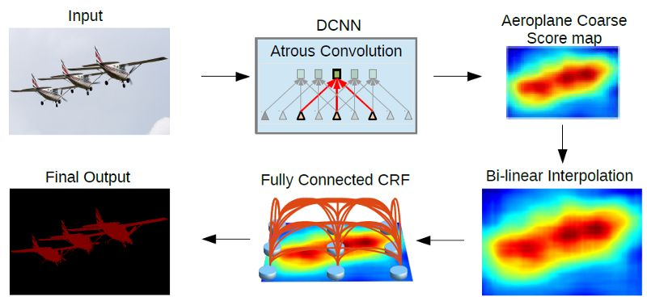
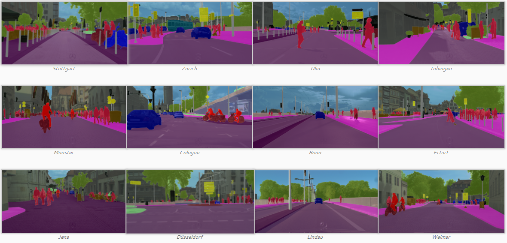
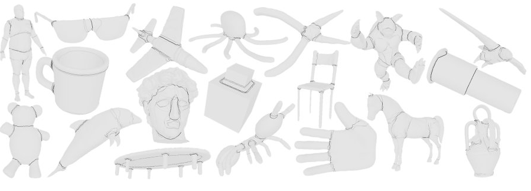

# 语义分割综述

## 1.初识语义分割

### 1.1.计算机视觉

目前，计算机视觉是深度学习领域最热门的研究领域之一。从广义上来说，计算机视觉就是要“赋予机器自然视觉的能力”。实际上，计算机视觉本质上就是研究视觉感知问题，其目标就是对环境的表达和理解，核心问题是研究如何对输入的图像信息进行组织，对物体和场景进行识别，进而对图像内容给予解释。更进一步来说，计算机视觉就是研究如何让计算机利用摄像头等机器设备实现和人类一样“看”的能力，对目标进行分割、分类、识别、跟踪、判别决策。计算机视觉是一个跨领域的交叉学科，包括计算机科学（图形、算法、理论、系统、体系结构），数学（信息检索、机器学习），工程学（机器人、语音、自然语言处理、图像处理），物理学（光学 ），生物学（神经科学）和心理学（认知科学）等等。许多科学家认为，计算机视觉为人工智能的发展开拓了道路。

对计算机视觉的定义应当包含以下三个方面：

- “对图像中的客观对象构建明确而有意义的描述”（Ballard＆Brown，1982）
- “从一个或多个数字图像中计算三维世界的特性”（Trucco＆Verri，1998）
- “基于感知图像做出对客观对象和场景有用的决策”（Sockman＆Shapiro，2001）

计算机视觉的三个发展方向：

1. 复制人眼——让计算机 " 去看 "

通过传感器和图像处理器获取图像，已经在某种程度上超越人眼获取图像的精确性和明锐度

2. 复制视觉皮层——让计算机 “ 去描述”

计算机采用 " 自下而上 " 的办法，去模拟大脑中神经元“看”的过程：计算机可以在多张图中，对一张图片进行一系列的转换，从而找到物体的边缘，发现图片上的物体、角度和运动。就像人类的大脑一样，通过给计算机观看各种图形，计算机会使用大量的计算和统计，试着把 " 看到的 " 形状与之前训练中识别的相匹配。

3. 以及复制大脑剩余部分——让计算机 " 去理解 "

计算机视觉不仅要“看到”，还要“看懂”，还要根据看到的不同物体做出不同的判断和决策，这就需要结合大脑剩余部分来进行。对于人们来说，大脑的剩余部分由这些组成，包括长短期记忆、其他感官的输入、注意力和认知力、从世界中万亿级别的交互中收获的十亿计知识，这些知识将通过我们很难理解的方式，被写入互联的神经。

### 1.2.语义分割

众所周知，计算机视觉有三大核心任务——分类、检测、分割，三者号称是深度学习炼丹师的“三大浪漫”。作为计算机视觉基础任务之一，语义分割历史悠久。分类针对整张图片，检测针对图片的局部，语义分割则如**图1**所示，旨在给输入图片上的每个像素赋予一个正确的语义标签。

​		

图1 语义分割示例
  

### 1.3.语义分割与实例分割的区别

​		首先说说他们的共性，语义分割和实例分割都是从图像中分割出目标有效区域，即预测每个像素点所属的类别。不同的是语义分割不区分同类目标，而实例分割则需要区分同类目标的不同个体。如**图2**所示，两种分割方式均可以分割出各个目标的有效区域，不同的是示例分割可以区分不同的目标个体，如cube。

图2 语义分割和实例分割区别示例
  

### 1.4.常用评价指标

对语义分割模型来说，通常用执行时间、内存占用以及准确度来评价算法的效果。对于执行时间、内存占用不做过多解释。

- PA（Pixel Accuracy，像素精度）：最简单的度量计算，总的像素跟预测正确像素的比率

- $$
  {\rm{PA}} = \frac{{\sum\limits_{i = 0}^k {{P_{ii}}} }}{{\sum\limits_{i = 0}^k {\sum\limits_{j = 0}^k {{P_{ij}}} } }}
  $$

- MPA（Mean Pixel Accuracy，平均像素精度）：基于每个类别正确的像素总数与每个类别总数比率求和得到的均值

- $$
  MPA = \frac{1}{{k + 1}}\sum\limits_{i = 0}^k {\frac{{{p_{ii}}}}{{\sum\limits_{j = 0}^k {{p_{ij}}} }}}
  $$

- MIoU（Mean Intersection over Union，平均并交比）：这是语义分割网络的一个标准评价指标，它通过计算交并比来度量，这里交并比代指ground truth与预测分割结果之间。是重新计算TP跟 (TP + FN+FP)之和之间的比率。IoU是基于每个类别计算，然后再求均值

- $$
  MIoU = \frac{1}{{k + 1}}\sum\limits_{i = 0}^k {\frac{{{p_{ii}}}}{{\sum\limits_{j = 0}^k {{p_{ij}}}  + \sum\limits_{j = 0}^k {{p_{ji}}}  - {P_{ii}}}}}
  $$

## 2.语义分割算法

​			传统的分割算法已经推出了历史舞台，目前工业界常用的分割算法都是使用大数据驱动的深度学习模型。我们从深度学习的角度出发，细数一下基于深度学习的分割模型发展历程，如**表1**所示。另外，根据模型的创新方向不同，**图3**形象化的展示了**表1**所提及的方法的分类。

表1 语义分割方法总览
  

图3 所提及方法的形象化展示
  

​		我们将按照分割方法的发展路线，选取一些经典的方法对其进行介绍。感兴趣的朋友可以按照分类学习对应改进方向的方法。

### 		2.1. FCN

经典CNN在卷积层之后使用全连接层得到固定长度的特征向量进行分类（全联接层＋softmax输出），做到了基于图像级别对图片进行分类，但不能识别图片中特定部分的物体。2015年Jonathan Long发表了《Fully Convolutional Networks for Semantic Segmentation》提出全卷积网络FCN可以接受任意尺寸的输入图像，采用反卷积层对最后一个卷积层的feature map进行上采样, 使它恢复到与输入图像相同的尺寸，从而可以对每个像素都产生了一个预测,，同时保留了原始输入图像中的空间信息， 最后在上采样的特征图上进行逐像素分类，解决了语义分割的问题。FCN主要有两个特点：

1.全连接层换成卷积层

2.不同尺度的信息融合FCN-8s,16s,32s

#### 2.1.1 全连接层换成卷积层

FCN与CNN的主要区别在于FCN把CNN最后的三层全连接层转换成三层卷积层，输出的是一张已经Label好的图片, 而这个图片就可以做语义分割

图4 使用卷积层替换全连接层
  

该变换最初的想法是把每个像素周围的区域输入CNN，得到一个标签。在变成全卷积网络后，相当于卷积网络在一张大的图片上滑动，在单个向前传播的过程中完成任务。

以AlexNet为例，AlexNet原来的结构是224x224大小的图片经过一系列卷积，得到大小为1/32 = 7x7的feature map，经过三层全连接层，得到基于FC的分布式表示。我们把三层全连接层全都换成卷积层，卷积核的大小和个数如**图5**中间行所示，我们去掉了全连接层，但是得到了另外一种基于不同channel的分布式表示：Heatmap热图。（经过多次卷积和pooling以后，得到的图像越来越小，分辨率越来越低，最终产生的热图就是我们最重要的高维特征图，得到heatmap之后就是最重要的一步也是最后的一步对原图像进行upsampling，把图像进行放大到原图像的大小）

图5 AlexNet网络结构变换
  

#### 2.1.2 不同尺度的信息融合

如下图所示，对原图像进行卷积conv1、pool1后原图像缩小为1/2；之后对图像进行第二次conv2、pool2后图像缩小为1/4；接着继续对图像进行第三次卷积操作conv3、pool3缩小为原图像的1/8，此时保留pool3的featureMap；接着继续对图像进行第四次卷积操作conv4、pool4，缩小为原图像的1/16，保留pool4的featureMap；最后对图像进行第五次卷积操作conv5、pool5，缩小为原图像的1/32，然后把原来CNN操作中的全连接变成卷积操作conv6、conv7，图像的FeatureMap数量改变但是图像大小依然为原图的1/32，此时图像不再叫featureMap而是叫HeatMap。之后再进行上采样（反卷积），这个时候就看是需要采用哪个层的特征图了，所以也就会有FCN-32s,FCN-16s,FCN-8s。

但是我们知道，随着一次次的池化，虽然感受野不断增大，语义信息不断增强。但是池化造成了像素位置信息的丢失：直观举例，1/32大小的Heatmap上采样到原图之后，在Heatmap上如果偏移一个像素，在原图就偏移32个像素，这是不能容忍的。如**图7**,前面的层虽然语义信息较少，但是位置信息较多，作者就把1/8 1/16 1/32的三个层的输出融合起来了。先把1/32的输出上采样到1/16,和Pool4的输出做elementwose addition , 结果再上采样到1/8,和Pool3的输出各个元素相加。得到1/8的结果，上采样8倍，求Loss。

图7 多尺度融合
  

### 		2.2. U-net

图8 U-net结构图
  

U-net的提出者为了解决生物医学领域的细胞分割任务，通过对可用的训练图像应用弹性变形来获得大量扩增的数据，只需很少的训练图像就可以进行更精确的分割。U-net可用于解决小样本的简单问题分割，比如医疗影片的分割。它遵循的基本原理与FCN一样：

1.Encoder-Decoder结构：前半部分为多层卷积池化，不断扩大感受野，用于提取特征。后半部分上采样回复图片尺寸。和FCN相比，U-Net的第一个特点是完全对称，也就是左边和右边是很类似的，而FCN的decoder相对简单，只用了一个deconvolution的操作，之后并没有跟上卷积结构。

2.更丰富的信息融合：如灰色剪头，更多的前后层之间的信息融合。这里是把前面层的输出和后面层concat(串联)到一起，区别于FCN的逐元素加和。不同Feature map串联到一起后，后面接卷积层，可以让卷积核在channel上自己做出选择。注意的是，在串联之前，需要把前层的feature map crop到和后层一样的大小。

### 		2.3. SegNet

图9 SegNet结构图
  

SegNet基于FCN，修改VGG-16网络得到的语义分割网络，有两种版本的SegNet，分别为SegNet与Bayesian SegNet，同时SegNet作者根据网络的深度提供了一个basic版（浅网络）。 SegNet和FCN思路十分相似，只是Encoder,Decoder(Upsampling)使用的技术不一致。此外SegNet的编码器部分使用的是VGG16的前13层卷积网络，每个编码器层都对应一个解码器层，最终解码器的输出被送入soft-max分类器以独立的为每个像素产生类概率。

在结构上看，SegNet和U-net其实大同小异，都是编码-解码结果。区别在意，SegNet没有直接融合不同尺度的层的信息，为了解决为止信息丢失的问题，SegNet使用了带有坐标（index）的池化。如**图10**所示，在Max pooling时，选择最大像素的同时，记录下该像素在Feature map的位置（左图）。在反池化的时候，根据记录的坐标，把最大值复原到原来对应的位置，其他的位置补零（右图）。后面的卷积可以把0的元素给填上。这样一来，就解决了由于多次池化造成的位置信息的丢失。

图10 Pooling与Unpooling
  

### 		2.4. Dilated Convolutions

在进行图像分割任务时，使用pooling增加了感受域的大小，但是却使图像的很多细小特征丢失了，这样导致分割出来的图像分辨率很低，于是有学者就提出了基于稀疏卷积核的卷积网络。这种新的卷积网络模块能够整合多尺度的上下文信息，同时不丧失分辨率，也不需要分析重新放缩的图像。这种模块是为稠密预测专门设计的，没有pooling或其它下采样。这个模块是基于空洞卷积，空洞卷积支持感受野指数级的增长，同时还不损失分辨率。

以上图为例，红色圆点为卷积核对应的输入“像素”，绿色为其在原输入中的感受野。

(a)图对应3x3的扩张率为1的卷积，和普通的卷积操作一样；

(b)图对应3x3的扩张率为2的卷积，实际的卷积核还是3x3，但是空洞率为2，也就是对于一个7x7的图像块，只有9个红色的点也就是3x3的卷积核发生卷积操作，其余的点略过。也可以理解为卷积核的大小为7x7，但是只有图中的9个点的权重不为0，其余都为0。可以看到虽然卷积核的大小只有3x3，但是这个卷积的感受野已经增大到了7x7。如果考虑到这个2-dilated convolution的前一层有一个1-dilated convolution的话，那么每个红点就是1-dilated的卷积输出，感受野为3x3，所以1-dilated和2-dilated合起来就能达到7x7的卷积；

(c)图是4-dilated convolution操作，同理跟在1-dilated和2-dilated convolution的后面，能达到15x15的感受野。

Dilated Convolutions的思路就是将用于分类的神经网络（论文里为VGG）的最后两个池化层去掉，用这种基于稀疏卷积核的卷积网络代替。这样，我们在不降低感受域大小的同时，使输出的数据的维度更大，保留了更多的原始图像的细小特征，避免了池化层降低数据维度造成的细小特征丢失的问题。

### 		2.5. RefineNet

基于稀疏核的卷积也不是没有缺点，缺点就是会极大的增加计算量和需要的内存空间，因为稀疏核增加了参数的个数，使得要处理的数据维度增大。这就增大了获取更高分辨率分割图的成本。因此有学者提出了使用Encoder-Decoder架构的RefineNet

RefineNet可以分为三个主要部分： 1. 不同尺度（也可能只有一个输入尺度）的特征输入首先经过两个Residual模块的处理； 2. 之后是不同尺寸的特征进行融合。当然如果只有一个输入尺度，该模块则可以省去。所有特征上采样至最大的输入尺寸，然后进行加和。上采样之前的卷积模块是为了调整不同特征的数值尺度； 3. 最后是一个链式的pooling模块。其设计本意是使用侧支上一系列的pooling来获取背景信息（通常尺寸较大）。直连通路上的ReLU可以在不显著影响梯度流通的情况下提高后续pooling的性能，同时不让网络的训练对学习率很敏感。最后再经过一个Residual模块即得RefineNet的输出。

### 		2.6. PSPnet

图13 PSPnet结构示意图
  

原理都大同小异，前面的不同level的信息融合都是融合浅层和后层的Feature Map,因为后层的感受野大，语义特征强，浅层的感受野小，局部特征明显且位置信息丰富。PSPnet则使用了空间金字塔池化，得到一组感受野大小不同的feature map,将这些感受野不同的map concat到一起，完成多层次的语义特征融合。

### 		2.7. Deeplab 系列

#### 2.7.1. Deeplab V1

图11 DeeplabV1结构图
  

针对标准的深度卷积神经网络的两个主要问题：1.Striding操作使得输出尺寸减小； 2.Pooling对输入小变化的不变性。Deeplab v1 使用带孔卷积(atrous convolution)+条件随机场(CRFs)来解决这两个问题。将图像分类网络转换成dense feature extractors而不用学习额外的参数。

1.由于Pooling-Upsample会丢失位置信息而且多层上下采样开销较大，把控制感受野大小的方法化成：带孔卷积(atrous convolution)

2.加入CRF(条件随机场)，利用像素之间的关连信息：相邻的像素，或者颜色相近的像素有更大的可能属于同一个class。

#### 		2.7.2. Deeplab V2

图14 DeeplabV2结构示意图
  

Deeplab v2在v1的基础上做出了改进，引入了空洞空间金字塔池化ASPP(Atrous Spatial Pyramid Pooling)的结构，如上图所示。

ASPP层就是为了融合不同级别的语义信息：选择不同扩张率的带孔卷积去处理Feature Map，由于感受野不同，得到的信息的Level也就不同，ASPP层把这些不同层级的feature map concat到一起，进行信息融合。

#### 		2.7.3 Deeplab V3

Deeplab v3在原有基础上的改动是：

1、DeeplabV3，即多尺度(multiple scales)分割物体，设计了串行和并行的带孔卷积模块，采用多种不同的atrous rates来获取多尺度的内容信息；

2、DeeplabV3中提出 Atrous Spatial Pyramid Pooling(ASPP)模块, 挖掘不同尺度的卷积特征，以及编码了全局内容信息的图像层特征，提升分割效果；

3、DeeplabV3中，不需要DenseCRF后处理（与之前的不一样的处理）。

图15 DeeplabV3结构示意图
  

新的ASPP模块：

1.加入了Batch Norm：一个1×1卷积和3个3×3的空洞卷积(采样率为(6,12,18))，每个卷积核都有256个且都有BN层

2.加入特征的全局平均池化（在扩张率很大的情况下，有效权重会变小）。如图14中的（b）Image Pooling就是全局平均池化，它的加入是对全局特征的强调、加强。

在旧的ASPP模块中：我们以为在扩张率足够大的时候，感受野足够大，所以获得的特征倾向于全局特征。但实际上，扩张率过大的情况下，Atrous conv出现了“权值退化”的问题，感受野过大，都已近扩展到了图像外面，大多数的权重都和图像外围的zero padding进行了点乘，这样并没有获取图像中的信息。有效的权值个数很少，往往就是1。于是我们加了全局平均池化，强行利用全局信息。

具体DeeplabV3详解请见[链接](https://paddlepedia.readthedocs.io/en/latest/tutorials/computer_vision/semantic_segmentation/DeeplabV3/index.html)

#### 		2.7.4 Deeplab V3+

图16 DeeplabV3+结构示意图
  

可以看成是把原Deeplab V3当作encoder，添加decoder得到新的模型（Deeplab V3+）。与V3不同的是，这里将空洞卷积和深度分离卷积结合，得到一个atrous separale convolution（也就是把空洞卷积应用在深度分离卷积上），能够在维持相同性能的情况下，深度分离卷积可以大大减小计算复杂度。后面再进行解码，并且在解码的过程中在此运用了不同层级特征的融合。此外，在encoder部分加入了Xception的结构减少了参数量，提高运行速度。

### 2.8 部分模型对比结果

如下**表2**和**表3**所示，在CityCapes公开数据集上现有部分语义分割模型进行实验比较，从分割准确性和实时性角度分别排序。

表2 CityCapes 像素级语义分割准确性比较结果
  

表3 CityCapes 像素级语义分割实时性比较结果
  

## 3.常用数据集

​		关于分割的开源/闭源数据集数量众多，并且基于很多重大数据集举办了很多竞赛。为了综述的完整性考虑，对现有的经典数据集进行总结。

​		[论文](https://arxiv.org/abs/1704.06857)给出了分割常用的数据集，所有列出的数据集均包含像素级别或点级别的标签。根据数据内在属性分为3个部分：2维的或平面的RGB数据集，2.5维或带有深度信息的RGB（RGB-D）数据集，以及纯体数据或3维数据集。**表4**给出了这些数据集的概览，以及他们被构建的目的、类数、数据格式以及训练集、验证集、测试集划分情况。

表4 常用大规模数据集总览
  

### 3.1.  二维数据集

​		自始至终，语义分割问题最关注的是二维图像。因此，二维数据集在所有类型中是最丰富的。

#### 3.1.1.**[PASCAL视觉物体分类数据集（PASCAL-VOC）](http://host.robots.ox.ac.uk/pascal/VOC/voc2012/)**

​		包括一个标注了的图像数据集和五个不同的竞赛：分类、检测、分割、动作分类、人物布局。分割的竞赛很有趣：他的目标是为测试集里的每幅图像的每个像素预测其所属的物体类别。有21个类，包括轮子、房子、动物以及其他的：飞机、自行车、船、公共汽车、轿车、摩托车、火车、瓶子、椅子、餐桌、盆栽、沙发、显示器（或电视）、鸟、猫、狗、马、绵羊、人。如果某像素不属于任何类，那么背景也会考虑作为其标签。该数据集被分为两个子集：训练集1464张图像以及验证集1449张图像。测试集在竞赛中是私密的。争议的说，这个数据集是目前最受欢迎的语义分割数据集，因此很多相关领域卓越的工作将其方法提交到该数据集的评估服务器上，在其测试集上测试其方法的性能。方法可以只用该数据集训练，也可以借助其他的信息。另外，其方法排行榜是公开的而且可以在线查询。

图17 PASCAL-VOC数据集示例
  

#### 3.1.2. **[PASCAL上下文数据集（PASCAL Context）](http://www.cs.stanford.edu/∼roozbeh/pascal-context/)**

​		对于PASCAL-VOC 2010识别竞赛的扩展，包含了对所有训练图像的像素级别的标注。共有540个类，包括原有的20个类及由PASCAL VOC分割数据集得来的图片背景，分为三大类，分别是物体、材料以及混合物。虽然种类繁多，但是只有59个常见类是较有意义的。由于其类别服从一个幂律分布，其中有很多类对于整个数据集来说是非常稀疏的。就这点而言，包含这59类的子集常被选作真实类别来对该数据集进行研究，其他类别一律重标为背景。

图18 PASCAL-Context数据集示例
  

#### 3.1.3. [**PASCAL部分数据集（PASCAL Part）**](http://www.stat.ucla.edu/∼xianjie.chen/pascal part dataset/pascal part.html)

​		对于PASCAL-VOC 2010识别竞赛的扩展，超越了这次竞赛的任务要求而为图像中的每个物体的部分提供了一个像素级别的分割标注（或者当物体没有连续的部分的时候，至少是提供了一个轮廓的标注）。原来的PASCAL-VOC中的类被保留，但被细分了，如自行车被细分为后轮、链轮、前轮、手把、前灯、鞍座等。本数据集包含了PASCAL VOC的所有训练图像、验证图像以及9637张测试图像的标签。

图19 PASCAL-part数据集示例
  

#### 3.1.4. **[语义边界数据集（SBD）](http://home.bharathh.info/home/sbd)**

​		该数据集是PASCAL数据集的扩展，提供VOC中未标注图像的语义分割标注。提供PASCAL VOC 2011 数据集中11355张数据集的标注，这些标注除了有每个物体的边界信息外，还有类别级别及实例级别的信息。由于这些图像是从完整的PASCAL VOC竞赛中得到的，而不仅仅是其中的分割数据集，故训练集与验证集的划分是不同的。实际上，SBD有着其独特的训练集与验证集的划分方式，即训练集8498张，验证集2857张。由于其训练数据的增多，深度学习实践中常常用SBD数据集来取代PASCAL VOC数据集。

图20 SBD数据集示例
  

#### 3.1.5. [**微软常见物体环境数据集（Microsoft COCO）**](http://mscoco.org/)

​		该数据集是另一个大规模的图像识别、分割、标注数据集。它可以用于多种竞赛，与本领域最相关的是检测部分，因为其一部分是致力于解决分割问题的。该竞赛包含了超过80个类别，提供了超过82783张训练图片，40504张验证图片，以及超过80000张测试图片。特别地，其测试集分为4个不同的子集各20000张：test-dev是用于额外的验证及调试，test-standard是默认的测试数据，用来与其他最优的方法进行对比，test-challenge是竞赛专用，提交到评估服务器上得出评估结果，test-reserve用于避免竞赛过程中的过拟合现象（当一个方法有嫌疑提交过多次或者有嫌疑使用测试数据训练时，其在该部分子集上的测试结果将会被拿来作比较）。由于其规模巨大，目前已非常常用，对领域发展很重要。实际上，该竞赛的结果每年都会在ECCV的研讨会上与ImageNet数据集的结果一起公布。

图21 MS-coco数据集示例
  

#### 3.1.6. [图像与注释合成数据集（SYNTHIA）](http://synthia-dataset.net/)

​		该数据集是一个大规模的虚拟城市的真实感渲染图数据集，带有语义分割信息，是为了在自动驾驶或城市场景规划等研究领域中的场景理解而提出的。提供了11个类别物体（分别为空、天空、建筑、道路、人行道、栅栏、植被、杆、车、信号标志、行人、骑自行车的人）细粒度的像素级别的标注。包含从渲染的视频流中提取出的13407张训练图像，该数据集也以其多变性而著称，包括场景（城镇、城市、高速公路等）、物体、季节、天气等。

图22 SYNTHIA数据集示例
  

#### 3.1.7. [城市风光数据集](https://www.cityscapes-dataset.com/)

​		该数据集是一个大规模的关注于城市街道场景理解的数据集，提供了8种30个类别的语义级别、实例级别以及密集像素标注（包括平坦表面、人、车辆、建筑、物体、自然、天空、空）。该数据集包括约5000张精细标注的图片，20000张粗略标注的图片。数据是从50个城市中持续数月采集而来，涵盖不同的时间以及好的天气情况。开始起以视频形式存储，因此该数据集按照以下特点手动选出视频的帧：大量的动态物体，变化的场景布局以及变化的背景。

图23 城市风光数据集示例
  

#### 3.1.8. [CamVid数据集](http://mi.eng.cam.ac.uk/research/projects/VideoRec/CamVid/)

​		该数据集是一个道路、驾驶场景理解数据集，开始是五个视频序列，来自一个安装在汽车仪表盘上的960x720分辨率的摄相机。这些序列中采样出了701个帧（其中4个序列在1fps处，1个序列在15fps处），这些静态图被手工标注上32个类别：空、建筑、墙、树、植被、栅栏、人行道、停车场、柱或杆、锥形交通标志、桥、标志、各种文本、信号灯、天空、……（还有很多）。有研究者将数据集按照367-100-233的比例分为训练集、验证集、测试集，这种分法使用了部分类标签：建筑、树、天空、车辆、信号、道路、行人、栅栏、杆、人行道、骑行者。

图24 CamVid数据集示例
  

#### 3.1.9. **KITTI** 

​		该数据集是用于移动机器人及自动驾驶研究的最受欢迎的数据集之一，包含了由多种形式的传感器得出的数小时的交通场景数据，包括高分辨率RGB、灰度立体摄像机以及三维激光扫描器。尽管很受欢迎，该数据集本身并没有包含真实语义分割标注，但是，众多的研究者手工地为该数据集的部分数据添加标注以满足其问题的需求。有人为道路检测竞赛中的323张图片生成了真实标注，包含三个类别：道路、垂直面和天空。还有人标注了252张图片，其中140张训练、112张测试，其选自追踪竞赛中的RGB和Velodyne扫描数据，共十个类。有学者在视觉测距数据集中标注了170个训练图片和46个测试图片，共11个类。

图25 KITTI数据集示例
  

#### 3.1.10. **YouTube物体数据集**

​		该数据集是从YouTube上采集的视频数据集，包含有PASCAL VOC中的10个类。该数据集不包含像素级别的标注，但有学者手动的标注了其126个序列的子集。其在这些序列中每10个帧选取一张图片生成器语义标签，总共10167张标注的帧，每帧480x360的分辨率。

图26 YouTube物体数据集示例
  

#### 3.1.11. [Adobe肖像分割数据集](http://xiaoyongshen.me/webpage%20portrait/index.html)

​		该数据集包含从Flickr中收集的800x600的肖像照片，主要是来自手机前置摄像头。该数据集包含1500张训练图片和300张预留的测试图片，这些图片均完全被二值化标注为人或背景。图片被半自动化的标注：首先在每幅图片上运行一个人脸检测器，将图片变为600x800的分辨率，然后，使用Photoshop快速选择工具将人脸手工标注。这个数据集意义重大，因为其专门适用于人脸前景的分割问题。

图27 Adobe肖像分割数据集示例
  

#### 3.1.12. **上下文语料数据集（MINC）**

​		该数据集是用于对块进行分类以及对整个场景进行分割的数据集。该数据集提供了23个类的分割标注（文中有详细的各个类别的名称），包含7061张标注了的分割图片作为训练集，5000张的测试集和2500张的验证集。这些图片均来自OpenSurfaces数据集，同时使用其他来源如Flickr或Houzz进行增强。因此，该数据集中的图像的分辨率是变化的，平均来看，图片的分辨率一般是800x500或500x800。

图28 上下文语料数据集（MINC）示例
  

#### 3.1.13. **[密集标注的视频分割数据集（DAVIS）](http://davischallenge.org/index.html)**

​		该竞赛的目标是视频中的物体的分割，这个数据集由50个高清晰度的序列组成，选出4219帧用于训练，2023张用于验证。序列中的帧的分辨率是变化的，但是均被降采样为480p的。给出了四个不同类别的像素级别的标注，分别是人、动物、车辆、物体。该数据集的另一个特点是每个序列均有至少一个目标前景物体。另外，该数据集特意地较少不同的大动作物体的数量。对于那些确实有多个前景物体的场景，该数据集为每个物体提供了单独的真实标注，以此来支持实例分割。

图29 密集标注的视频分割数据集（DAVIS）示例
  

#### 3.1.14. **[斯坦福背景数据集](http://dags.stanford.edu/data/iccv09Data.tar.gz)**

​		该数据集包含了从现有公开数据集中采集的户外场景图片，包括LabelMe, MSRC, PASCAL VOC 和Geometric Context。该数据集有715张图片（320x240分辨率），至少包含一个前景物体，且有图像的水平位置信息。该数据集被以像素级别标注（水平位置、像素语义分类、像素几何分类以及图像区域），用来评估场景语义理解方法。

图30 斯坦福背景数据集示例
  

#### 3.1.15.  **SiftFlow**

​		该数据集包含2688张完全标注的图像，是LabelMe数据集的子集。多数图像基于8种不同的户外场景，包括街道、高山、田地、沙滩、建筑等。图像是256x256的，分别属于33个语义类别。未标注的或者标为其他语义类别的像素被认为是空。

图31 SiftFlow数据集示例
  

### 3.2. 半立体（2.5维）数据集

随着廉价的扫描器的到来，带有深度信息的数据集开始出现并被广泛使用。我们回顾最知名的2.5维数据集，其中包含了深度信息。

#### 3.2.1. [NYUDv2数据集](http://horatio.cs.nyu.edu/mit/silberman/nyu_depth_v2/)

该数据集包含1449张由微软Kinect设备捕获的室内的RGB-D图像。其给出密集的像素级别的标注（类别级别和实力级别的均有），训练集795张与测试集654张均有40个室内物体的类，该数据集由于其刻画室内场景而格外重要，使得它可以用于某种家庭机器人的训练任务。但是，它相对于其他数据集规模较小，限制了其在深度网络中的应用。

图32 NYUDv2数据集示例
  

#### 3.2.2. **[SUN3D数据集](http://sun3d.cs.princeton.edu/)**

与NYUDv2数据集相似，该数据集包含了一个大规模的RGB-D视频数据集，包含8个标注了的序列。每一帧均包含场景中物体的语义分割信息以及摄像机位态信息。该数据集还在扩充中，将会包含415个序列，在41座建筑中的254个空间中获取。另外，某些地方将会在一天中的多个时段被重复拍摄。

图33 SUN3D数据集示例
  

#### 3.2.3. [SUNRGBD数据集](http://rgbd.cs.princeton.edu/)

该数据集由四个RGB-D传感器得来，包含10000张RGB-D图像，尺寸与PASCAL VOC一致。该数据集包含了NYU depth v2 , Berkeley B3DO, 以及SUN3D 数据集中的图像，整个数据集均为密集标注，包括多边形、带方向的边界框以及三维空间，适合于场景理解任务。

图34 SUNRGBD数据集示例
  

#### 3.2.4. **[物体分割数据集（OSD）](http://www.acin.tuwien.ac.at/?id=289)**

该数据集用来处理未知物体的分割问题，甚至是在部分遮挡的情况下进行处理。该数据集有111个实例，提供了深度信息与颜色信息，每张图均进行了像素级别的标注，以此来评估物体分割方法。但是，该数据集并没有区分各个类，使其退化为一个二值化的数据集，包含物体与非物体两个类。

图35 OSD数据集示例
  

#### 3.2.5. **[RGB-D物体数据集](http://rgbd-dataset.cs.washington.edu/)**

该数据集由视频序列构成，有300个常见的室内物体，分为51个类，使用WordNet hypernym-hyponym关系进行分类。该数据集使用Kinect型三维摄像机进行摄制，640x480RGB图像，深度信息30赫兹。对每一帧，数据集提供了RGB-D及深度信息，这其中包含了物体、位置及像素级别的标注。另外，每个物体放在旋转的桌面上以得出360度的视频序列。对于验证过程，其提供了22个标注的自然室内场景的包含物体的视频序列。

图36 RGB-D数据集示例
  

### 3.3. 三维数据集

纯粹的三维数据集是稀缺的，通常可以提供CAD网格或者其他的体元表示如点云等。为分割问题获取三维数据集是困难的，因此很少有深度学习方法可以处理这种数据。也因此，三维数据集目前还不是很受欢迎。尽管如此，我们还是介绍目前出现的相关数据集来解决现有的问题。

#### 3.3.1. [ShapeNet部分数据集](http://cs.stanford.edu/ericyi/project page/part annotation/)

该数据集是ShapeNet数据集的子集，关注于细粒度的三维物体分割。包含取自元数据及16个类的31693个网格，每个形状类被标注为二到五个部分，整个数据集共有50个物体部分，也就是说，物体的每个部分比如飞机的机翼、机身、机尾、发动机等都被标注了。真实标注按照被网格分割开的点呈现。

图37 ShapeNet数据集示例
  

#### 3.3.2. [**斯坦福****2D-3D-S****数据集**](http://buildingparser.stanford.edu)

该数据集是一个多模态、大规模室内空间数据集，是斯坦福三维语义分析工作的扩展。提供了多个模态：二维RGB，2.5维添加深度信息的图片、三维网格和点云，均提供分割标注信息。该数据集有70496张高分辨率的RGB图像（1080x1080分辨率），以及其对应的深度图谱、表面法线、网格以及点云，军事带有像素级别及点级别的语义标注信息。这些数据取自6个室内区域，分别来自三个不同的教育与办公建筑。共有271个房间，大约7亿个点，被标以13个类。

图38 斯坦福2D-3D-S数据集示例
  

#### 3.3.3. [**三维网格分割基准数据集**](http://segeval.cs.princeton.edu/)

该基准数据集有380个网格，被分为19个类。每个网格手动的被分割为不同的功能区域，主要目标是提供对于人们如何分配网格功能的一个概率分布。

图39 三维网格分割基准数据集示例
  

#### 3.3.4. **[悉尼城市物体数据集](http://www.acfr.usyd.edu.au/papers/SydneyUrbanObjectsDataset.shtml)**

该数据集包含多个常见的城市道路物体，由Velodyne HDK-64E LIDAR扫描得到，共有631个独立扫描的点云，由车辆、行人、标志、树木等类别组成。有趣的是，除了正常的扫描之外，还提供了全景360度的扫描标注。

图40 悉尼城市物体数据集示例
  

#### 3.3.5. **[大规模点云分类基准数据集](http://www.semantic3d.net/)**

该基准数据集提供手工标注的三维点云，面向自然与城市场景。该数据集在形成点云时保留了细节与密度等信息，训练集和测试集各包含15个大规模的点云，其规模达到超过十亿个标注点的级别。

图41 大规模点云分类基准数据集示例
  

## 4.前景展望

​		虽然语义分割任务属于计算机图像视觉方向的基础任务之一，但是其对于很对高级任务的支持至关重要，目前也有着许多未来研究的可能方向。

1. **三维数据集**：充分利用三维数据的一些方法已经开始出现，但是，即使是最新的方案，仍然缺乏对于最重要的构成成分之一即数据的考虑。目前急需一个大规模三维语义分割数据集，但这相对于其低维部分来说是较难创建的。虽然已经有了一些不错的工作，仍然需要更多、更好、更富变化的数据集的出现。值得注意的是，真实世界的三维数据是极其重要的，因为目前几乎所有的工作都是使用的合成数据集。三维数据重要性的一个证明便是，2018年ILSVRC将会创建三维数据。
2. **序列数据集**：三维数据集上大规模数据集缺乏的问题同样影响到了视频序列分割问题。目前仅有少数几个数据集是基于序列的，这些数据集对于利用时间序列信息的方法的发展很有利。从本质上将二维及三维高质量数据联系起来必将引领新的研究方向。
3. **使用图卷积网络（GCN）对点云进行分割**：如之前所述，处理三维数据如点云等目前尚未解决，由于点云内在的无序性及非结构性，传统的架构如CNN等不能直接予以应用，除非使用某种离散化手段使其结构化。一个靠谱的研究方向便致力于将点云处理为图，然后在其上应用卷积[109,110,111]。这种做法的好处便是在不量化数据的基础上保留了每个维度上的空间信息。
4. **上下文知识**：虽然FCN是语义分割领域中的一种坚实的方法，但是FCN网络缺乏对于上下文等特征的建模，而这些信息有可能会提高准确率。将CRF重写为RNN来创造一种端对端的解决方法看起来是一个靠谱的方法，可以提高真实生活场景下的性能。多尺度及特征融合方法也取得了较大的进展。总之，这些方法已经取得了不小的进步，但是仍然有许多问题亟待解决。
5. **实时分割**：在很多应用场景下，准确率是重要的，但是，能够处理达到常见的摄像机帧率（至少25帧每秒）的输入速度也是很关键的。目前多数的方法远远达不到这个帧率，比如，FCN-8处理一张低分辨率的PASCAL VOC数据集中的图像需要100ms，同时，CRFasRNN需要500ms。因此，接下来几年，我们期待会有一系列的工作关注于实时处理的限定，这些工作将必须在准确率与运行时间之间寻求一个平衡。
6. **存储空间**：某些平台受限于其存储空间。分割网络一般需要较大的存储空间，从而可以同时进行推理与训练。为了适应各种设备，网络必须要简单。虽然这可以通过降低复杂性（一般会牺牲准确率）来简单地实现，但是还是可以采取另外的办法。剪枝是一种靠谱的研究方向，可以用来简化网络，使得网络在保留多数信息的同时变得轻量化，也因此同时保留了原网络的准确率。
7. **序列数据的时间一致性**：一些方法解决了视频或序列分割的问题，但是他们有些未利用时间序列信息来提高准确率或效率。然而，没有一种方法解决了一致性的问题。对于一个应用在视频流上的分割系统来说，一致性信息是重要的，不仅可以逐帧地处理数据，还可以对整个片段的处理保持一致，而不需要通过平滑为序列预测出的像素级别的标签而产生人工的信息。
8. **多视角整合**：在最近提出的分割网络上应用多视角信息目前仅仅限于RGB-D摄像机相关的场景，尤其是致力于单一物体分割的情况。

## 参考文献

​		[1] [Image Segmentation Using Deep Learning: A Survey](https://arxiv.org/abs/2001.05566)

​		[2] [Global Convolutional Network(GCN)](https://arxiv.org/abs/1703.02719)

​		[3] [A survey on deep learning-based precise boundary recovery of semantic segmentation for images and point clouds](https://www.sciencedirect.com/science/article/pii/S0303243421001185?via%3Dihub)

​		[4] [Features to Text: A Comprehensive Survey of Deep Learning on Semantic Segmentation and Image Captioning](https://www.hindawi.com/journals/complexity/2021/5538927/)

​		[5] [Deep multimodal fusion for semantic image segmentation: A survey](https://www.sciencedirect.com/science/article/abs/pii/S0262885620301748?via%3Dihub)

​		[6] [A survey of semi- and weakly supervised semantic segmentation of images](https://link.springer.com/article/10.1007%2Fs10462-019-09792-7)

​		[7] [A Brief Survey on Semantic Segmentation with Deep Learning](https://www.sciencedirect.com/science/article/abs/pii/S0925231220305476?via%3Dihub)

​		[8] [A survey on indoor RGB-D semantic segmentation: from hand-crafted features to deep convolutional neural networks](https://link.springer.com/article/10.1007%2Fs11042-019-7684-3)

​		[9] [A Review on Deep Learning Techniques Applied to Semantic Segmentation](https://arxiv.org/abs/1704.06857)

