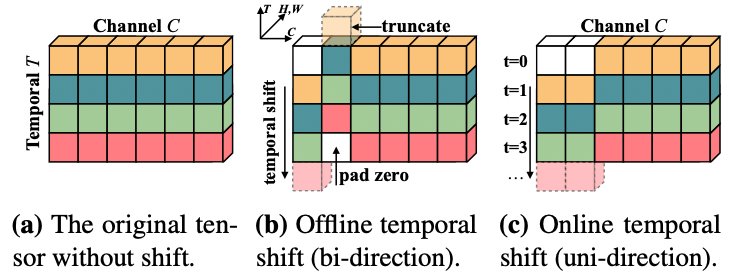
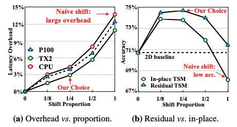
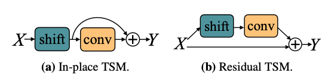
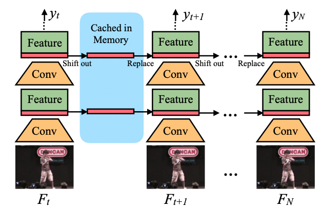
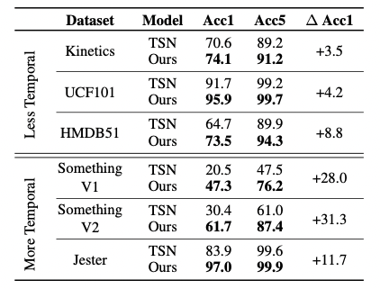
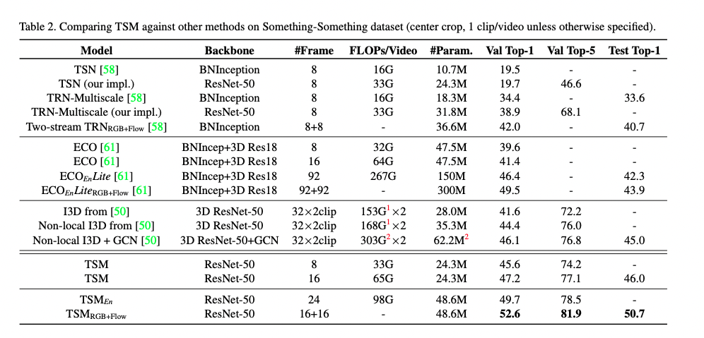

# TSM

## 1. TSM 简介

视频流的爆炸性增长为以高精度和低成本执行视频理解任务带来了挑战。传统的2D CNN计算成本低，但无法捕捉视频特有的时间信息；3D CNN可以得到良好的性能，但计算量庞大，部署成本高。作者提出了一种通用且有效的时间偏移模块（TSM），它通过沿时间维度移动部分通道来促进相邻帧间的信息交换，同时它可以插入到2D CNN中实现零计算和零参数的时间建模，以此兼具2D卷积的高效与3D卷积的高性能。

## 2. 模型介绍

### 2.1 Intuition

首先考虑一个正常的卷积操作，以核大小为3的一维卷积为例。假设卷积的权重为 $W = (w_1, w_2, w_3)$，输入 $X$ 是一个1D无限长的向量，则卷积操作 $Y = Conv(W,X)$ 可被表示为：

$$
Y_i = w_1X_{i-1} + w_2X_i + w_3X_{i+1}
$$
将卷积操作解耦为两步，位移和乘法累加。对输入 $X$ 进行 $-1, 0, +1$ 的位移，具体表示为：

$$
X^{-1}_{i} = X_{i - 1}, \quad X^{0}_{i} = X_i, \quad X^{+1}_{i} = X_{i+1}
$$
 乘法累加可表示为：

$$
Y = w_1X^{-1} + w_2X^0 + w_3X^{+1}
$$
第一步位移是不需要时间成本的，第二步乘法累加需要更大的计算消耗，但是TSM将乘法累加部分合并在了2D卷积中，因此它和基本的2D CNN网络相比不存在额外开销。

图1 Temporal Shift module
  

Temporal Shift Module(TSM) 如 **图1** 所示，在 **图1 a** 中，作者描述了一个具有C通道和T帧的张量，图片中每一行不同颜色代表在不同时间点的特征，沿时间维度，我们将一部分通道移动-1，另一部分通道移动+1，其余部分不动（如 **图1 b** 所示）。对于在线视频识别，作者也提供了在线版本的TSM（如 **图1c** 所示），由于在在线识别模式中，我们不能获得未来帧，因此只进行单一方向的移动。

### 2.2 简易的空间移动会带来什么问题

虽然时间位移的原理很简单，但作者发现直接将空间位移策略应用于时间维度并不能提供高性能和效率。具体来说，如果简单的转移所有通道，则会带来两个问题：（1）由于大量数据移动而导致的效率下降问题。位移操作不需要计算但是会涉及数据移动，数据移动增加了硬件上的内存占用和推理延迟，作者观察到在视频理解网络中，当使用naive shift策略时，CPU延迟增加13.7%，GPU延迟增加12.4%，使整体推理变慢。（2）空间建模能力变差导致性能下降，由于部分通道被转移到相邻帧，当前帧不能再访问通道中包含的信息，这可能会损失2D CNN主干的空间建模能力。与TSN基线相比，使用naive shift会降低2.6%的准确率。

### 2.3 TSM模块

为了解决naive shift的两个问题，TSM给出了相应的解决方法。

1. **减少数据移动。** 为了研究数据移动的影响，作者测量了TSM模型在不同硬件设备上的推理延迟，作者移动了不同比例的通道数并测量了延迟，位移方式分为无位移、部分位移（位移1/8、1/4、1/2的通道）和全部位移，使用ResNet-50主干和8帧输入测量模型。作者观察到，如果移动所有的通道，那么延迟开销将占CPU推理时间的13.7%（如 **图2 a** 所示），如果只移动一小部分通道，如1/8，则可将开销限制在3%左右。

图2 不同比例的通道位移下延迟与准确率对比
  

2. **保持空间特征学习能力。** 一种简单的TSM使用方法是将其直接插入到每个卷基层或残差模块前，如 **图3 a** 所示，这种方法被称为 in-place shift，但是它会损失主干模型的空间特征学习能力，尤其当我们移动大量通道时，存储在通道中的当前帧信息会随着通道移动而丢失。为解决这个问题，作者提出了另一种方法，即将TSM放在残差模块的残差分支中，这种方法被称为 residual TSM，如 **图3 b** 所示，它可以解决退化的空间特征学习问题，因为原始的激活信息在时间转移后仍可通过identity映射访问。 

   

   
图3 In-place TSM 和 Residual TSM
  

   为检验上述假设，作者在 Kinetics 数据集上比较了 In-place TSM 和 Residual TSM 的性能。在 **图2 b** 中我们可以看到，对于所有比例的位移，Residual TSM 都具有更好的性能。同时，作者发现，性能与位移通道的比例有关：如果比例太小，则时间推理的能力可能不足以处理复杂的时间关系；如果太大，则会损害空间特征学习能力，选择1/4的通道偏移时，性能会达到峰值。

### 2.4 TSM 视频网络

**Offline Models with Bi-directional TSM** 

作者使用双向TSM来构建离线视频识别模型。给定视频 V，首先从视频中采样T帧 $F_1, ..., F_T$。帧采样后，2D CNN单独处理每个帧，并对输出logits求平均值以给出最终预测。我们为每个残差模块插入了TSM，无需计算即可实现时间信息融合。在论文中，作者使用ResNet50作为网络主干。

**Online Models with Uni-directional TSM**

在线视频理解是现实生活中很重要的任务，单向TSM将特征从前一帧转移到当前帧。用于在线识别的单向TSM 推理图如 **图4** 所示，在推理过程中，对于每一帧，我们保存每个残差块的前 1/8 特征图并将其缓存在内存中，对于下一帧，我们用缓存的特征图来替换当前特征图的前 1/8。我们使用 7/8 当前特征图和 1/8 前一帧的特征图组合来生成下一层，并重复。

图4 单向TSM
  

## 3. 实验结果

表1 与TSN在不同数据集上的精度对比
  

如 **表1** 所示，作者在不同的数据集上分别测试了TSN的精度和TSM的精度。该表格可分为两部分，上部分涉及的数据集在时间关系上没有那么重要，TSM的计算结果小幅度优于2D TSN基线。下部分数据集，Something-Something V1和V2 以及 Jester，它们很大程度上取决于时间关系，TSM在这些数据集上性能有大幅度的明显提升。

表2 与SOTA模型对比
  

作者在Something-Something V1数据集上将TSM模型的性能与最先进的方法进行了对比。首先，由于TSN缺少时间建模，因此无法获得良好的性能。对于 TRN，虽然在特征提取后添加了后期时间融合，但其性能仍显著低于最先进的方法，跨所有层的时间融合的重要性。

在第二部分中，TSM与高效视频理解框架ECO进行对比。ECO使用早期2D + 晚期3D的结构，可实现中级时间融合。与ECO相比，TSM在较小的FLOP上获得了更好的性能。

第三部分包含当前的最新方法： Non-local I3D + GCN，可实现所有级别的时间融合。但由于GCN需要使用一个在MSCOCO对象检测数据集上训练的地区提议网络来生成边界框，这引入了额外的数据和训练成本，因此不能公平的进行比较。只将TSM与它的CNN部分（Non-local I3D）比较的话，TSM在验证集上的FLOP减小了10倍，精度提升1.2%。 

