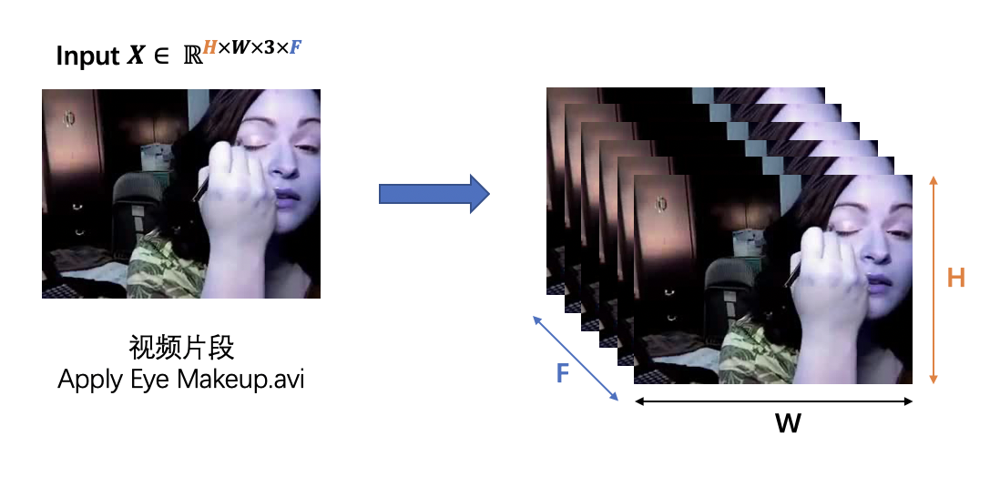
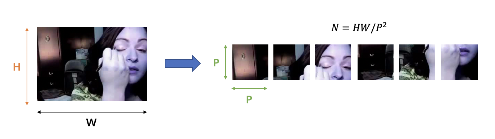
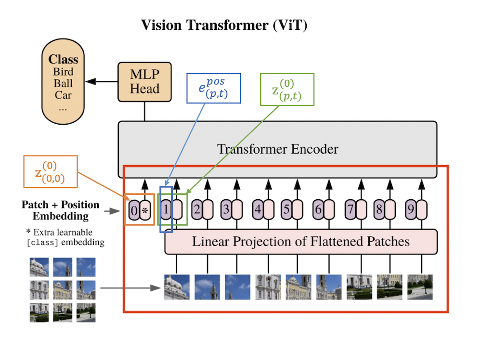
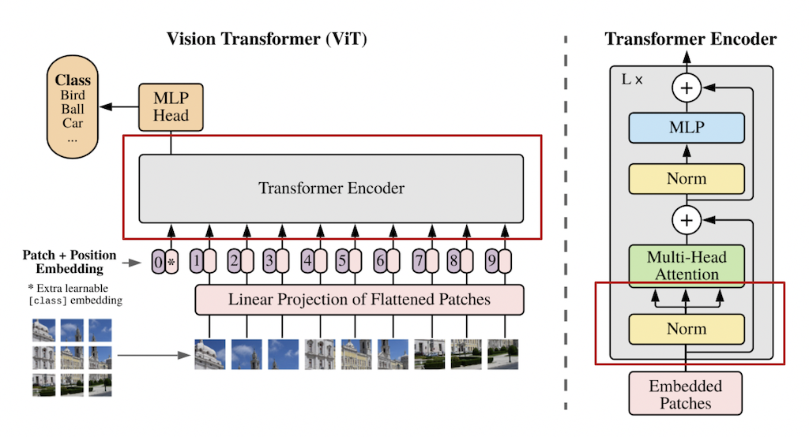
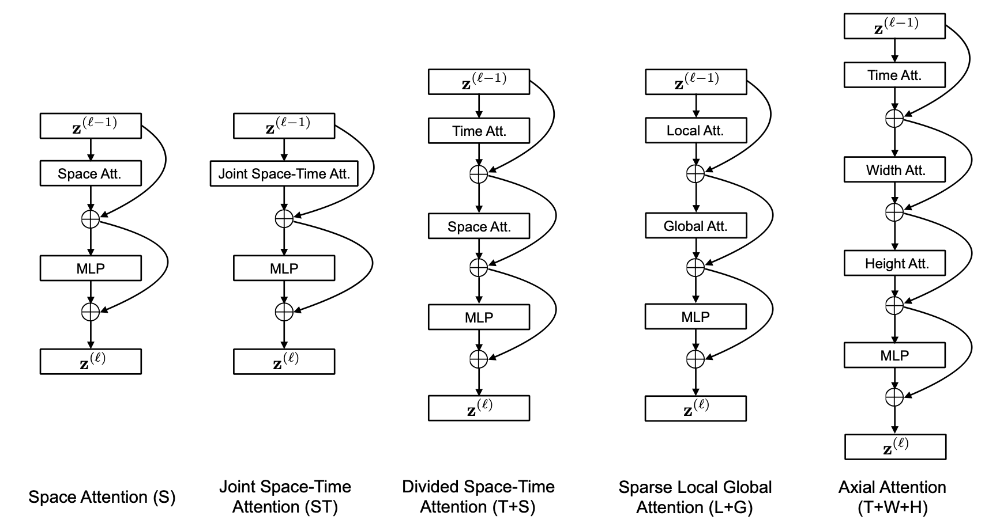
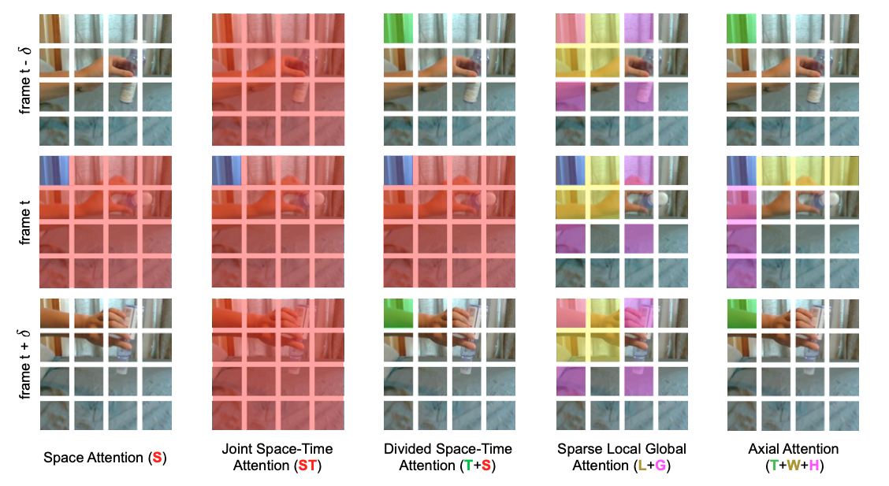
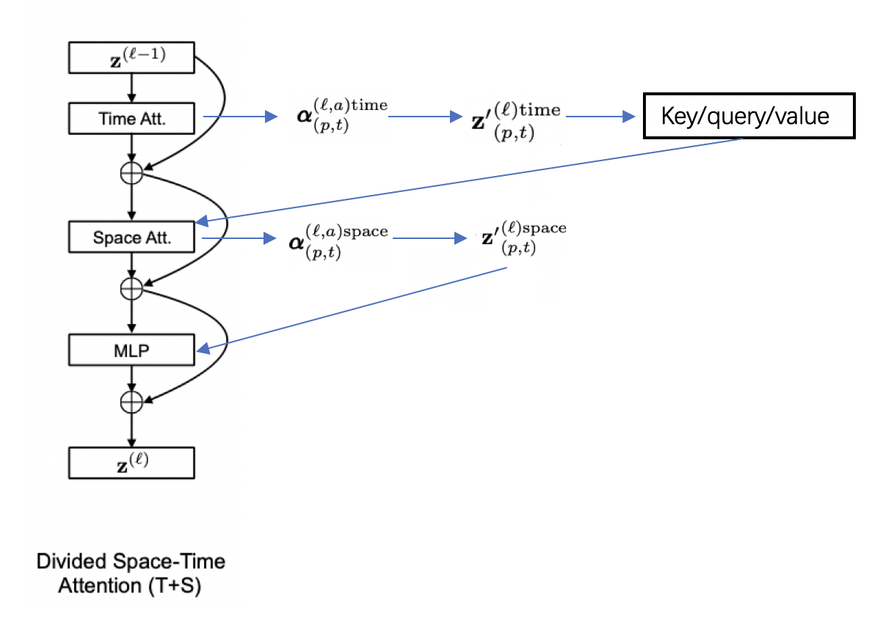
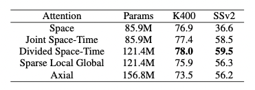
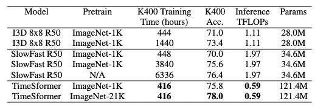

# TimeSformer

## 1. TimeSformer 简介

论文地址：[Is Space-Time Attention All You Need for Video Understanding?](https://arxiv.org/pdf/2102.05095.pdf)

TimeSformer是Facebook AI于2021年提出的无卷积视频分类方法，该方法使用ViT网络结构作为backbone，提出时空自注意力机制，以此代替了传统的卷积网络。与图像只具有空间信息不同，视频还包含时间信息，因此TimeSformer对一系列的帧级图像块进行时空特征提取，从而适配视频任务。TimeSformer在多个行为识别基准测试中达到了SOTA效果，其中包括TimeSformer-L在Kinetics-400上达到了80.7的准确率，超过了经典的基于CNN的视频分类模型TSN、TSM及Slowfast，而且有更短的训练用时（Kinetics-400数据集训练用时39小时）。同时，与3D卷积网络相比，TimeSformer的模型训练速度更快，拥有更高的测试效率，并且可以处理超过一分钟的视频片段。

## 2. 模型介绍

**输入视频片段**

TimeSformer的输入 $X \in \mathbb{R}^{H \times W \times 3 \times F}$ 为一段视频片段，由 $F$ 个从视频中采样的大小为 $H \times W$​ 的 RGB 图片帧组成。

图1：输入视频片段由一系列的图片帧构成
  

**图像块拆分**

与 ViT 结构相同，TimeSformer将每一帧的图像分割成 $N$ 个不重叠的图像块，每个图像块的大小为 $P \times P$。因为要确保每一帧被划分为 $N$ 个不重叠的图像块，因此 $N$ 的计算方式为：$N = HW / P^2$。我们将划分好的图像块展平为 $x_{(p,t)} \in \mathbb{R}^{3P^2}$ 的向量，其中 $p = 1, ..., N$ 代表图像块的位置，$t = 1, ..., F$ 代表帧的索引。

图2：将图像帧切割成图像块
  

**线性嵌入**

我们将每一个图像块 $x_{(p,t)}$ 通过一个线性嵌入层转化为向量 $z_{(p,t)}^{(0)} \in \mathbb{R}^D$​ :

$$
z_{(p,t)}^{(0)} = Ex_{(p,t)} + e_{(p,t)}^{pos}
$$

其中，$E \in \mathbb{R}^{D \times 3P^2}$ 是一个可学习的矩阵，$e_{(p,t)}^{pos} \in \mathbb{R}^D$ 代表一个可学习的位置embedding, 可以对每个图像块的位置信息进行编码。因为transformer的序列式处理方式减弱了空间位置关系，因此需要给每个图像块加上一个位置信息。$z_{{(p,t)}}^{(0)}$ 代表 transformer 结构的输入，同时，额外增加一个 $z_{(0,0)}^{(0)} \in \mathbb{R}^D$​ 来表示分类token的embedding，作为分类器的输入。

图3：线性嵌入层
  

**QKV计算**

TimeSformer采用的 transformer 结构中包含 $L$ 个编码模块。对于每一个模块 $l$​，一个query/key/value的向量都会由下述公式进行计算：

$$
q_{(p,t)}^{(l,a)} = W_Q^{(l,a)}LN(z_{(p,t)}^{(l-1)}) \in \mathbb{R}^{D_h} \\
k_{(p,t)}^{(l,a)} = W_K^{(l,a)}LN(z_{(p,t)}^{(l-1)}) \in \mathbb{R}^{D_h} \\
v_{(p,t)}^{(l,a)} = W_V^{(l,a)}LN(z_{(p,t)}^{(l-1)}) \in \mathbb{R}^{D_h} \\
$$

其中，LN() 代表层归一化，$a = 1, ..., A$ 代表多个注意力头的索引，$A$ 表示注意力头的总数。每个注意力头的潜在维度为 $D_h = D/A$​。

图4：QKV计算
  

**自注意力计算**

图5：自注意力模块
  

作者在实验过程中对不同的视频自注意力模块进行了调研。实验发现，单一维度的自注意力（只有时间维度或空间维度的自注意力）（S）相比于时空注意力模块（ST）极大的减小了计算量，但只采取单一的时间或空间维度进行自注意力计算，对于视频分类任务来说，势必会极大的影响模型的分类精度，因此，作者提出了一种 “Divided Space-Time Attention”(T+S)，在先进行时间注意力后再进行空间注意力，不同的注意力模块结构 **如图5** 所示。对于分离的注意力，我们先将每一个图片块 $(p,t)$ 与其他在相同空间位置但是不同时间帧的图像块进行对比（自注意力工作机制可视化 **如图6** 所示），得到权重矩阵 $\alpha_{(p,t)}^{(l,a)time}$:

$$
\alpha_{(p,t)}^{(l,a)time} = SM(\frac{{q_{(p,t)}^{(l,a)}}^T}{\sqrt{D_h}} \cdot [k_{(0,0)}^{(l,a)} \{k_{(p, t^{'})}^{(l,a)} \}_{t^{'} = 1, ..., F}])
$$

图6：自注意力模块工作机制可视化。每个视频片段都视为由一系列的帧级图像块组成，图像块大小为16*16 pixels。在本图中，蓝色代表查询图像块，非蓝色但有颜色的图像块为不同方案下的自注意力时空邻域，无颜色图像块则不用于蓝色图像块的自注意力计算。不同attention结构中不同的图像块颜色代表用于不同维度，比如：（T+S）的情况中，绿色图像块代表时间维度的自注意力邻域，红色图像块则代表空间维度的自注意力邻域。
  

实验证明，相比于每个图像块都需要进行 $(NF+1)$ 次对比的时空联合注意力模块（ST），空间-时间分离的注意力模块（T+S）对于每个图像块只需要进行 $(N+F+2)$ 次对比，极大的提高了计算效率的同时，同时也获得了更好的分类准确率。

作者还试验了“稀疏局部全局”（L+G）和 “轴向” (T+W+H) 注意力模型。其结构如 **图5** 所示，**图6** 显示attention过程中涉及到的图像块。对每个图像块 $(p,t)$，（L+G）首先考虑相邻的 $F \times H/2 \times W/2$ 图像块来计算局部注意力，然后以两个图像块的步长对整个视频片段沿时间维度和空间维度计算稀疏全局注意力。“轴向”注意力将注意力计算分解为三个不同的步骤：时间、宽度和高度。Ho et al., 2019[1]; Huang et al., 2019[2]; Wang et al., 2020b[3] 中提出了对图像两个空间轴的分解注意力，作者针对视频的情况添加了时间维度。

图7：divided space-time attention
  

针对分离的时空自注意力模块，具体的计算流程如 **图7** 所示，在通过time attention获得 $alpha_{(p,t)}^{(l,a)time}$, 根据权重矩阵计算得到encoding ${z^{'}}_{(p,t)}^{(l)time}$并由此计算出新的key/query/value向量。使用新得到的key/query/value来进行空间维度的计算，通过space attention得到 ${z^{'}}_{(p,t)}^{(l)space}$​​，最终经过MLP层得到：

$$
z_{(p,t)}^{(l)} = MLP(LN({z^{'}}_{(p,t)}^{(l)})) + {z^{'}}_{(p,t)}^{(l)}
$$

**Classification**

最后，通过一个MLP对class token进行处理，得到最终的预测结果。

$$
y = MLP(z_{(0,0)}^{(L)})
$$

## 3. 实验结果

作者对不同的attention模块分别在Kinetics-400（K400）和Something-Something-V2（SSv2）数据集上进行了实验，实验结果如 **表1** 所示。可以看到，分离的时空自注意力在两个数据集上都达到了很好的效果。

表1：不同attention结构的实验结果对比
  

作者也对TimeSformer和SlowFast以及I3D在K400数据集上进行了比较，可以看到尽管TimeSformer的参数量较大但是其推理成本较低。同时，在ImageNet-21K上进行预训练，则可达到78%的分类准确率。

表2：TimeSformer与I3D、SlowFast对比
  

## References

[1] Ho, J., Kalchbrenner, N., Weissenborn, D., and Salimans, T. Axial attention in multidimensional transformers. *CoRR*, 2019. https://arxiv.org/pdf/1912.12180.pdf

[2] Huang, Z., Wang, X., Huang, L., Huang, C., Wei, Y., and Liu, W. Ccnet: Criss-cross attention for semantic seg- mentation. 2019. https://openaccess.thecvf.com/content_ICCV_2019/papers/Huang_CCNet_Criss-Cross_Attention_for_Semantic_Segmentation_ICCV_2019_paper.pdf

[3] Wang, H., Zhu, Y., Green, B., Adam, H., Yuille, A. L., and Chen, L. Axial-deeplab: Stand-alone axial-attention for panoptic segmentation. In *Computer Vision - ECCV 2020 - 16th European Conference*, 2020b. https://link.springer.com/chapter/10.1007/978-3-030-58548-8_7

