# 激活函数

## 什么是激活函数

* 激活函数是人工神经网络的一个极其重要的特征；
* 激活函数决定一个神经元是否应该被激活，**激活**代表神经元接收的信息与给定的信息有关；
* 激活函数对输入信息进行非线性变换，然后将变换后的输出信息作为输入信息传给下一层神经元。

## 激活函数的作用

如果不用激活函数，每一层输出都是上层输入的线性函数，无论神经网络有多少层，最终的输出都是输入的线性组合。
激活函数给神经元引入了非线性因素，使得神经网络可以任意逼近任何非线性函数。

## 激活函数的种类

### identity

函数定义：

$$f(x)=x$$

导数：

$${ f }^{ ' }(x)=1$$

函数图形如 **图1** 所示：

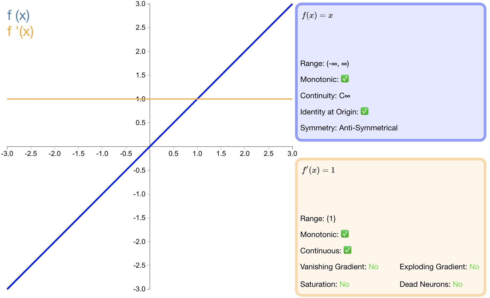

图1 identity

优点：适合于潜在行为是线性（与线性回归相似）的任务。

缺点：无法提供非线性映射，当多层网络使用identity激活函数时，整个网络就相当于一个单层模型。
### step
函数定义：

$$ { f }(x)=\begin{cases} \begin{matrix} 0 & x<0 \end{matrix} \\ \begin{matrix} 1 & x\ge 0 \end{matrix} \end{cases}$$

导数：

$$ { f }^{ ' }(x)=\begin{cases} \begin{matrix} 0 & x\neq 0 \end{matrix} \\ \begin{matrix} ? & x=0 \end{matrix} \end{cases}$$

函数图形如 **图2** 所示：

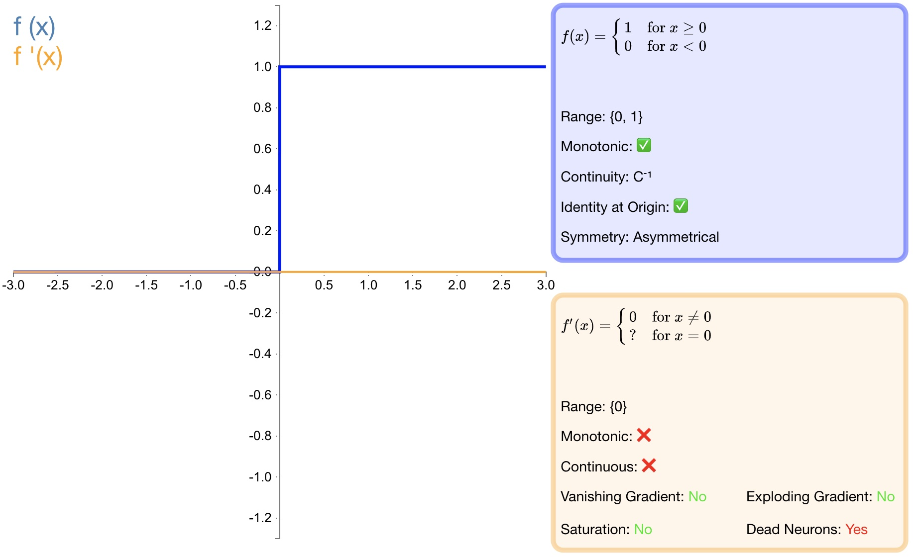

图2 step

优点：激活函数 $Step$ 更倾向于理论而不是实际，它模仿了生物神经元要么全有要么全无的属性。

缺点：它无法应用于神经网络因为其导数是 $0$（除了零点导数无定义以外），这意味着基于梯度的优化方法并不可行。
### sigmoid
函数定义：

$${ f }(x)=\sigma (x)=\frac { 1 }{ 1+{ e }^{ -x } } $$

导数：

$${ f }^{ ' }(x)=f(x)(1-f(x))$$

函数图形如 **图3** 所示：

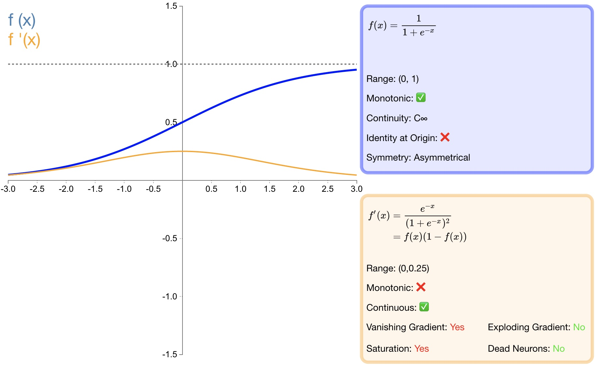

图3 sigmoid

优点：
1. $sigmoid$ 函数的输出映射在 $(0,1)$ 之间，单调连续，输出范围有限，优化稳定，可以用作输出层；
2. 求导容易；

缺点：
1. 由于其软饱和性，一旦落入饱和区梯度就会接近于0，根据反向传播的链式法则，容易产生梯度消失，导致训练出现问题；
2. Sigmoid函数的输出恒大于0。非零中心化的输出会使得其后一层的神经元的输入发生偏置偏移（Bias Shift），并进一步使得梯度下降的收敛速度变慢；
3. 计算时，由于具有幂运算，计算复杂度较高，运算速度较慢。

### tanh
函数定义：

$${ f }(x)=tanh(x)=\frac { { e }^{ x }-{ e }^{ -x } }{ { e }^{ x }+{ e }^{ -x } }$$

导数：

$${ f }^{ ' }(x)=1-f(x)^{ 2 }$$

函数图形如 **图4** 所示：

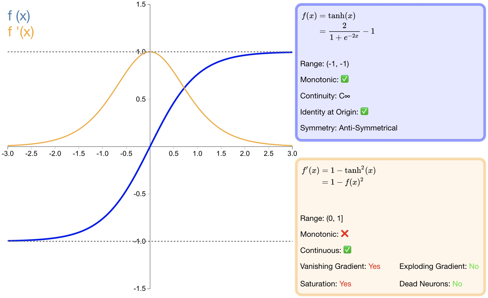

图4 tanh

优点：
1. $tanh$ 比 $sigmoid$ 函数收敛速度更快；
2. 相比 $sigmoid$ 函数，$tanh$ 是以 $0$ 为中心的；

缺点：
1. 与 $sigmoid$ 函数相同，由于饱和性容易产生的梯度消失；
2. 与 $sigmoid$ 函数相同，由于具有幂运算，计算复杂度较高，运算速度较慢。

### ReLU

函数定义：

$$f(x)=\begin{cases} \begin{matrix} 0 & x<0 \end{matrix} \\ \begin{matrix} x & x\ge 0 \end{matrix} \end{cases}$$

导数：

$${ { f }(x) }^{ ' }=\begin{cases} \begin{matrix} 0 & x<0 \end{matrix} \\ \begin{matrix} 1 & x\ge 0 \end{matrix} \end{cases}$$

函数图如 **图5** 所示：

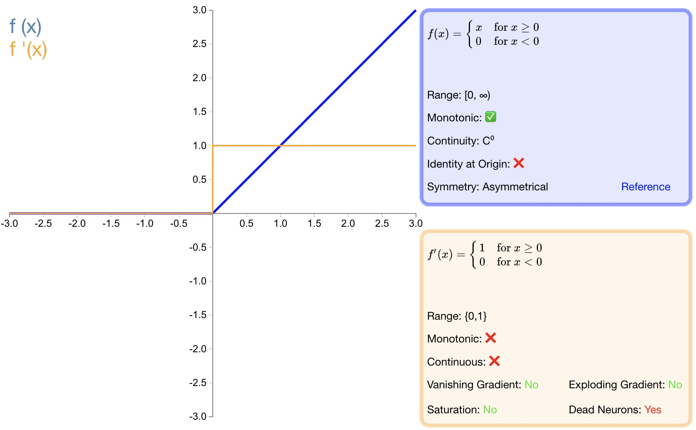

图5 ReLU

优点：
1. 收敛速度快；
2. 相较于 $sigmoid$ 和 $tanh$ 中涉及了幂运算，导致计算复杂度高， ReLU​可以更加简单的实现；
3. 当输入 $x>=0$ 时，ReLU​ 的导数为常数，这样可有效缓解梯度消失问题；
4. 当 $x<0$ 时，ReLU​ 的梯度总是 $0$，提供了神经网络的稀疏表达能力；

缺点：
1. ReLU​ 的输出不是以 $0$ 为中心的；
2. 神经元坏死现象，某些神经元可能永远不会被激活，导致相应参数永远不会被更新；
3. 不能避免梯度爆炸问题；

### LReLU

函数定义：

$$ f(x)=\begin{cases} \begin{matrix} \alpha x & x<0 \end{matrix} \\ \begin{matrix} x & x\ge 0 \end{matrix} \end{cases}$$

导数：

$${ { f }(x) }^{ ' }=\begin{cases} \begin{matrix} \alpha & x<0 \end{matrix} \\ \begin{matrix} 1 & x\ge 0 \end{matrix} \end{cases}$$

其中，$\alpha$ 常设置为0.01。函数图如 **图6** 所示：

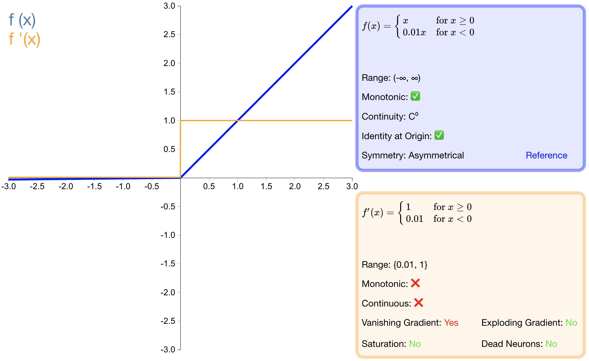

图6 LReLU

优点：
1. 避免梯度消失；
2. 由于导数总是不为零，因此可减少死神经元的出现；

缺点：
1. LReLU​ 表现并不一定比 ReLU​ 好；
2. 无法避免梯度爆炸问题；

### PReLU

函数定义：

$$f(\alpha ,x)=\begin{cases} \begin{matrix} \alpha x  & x<0 \end{matrix} \\ \begin{matrix} x & x\ge 0 \end{matrix} \end{cases}$$

导数：

$${ { f }(\alpha ,x) }^{ ' }=\begin{cases} \begin{matrix} \alpha  & x<0 \end{matrix} \\ \begin{matrix} 1 & x\ge 0 \end{matrix} \end{cases}$$

函数图如 **图7** 所示：

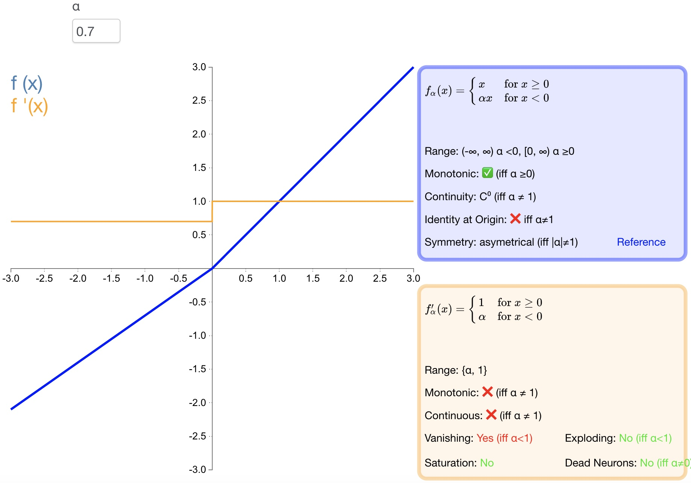

图7 PReLU

优点：
1. PReLU​ 是 LReLU 的改进，可以自适应地从数据中学习参数；
2. 收敛速度快、错误率低；
3. PReLU 可以用于反向传播的训练，可以与其他层同时优化；

### RReLU

函数定义：

$$f(\alpha ,x)=\begin{cases} \begin{matrix} \alpha  & x<0 \end{matrix} \\ \begin{matrix} x & x\ge 0 \end{matrix} \end{cases}$$

导数：

$${ { f }(\alpha ,x) }^{ ' }=\begin{cases} \begin{matrix} \alpha  & x<0 \end{matrix} \\ \begin{matrix} 1 & x\ge 0 \end{matrix} \end{cases}$$

函数图形如 **图8** 所示：

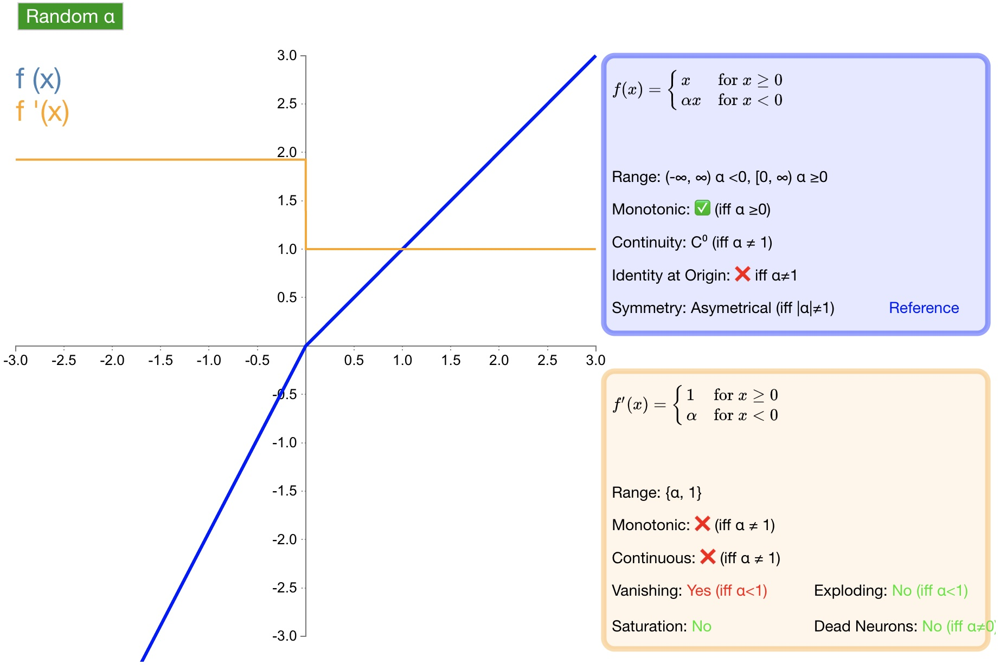

图8 RReLU

优点：为负值输入添加了一个线性项，这个线性项的斜率在每一个节点上都是随机分配的（通常服从均匀分布）。
### ELU

函数定义：

$$ f(\alpha ,x)=\begin{cases} \begin{matrix} \alpha \left( { e }^{ x }-1 \right)  & x<0 \end{matrix} \\ \begin{matrix} x & x\ge 0 \end{matrix} \end{cases}$$

导数：

$${ { f }(\alpha ,x) }^{ ' }=\begin{cases} \begin{matrix} f(\alpha ,x)+\alpha  & x<0 \end{matrix} \\ \begin{matrix} 1 & x\ge 0 \end{matrix} \end{cases}$$

函数图形如 **图9** 所示：

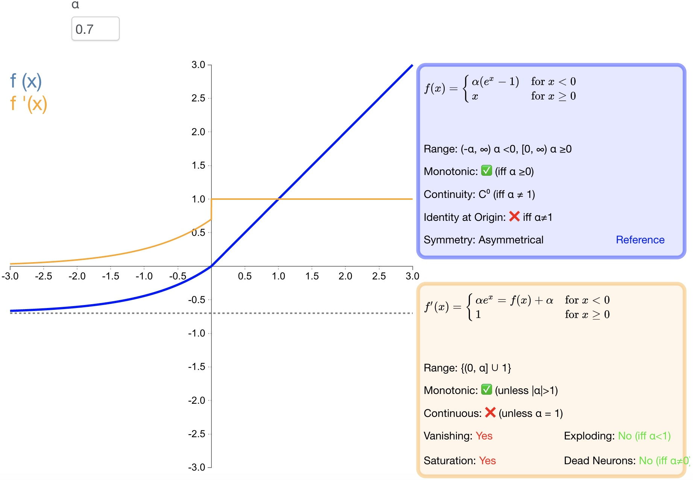

图9 ELU

优点：
1. 导数收敛为零，从而提高学习效率；
2. 能得到负值输出，这能帮助网络向正确的方向推动权重和偏置变化；
3. 防止死神经元出现。

缺点：
1. 计算量大，其表现并不一定比 ReLU 好；
2. 无法避免梯度爆炸问题；

### SELU

函数定义：

$$f(\alpha ,x)=\lambda \begin{cases} \begin{matrix} \alpha \left( { e }^{ x }-1 \right)  & x<0 \end{matrix} \\ \begin{matrix} x & x\ge 0 \end{matrix} \end{cases}$$

导数：

$${ { f }(\alpha ,x) }^{ ' }=\lambda \begin{cases} \begin{matrix} \alpha \left( { e }^{ x } \right)  & x<0 \end{matrix} \\ \begin{matrix} 1 & x\ge 0 \end{matrix} \end{cases}$$

函数图形 **如图10**  所示：

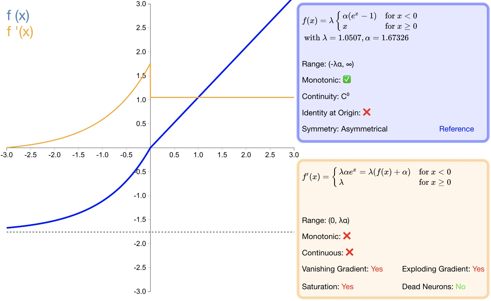

图10 SELU

优点：
1. SELU 是 ELU 的一个变种。其中 λ 和 α 是固定数值（分别为 $1.0507$ 和 $1.6726$）;
2. 经过该激活函数后使得样本分布自动归一化到 $0$ 均值和单位方差;
3. 不会出现梯度消失或爆炸问题;

### softsign
函数定义：

$$f(x)=\frac { x }{ \left| x \right| +1 }$$

导数：

$${ f }^{ ' }(x)=\frac { 1 }{ { (1+\left| x \right| ) }^{ 2 } } $$

函数图形如 **图 11** 所示：

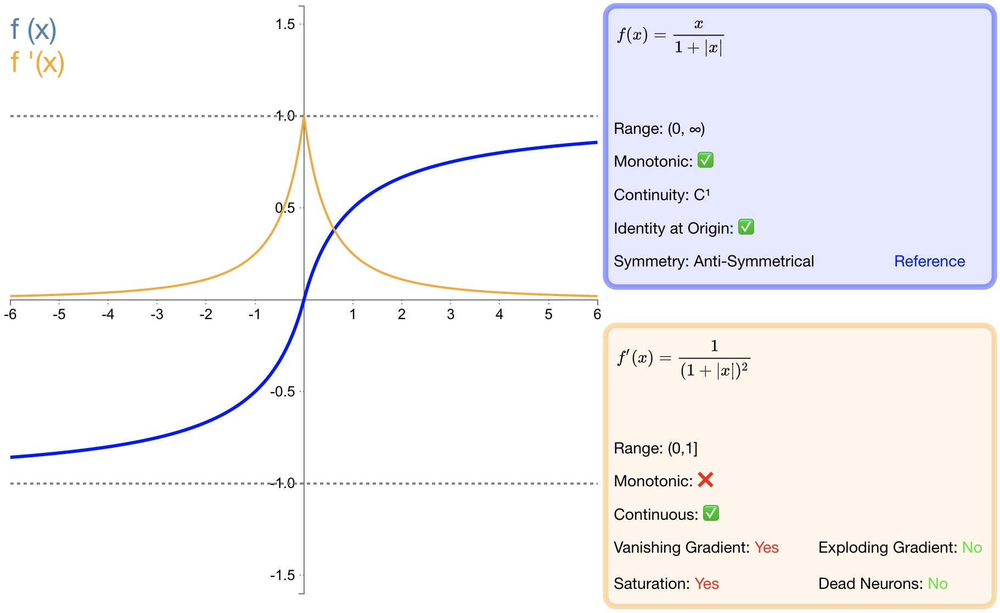

图11 softsign

优点：
1. $softsign$ 是 $tanh$ 激活函数的另一个替代选择；
2. $softsign$ 是反对称、去中心、可微分，并返回 $-1$ 和 $1$ 之间的值；
3. $softsign$ 更平坦的曲线与更慢的下降导数表明它可以更高效地学习；

缺点：
1. 导数的计算比$tanh$ 更麻烦；

### softplus

函数定义：

$$f(x)=\ln { (1+{ e }^{ x }) }$$

导数：

$${ f }^{ ' }(x)=\frac { 1 }{ 1+{ e }^{ -x } }$$

函数图形如 **图12** 所示：

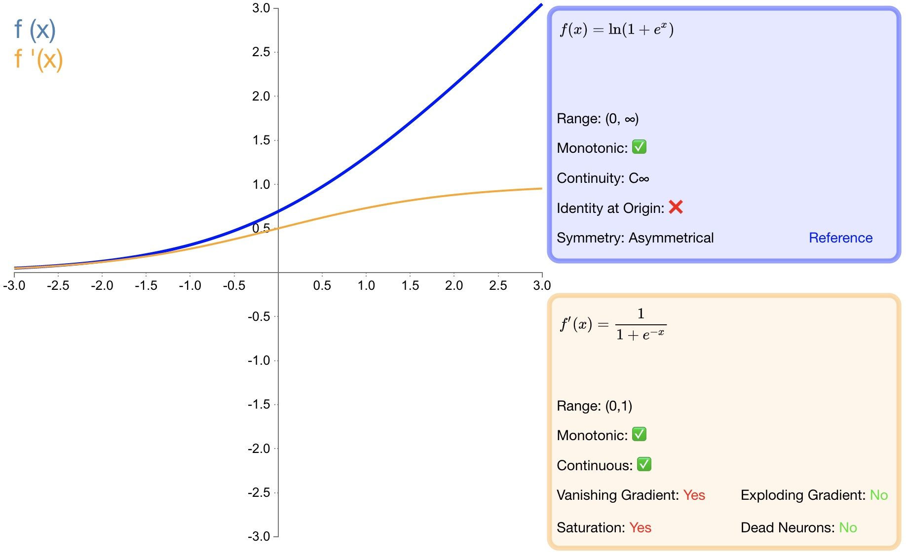

图12 softplus

优点：
1. 作为 $relu$ 的一个不错的替代选择，$softplus$ 能够返回任何大于 $0$ 的值。
2. 与 $relu$ 不同，$softplus$ 的导数是连续的、非零的，无处不在，从而防止出现死神经元。

缺点：
1. 导数常常小于 $1$ ，也可能出现梯度消失的问题。
2. $softplus$ 另一个不同于 $relu$ 的地方在于其不对称性，不以零为中心，可能会妨碍学习。

### softmax
softmax 函数一般用于多分类问题中，它是对逻辑斯蒂（logistic）回归的一种推广，也被称为多项逻辑斯蒂回归模型(multi-nominal logistic mode)。假设要实现 k 个类别的分类任务，Softmax 函数将输入数据 $x_i$ 映射到第 $i$ 个类别的概率 $y_i$ 如下计算：

$$
y_i=soft\max \left( x_i \right) =\frac{e^{x_i}}{\sum_{j=1}^k{e^{x_j}}}
$$

显然，$0<y_i<1$。**图13** 给出了三类分类问题的  softmax 输出示意图。在图中，对于取值为 4、1和-4 的 $x_1$、$x_2$ 和 $x_3$，通过 softmax 变换后，将其映射到 (0,1) 之间的概率值。

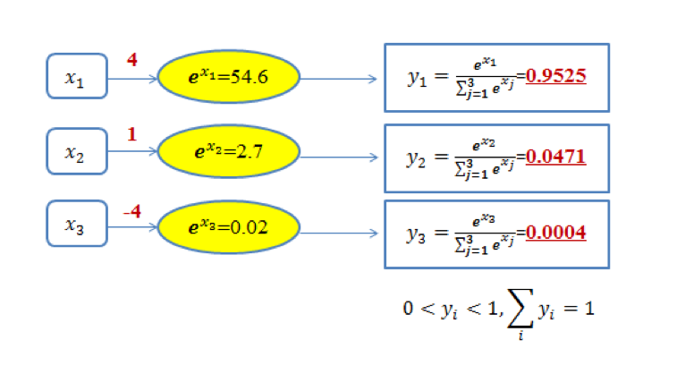

图13 三类分类问题的softmax输出示意图

由于 softmax 输出结果的值累加起来为 1，因此可将输出概率最大的作为分类目标（图 1 中被分类为第一类）。

也可以从如下另外一个角度来理解图 1 中的内容：给定某个输入数据，可得到其分类为三个类别的初始结果，分别用 $x_1$、$x_2$ 和 $x_3$ 来表示。这三个初始分类结果分别是 4、1和-4。通过 Softmax 函数，得到了三个类别分类任务中以概率表示的更好的分类结果，即分别以 95.25%、4.71%和0.04% 归属于类别1、类别2 和类别3。显然，基于这样的概率值，可判断输入数据属于第一类。可见，通过使用 Softmax 函数，可求取输入数据在所有类别上的概率分布。

### swish
函数定义：

$$f\left( x \right) =x\cdot \sigma \left( x \right) $$

其中，$\sigma$ 是 $sigmoid$ 函数。

$swish$ 激活函数的图形如 **图14** 所示：

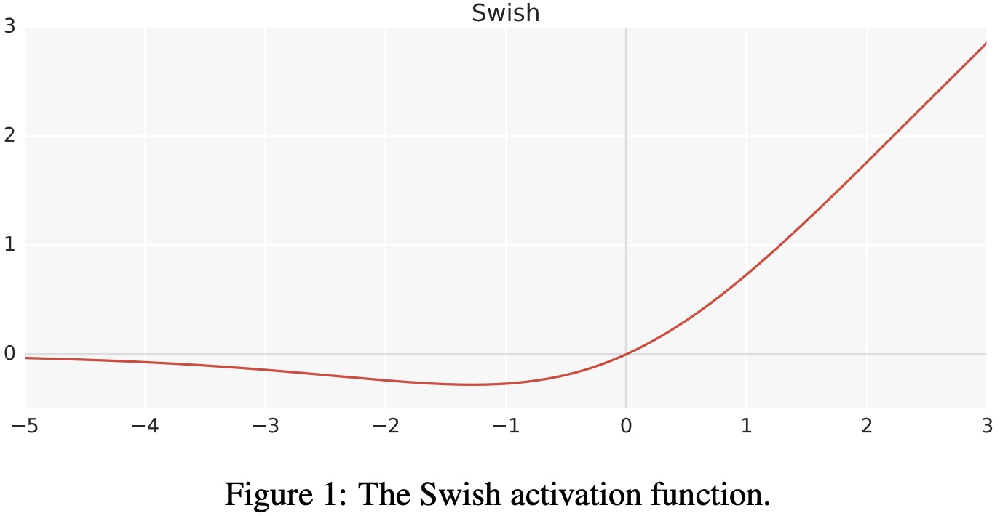

图14 swish 激活函数

$swish$ 激活函数的一阶导数如下：

$$\begin{array}{c}
	f^{'}\left( x \right) =\sigma \left( x \right) +x\cdot \sigma \left( x \right) \left( 1-\sigma \left( x \right) \right)\\
	=\sigma \left( x \right) +x\cdot \sigma \left( x \right) -x\cdot \sigma \left( x \right) ^2\\
	=x\cdot \sigma \left( x \right) +\sigma \left( x \right) \left( 1-x\cdot \sigma \left( x \right) \right)\\
	=f\left( x \right) +\sigma \left( x \right) \left( 1-f\left( x \right) \right)\\
\end{array}$$

$swish$ 激活函数的一阶和二阶导数的图形如 **图15** 所示：

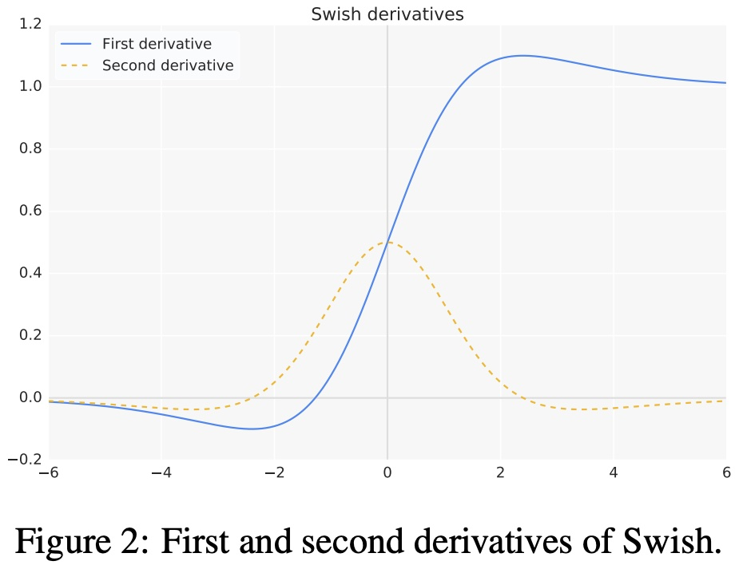

图15 swish 导数

超参数版 $swish$ 激活函数：

$$f\left( x \right) =x\cdot \sigma \left( \beta x \right)$$

其中，$\beta$ 是超参数。超参数版 $swish$ 激活函数的图形如 **图16** 所示：

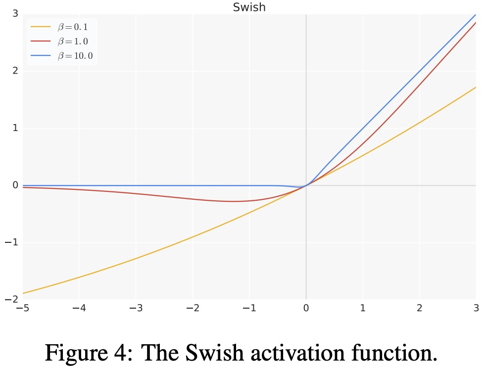

图16 swish 超参数

优点：
1. 当 $x>0$ 时，不存在梯度消失的情况；当 $x<0$ 时，神经元也不会像 ReLU 一样出现死亡的情况；
2. $swish$ 处处可导，连续光滑；
3. $swish$ 并非一个单调的函数；
4. 提升了模型的性能；

缺点：
1. 计算量大；

### hswish
函数定义：

$$f\left( x \right) =x\frac{\text{Re}LU6\left( x+3 \right)}{6}$$

$hard \ swish$ 和 $swish$ 激活函数对比如 **图17** 所示：

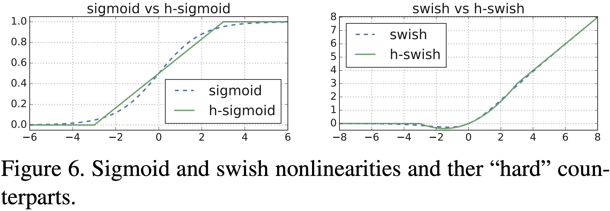

图17 Hard Swish

优点：
与 $swish$ 相比 $hard \ swish$ 减少了计算量，具有和 $swish$ 同样的性质。

缺点：
与 $relu6$ 相比 $hard \ swish$ 的计算量仍然较大。

## 激活函数的选择
1. 浅层网络在分类器时，$sigmoid$ 函数及其组合通常效果更好。
2. 由于梯度消失问题，有时要避免使用 $sigmoid$ 和 $tanh$ 函数。
3. $relu$ 函数是一个通用的激活函数，目前在大多数情况下使用。
4. 如果神经网络中出现死神经元，那么 $prelu$ 函数就是最好的选择。
5. $relu$ 函数只能在隐藏层中使用。
6. 通常，可以从 $relu$ 函数开始，如果 $relu$ 函数没有提供最优结果，再尝试其他激活函数。

## 激活函数相关问题
> 为什么 $relu$ 不是全程可微/可导也能用于基于梯度的学习？

从数学的角度看 $relu$ 在 $0$ 点不可导，因为它的左导数和右导数不相等；但在实现时通常会返回左导数或右导数的其中一个，而不是报告一个导数不存在的错误，从而避免了这个问题。

> 为什么 $tanh$ 的收敛速度比 $sigmoid$ 快？

$$\tan\text{h}^{'}\left( x \right) =1-\tan\text{h}\left( x \right) ^2\in \left( 0,1 \right) $$

$$s^{'}\left( x \right) =s\left( x \right) \left( 1-s\left( x \right) \right) \in \left( 0,\frac{1}{4} \right] $$

由上面两个公式可知 $tanh$ 引起的梯度消失问题没有 $sigmoid$ 严重，所以 $tanh$ 收敛速度比 $sigmoid$ 快。

> sigmoid 和 softmax 有什么区别？

1. 二分类问题时 $sigmoid$ 和 $softmax$ 是一样的，都是求 $cross \ entropy \ loss$ ，而 $softmax$ 可以用于多分类问题。
2. $softmax$ 是 $sigmoid$ 的扩展，因为，当类别数 $k=2$ 时，$softmax$ 回归退化为 $logistic$ 回归。
3. $softmax$ 建模使用的分布是多项式分布，而 $logistic$ 则基于伯努利分布。
4. 多个 $logistic$ 回归通过叠加也同样可以实现多分类的效果，但是 $softmax$ 回归进行的多分类，类与类之间是互斥的，即一个输入只能被归为一类；多 $logistic$ 回归进行多分类，输出的类别并不是互斥的，即"苹果"这个词语既属于"水果"类也属于"$3C$"类别。

