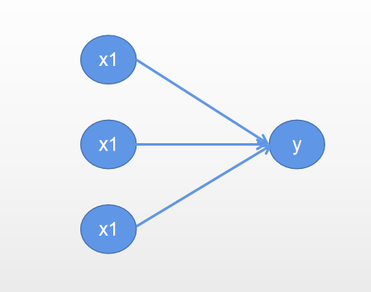
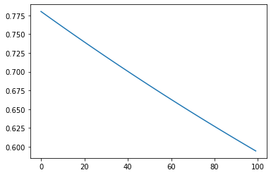

# 前言

​		在介绍深度学习的全连接之前，需要介绍一下高中的线性回归知识，在线性回归中，我们希望找到一个函数 $y=a*x+b$ 中的$a$ 和$b$ ，使得每一个$x$ 计算的$y_{pred}$尽可能的与真实值$y_{true}$ 就接近，在全连接中也是这样一个目的，不过寻找的参数有很多，多到没有线性回归那样计算$a$ 和$b$ 的公式来求解，所以需要使用计算机根据一定的策略来搜寻。

## 线性回归

**假如有一组数据：（1）**

| x    | $y_{true}$ |
| ---- | ---------- |
| 1    | 2          |
| 2    | 3          |
| 3    | 4          |
| 4    | 5          |

那么根据线性回归的公式可以计算得到$y=x+1$,如果想使用深度学习框架如何来计算这$a,b$的值呢

计算机是使用不断试错的办法，大致步骤如下：

- 第一步

  先随机给定一个参数，如$a=2,b=3$ 那么有公式$y=2x+3$，把$x$的值以此代入可以得到5，7，9，11。计算机需要知道我计算的值是否和真实值$y_{true}$有多大的偏差呢，这里就需要使用一个量化的办法，叫损失函数，是用来计算预测值和真是值之间的差距，这里采用绝对值$loss=\sum{|y_{true}-y_{pred}|}$，可以得到损失值为18。

- 第二步

  再随机给定$a和b$的值，计算得到损失值

不断地重复上面的步骤，这样就可以得到很多的损失值和对应的$a,b$ ，挑选出使得损失值最小的$a,b$作为该回归函数的参数。

**现在数据难度升级（2）**

| $x_1$ | $x_2$ | $x_3$ | $y_{true}$ |
| ----- | ----- | ----- | ---------- |
| 0.8   | 1     | 4     | 2          |
| 0.4   | 2     | 6     | 3          |
| 0.1   | 3     | 3     | 4          |
| 0.9   | 4     | 10    | 5          |

对于这组数据集，目标是寻找函数$y=ax_1+bx_2+cx_3$ 中的$a,b,c$使得函数计算得到的结果和$y_{true}$ 尽可能的接近，或者说使得损失值最小。

## 全连接神经网络

对于数据（2），用深度学习的图表示如下：



现在使用paddle来完成这样一个任务：

```python
import paddle
from paddle import nn
from paddle.optimizer import Adam
from paddle.nn import MSELoss
import numpy as np
import matplotlib.pyplot as plt

x=paddle.to_tensor([[0.8, 1, 4],
                    [0.4 ,2, 6],  
                    [0.1 ,3, 3],
                    [0.9, 4, 10]]).astype("float32")
y=paddle.to_tensor([[2],[3],[4],[5]]).astype("float32")

#定义模型的结构
class FullConnected(nn.Layer):
    def __init__(self):
        super(FullConnected,self).__init__()
        self.fc=nn.Linear(3,1)#这里表示是接收3个数据就会返回1个数据
    #必须重写forward方法，在调用模型的时候会自动地执行forward方法
    def forward(self,x):
        out = self.fc(x)#这里接收3个数据然后得到一个数据out
        return out

model = FullConnected()#实例化模型
adam = Adam(learning_rate=0.001,parameters=model.parameters())#优化器
mse = MSELoss()#均方差损失函数，不使用绝对值损失函数而使用均方差是方便求导

LOSS=[]
for i in range(100):
    ls=[]
    for data,label in zip(x,y):
        pred = model(data)#模型得到一个预测值
        loss = mse(pred, label)#计算真实值和预测值之间的损失
        ls.append(loss.item())
        loss.backward()#将损失反向传播
        adam.step()
        adam.clear_grad()
    print("第{}轮，损失为：{}".format(i,np.mean(ls)))
    LOSS.append(np.mean(ls))

#画出损失值
plt.plot(range(len(LOSS)),LOSS)
plt.show()
```



可以看出，随着迭代次数的增加，损失值不断下降

## 全连接的缺点

在卷积神经网络出现之前，人们处理图片这种二维的数据集通常是将其拉平变成一维的数据，这样的结果就是数据特征极多，计算量大，而且效果不好，所以全连接适合处理的数据是每个样本本身就是一行即[N,M]形状的数据
