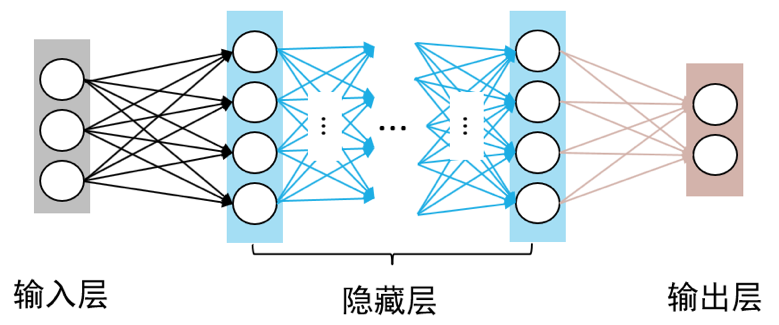

# 多层感知机

由于无法模拟诸如异或以及其他复杂函数的功能，使得单层感知机的应用较为单一。一个简单的想法是，如果能在感知机模型中增加若干隐藏层，增强神经网络的非线性表达能力，就会让神经网络具有更强拟合能力。因此，由多个隐藏层构成的多层感知机被提出。

如 **图1** 所示，多层感知机由输入层、输出层和至少一层的隐藏层构成。网络中各个隐藏层中神经元可接收相邻前序隐藏层中所有神经元传递而来的信息，经过加工处理后将信息输出给相邻后续隐藏层中所有神经元。

图1 多层感知机模型
  

在多层感知机中，相邻层所包含的神经元之间通常使用“全连接”方式进行连接。所谓“全连接”是指两个相邻层之间的神经元相互成对连接，但同一层内神经元之间没有连接。多层感知机可以模拟复杂非线性函数功能，所模拟函数的复杂性取决于网络隐藏层数目和各层中神经元数目。

