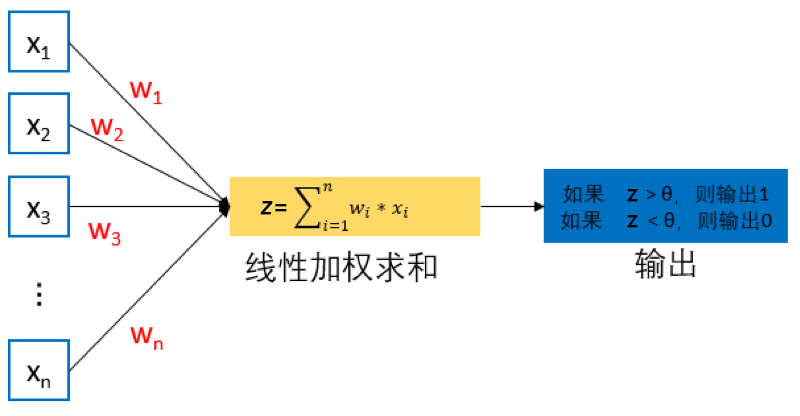

# 神经元

在生物学中，神经元细胞有兴奋与抑制两种状态。大多数神经元细胞在正常情况下处于抑制状态，一旦某个神经元受到刺激并且电位超过一定的阈值后，这个神经元细胞就被激活，处于兴奋状态，并向其他神经元传递信息。基于神经元细胞的结构特性与传递信息方式，神经科学家 Warren McCulloch 和逻辑学家 Walter Pitts 合作提出了“McCulloch–Pitts (MCP) neuron”模型。在人工神经网络中，MCP模型成为人工神经网络中的最基本结构。MCP模型结构如 **图1** 所示。

图1 MCP 模型结构
  

从 **图1** 可见，给定 n 个二值化（0或1）的输入数据 $x_i$ ($1\le i\le n$)与连接参数 $w_i$ ($1\le i\le n$)，MCP 神经元模型对输入数据线性加权求和，然后使用函数 $\varPhi \left(  \right)$ 将加权累加结果映射为 0 或 1 ，以完成两类分类的任务：
$$
y=\varPhi \left( \sum_{i=1}^n{w_ix_i} \right)
$$

其中 $w_i$ 为预先设定的连接权重值（一般在 0 和 1 中取一个值或者 1 和 -1 中取一个值），用来表示其所对应输入数据对输出结果的影响（即权重）。$\varPhi \left(  \right)$ 将输入端数据与连接权重所得线性加权累加结果与预先设定阈值 $\theta$ 进行比较，根据比较结果输出 1 或 0。

具体而言，如果线性加权累加结果（即 $\sum_{i=1}^m{w_ix_i}
$）大于阈值 $\theta$，则函数 $\varPhi \left(  \right)$ 的输出为1、否则为0。也就是说，如果线性加权累加结果大于阈值 $\theta$，则神经元细胞处于兴奋状态，向后传递 1 的信息，否则该神经元细胞处于抑制状态而不向后传递信息。

从另外一个角度来看，对于任何输入数据 $x_i$ ($1\le i\le n$)，MCP 模型可得到 1 或 0 这样的输出结果，实现了将输入数据分类到 1 或 0 两个类别中，解决了二分类问题。

