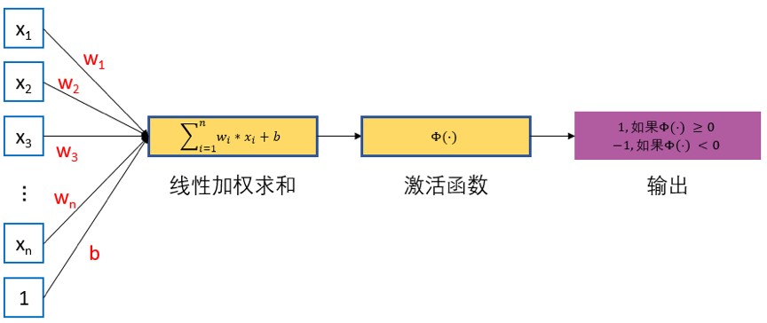
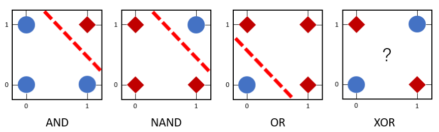

# 单层感知机

## 1. 单层感知机模型

1957年 Frank Rosenblatt 提出了一种简单的人工神经网络，被称之为感知机。早期的感知机结构和 MCP 模型相似，由一个输入层和一个输出层构成，因此也被称为“单层感知机”。感知机的输入层负责接收实数值的输入向量，输出层则为1或-1两个值。单层感知机可作为一种二分类线性分类模型，结构如 **图1** 所示。

图1 感知机模型
  

单层感知机的模型可以简单表示为：

$$
f(x) = sign(w*x+b)
$$
对于具有 $n$ 个输入 $x_{i}$ 以及对应连接权重系数为 $w_j$ 的感知机，首先通过线性加权得到输入数据的累加结果 $z$：$z=w_1 x_1+w_2 x_2+ ... +b$。这里 $x_1,x_2,...,x_n$ 为感知机的输入，$w_1,w_2,...,w_n$为网络的权重系数，$b$ 为偏置项（$bias$）。然后将 $z$ 作为激活函数 $\varPhi(\cdot)$ 的输入，这里激活函数 $\varPhi(\cdot)$为 $sign$ 函数，其表达式为：

$$
sign(x) = 
\begin{cases}
+1 \qquad & x \geq 0 \\
-1 \qquad & x \lt 0
\end{cases}
$$
 $\varPhi(\cdot)$会将 $z$ 与某一阈值（此例中，阈值为$0$）进行比较，如果大于等于该阈值则感知器输出为 $1$，否则输出为 $-1$。通过这样的操作，输入数据被分类为 $1$ 或 $-1$ 这两个不同类别。

## 2. 训练过程

给定一个 $n$ 维数据集，如果它可以被一个超平面完全分割，那么我们称这个数据集为线性可分数据集，否则，则为线性不可分的数据集。单层感知机只能处理线性可分数据集，其任务是寻找一个线性可分的超平面将所有的正类和负类划分到超平面两侧。单层感知机与 $MCP$ 模型在连接权重设置上是不同的，即感知机中连接权重参数并不是预先设定好的，而是通过多次迭代训练而得到的。单层感知机通过构建损失函数来计算模型预测值与数据真实值间的误差，通过最小化代价函数来优化模型参数。

其具体的训练过程为：

1. 定义数据集，变量和参数，其中给定一个$m*n$大小的数据集，$x^0, x^1,...,x^m$ 为训练样本, $x_0^m, x_1^m, ..., x_n^m$为第 $m$ 条训练样本，$d^m$ 为期望结果，$y^m$ 为实际结果，$\eta$ 为学习率，$0 \lt \eta \lt 1$；

2. 对权重系数$w_j$进行初始化，初始值为随机值或全零值。同时，设置 $m = 0$，读取第零条训练样本；

3. 将训练样本输入到单层感知机中，根据模型公式，得到实际输出 $y$ ;

4. 根据如下公式更新权重系数;
   
   
   $$
   w^{m+1} = w^m + \eta[d^m - y^m]x^m
   $$
   
5. 当满足收敛条件时，算法结束；若不满足收敛条件则输入下一条样本继续训练，即 $m = m +1$。通常收敛条件可为：

   * 误差小于某个预先设定的较小值 $\epsilon$ ;
   * 迭代的权重系数间权值变化小于某个较小值；
   * 迭代次数超过设定的最大迭代次数。

## 3. 单层感知机存在的问题

图2 单层感知机模拟不同逻辑函数功能的示意图
  

单层感知机可被用来区分线性可分数据。在 **图2** 中，逻辑与(AND)、逻辑与非(NAND)和逻辑或(OR)为线性可分函数，所以可利用单层感知机来模拟这些逻辑函数。但是，由于逻辑异或（XOR）是非线性可分的逻辑函数，因此**单层感知机无法模拟逻辑异或函数的功能**。

