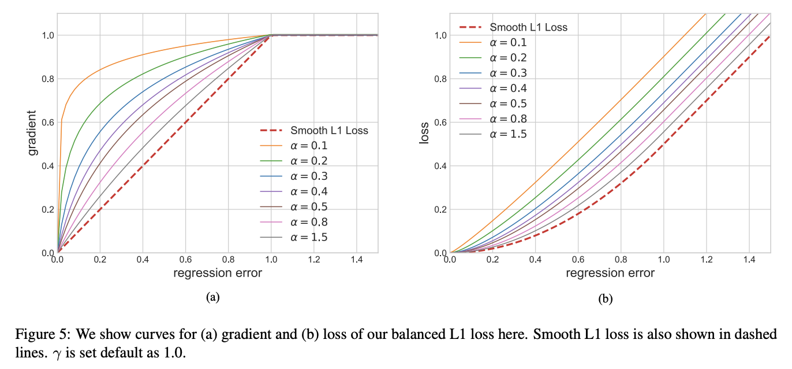

# 平衡 L1损失(Balanced L1 Loss)

目标检测(object detection)的损失函数可以看做是一个多任务的损失函数，分为分类损失和检测框回归损失：

$$L_{p,u,t_u,v} = L_{cls}(p,u)+\lambda[u\ge1]L_{loc}(t^u,v) $$

$L_{cls}$表示分类损失函数、$L_{loc}$表示检测框回归损失函数。在分类损失函数中，p表示预测值，u表示真实值。$t_{u}$表示类别u的位置回归结果，v是位置回归目标。λ用于调整多任务损失权重。定义损失大于等于1.0的样本为outliers(困难样本，hard samples)，剩余样本为inliers(简单样本，easy sample)。

平衡上述损失的一个常用方法就是调整两个任务损失的权重，然而，回归目标是没有边界的，直接增加检测框回归损失的权重将使得模型对outliers更加敏感，这些hard samples产生过大的梯度，不利于训练。inliers相比outliers对整体的梯度贡献度较低，相比hard sample，平均每个easy sample对梯度的贡献为hard sample的30%，基于上述分析，提出了balanced L1 Loss(Lb)。

​    Balanced L1 Loss受Smooth L1损失的启发，Smooth L1损失通过设置一个拐点来分类inliers与outliers，并对outliers通过一个max(p,1.0)进行梯度截断。相比smooth l1 loss，Balanced l1 loss能显著提升inliers点的梯度，进而使这些准确的点能够在训练中扮演更重要的角色。设置一个拐点区分outliers和inliers，对于那些outliers，将梯度固定为1，如下图所示：

​    Balanced L1 Loss的核心思想是提升关键的回归梯度（来自inliers准确样本的梯度），进而平衡包含的样本及任务。从而可以在分类、整体定位及精确定位中实现更平衡的训练，Balanced L1 Loss的检测框回归损失如下：

$$L_{loc} = \sum_{i\in{x,y,w,h}}L_{b}(t_{i}^{u} - v_{i})$$

其相应的梯度公示如下：

$$\frac{\partial L_{loc}}{\partial w} \propto \frac{\partial L_{b}}{\partial t_{i}^{u}} \propto \frac{\partial L_{b}}{\partial x}$$

基于上述公式，设计了一种推广的梯度公式为：

$$ \frac{\partial L_{b}}{\partial x} =  \begin{cases}\alpha ln(b|x|+1), if |x|<1 \\ \gamma, otherwise\end{cases} $$

其中，α控制着inliers梯度的提升；一个较小的α会提升inliers的梯度同时不影响outliers的值。γ来调整回归误差的上界，能够使得不同任务间更加平衡。α，γ从样本和任务层面控制平衡，通过调整这两个参数，从而达到更加平衡的训练。Balanced L1 Loss公式如下：

$$ L_{b}(x) =  \begin{cases} \frac{a}{b}(b|x|+1)ln(b|x|+1)-\alpha|x|, if |x|<1 \\ \gamma|x|+C, otherwise\end{cases} $$

其中参数满足下述条件：

$$ \alpha ln(b|x|+1) = \gamma$$

默认参数设置：α = 0.5，γ=1.5

延伸阅读：[Libra R-CNN: Towards Balanced Learning for Object Detection](https://arxiv.org/pdf/1904.02701.pdf)