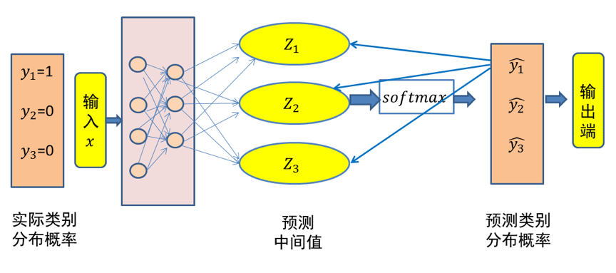

# 交叉熵损失函数

在物理学中，“熵”被用来表示热力学系统所呈现的无序程度。香农将这一概念引入信息论领域，提出了“信息熵”概念，通过对数函数来测量信息的不确定性。

交叉熵（cross entropy）是信息论中的重要概念，主要用来度量两个概率分布间的差异。假定 $p$ 和 $q$ 是数据 $x$ 的两个概率分布，通过 $q$ 来表示 $p$ 的交叉熵可如下计算：

$$
H\left( p,q \right) =-\sum_x{p\left( x \right) \log q\left( x \right)}
$$

交叉熵刻画了两个概率分布之间的距离，旨在描绘通过概率分布 $q$ 来表达概率分布 $p$ 的困难程度。根据公式不难理解，交叉熵越小，两个概率分布 $p$ 和 $q$ 越接近。

这里仍然以三类分类问题为例，假设数据 $x$ 属于类别 $1$。记数据x的类别分布概率为 $y$，显然 $y=(1,0,0)$代表数据 $x$ 的实际类别分布概率。记 $\hat{y}
$ 代表模型预测所得类别分布概率。

那么对于数据 $x$ 而言，其实际类别分布概率 $y$ 和模型预测类别分布概率 $\hat{y}$ 的交叉熵损失函数定义为：

$$
cross\ entropy=-y\times \log \left( \hat{y} \right)
$$

很显然，一个良好的神经网络要尽量保证对于每一个输入数据，神经网络所预测类别分布概率与实际类别分布概率之间的差距越小越好，即交叉熵越小越好。于是，可将交叉熵作为损失函数来训练神经网络。

图1 三类分类问题中输入x的交叉熵损失示意图（x 属于第一类）

**图1** 给出了一个三个类别分类的例子。由于输入数据 $x$ 属于类别 $1$，因此其实际类别概率分布值为 $y=(y_1,y_2,y_3)=(1,0,0)$。经过神经网络的变换，得到了输入数据 $x$ 相对于三个类别的预测中间值 $(z1,z2,z3)$。然后，经过 $Softmax$ 函数映射，得到神经网络所预测的输入数据 $x$ 的类别分布概率 $\hat{y}=\left( \hat{y}_1,\hat{y}_2,\hat{y}_3 \right)$。根据前面的介绍，$\hat{y}_1$、$\hat{y}_2$ 和 $\hat{y}_3$ 为 $(0,1)$ 范围之间的一个概率值。由于样本 $x$ 属于第一个类别，因此希望神经网络所预测得到的 $\hat{y}_1$取值要远远大于 $\hat{y}_2$ 和 $\hat{y}_3$ 的取值。为了得到这样的神经网络，在训练中可利用如下交叉熵损失函数来对模型参数进行优化：
$$
cross\ entropy=-\left( y_1\times \log \left( \hat{y}_1 \right) +y_2\times \log \left( \hat{y}_2 \right) +y_3\times \log \left( \hat{y}_3 \right) \right) 
$$

在上式中，$y_2$ 和 $y_3$ 均为 $0$、$y_1$ 为 $1$，因此交叉熵损失函数简化为：
$$
-y_1\times \log \left( \hat{y}_1 \right) =-\log \left( \hat{y}_1 \right) 
$$

在神经网络训练中，要将输入数据实际的类别概率分布与模型预测的类别概率分布之间的误差（即损失）从输出端向输入端传递，以便来优化模型参数。下面简单介绍根据交叉熵计算得到的误差从 $\hat{y}_1$ 传递给 $z_1$ 和 $z_2$（$z_3$ 的推导与 $z_2$ 相同）的情况。

$$
\frac{\partial \hat{y}_1}{\partial z_1}=\frac{\partial \left( \frac{e^{z_1}}{\sum_k{e^{z_k}}} \right)}{\partial z_1}=\frac{\left( e^{z_1} \right) ^{'}\times \sum_k{e^{z_k}-e^{z_1}\times e^{z_1}}}{\left( \sum_k{e^{z_k}} \right) ^2}=\frac{e^{z_1}}{\sum_k{e^{z_k}}}-\frac{e^{z_1}}{\sum_k{e^{z_k}}}\times \frac{e^{z_1}}{\sum_k{e^{z_k}}}=\hat{y}_1\left( 1-\hat{y}_1 \right) 
$$

由于交叉熵损失函数 $-\log \left( \hat{y}_1 \right)$ 对 $\hat{y}_1$ 求导的结果为 $-\frac{1}{\hat{y}_1}$，$\hat{y}_1\left( 1-\hat{y}_1 \right)$ 与 $-\frac{1}{\hat{y}_1}$ 相乘为 $\hat{y}_1-1$。这说明一旦得到模型预测输出 $\hat{y}_1$，将该输出减去1就是交叉损失函数相对于 $z_1$ 的偏导结果。

$$
\frac{\partial \hat{y}_1}{\partial z_2}=\frac{\partial \left( \frac{e^{z_1}}{\sum_k{e^{z_k}}} \right)}{\partial z_2}=\frac{0\times \sum_k{e^{z_k}-e^{z_1}\times e^{z_2}}}{\left( \sum_k{e^{z_k}} \right) ^2}=-\frac{e^{z_1}}{\sum_k{e^{z_k}}}\times \frac{e^{z_2}}{\sum_k{e^{z_k}}}=-\hat{y}_1\hat{y}_2
$$

同理，交叉熵损失函数导数为 $-\frac{1}{\hat{y}_1}$，$-\hat{y}_1\hat{y}_2$ 与 $-\frac{1}{\hat{y}_1}$ 相乘结果为 $\hat{y}_2$。这意味对于除第一个输出节点以外的节点进行偏导，在得到模型预测输出后，只要将其保存，就是交叉损失函数相对于其他节点的偏导结果。在 $z_1$、$z_2$ 和 $z_3$得到偏导结果后，再通过链式法则（后续介绍）将损失误差继续往输入端传递即可。

在上面的例子中，假设所预测中间值 $(z_1,z_2,z_3)$ 经过 $Softmax$ 映射后所得结果为 $(0.34,0.46,0.20)$。由于已知输入数据 $x$ 属于第一类，显然这个输出不理想而需要对模型参数进行优化。如果选择交叉熵损失函数来优化模型，则 $(z_1,z_2,z_3)$ 这一层的偏导值为 $(0.34-1,0.46,0.20)= (-0.66,0.46,0.20)$。

可以看出，$Softmax$ 和交叉熵损失函数相互结合，为偏导计算带来了极大便利。偏导计算使得损失误差从输出端向输入端传递，来对模型参数进行优化。在这里，交叉熵与$Softmax$ 函数结合在一起，因此也叫 $Softmax$ 损失（Softmax with cross-entropy loss）。