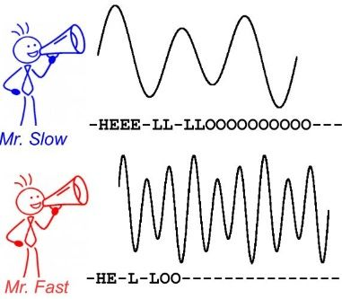
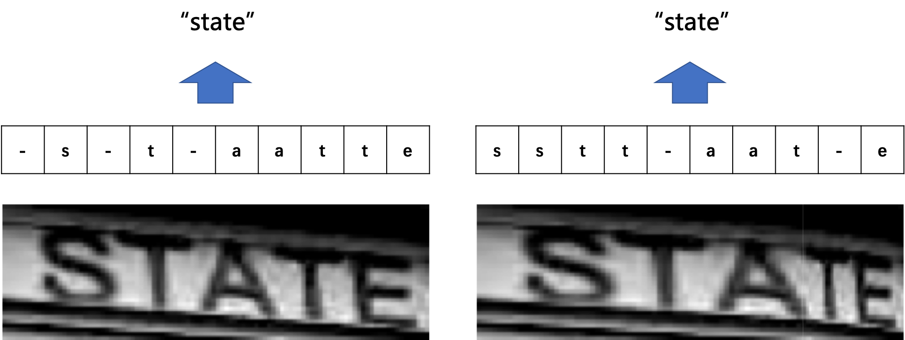
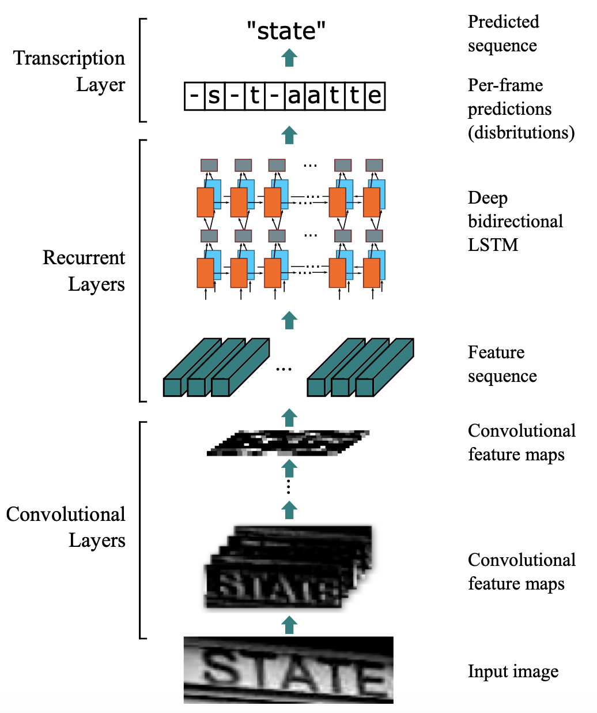
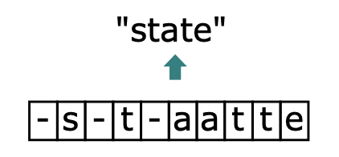

# CTC算法

## 算法背景

CTC 算法主要用来解决神经网络中标签和预测值无法对齐的情况，通常用于文字识别以及语音等序列学习领域。举例来说，在语音识别任务中，我们希望语音片段可以与对应的文本内容一一对应，这样才能方便我们后续的模型训练。但是对齐音频与文本是一件很困难的事，如 **图1** 所示，每个人的语速都不同，有人说话快，有人说话慢，我们很难按照时序信息将语音序列切分成一个个的字符片段。而手动对齐音频与字符又是一件非常耗时耗力的任务。

图1 语音识别任务中音频与文本无法对齐

在文本识别领域，由于字符间隔、图像变形等问题，相同的字符也会得到不同的预测结果，所以同样会会遇到标签和预测值无法对齐的情况。如 **图2** 所示。

图2 不同表现形式的相同字符示意图

总结来说，假设我们有个输入（如字幅图片或音频信号）$X$ ，对应的输出是 $Y$ ，在序列学习领域，通常会碰到如下难点：

1. $X$ 和 $Y$ 都是变长的；
2. $X$ 和 $Y$ 的长度比也是变化的；
3. $X$ 和 $Y$ 相应的元素之间无法严格对齐。

## 算法概述

引入CTC主要就是要解决上述问题。这里以文本识别算法CRNN为例，分析CTC的计算方式及作用。CRNN中，整体流程如 **图3** 所示。

图3 CRNN整体流程

CRNN中，首先使用CNN提取图片特征，特征图的维度为$m\times T$ ，特征图 $x$ 可以定义为：

$$
x = (x^1,x^2,...,x^T)
$$
然后，将特征图的每一列作为一个时间片送入LSTM中。令 $t$ 为代表时间维度的值，且满足 $1<t<T$ ，则每个时间片可以表示为：

$$
x^t = (x_1^t,x_2^t,...,x_m^t)
$$
经过LSTM的计算后，使用softmax获取概率矩阵 $y$ ，定义为：

$$
y = (y^1,y^2,...,y^T)
$$
其中，矩阵的每一列 $y^t$ 定义为：

$$
y^t = (y_1^t,y_2^t,...,y_n^t)
$$
 $n$ 为字符字典的长度，由于  $y_i^t$ 是概率，所以  $\Sigma_i{y_i^t}=1$ 。对每一列 $y^t$ 求 $argmax()$ ，就可以获取每个类别的概率。

 考虑到文本区域中字符之间存在间隔，也就是有的位置是没有字符的，所以这里定义分隔符  $-$ 来表示当前列的对应位置在图像中没有出现字符。用 $L$ 代表原始的字符字典，则此时新的字符字典  $L'$ 为：

$$
L' = L \cup \{-\}
$$
 此时，就回到了我们上文提到的问题上了，由于字符间隔、图像变形等问题，相同的字符可能会得到不同的预测结果。在CTC算法中，定义了 $B$ 变换来解决这个问题。  $B$ 变换简单来说就是将模型的预测结果去掉分割符以及重复字符（如果同个字符连续出现，则表示只有1个字符，如果中间有分割符，则表示该字符出现多次），使得不同表现形式的相同字符得到统一的结果。如 **图4** 所示。

图4 CTC示意图

这里举几个简单的例子便于理解，这里令T为10:

$$
B(-s-t-aatte)=state
$$

$$
B(ss-t-a-t-e)=state
$$

$$
B(sstt-aat-e)=state
$$

对于字符中间有分隔符的重复字符则不进行合并：

$$
B(-s-t-tatte)=sttate
$$
当获得LSTM输出后，进行 $B$ 变换就可以得到最终结果。由于 $B$ 变换并不是一对一的映射，例如上边的3个不同的字符都可以变换为state，所以在LSTM的输入为 $x$ 的前提下，CTC的输出为 $l$ 的概率应该为：

$$
p(l|x) = \Sigma_{\pi\in B^{-1}(l)}p(\pi|x)
$$
其中， $\pi$ 为LSTM的输出向量， $\pi\in B^{-1}(l)$ 代表所有能通过 $B$ 变换得到 $l$ 的 $\pi$ 的集合。

而对于任意一个 $\pi$ ，又有：

$$
p(\pi|x) = \Pi_{t=1}^Ty^t_{\pi_t}
$$
其中， $y^t_{\pi_t}$ 代表 $t$ 时刻  $\pi$ 为对应值的概率，这里举一个例子进行说明：

$$
\pi = -s-t-aatte
$$

$$
y^t_{\pi_t} = y_-^1*y_s^2*y_-^3*y_t^4*y_-^5*y_a^6*y_a^7*y_t^8*y_t^9*y_e^10
$$

不难理解，使用CTC进行模型训练，本质上就是希望调整参数，使得  $p(\pi|x) $ 取最大。

具体的参数调整方法，可以阅读以下论文进行了解。

延伸阅读：[Connectionist Temporal Classification: Labelling Unsegmented Sequence Data with Recurrent Neural Networks](http://www.cs.toronto.edu/~graves/icml_2006.pdf)