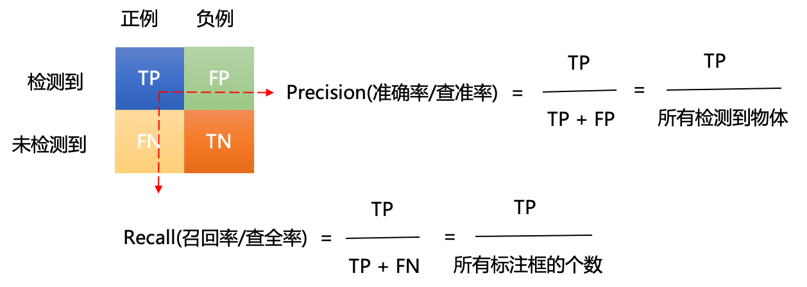

# mAP

在目标检测任务中，还有一个非常重要的概念是mAP。mAP是用来衡量目标检测算法精度的一个常用指标。目前各个经典算法都是使用mAP在开源数据集上进行精度对比。在计算mAP之前，还需要使用到两个基础概念：准确率（Precision）和召回率（Recall）。

## 准确率和召回率

- 准确率：预测为正的样本中有多少是真正的正样本。
- 召回率：样本中的正例有多少被预测正确。

具体计算方式如 **图1** 所示。

图1 准确率和召回率计算方式

其中，上图还存在以下几个概念：

- 正例：正样本，即该位置存在对应类别的物体。
- 负例：负样本，即该位置不存在对应类别的物体。
- TP（True Positives）：正样本预测为正样本的数量。
- FP（False Positives）：负样本预测为正样本的数量。
- FN（False Negative）：正样本预测为负样本的数量。
- TN（True Negative）：负样本预测为负样本的数量。

这里举个例子来说明准确率和召回率是如何进行计算的：假设我们的输入样本中有某个类别的10个目标，我们最终预测得到了8个目标。其中6个目标预测正确（TP），2个目标预测错误（FP），4个目标没有预测到（FN）。则准确率和召回率的计算结果如下所示：

- 准确率：6/（6+2） = 6/8 = 75%
- 召回率：6/（6+4） = 6/10 = 60%

## PR曲线

上文中，我们学习了如何计算准确率（Precision）和召回率（Recall），得到这两个结果后，我们使用Precision、Recall为纵、横坐标，就可以得到PR曲线，这里同样使用一个例子来演示如何绘制PR曲线。

假设我们使用目标检测算法获取了如下的24个目标框，各自的置信度（即网络预测得到的类别得分）按照从上到下进行排序后如 **图2** 所示。我们通过设置置信度阈值可以控制最终的输出结果。可以预想到的是：

1. 如果把阈值设高，则最终输出结果中大部分都会是比较准确的，但也会导致输出结果较少，样本中的正例只有部分被找出，准确率会比较高而召回率会比较低。

2. 如果把阈值设低，则最终输出结果会比较多，但是输出的结果中包含了大量负样本，召回率会比较高而准确率率会比较低。

   

图2 准确率和召回率列表

这里，我们从上往下每次多包含一个点，就可以得到最右边的两列，分别是累加的recall和累加的precision。以recall为自变量、precision为因变量可以得到一系列的坐标点（Recall，Precision）。将这些坐标点进行连线可以得到 **图3** 。

图3 PR曲线

而最终mAP的计算方式其实可以分成如下两步：

- AP（Average Precision）：某一类P-R曲线下的面积。
- mAP（mean Average Precision）：所有类别的AP值取平均。