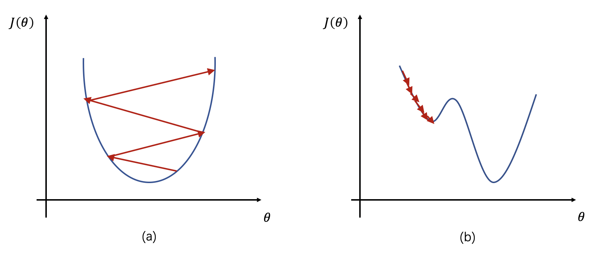

# 学习率

## 1. 什么是学习率

学习率是训练神经网络的重要超参数之一，它代表在每一次迭代中梯度向损失函数最优解移动的步长，通常用 $\eta$ 表示。它的大小决定网络学习速度的快慢。在网络训练过程中，模型通过样本数据给出预测值，计算代价函数并通过反向传播来调整参数。重复上述过程，使得模型参数逐步趋于最优解从而获得最优模型。在这个过程中，学习率负责控制每一步参数更新的步长。合适的学习率可以使代价函数以合适的速度收敛到最小值。

## 2. 学习率对网络的影响

梯度更新公式：$\theta = \theta - \eta\frac{\partial}{\partial \theta}J(\theta)$

根据上述公式我们可以看到，如果学习率 $\eta$ 较大，那么参数的更新速度就会很快，可以加快网络的收敛速度，但如果学习率过大，可能会导致参数在最优解附近震荡，代价函数难以收敛，甚至可能会错过最优解，导致参数向错误的方向更新，代价函数不仅不收敛反而可能爆炸（如图1a所示）。

如果学习率 $\eta$ 较小，网络可能不会错过最优点，但是网络学习速度会变慢。同时，如果学习率过小，则很可能会陷入局部最优点（如图1b所示）。

因此，只有找到合适的学习率，才能保证代价函数以较快的速度逼近全局最优解。



<center>图1: 不同学习率下的梯度更新</center><br></br>

## 3. 学习率的设置

我们了解了只有合适的学习率才能保证网络稳定学习的同时，又以合理的高速收敛来减少训练时间。那么，如何设置学习率呢？

通常的，在训练网络的前期过程中，会选取一个相对较大的学习率以加快网络的收敛速度。而随着迭代优化的次数增多，逐步减小学习率，以保证最终收敛至全局最优解，而不是在其附近震荡或爆炸。下面将介绍几种常用的学习率衰减方法，包括：分段常数衰减、指数衰减、自然指数衰减、多项式衰减、间隔衰减、多间隔衰减、逆时间衰减、Lambda衰减、余弦衰减、诺姆衰减、loss自适应衰减、线性学习率热身等。

* 分段常数衰减（Piecewise Decay）

  在不同的学习阶段指定不同的学习率，在每段内学习率相同。该过程可以举例说明为：

  ```
  boundaries = [100, 200]  # 指定学习率改变的边界点为100和200
  values = [1.0, 0.5, 0.1] # 指定不同区间下的学习率大小
  
  learning_rate = 1.0  if epoch < 100 
  learning_rate = 0.5  if 100 <= epoch < 200
  learning_rate = 0.1  if epoch >= 200

* 指数衰减（Exponential Decay）

  学习率随训练轮数成指数衰减，每次将当前学习率乘以给定的衰减率得到下一个学习率。指数衰减的公式可表示为：

  
  $$
  new\_learning\_rate = last\_learning\_rate * gamma
  $$
  其中，$gamma$ 为衰减率。

  

* 自然指数衰减 （Natural Exponential Decay）

  每次将当前学习率乘以给定的衰减率的自然指数得到下一个学习率。其公式表达为：

  
  $$
  new\_learning\_rate = learning\_rate * e^{-gamma*epoch}
  $$
  其中，$learning\_rate$ 为初始学习率，$gamma$ 为衰减率，$epoch$ 为训练轮数。

  

* 多项式衰减（Polynomial Decay）

  通过多项式衰减函数，学习率从初始值逐渐衰减至最低学习率。其中，参数 $cycle$ 代表学习率下降后是否重新上升。若 $cycle=True$，则学习率衰减至最低后会重新上升到一定值，再降低至最低学习率并进行循环。若 $cycle = False$，则学习率从初始值单调递减至最低值。

  若 $cycle=True$，其计算公式为：

  
  $$
  \begin{align}
  decay\_steps &= decay\_steps * math.ceil(\frac{epoch}{decay\_steps}) \\
  new\_learning\_rate &= (learning\_rate - end\_lr) * (1 - \frac{epoch}{decay\_steps})^{power} + end\_lr
  \end{align}
  $$
  若 $cycle=False$，其计算公式为：

  
  $$
  \begin{align}
  epoch &= min(epoch, decay\_steps) \\
  new\_learning\_rate &= (learning\_rate - end\_lr) * (1 - \frac{epoch}{decay\_steps})^{power} + end\_lr
  \end{align}
  $$
  其中，$learning\_rate$ 为初始学习率，$decay\_step$ 为进行衰减的步长，$end\_lr$ 为最低学习率，$power$ 为多项式的幂。

  

* 间隔衰减 （Step Decay）

  学习率按照指定的轮数间隔进行衰减，该过程可举例说明为：

  ```
  learning_rate = 0.5 # 学习率初始值
  step_size = 30      # 每训练30个epoch进行一次衰减
  gamma = 0.1         # 衰减率
  
  
  learning_rate = 0.5    if epoch < 30 
  learning_rate = 0.05   if 30 <= epoch < 60
  learning_rate = 0.005  if 60 <= epoch < 90
  ...
  ```

  

* 多间隔衰减（Multi Step Decay）

  学习率按特定间隔进行衰减，与间隔衰减的区别在于：间隔衰减的epoch间隔是单一且固定的，而多间隔衰减中的epoch间隔是预先指定的多间隔。该过程可举例说明为：

  ```
  learning_rate = 0.5    # 学习率初始值
  milestones = [30, 50]  # 指定轮数间隔
  gamma = 0.1            # 衰减率
  
  learning_rate = 0.5    if epoch < 30
  learning_rate = 0.05   if 30 <= epoch < 50
  learning_rate = 0.005  if 50 <= epoch
  ...
  ```

* 逆时间衰减（Inverse Time Decay）

  学习率大小与当前衰减次数成反比。其计算公式如下：

  
  $$
  new\_learning\_rate = \frac{learning\_rate}{1 + gamma * epoch}
  $$
  其中，$learning\_rate$ 为初始学习率，$gamma$ 为衰减率，$epoch$ 为训练轮数。

  

* Lambda衰减（Lambda Decay）

  使用lambda函数来设置学习率，其中lambda函数通过epoch计算出一个因子，使用该因子乘以初始学习率。该衰减过程可参考如下例子：

  ```
  learning_rate = 0.5                      # 学习率初始值
  lr_lambda = lambda epoch: 0.95 ** epoch  # 定义lambda函数
  
  learning_rate = 0.5                      # 当epoch = 0时，0.5 * 0.95 ** 0 = 0.5
  learning_rate = 0.475                    # 当epoch = 1时，0.5 * 0.95 ** 1 = 0.475
  learning_rate = 0.45125                  # 当epoch = 2时，0.5 * 0.95 ** 2 = 0.45125
  ...
  ```

* 余弦衰减（Cosine Annealing Decay）

  使用 `cosine annealing` 的策略来动态调整学习率，学习率随step数变化成余弦函数周期变化。该方法为论文 [SGDR：Stochastic Gradient Descent with Warm Restarts](https://arxiv.org/abs/1608.03983) 中`cosine annealing`动态学习率。学习率调整公式为：

  
  $$
  \begin{align}
  \eta_t = \eta_{min} + \frac{1}{2}(\eta_{max} - \eta_{min})(1 + cos(\frac{T_{cur}}{T_{max}}\pi)), \quad T_{cur} \neq (2k+1)T_{max} \\
  \eta_{t+1} = \eta_{t} + \frac{1}{2}(\eta_{max} - \eta_{min})(1 - cos(\frac{1}{T_{max}}\pi)), \quad T_{cur} = (2k + 1)T_{max}
  \end{align}
  $$
  其中，$\eta_{max}$的初始值为学习率的初始值，$T_{cur}$是SGDR训练过程中的当前训练轮数。

  

* 诺姆衰减（Noam Decay）

  诺姆衰减的计算方式如下：

  
  $$
  new\_learning\_rate = learning\_rate * d_{mode}^{-0.5}*min(epoch^{-0.5}, epoch*warmup\_steps^{-1.5})
  $$
  其中，$d_{model}$ 代表模型的输入、输出向量特征维度，$warmup\_steps$ 为预热步数，$learning\_rate$ 为初始学习率。更多细节请参考 [attention is all you need](https://arxiv.org/pdf/1706.03762.pdf)。

  

* loss自适应衰减（Reduce On Plateau）

  当loss停止下降时，降低学习率。其思想是：一旦模型表现不再提升，将学习率降低 2-10 倍对模型的训练往往有益。此外，每降低一次学习率后，将会进入一个冷静期。在冷静期内不会监控loss变化也不会进行衰减。当冷静期结束后，会继续监控loss的上升或下降。

  

* 线性学习率热身（Linear Warm Up）

  线性学习率热身是一种学习率优化策略，在正常调整学习率前，先逐步增大学习率。

  当训练步数小于热身步数（warmup_steps）时，学习率 $lr$ 按如下方式更新：
  
  
  $$
  lr = start\_lr + (end\_lr - start\_lr) * \frac{epoch}{warmup\_steps}
  $$
  当训练步数大于等于热身步数（warmup_steps）时，学习率 $lr$ 为：
  
  
  $$
  lr = learning\_rate
  $$
  其中，$lr$ 为热身之后的学习率，$start\_lr$ 为学习率初始值，$end\_lr$ 为最终学习率，$epoch$ 为训练轮数。


