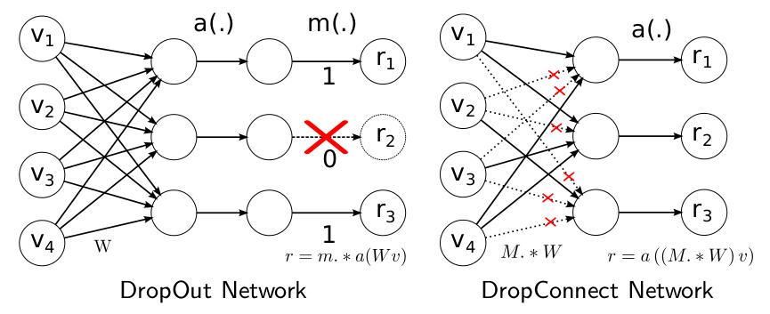
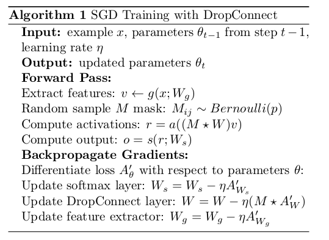
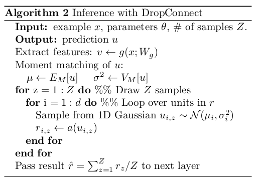

# Drop Connect
DropConnect也是在ICML2013上发表的另一种减少算法过拟合的正则化策略，是 Dropout 的一般化。在 Drop Connect 的过程中需要将网络架构权重的一个随机选择子集设置为零，取代了在 Dropout 中对每个层随机选择激活函数的子集设置为零的做法。由于每个单元接收来自过去层单元的随机子集的输入，Drop Connect 和 Dropout 都可以获得有限的泛化性能。Drop Connect 和 Dropout 相似的地方在于它涉及在模型中引入稀疏性，不同之处在于它引入的是权重的稀疏性而不是层的输出向量的稀疏性。
对于一个DropConnect层，输出可以写为：

$$r=a((M*W)v)$$

其中r是一个层的输出，v是一个层的输入，W是权重参数，M是编码连接信息的二进制矩阵，其中$M_{ij}~Bernoulli(p)$。 在训练期间，M中的每个元素都是独立的对样本进行。基本上为每个示例实例化不同的连接。另外，这些偏见在训练中也被掩盖了。

## dropout与dropconncet

+ Dropout是随机将隐含层节点的输出清0，针对的是输出。
+ DropConnect是将节点中的每个与其相连的输入权值以1-p的概率清0；针对的是输入。

## DropConnect的训练
使用DropConnect时，需要对每个example, 每个echo都随机sample一个M矩阵（元素值都是0或1, 俗称mask矩阵）。training部分的算法流程如下：

+ DropConnect只能用于全连接的网络层（和dropout一样），如果网络中用到了卷积，则用patch卷积时的隐层节点是不使用DropConnect的，因此上面的流程里有一个Extract feature步骤，该步骤就是网络前面那些非全连接层的传播过程，比如卷积+pooling.

## DropConnect的推理

在Dropout网络中进行inference时，是将所有的权重W都scale一个系数p(作者证明这种近似在某些场合是有问题的)。而在对DropConnect进行推理时，采用的是对每个输入（每个隐含层节点连接有多个输入）的权重进行高斯分布的采样。该高斯分布的均值与方差当然与前面的概率值p有关，满足的高斯分布为：

$$ u~N(pWv,p(1-p)(W*W)(v*v)) $$
推理过程如下：

由上面的过程可知，在进行inference时，需要对每个权重都进行sample，所以DropConnect速度会慢些。

根据作者的观点，Dropout和DropConnect都类似模型平均，Dropout是$2^{|m|}$个模型的平均，而DropConnect是$2^{|M|}$个模型的平均。（m是向量，M是矩阵，取模表示矩阵或向量中对应元素的个数），从这点上来说，DropConnect模型平均能力更强，因为$|M|>|m|$