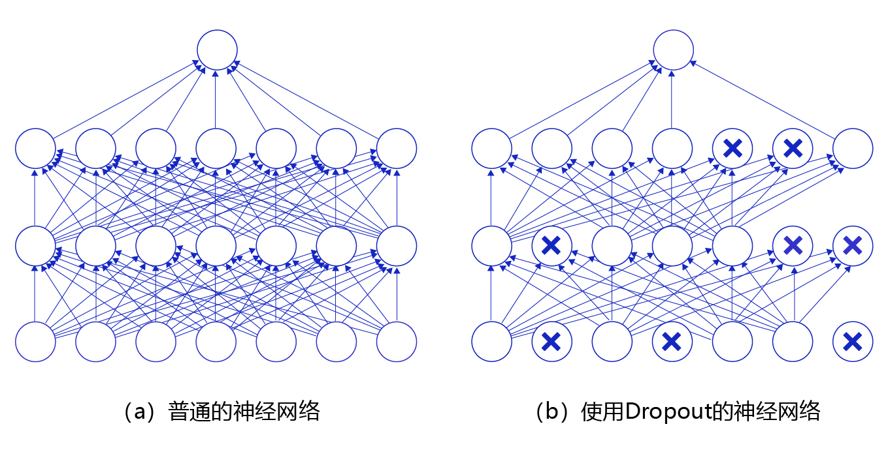

# 丢弃法（Dropout）

## 基础概念

Dropout指在训练神经网络过程中随机丢掉一部分神经元来减少神经网络复杂度，从而防止过拟合。Dropout实现方法很简单：在每次迭代训练中，以一定概率随机屏蔽每一层中若干神经元，用余下神经元所构成网络来继续训练。

**图1** 是Dropout示意图，左边是完整的神经网络，右边是应用了Dropout之后的网络结构。应用Dropout之后，会将标了$\times$的神经元从网络中删除，让它们不向后面的层传递信号。在学习过程中，丢弃哪些神经元是随机决定，因此模型不会过度依赖某些神经元，能一定程度上抑制过拟合。



图1 Dropout示意图

## 应用示例

在预测场景时，会向前传递所有神经元的信号，可能会引出一个新的问题：训练时由于部分神经元被随机丢弃了，输出数据的总大小会变小。比如：计算其$L1$范数会比不使用Dropout时变小，但是预测时却没有丢弃神经元，这将导致训练和预测时数据的分布不一样。为了解决这个问题，飞桨支持如下两种方法：

- **downscale_in_infer**

训练时以比例$r$随机丢弃一部分神经元，不向后传递它们的信号；预测时向后传递所有神经元的信号，但是将每个神经元上的数值乘以 $(1 - r)$。

- **upscale_in_train**

训练时以比例$r$随机丢弃一部分神经元，不向后传递它们的信号，但是将那些被保留的神经元上的数值除以 $(1 - r)$；预测时向后传递所有神经元的信号，不做任何处理。

在飞桨[Dropout API](https://www.paddlepaddle.org.cn/documentation/docs/zh/api/paddle/nn/layer/common/Dropout_cn.html)中，通过mode参数来指定用哪种方式对神经元进行操作，

> paddle.nn.Dropout(p=0.5, axis=None, mode="upscale_in_train”, name=None)

主要参数如下：

- p (float) ：将输入节点置为0的概率，即丢弃概率，默认值：0.5。该参数对元素的丢弃概率是针对于每一个元素而言，而不是对所有的元素而言。举例说，假设矩阵内有12个数字，经过概率为0.5的dropout未必一定有6个零。

- mode(str) ：丢弃法的实现方式，有'downscale_in_infer'和'upscale_in_train'两种，默认是'upscale_in_train'。

------

**说明：**

不同框架对于Dropout的默认处理方式可能不同，读者可以查看API详细了解。

------

下面这段程序展示了经过Dropout之后输出数据的形式。


```python
# dropout操作
import paddle
import numpy as np

# 设置随机数种子，这样可以保证每次运行结果一致
np.random.seed(100)
# 创建数据[N, C, H, W]，一般对应卷积层的输出
data1 = np.random.rand(2,3,3,3).astype('float32')
# 创建数据[N, K]，一般对应全连接层的输出
data2 = np.arange(1,13).reshape([-1, 3]).astype('float32')
# 使用dropout作用在输入数据上
x1 = paddle.to_tensor(data1)
# downgrade_in_infer模式下
drop11 = paddle.nn.Dropout(p = 0.5, mode = 'downscale_in_infer')
droped_train11 = drop11(x1)
# 切换到eval模式。在动态图模式下，使用eval（）切换到求值模式，该模式禁用了dropout。
drop11.eval()
droped_eval11 = drop11(x1)
# upscale_in_train模式下
drop12 = paddle.nn.Dropout(p = 0.5, mode = 'upscale_in_train')
droped_train12 = drop12(x1)
# 切换到eval模式
drop12.eval()
droped_eval12 = drop12(x1)

x2 = paddle.to_tensor(data2)
drop21 = paddle.nn.Dropout(p = 0.5, mode = 'downscale_in_infer')
droped_train21 = drop21(x2)
# 切换到eval模式
drop21.eval()
droped_eval21 = drop21(x2)
drop22 = paddle.nn.Dropout(p = 0.5, mode = 'upscale_in_train')
droped_train22 = drop22(x2)
# 切换到eval模式
drop22.eval()
droped_eval22 = drop22(x2)
    
print('x1 {}, \n droped_train11 \n {}, \n droped_eval11 \n {}'.format(data1, droped_train11.numpy(),  droped_eval11.numpy()))
print('x1 {}, \n droped_train12 \n {}, \n droped_eval12 \n {}'.format(data1, droped_train12.numpy(),  droped_eval12.numpy()))
print('x2 {}, \n droped_train21 \n {}, \n droped_eval21 \n {}'.format(data2, droped_train21.numpy(),  droped_eval21.numpy()))
print('x2 {}, \n droped_train22 \n {}, \n droped_eval22 \n {}'.format(data2, droped_train22.numpy(),  droped_eval22.numpy()))
```

程序运行结果如下：

```
 x1 
 [[[[0.54340494 0.2783694  0.4245176] [0.84477615 0.00471886 0.12156912] [0.67074907 0.82585275 0.13670659]]
 		 [[0.5750933  0.89132196 0.20920213] [0.18532822 0.10837689 0.21969749] [0.9786238  0.8116832  0.17194101]]
		 [[0.81622475 0.27407375 0.4317042 ] [0.9400298  0.81764936 0.33611196] [0.17541045 0.37283206 0.00568851]]]
		[[[0.25242636 0.7956625  0.01525497] [0.5988434  0.6038045  0.10514768] [0.38194343 0.03647606 0.89041156]]
		 [[0.98092085 0.05994199 0.89054596] [0.5769015  0.7424797  0.63018394] [0.5818422  0.02043913 0.21002658]]
		 [[0.5446849  0.76911515 0.25069523] [0.2858957  0.8523951  0.9750065 ] [0.8848533 0.35950786 0.59885895]]]] 
 droped_train11 
 [[[[0.         0.2783694  0.4245176 ] [0.         0.00471886 0.        ] [0.         0.82585275 0.        ]]
	 [[0.         0.         0.20920213] [0.18532822 0.10837689 0.        ] [0.9786238  0.         0.17194101]]
	 [[0.81622475 0.27407375 0.        ] [0.         0.         0.33611196] [0.17541045 0.37283206 0.00568851]]]
	[[[0.25242636 0.         0.        ] [0.5988434  0.6038045  0.10514768] [0.38194343 0.         0.89041156]]
	 [[0.98092085 0.         0.        ] [0.5769015  0.7424797  0.        ] [0.5818422  0.02043913 0.        ]]
	 [[0.5446849  0.76911515 0.        ] [0.         0.8523951  0.9750065 ] [0.         0.35950786 0.59885895]]]], 
 droped_eval11 
 [[[[0.27170247 0.1391847  0.2122588 ] [0.42238808 0.00235943 0.06078456] [0.33537453 0.41292638 0.0683533 ]]
	 [[0.28754666 0.44566098 0.10460106] [0.09266411 0.05418845 0.10984875] [0.4893119  0.4058416  0.08597051]]
	 [[0.40811238 0.13703687 0.2158521 ] [0.4700149  0.40882468 0.16805598] [0.08770522 0.18641603 0.00284425]]]
	[[[0.12621318 0.39783126 0.00762749] [0.2994217  0.30190226 0.05257384] [0.19097172 0.01823803 0.44520578]]
	 [[0.49046043 0.02997099 0.44527298] [0.28845075 0.37123984 0.31509197] [0.2909211  0.01021957 0.10501329]]
	 [[0.27234244 0.38455757 0.12534761] [0.14294785 0.42619756 0.48750326] [0.44242665 0.17975393 0.29942948]]]]
 x1
 [[[[0.54340494 0.2783694  0.4245176 ] [0.84477615 0.00471886 0.12156912] [0.67074907 0.82585275 0.13670659]]
   [[0.5750933  0.89132196 0.20920213] [0.18532822 0.10837689 0.21969749] [0.9786238  0.8116832  0.17194101]]
   [[0.81622475 0.27407375 0.4317042 ] [0.9400298  0.81764936 0.33611196] [0.17541045 0.37283206 0.00568851]]]
  [[[0.25242636 0.7956625  0.01525497] [0.5988434  0.6038045  0.10514768] [0.38194343 0.03647606 0.89041156]]
   [[0.98092085 0.05994199 0.89054596] [0.5769015  0.7424797  0.63018394] [0.5818422  0.02043913 0.21002658]]
   [[0.5446849  0.76911515 0.25069523] [0.2858957  0.8523951  0.9750065 ] [0.8848533  0.35950786 0.59885895]]]]
 droped_train12 
 [[[[0.         0.5567388  0.8490352 ] [0.         0.         0.24313824] [0.         0.         0.        ]]
   [[0.         0.         0.41840425] [0.37065643 0.         0.        ] [1.9572476  0.         0.        ]]
   [[0.         0.         0.        ] [0.         1.6352987  0.6722239 ] [0.3508209  0.         0.01137702]]]
  [[[0.         1.591325   0.03050994] [1.1976868  1.207609   0.        ] [0.76388687 0.         1.7808231 ]]
   [[0.         0.         0.        ] [1.153803   0.         0.        ] [1.1636844  0.         0.42005315]]
   [[1.0893698  0.         0.50139046] [0.5717914  1.7047902  0.        ] [0.         0.7190157  0.        ]]]]
 droped_eval12 
 [[[[0.54340494 0.2783694  0.4245176 ] [0.84477615 0.00471886 0.12156912] [0.67074907 0.82585275 0.13670659]]
   [[0.5750933  0.89132196 0.20920213] [0.18532822 0.10837689 0.21969749] [0.9786238  0.8116832  0.17194101]]
   [[0.81622475 0.27407375 0.4317042 ] [0.9400298  0.81764936 0.33611196] [0.17541045 0.37283206 0.00568851]]]
  [[[0.25242636 0.7956625  0.01525497] [0.5988434  0.6038045  0.10514768] [0.38194343 0.03647606 0.89041156]]
   [[0.98092085 0.05994199 0.89054596] [0.5769015  0.7424797  0.63018394] [0.5818422  0.02043913 0.21002658]]
   [[0.5446849  0.76911515 0.25069523] [0.2858957  0.8523951  0.9750065 ] [0.8848533  0.35950786 0.59885895]]]]
 x2 
 [[ 1.  2.  3.] [ 4.  5.  6.] [ 7.  8.  9.] [10. 11. 12.]], 
 droped_train21 
 [[ 1.  2.  3.] [ 4.  5.  6.] [ 0.  0.  9.] [ 0. 11.  0.]]
 droped_eval21 
 [[0.5 1.  1.5] [2.  2.5 3. ] [3.5 4.  4.5] [5.  5.5 6. ]]
 x2 
 [[ 1.  2.  3.] [ 4.  5.  6.] [ 7.  8.  9.] [10. 11. 12.]]
 droped_train22 
 [[ 2.  0.  6.] [ 0. 10.  0.] [14. 16. 18.] [ 0. 22. 24.]]
 droped_eval22 
 [[ 1.  2.  3.] [ 4.  5.  6.] [ 7.  8.  9.] [10. 11. 12.]]
```

从上面的运行结果可以看到，经过dropout之后，tensor中的某些元素变为了0，这个就是dropout实现的功能，通过随机将输入数据的元素置0，消除减弱了神经元节点间的联合适应性，增强模型的泛化能力。

在程序中，我们将随机失活比率设为0.5，分别使用两种不同的策略进行dropout，并且分别打印训练和评估模式下的网络层输出。其中，数据 $x_1$ 模拟的是卷积层的输出数据， 数据 $x_2$ 模拟的是全连接层的输入数据。由于通常情况下，我们会把dropout添加到全连接层后，所以这里针对前一层的输出为 $x_2$ 的情况为大家进行分析，前一层的输出为 $x_1$ 的情况也基本类似。

 $x_2$ 定义如下：


$$
x_2=\left[\begin{array}{ccc}
1 & 2 & 3 \\
4 & 5 & 6 \\
7 & 8 & 9 \\
10 & 11 & 12
\end{array}\right]
$$
将 paddle.nn.Dropout API 中 mode 设置为 'downscale_in_infer' 时，可以观察到在训练模式下，部分元素变为0，其他元素的值并没有发生改变，此时 $x_{2\_train}$ 为：


$$
x_2=\left[\begin{array}{ccc}1 & 2 & 3 \\4 & 5 & 6 \\0 & 0 & 9 \\0 & 11 & 0\end{array}\right]
$$
而在验证模式下，所有的元素都被保留，但是所有元素的值都进行了缩放，缩放的系数为$(1 - r)$ ，即$(1 - 0.5)=0.5$ ，此时 $x_{2\_eval}$ 为：


$$
x_2=\left[\begin{array}{ccc}
0.5 & 1 & 1.5 \\
2 & 2.5 & 3 \\
3.5 & 4 & 4.5 \\
5 & 5.5 & 6
\end{array}\right]
$$
而将 paddle.nn.Dropout API 中 mode 设置为 'upscale_in_train' 时，可以观察到在训练模式下，部分元素变为0，其他元素的值进行了缩放，缩放的系数为$\frac{1}{1-r}$，即$\frac{1}{1-0.5}=2$ ，，此时 $x_{2\_train}$ 为：


$$
x_2=\left[\begin{array}{ccc}2 & 0 & 6 \\0 & 10 & 0 \\14 & 16 & 18 \\0 & 22 & 24\end{array}\right]
$$
而在验证模式下，所有的元素都被保留，且所有元素的值并没有发生改变，此时 $x_{2\_eval}$ 为：


$$
x_2=\left[\begin{array}{ccc}
1 & 2 & 3 \\
4 & 5 & 6 \\
7 & 8 & 9 \\
10 & 11 & 12
\end{array}\right]
$$