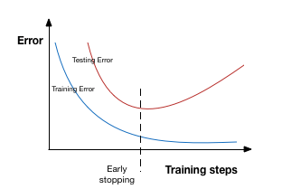

# 早停法

早停法可以限制模型最小化代价函数所需的训练迭代次数。早停法通常用于防止训练中过度表达的模型泛化性能差。如果迭代次数太少，算法容易欠拟合（方差较小，偏差较大），而迭代次数太多，算法容易过拟合（方差较大，偏差较小）。早停法通过确定迭代次数解决这个问题，不需要对特定值进行手动设置。

提前停止是一种交叉验证的策略，即把一部分训练集保留作为验证集。当看到验证集上的性能变差时，就立即停止模型的训练。

在上图中，我们在虚线处停止模型的训练，因为在此处之后模型会开始在训练数据上过拟合。