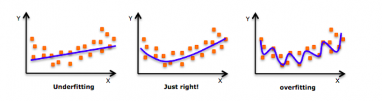
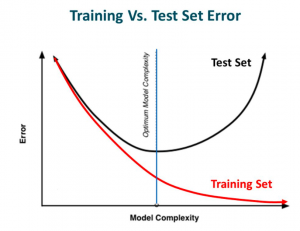
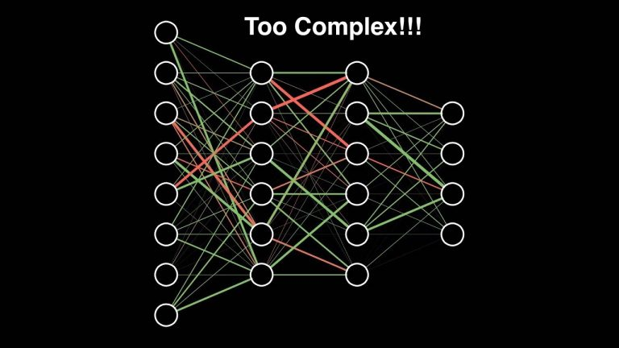
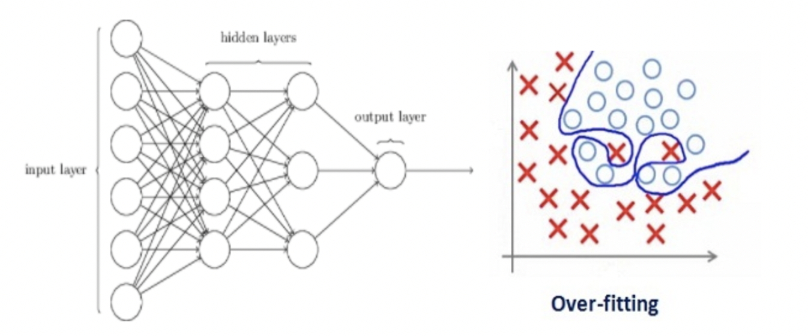
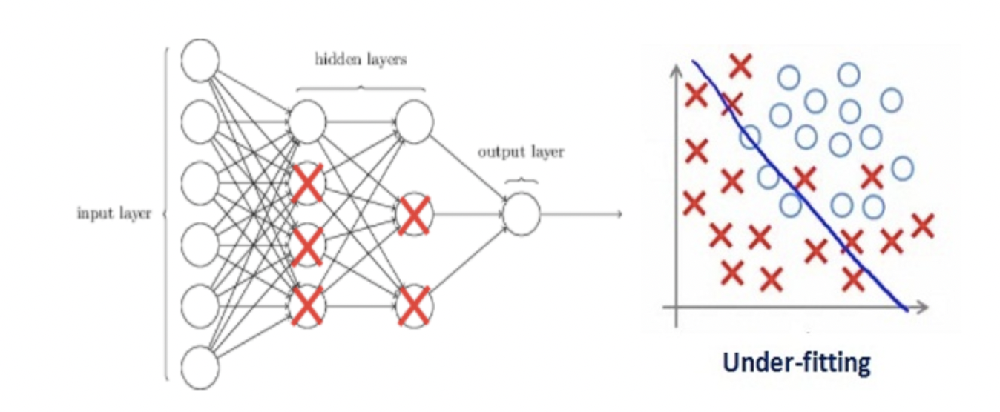
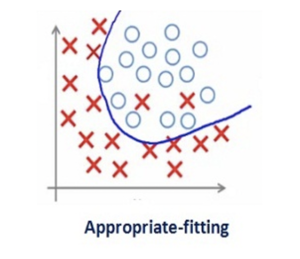

# 正则化

## 什么是正则化？

当我们向右移时，我们的模型试图从训练数据中很好地学习细节和噪声，这最终导致在看不见的数据上表现不佳。
也就是说，当模型向右移动时，模型的复杂度增加，使得训练误差减小，而测试误差没有减小。如下图所示。

如果你以前建立过神经网络，你就知道它们有多复杂。这使得他们更容易过度拟合。

正则化是一种对学习算法稍加修改以使模型具有更好的泛化能力的技术。这反过来也提高了模型在看不见的数据上的性能。

## 正则化如何帮助减少过度拟合？

让我们考虑一个神经网络，它对训练数据进行了过度拟合，如下图所示。

如果你研究过机器学习中正则化的概念，你会有一个公平的想法，正则化惩罚系数。在深度学习中，它实际上惩罚节点的权重矩阵。

假设我们的正则化系数非常高，以至于一些权重矩阵几乎等于零。

这将导致更简单的线性网络和训练数据的轻微欠拟合。

如此大的正则化系数值并不是很有用。我们需要优化正则化系数的值，以获得如下图所示的良好拟合模型。

正则化可以避免算法过拟合，过拟合通常发生在算法学习的输入数据无法反应真实的分布且存在一些噪声的情况。过去数年，研究者提出和开发了多种适合机器学习算法的正则化方法，如数据增强、L2 正则化（权重衰减）、L1 正则化、Dropout、Drop Connect、随机池化和早停等。

除了泛化原因，奥卡姆剃刀原理和贝叶斯估计也都支持着正则化。根据奥卡姆剃刀原理，在所有可能选择的模型中，能很好解释已知数据，并且十分简单的模型才是最好的模型。而从贝叶斯估计的角度来看，正则化项对应于模型的先验概率。
