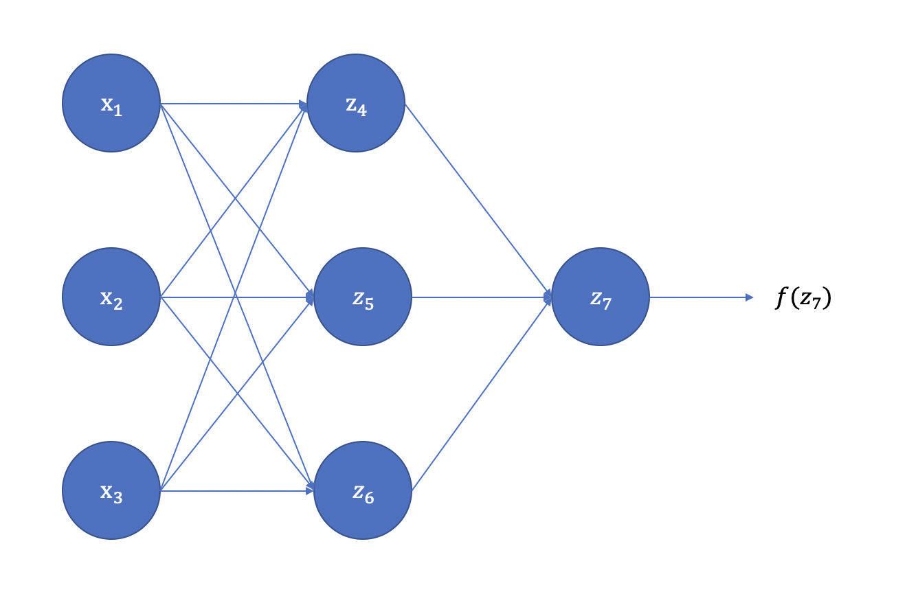

# 参数初始化

在我们开始训练神经网络之前，首先要做的是给网络中的每一个权重和偏置赋值，这个赋值的过程就是参数初始化。合理的初始化可以缩短神经网络的训练时间，而不合理的初始化可能使网络难以收敛。那么，我们要如何对参数进行初始化呢？或许你有想到过将全部参数都设置为0，这看起来是一个简单又方便的办法，但遗憾的是神经网络中不能对权重进行全零初始化。在讨论如何对参数进行初始化前，我们先来看看为什么不能进行全零初始化。

## 1. 为什么不能全零初始化？

以一个三层网络为例，假设其具体的网络示意图如图1所示。

图1: 三层网络示意图
  

其中，$z_4、z_5、z_6$ 可表达为:

$$
z_4 = w_{14} * x_1 + w_{24} * x_2 + w_{34} * x_3 + b_4 \\
z_5 = w_{15} * x_1 + w_{25} * x_2 + w_{35} * x_3 + b_5 \\
z_6 = w_{16} * x_1 + w_{26} * x_2 + w_{36} * x_3 + b_6 \\
$$
由于权重和偏置的初始值都为0，且同一层网络的激活函数相同，则有：

$$
z_4 = z_5 = z_6  \\
a_4 = a_5 = a_6
$$
对于神经网络的最终输出 $a_7$，我们可以得到：

$$
\begin{align}
z_7 &= w_{47} * a_4 + w_{57} * a_5 + w_{67} * a_6 \\
a_7 &= f(z_7)
\end{align}
$$
其中，$f(\cdot)$为第三层网络的激活函数。

假设真实值为 $y$, 损失函数为 $Loss(a_7, y)$，根据反向传播算法和链式法则，我们可以得到：

$$
\begin{align}
\frac{\partial Loss(a_7,y)}{\partial w_{47}} &= \frac{\partial Loss(a_7, y)}{\partial a_7} * \frac{\partial a_7}{\partial z_7} * \frac{\partial z_7}{\partial w_{47}} \\
&=\frac{\partial Loss(a_7, y)}{\partial a_7} * \frac{\partial a_7}{\partial z_7} * a_4
\end{align}
$$
同样地：

$$
\begin{align}
\frac{\partial Loss(a_7,y)}{\partial w_{57}} &= \frac{\partial Loss(a_7, y)}{\partial a_7} * \frac{\partial a_7}{\partial z_7} * \frac{\partial z_7}{\partial w_{57}} \\
&= \frac{\partial Loss(a_7, y)}{\partial a_7} * \frac{\partial a_7}{\partial z_7} * a_5 \\
\frac{\partial Loss(a_7,y)}{\partial w_{67}} &= \frac{\partial Loss(a_7, y)}{\partial a_7} * \frac{\partial a_7}{\partial z_7} * a_6
\end{align}
$$
由于 $a_4 = a_5 = a_6$，则有：

$$
\frac{\partial Loss(a_7,y)}{\partial w_{47}} = \frac{\partial Loss(a_7,y)}{\partial w_{57}} = \frac{\partial Loss(a_7,y)}{\partial w_{67}} = \Delta w
$$
权重更新表达式为：

$$
w_{47}^{'} = w_{47} + \Delta w \\
w_{57}^{'} = w_{57} + \Delta w \\
w_{67}^{'} = w_{67} + \Delta w
$$
由于 $w_{47}、w_{57}、w_{67}$ 的初始值均为0，那么：$w_{47}^{'} = w_{57}^{'} = w_{67}^{'}$，同理：$w_{14}^{'} = w_{24}^{'} = w_{34}^{'} = w_{14}^{'} = w_{25}^{'} = w_{26}^{'} = w_{34}^{'} = w_{35}^{'} = w_{36}^{'}$。由此可见，更新后的参数在每一层内都是相同的。同时，无论经过多少次网络训练，相同网络层内的参数值都是相同的，这会导致网络在学习时没有重点，对所有的特征处理相同，这很可能导致模型无法收敛训练失败。这种现象被称为对称失效。

同样地，当权重被初始化为相同的非零值时，也会出现上述情况，此时神经网络模型和一个线性模型的效果相似，失去了神经网络提取特征的意义。那么，有哪些可行的参数初始化方法呢？

## 2. 常见的初始化方法

### 2.1 基于固定方差的参数初始化

1. 一种非常常见的方式是采用高斯分布或均匀分布来对权重进行随机初始化。高斯分布和均匀分布的选择似乎没有很大差别，但初始分布的大小对于优化过程的结果和网络泛化能力都有很大影响。

   * 高斯分布初始化：使用一个均值为 $\mu$，方差为 $\sigma^2$ 的高斯分布 $N(\mu, \sigma^2)$ 对每个参数进行随机初始化，通常情况下，$\mu = 0$，并对生成的数乘上一个小数，把权重初始化为很小的随机数。比如：$w = 0.01 * np.random.rand(D,H)$，这里选择乘以0.01初始化为一个很小的数是因为，如果最初随机到的 $w$ 值很大，当我们选择 sigmoid 或 tanh 激活函数时，函数值 $sigmoid(\cdot)$ 或 $tanh(\cdot)$ 会停留在一个很平坦的地方，激活值接近饱和，导致梯度下降时，梯度很小，学习变得缓慢。但也不是说权重值越小越好，如果权重值过小，会导致在反向传播时计算得到很小的梯度值，在不断的反向传播过程中，引起梯度消失。
   * 均匀分布初始化：在一个给定区间 $[-r, r]$ 内采取均匀分布进行初始化。假设随机变量在区间 $[a, b]$ 内均匀分布，则其方差为 $var(x) = \frac{(b-a)^2}{12}$ 。因此，当在 $[-r, r]$ 的区间内均匀分布采样，并满足 $var(x) = \sigma^2$ 时，则有 $r = \sqrt{3\sigma^2}$ 。

   上述两种基于固定方差的初始随机化方法中，关键点在于如何设置方差 $\sigma^2$。过大或过小的方差都会导致梯度下降缓慢，网络训练效果不好等问题。为了降低固定方差对网络性能及优化效率的影响，基于固定方差的随机初始化一般要配合逐层归一化来使用。

### 2.2 基于方差缩放的参数初始化

方差缩放方法能够根据神经元的链接数量来自适应地调整初始化分布地方差，尽可能的保证每个神经元的输入和输出方差一致。那么，为什么要保证前后方差的一致性呢？这是因为如果输入空间和输出空间的方差差别较大，也就是说数据空间分布差异较大，那么在反向传播时可能会引起梯度消失或爆炸问题。比如，当输入空间稀疏，输出空间稠密时，将在输出空间计算得到的误差反向传播给输入空间时，这个误差可能会显得微不足道，从而引起梯度消失。而当输入空间稠密，输出空间稀疏时，将误差反向传播给输入空间，就可能会引起梯度爆炸，使得模型震荡。

1. Xavier初始化

   Xavier初始化的提出，遵循了Bradley（2009）的理论环境，假设网络中的每一层的激活函数都是关于0对称的线性激活函数，权重间的初始化和输入特征相互独立，且均值都为0。

   假设在一个神经网络中，对于一层线性网络，其表示为：

   

   $$
   y = f(z_1W_1 + z_2W_2 + z_3W_3 + ... + z_iW_i + b)
   $$
   $z_i$ 代表该层网络的第 $i$ 个神经元，$y$ 为该层网络的输出，$W_i$ 为本层网络的权重，$b$ 为偏置，$f(\cdot)$ 为激活函数。这里我们假设激活函数为恒等函数，即 $f(x) = x$，导数为1。

   对于其中的每个 $z_iW_i$，其方差为：

   

   $$
   Var(z_iW_i) = E(z_i)^2Var(W_i) + E(W_i)^2Var(z_i)+Var(z_i)Var(W_i)
   $$
   由于 $W_i$ 和 $z_i$ 的均值都为0，因此可以得到：

   

   $$
   Var(z_iW_i) = Var(z_i)Var(W_i)
   $$
   又因为 $z$ 和 $W$ 相互独立，则有：

   

   $$
   Var(y) = n_i * Var(z_i)Var(W_i)
   $$
   其中，$n_i$ 代表第 $i$ 层的神经元数量。

   通过上面的公式我们可以发现，输入 $z_i$ 的方差和输出 $y$ 方差相差 $n * Var(W_i)$ 倍，也就是说输入信号在经过神经元后会被放大或缩小 $n * Var(W_i)$ 倍。为保证经过多层网络后，信号不被过分的放大或缩小，我们需要尽可能保证前向传播和反向传播时每层方差保持一致，则有：

   

   $$
   {\forall}i, \quad n_i * Var(W_i) = 1\\
   {\forall}i, \quad n_{i+1} * Var(W_i) = 1
   $$
   权衡上述两个限制，提出一个折中的办法：

   

   $$
   {\forall}i, \quad Var(W_i) = \frac{2}{n_i + n_{i+1}}
   $$
   根据计算出的理想方差，可选择通过高斯分布或均匀分布来随机初始化参数。若采用高斯分布，则权重可按照 $N(0, \frac{2}{n_i + n_{i+1}})$ 的高斯分布来进行初始化。若采用在区间 $[-r, r]$ 的均匀分布进行初始化，则初始化分布有：

   

   $$
   W \sim U[- \frac{\sqrt 6}{\sqrt{n_i + n_{i+1}}}, \frac{\sqrt 6}{\sqrt{n_i + n_{i+1}}}]
   $$

   Xavier 初始化因为基本保证了输入和输出的方差一致，使得样本空间和类别空间的分布差异相似，因此使得模型的训练速度和分类性能获得提升。但xavier初始化的推导基于激活函数是线性的假设，使其并不适合于ReLU、sigmoid等非线性激活函数。

   具体论文参见：[Understanding the difficulty of training deep feedforward neural networks](http://proceedings.mlr.press/v9/glorot10a/glorot10a.pdf)

2. Kaiming初始化

   kaiming初始化是一种针对ReLU的初始化方法，假定使用ReLU激活函数时，网络每一层都中有一半的神经元被激活，另一半为0，因此其分布的方差也近似为恒等函数的一半。这样在考虑前向传播和反向传播时则有：

   
   
   $$
   {\forall}i, \quad \frac12 n_i * Var(W_i) = 1\\
   {\forall}i, \quad \frac12 n_{i+1} * Var(W_i) = 1
   $$
   $W_i$ 的理想方差为：
   
   
   
   $$
   {\forall}i, \quad Var(W_i) = \frac{2}{n_i}
   $$
   
   当采用高斯分布时，则权重可按照 $N(0, \frac{2}{n_i})$ 的高斯分布来进行初始化。若采用在区间 $[-r, r]$ 的均匀分布进行初始化，则初始化分布有：
   
   
   $$
   W \sim U[- \frac{\sqrt 6}{\sqrt{n_i}}, \frac{\sqrt 6}{\sqrt{n_i}}]
   $$
   
   
   具体论文参见：[Delving Deep into Rectifiers: Surpassing Human-Level Performance on ImageNet Classification](https://arxiv.org/pdf/1502.01852.pdf)

## References

1. Bradley, D. (2009). *Learning in modular systems.* Doctoral dissertation, The Robotics Institute, Carnegie Mellon University.

