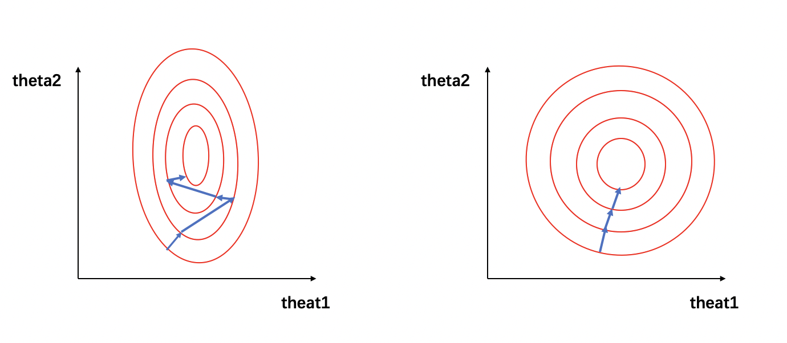

# 归一化基础知识点

## 1. 什么是归一化

归一化是一种数据处理方式，能将数据经过处理后限制在某个固定范围内。

归一化存在两种形式，一种是在通常情况下，将数处理为 [0, 1] 之间的小数，其目的是为了在随后的数据处理过程中更便捷。例如，在图像处理中，就会将图像从 [0, 255] 归一化到 [0, 1]之间，这样既不会改变图像本身的信息储存，又可加速后续的网络处理。其他情况下，也可将数据处理到 [-1, 1] 之间，或其他的固定范围内。另一种是通过归一化将有量纲表达式变成无量纲表达式。那么什么是量纲，又为什么需要将有量纲转化为无量纲呢？具体举一个例子。当我们在做对房价的预测时，收集到的数据中，如房屋的面积、房间的数量、到地铁站的距离、住宅附近的空气质量等，都是量纲，而他们对应的量纲单位分别为平方米、个数、米、AQI等。这些量纲单位的不同，导致数据之间不具有可比性。同时，对于不同的量纲，数据的数量级大小也是不同的，比如房屋到地铁站的距离可以是上千米，而房屋的房间数量一般只有几个。经过归一化处理后，不仅可以消除量纲的影响，也可将各数据归一化至同一量级，从而解决数据间的可比性问题。

## 2. 为什么要归一化

1. 如在`1.什么是归一化`中所讲，归一化可以将有量纲转化为无量纲，同时将数据归一化至同一量级，解决数据间的可比性问题。在回归模型中，自变量的量纲不一致会导致回归系数无法解读或错误解读。在KNN、Kmeans等需要进行距离计算的算法中，量纲的量级不同可能会导致拥有较大量级的特征在进行距离计算时占主导地位，从而影响学习结果。

2. 数据归一化后，寻求最优解的过程会变得平缓，可以更快速的收敛到最优解。详解请参见`3.为什么归一化能提高求解最优解的速度`。

   

## 3. 为什么归一化能提高求解最优解的速度

在`1.什么是归一化`中，我们提到一个对房价进行预测的例子，假设自变量只有房子到地铁站的距离$x_{1}$和房子内房间的个数$x_{2}$，因变量为房价，预测公式和损失函数分别为：

$$
\begin{align}
y &= \theta_1x_1 + \theta_2x_2 \\
J &= (\theta_{1}x_{1} + \theta_{2}x_{2} - y_{label})^2
\end{align}
$$
在未归一化时，房子到地铁站的距离的取值在0～5000之间，而房间个数的取值范围仅为0～10。假设$x_{1} = 1000，x_{2} = 3$， 那么损失函数的公式可以写为：

$$
J = (1000\theta_{1}+3\theta_{2} - y_{label})^2
$$

可将该损失函数寻求最优解过程可视化为下图：

图1: 损失函数的等高线，图1（左）为未归一化时，图1（右）为归一化
  

在图1中，左图的红色椭圆代表归一化前的损失函数等高线，蓝色线段代表梯度的更新，箭头的方向代表梯度更新的方向。寻求最优解的过程就是梯度更新的过程，其更新方向与登高线垂直。由于$x_1$ 和 $x_2$ 的量级相差过大，损失函数的等高线呈现为一个瘦窄的椭圆。因此如图1（左）所示，瘦窄的椭圆形会使得梯度下降过程呈之字形呈现，导致梯度下降速度缓慢。

当数据经过归一化后，$x_{1}^{'} = \frac{1000-0}{5000-0}=0.2$，$x_{2}^{'} = \frac{3-0}{10-0}=0.3$，那么损失函数的公式可以写为：

$$
J(x) = (0.2\theta_{1} + 0.3\theta_{2} - y_{label})^2
$$
我们可以看到，经过归一化后的数据属于同一量级，损失函数的等高线呈现为一个矮胖的椭圆形（如图1（右）所示），求解最优解过程变得更加迅速且平缓，因此可以在通过梯度下降进行求解时获得更快的收敛。

## 4. 归一化有哪些类型

1. Min-max normalization (Rescaling)：
   
   
   $$
   x^{'} = \frac{x - min(x)}{max(x) - min(x)}
   $$
   归一化后的数据范围为 [0, 1]，其中 $min(x)、 max(x)$ 分别求样本数据的最小值和最大值。
   
2. Mean normalization：

   
   $$
   x^{'} = \frac{x - mean(x)}{max(x) - min(x)}
   $$
   归一化后的数据范围为 [-1, 1]，其中 $mean(x)$ 为样本数据的平均值。

   

3. Z-score normalization (Standardization)：

   
   $$
   x^{'} = \frac{x - \mu}{\sigma}
   $$
   归一化后的数据范围为实数集，其中 $\mu、\sigma$ 分别为样本数据的均值和标准差。

4. 非线性归一化：

   * 对数归一化：

     

   $$
   x^{'} = \frac{\lg x}{\lg max(x)}
   $$

   * 反正切函数归一化：
     
     
     $$
     x^{'} = \arctan(x) * \frac{2}{\pi}
     $$
     归一化后的数据范围为 [-1, 1]
     
    * 小数定标标准化（Demical Point Normalization）:
      
      
      $$
      x^{'} = \frac{x}{10^j}
      $$
      归一化后的数据范围为 [-1, 1]，$j$ 为使$max(|x^{'}|) < 1$的最小整数。

   

## 5. 不同归一化的使用条件

1. Min-max归一化和mean归一化适合在最大最小值明确不变的情况下使用，比如图像处理时，灰度值限定在 [0, 255] 的范围内，就可以用min-max归一化将其处理到[0, 1]之间。在最大最小值不明确时，每当有新数据加入，都可能会改变最大或最小值，导致归一化结果不稳定，后续使用效果也不稳定。同时，数据需要相对稳定，如果有过大或过小的异常值存在，min-max归一化和mean归一化的效果也不会很好。如果对处理后的数据范围有严格要求，也应使用min-max归一化或mean归一化。

2. Z-score归一化也可称为标准化，经过处理的数据呈均值为0，标准差为1的分布。在数据存在异常值、最大最小值不固定的情况下，可以使用标准化。标准化会改变数据的状态分布，但不会改变分布的种类。特别地，神经网络中经常会使用到z-score归一化，针对这一点，我们将在后续的文章中进行详细的介绍。

3. 非线性归一化通常被用在数据分化程度较大的场景，有时需要通过一些数学函数对原始值进行映射，如对数、反正切等。

   

***

**注意**

在查找资料的时候，我看到很多文章都提出了：“在分类、聚类算法中，需要使用距离来度量相似性的时候，z-score归一化也就是标准化的效果比归一化要好，但是对于这个观点并没有给出足够的技术支持。因此，我选取了KNN分类网络搜索了相关论文，在论文Comparative Analysis of KNN Algorithm using Various Normalization Techniques <a href="#ref1">[1]</a> 中，在K值不同的情况下，对于相同的数据分别进行min-max归一化和z-score归一化，得到的结果如下图所示：

图2: 对于不同的K值，相同数据集不同归一化方式下的预测精确度
  

由此可以看到，至少对于KNN分类问题，z-score归一化和min-max归一化的选择会受到数据集、K值的影响，对于其他的分类和聚类算法，哪一种归一化的方法更好仍有待验证。最好的选择方法就是进行实验，选择在当前实验条件下，能够使模型精度更高的一种。

## 6. 归一化和标准化的联系与区别

谈到归一化和标准化可能会存在一些概念的混淆，我们都知道归一化是指normalization，标准化是指standardization，但根据wiki上对feature scaling方法的定义，standardization其实就是z-score normalization，也就是说标准化其实是归一化的一种，而一般情况下，我们会把z-score归一化称为标准化，把min-max归一化简称为归一化。在下文中，我们也是用标准化指代z-score归一化，并使用归一化指代min-max归一化。

其实，归一化和标准化在本质上都是一种线性变换。在`4.归一化有哪些类型`中，我们提到了归一化和标准化的公式，对于归一化的公式，在数据给定的情况下，可以令$a = max(x) - min(x)、b = min(x)$，则归一化的公式可变形为：

$$
x^{'} = \frac{x - b}{a} = \frac{x}{a} - \frac{b}{a} = \frac{x}{a} - c
$$
标准化的公式与变形后的归一化类似，其中的$\mu$和$\sigma$在数据给定的情况下，可以看作常数。因此，标准化的变形与归一化的类似，都可看作对$x$按比例$a$进行缩放，再进行$c$个单位的平移。由此可见，归一化和标准化的本质都是一种线性变换，他们都不会因为对数据的处理而改变数据的原始数值排序。

那么归一化和标准化又有什么区别呢？

1. 归一化不会改变数据的状态分布，但标准化会改变数据的状态分布；
2. 归一化会将数据限定在一个具体的范围内，如 [0, 1]，但标准化不会，标准化只会将数据处理为均值为0，标准差为1。

## References

【1】Comparative Analysis of KNN Algorithm using Various Normalization Techniques；Amit Pandey，Achin Jain.

