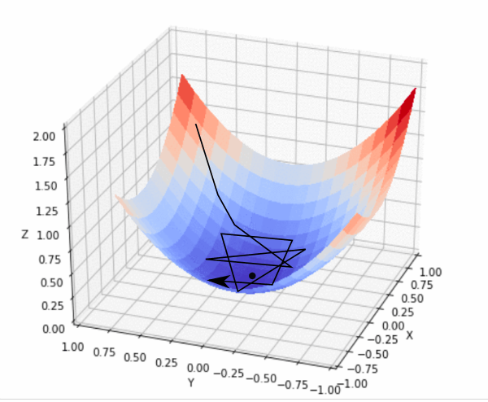
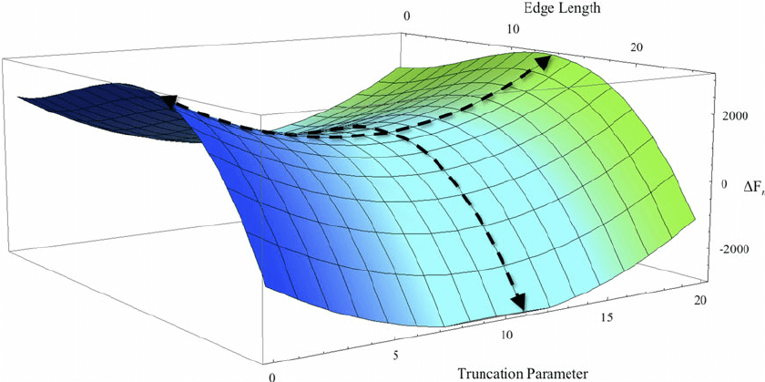

# 梯度下降算法

## 什么是优化器？
### 解释

如果我们定义了一个机器学习模型，比如一个三层的神经网络，那么就需要使得这个模型能够尽可能拟合所提供的训练数据。但是我们如何评价模型对于数据的拟合是否足够呢？那就需要使用相应的指标来评价它的拟合程度，所使用到的函数就称为损失函数(Loss Function)，当损失函数值下降，我们就认为模型在拟合的路上又前进了一步。最终模型对训练数据集拟合的最好的情况是在损失函数值最小的时候，在指定数据集上时，为损失函数的平均值最小的时候。

由于我们一般情况下很难直接精确地计算得到当模型的参数为何值时，损失函数最小，所以，我们可以通过让参数在损失函数的“场”中，向着损失函数值减小的方向移动，最终在收敛的时候，得到一个极小值的近似解。为了让损失函数的数值下降，那么就需要使用优化算法进行优化，其中，损失函数值下降最快的方向称为负梯度方向，所使用的算法称为梯度下降法，即最速下降法(steepest descent)。当前，几乎所有的机器学习优化算法都是基于梯度下降的算法。

总结的来讲优化器（例如梯度下降法）就是在深度学习反向传播过程中，指引损失函数（目标函数）的各个参数往正确的方向更新合适的大小，使得更新后的各个参数让损失函数（目标函数）值不断逼近全局最小。

### 原理解释
优化问题可以看做是我们站在山上的某个位置（当前的参数信息），想要以最佳的路线去到山下（最优点）。首先，直观的方法就是环顾四周，找到下山最快的方向走一步，然后再次环顾四周，找到最快的方向，直到下山——这样的方法便是朴素的梯度下降——当前的海拔是我们的目标（损失）函数值，而我们在每一步找到的方向便是函数梯度的反方向（梯度是函数上升最快的方向，所以梯度的反方向就是函数下降最快的方向）。

使用梯度下降进行优化，是几乎所有优化器的核心思想。当我们下山时，有两个方面是我们最关心的：

+ 首先是优化方向，决定“前进的方向是否正确”，在优化器中反映为梯度或动量。
+ 其次是步长，决定“每一步迈多远”，在优化器中反映为学习率。

所有优化器都在关注这两个方面，但同时也有一些其他问题，比如应该在哪里出发、路线错误如何处理……这是一些最新的优化器关注的方向。
### 作用
梯度下降是机器学习中常见优化算法之一，梯度下降法有以下几个作用：

（1）梯度下降是迭代法的一种,可以用于求解最小二乘问题（线性和非线性都可以），其他的问题，只要损失函数可导也可以使用梯度下降，比如交叉熵损失等等。

（2）在求解机器学习算法的模型参数，即无约束优化问题时，主要有梯度下降法，牛顿法等。

（3）在求解损失函数的最小值时，可以通过梯度下降法来一步步的迭代求解，得到最小化的损失函数和模型参数值。

（4）如果我们需要求解损失函数的最大值，可通过梯度上升法来迭代。梯度下降法和梯度上升法可相互转换。

## 深度学习主流模型与梯度下降
下表列举了自然语言处理（NLP），计算机视觉（CV），推荐系统（Recommendation System,RS）,强化学习(Reinforcement Learning,RL)这四个方向的主流模型使用优化器的情况，可以看出在NLP领域AdamW（AdamWeightDecayOptimizer）使用比较普遍，CV领域SGD和momentum使用比较普遍，推荐领域比较杂，强化学习领域Adam使用比较普遍。

|  模型   | 优化器  |  领域 |
|  ----  | ----  |----|
|BERT  | AdamWeightDecayOptimizer | NLP|
| ELECTRA  | AdamWeightDecayOptimizer |NLP|
| XLNet  | AdamWeightDecayOptimizer,AdamOptimizer |NLP|
| ZFNet  | MomentumOptimizer |CV|
| VGGNet  | SGD |CV|
| GoogLeNet  | SGD |CV|
| ResNet  | momentum |CV|
| EfficientNet  | rmsprop |CV|
| DenseNet  | Nesterov, momentum |CV|
| Faster R-CNN  |momentum |CV|
| Mask R-CNN  |SGD |CV|
| YOLOv3,YOLOv5  |Adam,SGD |CV|
| RetinaNet  |SGD |CV|
| YoutubeDNN  |Adam |RS|
| DSSM  | adagrad |RS|
| DeepFM  |adam,adagrad,gd,momentum |RS|
| DQN  |Adam |RL|
| DDPG  |Adam |RL|
| A2C  |Adam |RL|

## 梯度下降变体
依据计算目标函数梯度使用的数据量的不同，有三种梯度下降的变体，即批量梯度下降，随机梯度下降，Mini-batch梯度下降。根据数据量的大小，在参数更新的准确性和执行更新所需时间之间做了一个权衡。

### 批量梯度下降
标准的梯度下降，即批量梯度下降（batch gradient descent,BGD），在整个训练集上计算损失函数关于参数$\theta$的梯度。

$$\theta=\theta-\eta \nabla_{\theta}J(\theta)$$

其中$\theta$是模型的参数，$\eta$是学习率，$\nabla_{\theta}J(\theta)$为损失函数对参数$\theta$的导数。由于为了一次参数更新我们需要在整个训练集上计算梯度，导致 BGD 可能会非常慢，而且在训练集太大而不能全部载入内存的时候会很棘手。BGD 也不允许我们在线更新模型参数，即实时增加新的训练样本。

BGD 对于凸误差曲面（convex error surface）保证收敛到全局最优点，而对于非凸曲面（non-convex surface）则是局部最优点。

### 随机梯度下降
随机梯度下降（ stotastic gradient descent, SGD ）则是每次使用一个训练样本$x^{i}$和标签$y^{i}$进行一次参数更新。

$$\theta=\theta -\eta \cdot \nabla_{\theta}J(\theta;x^i;y^i)$$

其中$\theta$是模型的参数，$\eta$是学习率，$\nabla_{\theta}J(\theta)$为损失函数对参数$\theta$的导数。BGD 对于大数据集来说执行了很多冗余的计算，因为在每一次参数更新前都要计算很多相似样本的梯度。SGD 通过一次执行一次更新解决了这种冗余。因此通常 SGD 的速度会非常快而且可以被用于在线学习。SGD以高方差的特点进行连续参数更新，导致目标函数严重震荡

BGD 能够收敛到（局部）最优点，然而 SGD 的震荡特点导致其可以跳到新的潜在的可能更好的局部最优点。已经有研究显示当我们慢慢的降低学习率时，SGD 拥有和 BGD 一样的收敛性能，对于非凸和凸曲面几乎同样能够达到局部或者全局最优点。
### Mini-batch梯度下降
Mini-batch gradient descent（ mini-batch gradient descent, MBGD ）则是在上面两种方法中采取了一个折中的办法：每次从训练集中取出$batch  size$个样本作为一个mini-batch，以此来进行一次参数更新。

$$\theta=\theta -\eta \cdot \nabla_{\theta} J(\theta;x^{(i:i+n);y^{(i:i+n)}})$$

其中$\theta$是模型的参数，$\eta$是学习率，$\nabla_{\theta} J(\theta;x^{(i:i+n);y^{(i:i+n)}}$为损失函数对参数$\theta$的导数，n为Mini-bach的大小（batch size）。 batch size越大，批次越少，训练时间会更快一点，但可能造成数据的很大浪费；而batch size越小，对数据的利用越充分，浪费的数据量越少，但批次会很大，训练会更耗时。

**优点**

+ 减小参数更新的方差，这样可以有更稳定的收敛。
+ 利用现在最先进的深度学习库对矩阵运算进行了高度优化的特点，这样可以使得计算 mini-batch 的梯度更高效。

样本数目较大的话，一般的mini-batch大小为64到512，考虑到电脑内存设置和使用的方式，如果mini-batch大小是2的n次方，代码会运行地快一些，64就是2的6次方，以此类推，128是2的7次方，256是2的8次方，512是2的9次方。所以我经常把mini-batch大小设成2的次方。

MBGD 是训练神经网络时的常用方法，而且通常即使实际上使用的是 MBGD，也会使用 SGD 这个词来代替。

### MBGD面临的问题

#### 学习率的选择

选择一个好的学习率是非常困难的。太小的学习率导致收敛非常缓慢，而太大的学习率则会阻碍收敛，导致损失函数在最优点附近震荡甚至发散。相同的学习率被应用到所有参数更新中。如果我们的数据比较稀疏，特征有非常多不同的频率，那么此时我们可能并不想要以相同的程度更新他们，反而是对更少出现的特征给予更大的更新。为了能在学习期间自动调节学习率，根据先前定义好的一个规则来减小学习率，或者两次迭代之间目标函数的改变低于一个阈值的时候。然而这些规则和阈值也是需要在训练前定义好的，所以也不能做到自适应数据的特点

上图中，学习率设置过大，导致目标函数值沿着 “山谷” 周围大幅震荡，可能永远都到达不了最小值。

#### 鞍点

对于神经网络来说，另一个最小化高度非凸误差函数的关键挑战是避免陷入他们大量的次局部最优点（suboptimal）。事实上困难来自于鞍点而不是局部最优点，即损失函数在该点的一个维度上是上坡（slopes up），而在另一个维度上是下坡（slopes down）。这些鞍点通常被一个具有相同误差的平面所包围，这使得对于 SGD 来说非常难于逃脱，因为在各个维度上梯度都趋近于 0 。

如图，鞍点得名于它的形状类似于马鞍。尽管它在 x 方向上是一个最小值点，但是它在另一个方向上是局部最大值点，并且，如果它沿着 x 方向变得更平坦的话，梯度下降会在 x 轴振荡并且不能继续根据 y 轴下降，这就会给我们一种已经收敛到最小值点的错觉。
