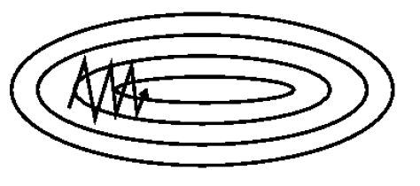
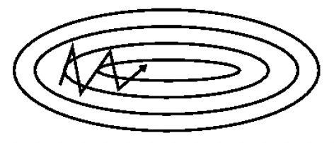

# Momentum

为了抑制SGD的震荡，SGDM认为梯度下降过程可以加入惯性。可以简单理解为：当我们将一个小球从山上滚下来时，没有阻力的话，它的动量会越来越大，但是如果遇到了阻力，速度就会变小。SGDM全称是SGD with momentum，在SGD基础上引入了一阶动量：

$$v_{t}=\gamma v_{t-1}+\eta \nabla J(\theta) $$

SGD-M参数更新公式如下，其中$\eta$是学习率，$\nabla J(\theta)$是当前参数的梯度

$$\theta=\theta-v_{t}$$
一阶动量是各个时刻梯度方向的指数移动平均值，也就是说，t时刻的下降方向，不仅由当前点的梯度方向决定，而且由此前累积的下降方向决定。$\gamma$的经验值为0.9，这就意味着下降方向主要是此前累积的下降方向，并略微偏向当前时刻的下降方向。想象高速公路上汽车转弯，在高速向前的同时略微偏向，急转弯可是要出事的。
SGD 震荡且缓慢的沿着沟壑的下坡方向朝着局部最优点前进，如下图：

momentum能够加速SGD方法，并且能够减少震荡，如下图：

**特点**

+ 加入了动量因素，SGD-M缓解了SGD在局部最优点梯度为0，无法持续更新的问题和振荡幅度过大的问题。
+ 当局部沟壑比较深，动量加持用完了，依然会困在局部最优里来回振荡