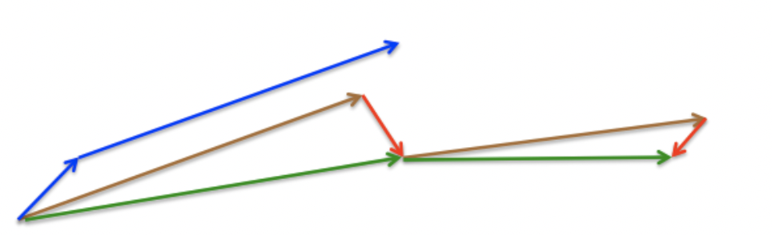

# NAG
SGD 还有一个问题是困在局部最优的沟壑里面震荡。想象一下你走到一个盆地，四周都是略高的小山，你觉得没有下坡的方向，那就只能待在这里了。可是如果你爬上高地，就会发现外面的世界还很广阔。因此，我们不能停留在当前位置去观察未来的方向，而要向前一步、多看一步、看远一些。

NAG全称Nesterov Accelerated Gradient，是在SGD、SGD-M的基础上的进一步改进，我们知道在时刻$t$的主要下降方向是由累积动量决定的，自己的梯度方向说了也不算，那与其看当前梯度方向，不如先看看如果跟着累积动量走了一步，那个时候再怎么走。因此，NAG不计算当前位置的梯度方向，而是计算如果按照累积动量走了一步，那个时候的下降方向：

$$v_{t}=\gamma v_{t-1}+\eta \nabla_{\theta}J(\theta-\gamma v_{t-1})$$

NAG参数更新公式如下，其中$\eta$是学习率， $\nabla_{\theta}J(\theta-\gamma v_{t-1})$是当前参数的梯度

$$\theta=\theta-v_{t}$$

然后用下一个点的梯度方向，与历史累积动量相结合，计算当前时刻的累积动量。

如上图，动量法首先计算当前梯度（图中的小蓝色向量）,然后在更新累积梯度（updated accumulated gradient）方向上大幅度的跳跃（图中的大蓝色向量）。与此不同的是，NAG 首先在先前的累积梯度（previous accumulated gradient）方向上进行大幅度的跳跃（图中的棕色向量），评估这个梯度并做一下修正（图中的红色向量），这就构成一次完整的 NAG 更新（图中的绿色向量）。这种预期更新防止我们进行的太快，也带来了更高的相应速度，这在一些任务中非常有效的提升了 RNN 的性能。

**特点**

+ 有利于跳出当前局部最优的沟壑，寻找新的最优值，但收敛速度慢
