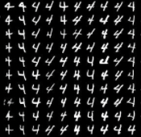

# 模式崩溃

**如何判断GAN模型发生崩溃？**

**表现：**生成器开始退化，总是生成同样的样本点，无法继续学习，这种情况称为模式崩溃。例如，在MNIST数据集上训练GAN之后，我们的生成器可能无法生成与数字4不同的数字。

**可以尝试以下解决办法：**

1）学习率：尝试使用一个较低的学习率从头开始训练；

2）Mini-batch discrimination：在判别器的中间层建立一个mini-batch layer用于计算基于L1距离的样本统计量，通过建立该统计量，实现了一个batch内某个样本与其他样本有多接近。这个信息可以被判别器利用到，从而甄别出哪些缺乏多样性的样本。对生成器而言，则要试图生成具有多样性的样本；

3）使用GAN改进算法：Multi agent diverse GAN(MAD-GAN)采用多个生成器，一个判别器以保障样本生成的多样性等。