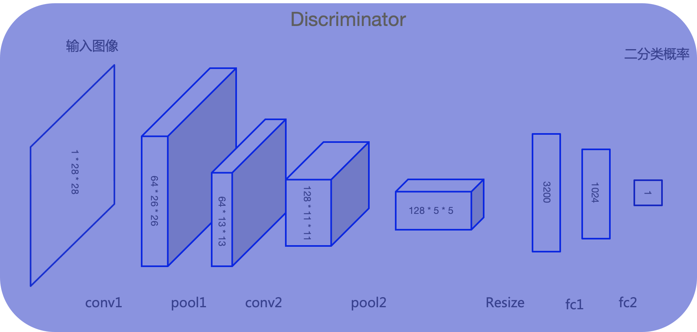

# 判别器Discriminator

判别器D的输入为真实图像和生成器生成的图像，其目的是将生成的图像从真实图像中尽可能的分辨出来。属于二分类问题，通过下图模型结构讲解判别器如何区分真假图片：

* 输入：单通道图像，尺寸为28*28像素(非固定值，根据实际情况修改即可)。
* 输出：二分类，样本是真或假。

1）输入：28\*28*1像素的图像；

2）经过第一个卷积conv1，得到64个26\*26的特征图，然后进行最大池化pool1，得到64个13*13的特征图；

3）经过第二个卷积conv2，得到128个11\*11的特征图，然后进行最大池化pool2，得到128个5*5的特征图；

4）通过Resize将多维输入一维化；

5）再经过两个全连接层fc1和fc2，得到原始图像的向量表达；

6）最后通过Sigmoid激活函数，输出判别概率，即图片是真是假的二分类结果。