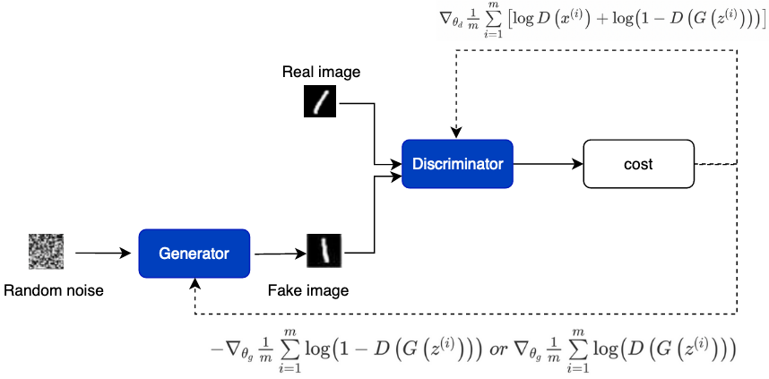

# 模型训练

GAN包含生成器G和判别器D两个网络，那么我们如何训练两个网络？

**训练时先训练鉴别器D：**将真实图片打上真标签1和生成器G生成的假图片打上假标签0，一同组成batch送入判别器D，对判别器进行训练。计算loss时使判别器对真实图像输入的判别趋近于真，对生成的假图片的判别趋近于假。此过程中只更新判别器的参数，不更新生成器的参数。

**然后再训练生成器G：**将高斯分布的噪声z送入生成器G，将生成的假图片打上真标签1送入判别器D。计算loss时使判别器对生成的假图片的判别趋近于真。此过程中只更新生成器的参数，不更新判别器的参数。

>  注意：训练初期，当G的生成效果很差时，D会以高置信度来拒绝生成样本，因为它们与训练数据明显不同。因此，log(1−D(G(z)))饱和（即为常数，梯度为0）。因此我们选择最大化logD(G(z))而不是最小化log(1−D(G(z)))来训练G，和公示(1)右边第二项比较。
