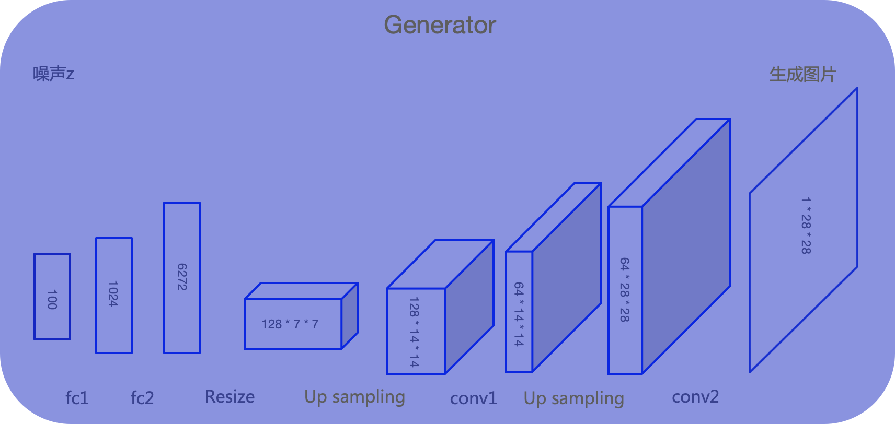

# 生成器Generator

生成器G是一个生成图片的网络，可以采用多层感知机、卷积网络、自编码器等。它接收一个随机的噪声z，通过这个噪声生成图片，记做G(z)。通过下图模型结构讲解生成器如何一步步将噪声生成一张图片：

1）输入：100维的向量；

2）经过两个全连接层Fc1和Fc2、一个Resize，将噪声向量放大，得到128个7*7大小的特征图；

3）进行上采样，以扩大特征图，得到128个14*14大小的特征图；

4）经过第一个卷积Conv1，得到64个14*14的特征图；

5）进行上采样，以扩大特征图，得到64个28*28大小的特征图；

6）经过第二个卷积Conv2，将输入的噪声Z逐渐转化为1\*28*28的单通道图片输出，得到生成的手写数字。

> Tips：全连接层作用：维度变换，变为高维，方便将噪声向量放大。因为全连接层计算量稍大，后序改进的GAN移除全连接层。

> Tips：最后一层激活函数通常使用tanh()：既起到激活作用，又起到归一作用，将生成器的输出归一化至[-1,1]，作为判别器的输入。也使GAN的训练更稳定，收敛速度更快，生成质量确实更高。

