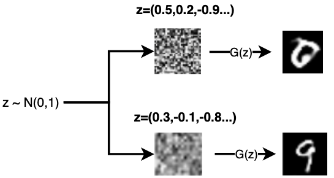

# GAN生成器的输入为什么是噪声？

GAN生成器Generator的输入是随机噪声，目的是每次生成不同的图片。但如果完全随机，就不知道生成的图像有什么特征，结果就会不可控，因此通常从一个先验的随机分布产生噪声。常用的随机分布：

* **高斯分布**：连续变量中最广泛使用的概率分布；

* **均匀分布**：连续变量x的一种简单分布。

引入随机噪声使得生成的图片具有多样性，比如下图不同的噪声z可以产生不同的数字：

