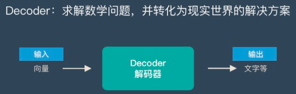
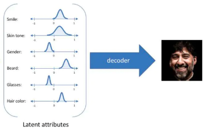

```
typora-root-url: ../encoder-decoder
```

# Decoder

Decoder目标是利用Encoder输出的embedding，来解码关于图的结构信息。




输入是Node Pair的embeddings，输出是一个实数，衡量了这两个Node在中的相似性，映射关系如下：

$$\begin{equation}R^{d} * R^{d}\to R^{+}\end{equation}.                                 \tag{1}$$

Decoder对缩小后的特征图像向量进行上采样，然后对上采样后的图像进行卷积处理，目的是完善物体的几何形状，弥补Encoder当中池化层将物体缩小造成的细节损失。

以人脸编码、解码为例，Encoder对人脸进行编码之后，再用解码器Decoder学习人脸的特性，即由短向量恢复到人脸图像，如下图所示：



