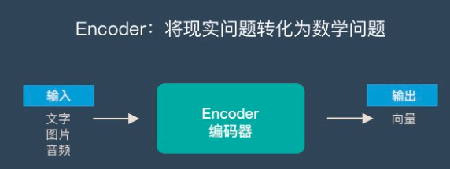
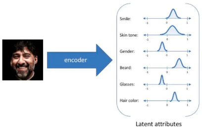

# Encoder

Encoder目标是将输入序列编码成低维的向量表示或embedding，映射函数如下：

$$\begin{equation}V\to R^{d}\end{equation}                                              \tag{1}$$

即将输入V映射成embedding $z_i\in R^{d}$，如下图所示：

Encoder一般是卷积神经网络，主要由卷积层，池化层和BatchNormalization层组成。卷积层负责获取图像局域特征，池化层对图像进行下采样并且将尺度不变特征传送到下一层，而BN主要对训练图像的分布归一化，加速学习。（Encoder网络结构不局限于卷积神经网络）

以人脸编码为例，Encoder将人脸图像压缩到短向量，这样短向量就包含了人脸图像的主要信息，例如该向量的元素可能表示人脸肤色、眉毛位置、眼睛大小等等。编码器学习不同人脸，那么它就能学习到人脸的共性：

