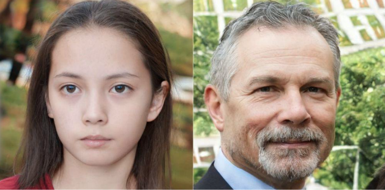
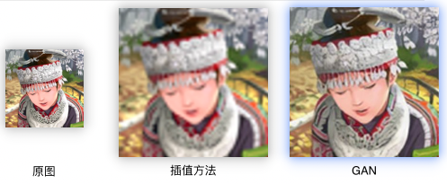
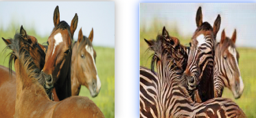
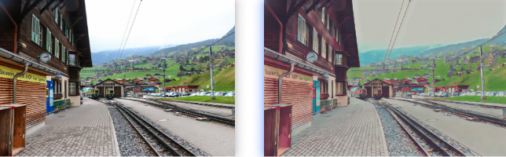
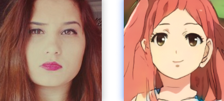
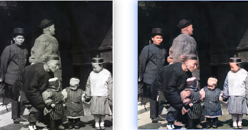
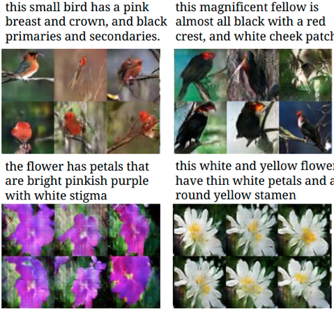

# GAN应用

一起来看看GAN有哪些有趣的应用：

* 图像生成

  图像生成是生成模型的基本问题，GAN相对先前的生成模型能够生成更高图像质量的图像。如生成逼真的人脸图像

  
  
* 超分辨率

  将图像放大时，图片会变得模糊。使用GAN将32\*32的图像扩展为64\*64的真实图像，放大图像的同时提升图片的分辨率。

  
  
* 图像修复

  将残缺的图像补全、也可以用于去除纹身、电视logo、水印等。

  
  
* 图像到图像的转换

  根据一幅图像生成生成另一幅风格不同图像，比如马变成斑马图、航拍地图变成地图

  
  
* 风景动漫化

  将风景图转化为动漫效果

  
  
* 漫画脸

  将人脸图生成卡通风格

  
  
* 图像上色

  黑白影像上色

  
  
* 文本转图像

  根据文字描述生成对应图像

  

GAN的应用常用非常广泛，远远不止上述几种。

