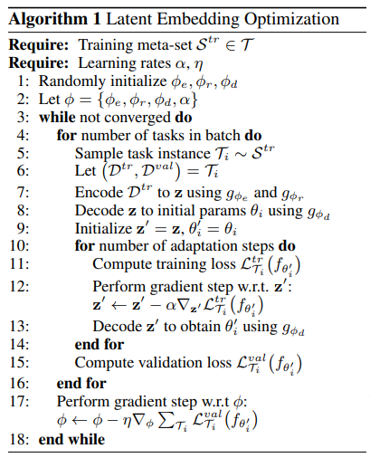

# 基于优化的元学习——LEO

[https://openreview.net/forum?id=BJgklhAcK7](https://openreview.net/forum?id=BJgklhAcK7)

## LEO 原理
LEO（Latent Embedding Optimization）从高维度输入数据提取低维度的关键特征，计算这些特征之间的距离和离散程度，使用这些信息进行样本点标注的预测。LEO考虑了样本点的离散程度，综合每一类样本点分布的特征，对距离进行归一化，使得不同类别的样本点之间的距离可比，分类更加精确。在元学习器中，使用SGD最小化任务验证集损失函数，使得模型的泛化能力最大化，计算元参数，元学习器将元参数输入基础学习器，继而，基础学习器最小化任务训练集损失函数，快速给出任务上的预测结果。

图1	LEO 结构图。

LEO 包括基础学习器和元学习器，还包括编码器和解码器。在基础学习器中，编码器将高维输入数据映射成特征向量，解码器将输入数据的特征向量映射成输入数据属于各个类别的概率值，基础学习器使用元学习器提供的元参数进行一个轮次的参数更新，给出数据标注的预测结果。元学习器为基础学习器的编码器和解码器提供元参数，元参数包括特征提取模型的参数、编码器的参数、解码器的参数等，通过最小化所有任务上的泛化误差，更新元参数。

## 基础学习器：编码器和解码器

编码器和解码器都在基础学习器中，用于计算输入数据属于每个类别的概率值，进而对输入数据进行分类。元学习器提供了编码器和解码器中的参数，基础学习器快速地使用编码器和解码器计算输入数据的分类，在任务上达到很高的分类精度。任务训练完成后，基础学习器将每个类别数据的特征向量和任务 $\varepsilon$ 的基础学习器参数 $\boldsymbol{\theta}_{\varepsilon}$ 输入元学习器，元学习器使用这些信息更新元参数。

### 编码器
编码器模型包括两个主要部分：编码器和关系网络。
1. 编码器 $g_{\phi_{e}}$ ，其中 $\phi_{e}$ 是编码器的可训练参数，其功能是将第 $n$ 个类别的输入数据映射成第 $n$ 个类别的特征向量。
2. 关系网络 $g_{\phi_{r}}$ ，其中 $\phi_{r}$ 是关系网络的可训练参数，其功能是计算特征之间的距离。

第 $n$ 个类别的输入数据的特征记为 $z_{n}$ 。对于输入数据，首先，使用编码器 $g_{\phi_{e}}$ 对属于第 $n$ 个类别的输入数据进行特征提取；然后，使用关系网络 $g_{\phi_r}$ 计算特征之间的距离，综合考虑训练集中所有样本点之间的距离，计算这些距离的平均值和离散程度；第 $n$ 个类别输入数据的特征 $z_{n}$ 服从高斯分布，且高斯分布的期望是这些距离的平均值，高斯分布的方差是这些距离的离散程度，具体的计算公式如下：
$$
\begin{aligned}
&\mu_{n}^{e}, \sigma_{n}^{e}=\frac{1}{N K^{2}} \sum_{k_{n}=1}^{K} \sum_{m=1}^{N} \sum_{k_{m}=1}^{K} g_{\phi_{\delta}}\left[g_{\phi_{c}}\left(x_{n}^{k_{n}}\right), g_{\phi_{e}}\left(x_{m}^{k_{m}}\right)\right] \\
&z_{n} \sim q\left(z_{n} \mid D_{n}^{\mathrm{tr}}\right)=N\left\{\mu_{n}^{e}, \operatorname{diag}\left(\sigma_{n}^{e}\right)^{2}\right\}
\end{aligned}
$$
其中，$N$ 是类别总数， $K$ 是每个类别的图片总数， $\boldsymbol{D}_{n}^{\mathrm{tr}}$ 是第 $n$ 个类别的训练数据集。对于每个类别的输入数据，每个类别下有 $K$ 张图片，计算这 $K$ 张图片和所有已知图片之间的距离。计算距离包括两个模型：特征提取模型和 $\mathrm{RN}$ 的深度度量模型。计算这些距离的平均值和方差，第 $n$ 个类别输人数据的特征 $z_{n}$ 服从高斯分布，高斯分布的期望和方差分别是这些距离的平均值和方差。总共有 $N$ 个类别，通过编码器的计算，形成了所有类别的特征，记为 $z=\left(z_{1}, \cdots, z_{N}\right)$。

### 解码器
解码器 $g_{\phi_{d}}$ ，其中 $\phi_{d}$ 是解码器的可训练参数，其功能将每个类别输入数据的特征向量 $z_{n}$ 映射成属于每个类别的概率值 $\boldsymbol{w}_{n}$：
$$
\begin{aligned}
&\mu_{n}^{d}, \sigma_{n}^{d}=g_{\phi_{d}}\left(z_{n}\right) \\
&w_{n} \sim q\left(w \mid z_{n}\right)=N\left\{\mu_{n}^{d}, \operatorname{diag}\left(\sigma_{n}^{d}\right)^{2}\right\}
\end{aligned}
$$
其中，任务 $\varepsilon$ 的基础学习器参数记为 $\theta_{\varepsilon}$，基础学习器参数由属于每个类别的概率值组成，记为 $\theta_{\varepsilon}=\left(w_{1}, w_{2}, \cdots, w_{N}\right)$，基础学习器参数 $\boldsymbol{w}_{n}$ 指的是输入数据属于第 $n$ 个类别的概率值，$g_{\phi_{d}}$ 是从特征向量到基础学习器参数的映射， $\phi_{d}$ 是解码器中的可训练参数。

图2	LEO 基础学习器工作原理图。

##  基础学习器更新过程
在基础学习器中，任务 $\varepsilon$ 训练集的交叉熵损失函数是
$$
L_{\varepsilon}^{\mathrm{tr}}\left(f_{\theta_{\varepsilon}}\right)=\sum_{(x, y) \in D_{\varepsilon}^{\mathrm{tr}}}\left[-w_{y} \boldsymbol{x}+\log \sum_{j=1}^{N} \mathrm{e}^{w_{j} x}\right]
$$
其中，$(x, y)$ 是任务 $\varepsilon$ 训练集 $D_{\varepsilon}^{\mathrm{tr}}$ 中的样本点，$f_{\theta_{\varepsilon}}$ 是任务 $\varepsilon$ 的基础学习器，最小化任务 $\varepsilon$ 的损失函数更新任务专属参数 $\theta_{\varepsilon}$ 。在解码器模型中，任务专属参数为 $w_{n} \sim q\left(w \mid z_{n}\right)$，更新任务专属参数 $\theta_{\varepsilon}$ 意味着更新特征向量 $z_{n}$：
$$
z_{n}^{\prime}=z_{n}-\alpha \nabla_{z_{n}} L_{\varepsilon}^{t r}\left(f_{\theta_{\varepsilon}}\right),
$$
其中，$\boldsymbol{z}_{n}^{\prime}$ 是更新后的特征向量，对应的是更新后的任务专属参数 $\boldsymbol{\theta}_{\varepsilon}^{\prime}$ 。 $\alpha$ 是学习率。基础学习器使用 $\theta_{\varepsilon}^{\prime}$ 来预测任务验证集数据的标注，将任务 $\varepsilon$ 的验证集 $\mathrm{D}_{\varepsilon}^{\mathrm{val}}$ 损失函数 $L_{\varepsilon}^{\mathrm{val}}\left(f_{\theta_{\varepsilon}^{\prime}}\right)$ 、更新后的特征向量 $z_{n}^{\prime}$、更新后的任务专属参数 $\theta_{\varepsilon}^{\prime}$ 输入元学习器，在元学习器中更新元参数。

##  元学习器更新过程
在元学习器中，最小化所有任务 $\varepsilon$ 的验证集的损失函数的求和，最小化任务上的模型泛化误差：
$$
\min _{\phi_{e}, \phi_{r}, \phi_{d}} \sum_{\varepsilon}\left[L_{\varepsilon}^{\mathrm{val}}\left(f_{\theta_{\varepsilon}^{\prime}}\right)+\beta D_{\mathrm{KL}}\left\{q\left(z_{n} \mid \boldsymbol{D}_{n}^{\mathrm{tr}}\right) \| p\left(z_{n}\right)\right\}+\gamma\left\|s\left(\boldsymbol{z}_{n}^{\prime}\right)-\boldsymbol{z}_{n}\right\|_{2}^{2}\right]+R
$$
其中， $L_{\varepsilon}^{\mathrm{val}}\left(f_{\theta_{\varepsilon}^{\prime}}\right)$ 是任务 $\varepsilon$ 验证集的损失函数，其衡量了基础学习器模型的泛化误差，损失函数越小，模型的泛化能力越好。 $p\left(z_{n}\right)=N(0, I)$ 是高斯分布，$D_{\mathrm{KL}}\left\{q\left(z_{n} \mid \boldsymbol{D}_{n}^{\mathrm{t}}\right) \| p\left(z_{n}\right)\right\}$ 是近似后验分布 $q\left(z_{n} \mid D_{n}^{\text {tr }}\right)$ 与先验分布 $p\left(z_{n}\right)$ 之间的 KL 距离 (KL-Divergence)，最小化 $\mathrm{KL}$ 距离可使后验分布 $q\left(z_{n} \mid \boldsymbol{D}_{n}^{\text {tr }}\right)$ 的估计尽可能准确。最小化距离 $\left\|s\left(z_{n}^{\prime}\right)-z_{n}\right\|$ 使得参数初始值 $z_{n}$ 和训练完成后的参数更新值 $z_{n}^{\prime}$ 距离最小，使得参数初始值和参数最终值更接近，那么就不需要那么多次迭代更新，参数就会带来更好的分类精度。 $\beta$ 和 $\gamma$ 都是元学习器的超参数，可以固定，也可以通过训练来计算。 $R$ 是正则项, 用于调控元参数的复杂程度，避免出现过拟合，正则项 $R$ 的计算公式如下：
$$
R=\lambda_{1}\left(\left\|\phi_{e}\right\|_{2}^{2}+\left\|\phi_{r}\right\|_{2}^{2}+\left\|\phi_{d}\right\|_{2}^{2}\right)+\lambda_{2}\left\|C_{d}-\mathbb{I}\right\|_{2}
$$
其中， $\left\|\phi_{r}\right\|_{2}^{2}$ 指的是调控元参数的个数和大小， $\mathbb{C}_{d}$ 是参数 $\phi_{d}$ 的行和行之间的相关性矩阵，超参数 $\lambda_{1},\lambda_{2}>0$， $\left\|C_{d}-\mathbb{I}\right\|_{2}$ 使得 $C_{d}$ 接近单位矩阵，使得参数 $\phi_{d}$ 的行和行之间的相关性不能太大，每个类别的特征向量之间的相关性不能太大，属于每个类别的概率值之间的相关性也不能太大，分类要尽量准确。

## LEO 算法流程
LEO 使用片段式训练模式，其步骤如算法1： 

