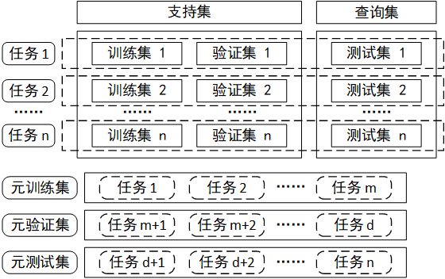

# 元学习概述

## 元学习概念
元学习（Meta-Learning）通常被理解为“学会学习（Learning-to-Learn）”，指的是在多个学习阶段改进学习算法的过程。在基础学习过程中，内部（或下层/基础）学习算法解决由数据集和目标定义的任务。在元学习过程中，外部（或上层/元）算法更新内部学习算法，使其学习的模型改进外部目标。这个目标可能是内部算法的泛化性能、学习速度等。
元学习的含义有两层，第一层是让机器学会学习，使其具备分析和解决问题的能力，机器通过完成任务获取经验，提高完成任务的能力; 第二层是让机器学习模型可以更好地泛化到新领域中，并且在新领域中创新、综合，从而完成差异很大的新任务。元学习通过机器学习方法探索数据中能够推而广之的本质规律，并且找到这种规律的充分表示模型，将这种规律用于完成其他任务，提高模型的训练效率。

## 元学习应用场景
元学习的应用场景主要有以下四种：
- 数据量很少却需要训练深度学习模型的场景；
- 在线学习需要实时更新深度学习模型, 但是每个时刻获取的数据包都很小；
- 复杂的优化问题，包括许多连续和离散的超参数需要优化，元学习器指导基础学习器优先探索更有希望的超参数组合；
- 解决从头训练深度模型过于复杂或者无法实现的场景，必须借鉴过去的经验对深度模型的训练进行加速。

## 元学习的关键问题
元学习的关键在于发现不同问题之间的普适规律，通过推广这样的普适规律来解决末知难题。普适规律在能够被很好推广的基础上，增加了对问题特性的表示力，特性代表了从新问题中获得的有效信息，最好的普适规律需要达到对问题共性和特性表示力的均衡。普适规律的寻找主要依赖于以下几点：
- 发现已经解决的问题和新问题之间联系密切的部分，提取已经解决的问题的普适规律，用于新问题的解决；
- 将新问题分解，化繁为简，在已经解决的问题中找到与新问题各个子任务联系紧密的普适规律，以及这些规律的适用范围；
- 在新问题中学习推理逻辑，使用推理逻辑来对新问题进行表示，在这些表示中寻找规律，通过新问题自身各个部分之间的推理逻辑，找到解决新问题的办法。

## 元学习单位
元学习考虑的基本单元是任务（任务代表的是研究者需要解决的问题），元学习的输入是许多任务，元训练集（Meta-Training Data）、元验证集（Meta-Validation Data）和元测试集（Meta-Testing Data）都是由抽样任务组成的任务集合。元训练集和元验证集中的任务用来训练元学习模型，元测试集中的任务用来衡量元学习模型完成任务的效果。图1中所示的支持集 ( Support Data）是所有有标注数据的集合, 查询集（Query Data）是所有无标注数据的集合，训练集和验证集是从支持集中随机抽样生成的，测试集是从查询集中随机抽样生成的。每个任务包含一个训练集、一个验证集和一个测试集。任务定义是基于对真实问题的分析判断来进行的，遇到复杂问题时，需要将复杂问题分解为容易解决的子问题，进而产生对任务的划分和界定。元学习模型在解决复杂问题时，首先处理好每个子任务，实现模型在每个子任务上的适应和推广，进而解决复杂多变的母问题。

图1 元学习数据集示意图

## 元学习与深度学习的区别和联系
元学习模型是一个针对任务的学习器产生机制，一个学习器处理一个任务，元学习器对不同任务有针对性地产生一个精度较高的学习器，产生机制必须快速，生成的学习器在任务上必须达到很高的精度。在元学习领域中，这样的学习器产生机制用一个机制处理了许多不同的任务。深度学习模型可以使用一个复杂学习器，训练大量有标注数据集，来解决问题，所以，学习器的复杂度较高，且无法适用于数据集较小的情况。

深度学习输入的基本单元是观测样本点，目标是从数据集中找到规律，进行预测，解决问题。这里，输入的一组数据集就是一个任务。元学习中输入的是许多任务，目的是从许多任务中提炼出完成任务的方法，从而达到用一个元学习模型完成多个任务的目的，让机器学会在面对新任务时自我更新，从而快速有效地完成新任务。元学习模型代表的是一个针对不同任务给出不同学习器的模型泛化机制。

总而言之，深度学习模型是元学习模型的基础，元学习模型是深度学习模型结合任务间的泛化模型形成的，两者的融合可以扩展深度学习模型的适用范围，加速新任务上深度学习模型训练的速度，在新任务上找到精度更好的深度学习模型。对于复杂的应用场景，元学习包含两个层面上的问题简化：
- 将复杂问题分解为容易解决的子问题，这些简单子问题即子任务，通过完成很多简单的子任务，来完成复杂任务；
- 针对简单子任务设计高效的学习器产生机制，对于简单的子任务而言，学习器的结构也会相对简单，最后，将所有简单子任务的学习器拼装起来, 完成复杂任务。
 

