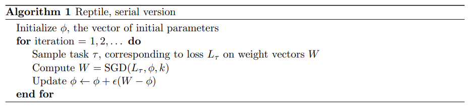
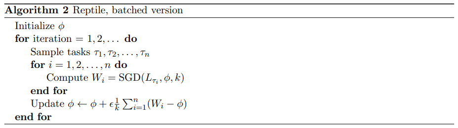

# 基于优化的元学习——Reptile

[https://arxiv.org/abs/1803.02999v1](https://arxiv.org/abs/1803.02999v1)

Reptil 算法有两个版本：Serial Version和Batched Version.

## Serial Version
单次更新的 Reptile 算法，每次训练完一个任务的基础学习器，就更新一次元学习器中的参数初始值。

1. 任务上的基础学习器记为 $f_{\phi}$ ，其中 $\phi$ 是基础学习器中可训练的参数， $\theta$ 是元学习器提供给基础学习器的参数初始值。在任务 $T_{i}$ 上，基础学习器的损失函数是 $L_{T_{i}}\left(f_{\phi}\right)$ ，基础学习器中的参数经过$N$次迭代更新得到参数估计值：
$$
\boldsymbol{\theta}_{i}^{N}=\operatorname{SGD}\left(L_{T_{i}}, \boldsymbol{\theta}, \mathrm{N}\right)
$$

2. 更新元学习器中的参数初始值：
$$
\theta \leftarrow \theta+\varepsilon\left(\theta_{i}^{N}-\theta\right)
$$
其中， $\varepsilon$ 是可训练的步长参数。

## Batched Version
批次更新的 Reptile 算法，每次训练完多个任务的基础学习器之后，才更新一次元学习器中的参数初始值。

1. 在多个任务上训练基础学习器，每个任务从参数初始值开始，迭代更新 $N$ 次，得到参数估计值。

2. 更新元学习器中的参数初始值：
$$
\theta \leftarrow \theta+\varepsilon \frac{1}{n} \sum_{i=1}^{n}\left(\theta_{i}^{N}-\theta\right)
$$
其中， $\varepsilon$ 是可训练的步长参数， $N$ 是基础学习器上参数初始值迭代更新的次数， $n$ 是指每次训练完 $n$ 个任务上的基础学习器后，才更新一次元学习器中的参数初始值。

##  MAML 和 Reptile 的区别和联系
1. 在 MAML 算法的元学习器中，使用了求导数的算式来更新参数初始值，导致在计算中出现了任务损失函数的二阶导数，降低了计算速度，导致了计算不稳定。在 Reptile 算法的元学习器中，参数初始值更新时，直接使用了任务上的参数估计值和参数初始值之间的差，来近似损失函数对参数初始值的导数，进行参数初始值的更新，从而不会出现任务损失函数的二阶导数。一旦在元学习器中使用梯度来更新参数初始值，就会出现任务损失函数对参数初始值求导的计算，需要计算任务损失函数的高阶导数，导致计算缓慢且不稳定。在 Reptile 算法中，只在基础学习器中出现了任务损失函数对可训练参数的一阶导数，在元学习器中，并没有进行求导数的计算，不需要计算任务损失函数的高阶导数，因此， Reptile 算法更快速更稳定。

2. 在 MAML 算法中，在基础学习器中只进行一次迭代更新，从参数初始值来计算任务训练完成后的参数值，这样做使得训练相对简单，而且在任务很相似，且参数初始值很准确的情况下，在任务上只需要进行一次迭代更新就可以达到不错的精度，可以很好地完成任务。在 Reptile 算法中，基础学习器在参数初始值的基础上进行了多次迭代更新，使得基础学习器在任务上达到不错的精度，基础学习器中的计算量增加。另一方面，在 Reptile 算法的元学习器中不使用损失函数梯度来更新参数初始值，而是使用损失函数梯度的近似值来更新参数初始值，计算更加快速稳定，元学习器中的计算量减小。整体上来看， Reptile 算法还是比 MAML 算法速度快，但是精度会比 MAML 略低一些。
