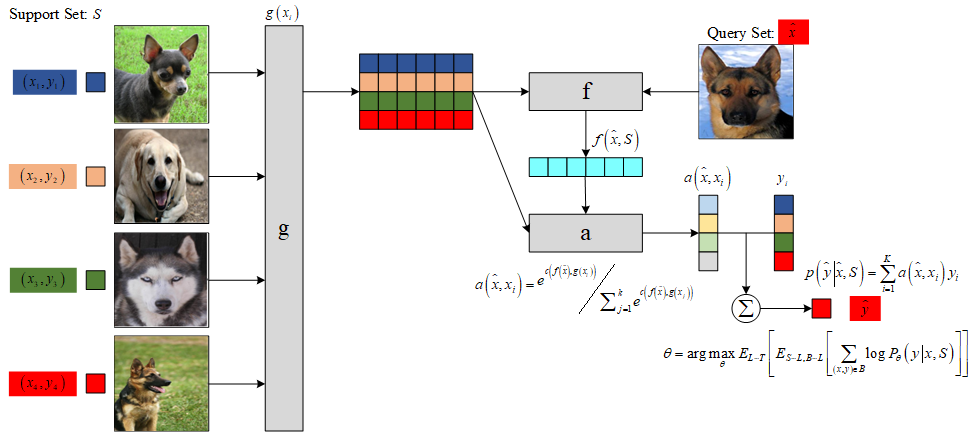

# Matching Network

Matching Network (MN) 
结合了度量学习 (Metric Learning) 与记忆增强神经网络 (Memory Augment Neural Networks)，
并利用注意力机制与记忆机制加速学习，同时提出了 set-to-set 框架，
使得 MN 能够为新类产生合理的测试标签，且不用网络做任何改变。

## 1 MN

将支持集 $S=\left\{\left(x_{i}, y_{i}\right)\right\}_{i=1}^{k}$ 
映射到一个分类器 $c_{S}(\hat{x})$ ，
给定一个测试样本 $\hat{x}$ ，$c_{S}(\hat{x})$ 定义一个关于输出 $\hat{y}$ 的概率分布，即

$$
S \rightarrow c_{S}\left(\hat{x}\right):=
P\left(\hat{y} \mid \hat{x}, S\right)
$$

其中， $P$ 被网络参数化。
因此，当给定一个新的支持集 $S^{\prime}$ 进行小样本学习时，
只需使用 $P$ 定义的网络来预测每个测试示例 $\hat{x}$ 的适当标签分布
$P\left(\hat{y} \mid \hat{x}, S^{\prime}\right)$ 即可。

### 1.1 注意力机制

模型以最简单的形式计算 $\hat{y}$ 上的概率：

$$
P(\hat{y} \mid \hat{x}, S)=\sum_{i=1}^{k} a\left(\hat{x}, x_{i}\right) y_{i}
$$

上式本质是将一个输入的新类描述为支持集中所有类的一个线性组合，
结合了核密度估计KDE（ $a$ 可以看做是一种核密度估计）和 KNN 。
其中, $k$ 表示支持集中样本类别数, 
$a\left(\hat{x}, x_{i}\right)$ 是注意力机制，
类似 attention 模型中的核函数，
用来度量 $\hat{x}$ 和训练样本 $x_{i}$ 的匹配度。

$a$ 的计算基于新样本数据与支持集中的样本数据的嵌入表示的余弦相似度以及softmax函数：

$$
a\left(\hat{x}, x_{i}\right)=\frac{e^{c\left(f(\hat{x}), g\left(x_{i}\right)\right)}}{\sum_{j=1}^{k} e^{c\left(f(\hat{x}), g\left(x_{j}\right)\right)}}
$$

其中， $c(\cdot)$ 表示余弦相似度， 
$f$ 与 $g$ 表示施加在测试样本与训练样本上的嵌入函数 (Embedding Function)。

如果注意力机制是 $X \times X$ 上的核，
则上式类似于核密度估计器。
如果选取合适的距离度量以及适当的常数，
从而使得从 $x_{i}$ 到 $\hat{x}$ 的注意力机制为 0 ，
则上式等价于 KNN 。

图1是 MN 的网络结构示意图。

图1	MN 示意图。

### 1.2 Full Context Embeddings

为了增强样本嵌入的匹配度，
[1] 提出了 Full Context Embeeding (FCE) 方法：
支持集中每个样本的嵌入应该是相互独立的，
而新样本的嵌入应该受支持集样本数据分布的调控，
其嵌入过程需要放在整个支持集环境下进行，
因此 [1] 采用带有注意力的 LSTM 网络对新样本进行嵌入。

在对余弦注意力定义时，
每个已知标签的输入 $x_i$ 通过 CNN 后的 embedding ，
因此 $g(x_i)$ 是独立的，前后没有关系，
然后与 $f\left(\hat{x}\right)$ 进行逐个对比，
并没有考虑到输入任务 $S$ 改变 embedding $\hat{x}$ 的方式，
而 $f(\cdot)$ 应该是受 $g(S)$ 影响的。
为了实现这个功能，[1] 采用了双向 LSTM 。

在通过嵌入函数 $f$ 和 $g$ 处理后，
输出再次经过循环神经网络进一步加强 context 和个体之间的关系。

$$
f\left(\hat{x},S\right)=\mathrm{attLSTM}\left(f'\left(\hat{x}\right),g(S),K\right)
$$

其中， $S$ 是相关的上下文， $K$ 为网络的 timesteps 。

因此，经过 $k$ 步后的状态为:

$$
\begin{aligned}
& \hat{h}_{k}, c_{k} =\operatorname{LSTM}\left(f^{\prime}(\hat{x}),\left[h_{k-1}, r_{k-1}\right], c_{k-1}\right) \\
& h_{k} =\hat{h}_{k}+f^{\prime}(\hat{x}) \\
& r_{k-1} =\sum_{i=1}^{|S|} a\left(h_{k-1}, g\left(x_{i}\right)\right) g\left(x_{i}\right) \\
& a\left(h_{k-1}, g\left(x_{i}\right)\right) =e^{h_{k-1}^{T} g\left(x_{i}\right)} / \sum_{j=1}^{|S|} e^{h_{k-1}^{T} g\left(x_{j}\right)}
\end{aligned}
$$

## 2 网络结构

特征提取器可采用常见的 VGG 或 Inception 网络，
[1] 设计了一种简单的四级网络结构用于图像分类任务的特征提取，
每级网络由一个 64 通道的 3 $\times$ 3 卷积层，一个批规范化层，
一个 ReLU 激活层和一个 2 $\times$ 2 的最大池化层构成。
然后将最后一层输出的特征输入到 LSTM 网络中得到最终的特征映射
$f\left(\hat{x},S\right)$ 和 $g\left({x_i},S\right)$ 。

## 3 损失函数

$$
\theta=\arg \max _{\theta} E_{L \sim T}\left[E_{S \sim L, B \sim L}\left[\sum_{(x, y) \in B} \log P_{\theta}(y \mid x, S)\right]\right]
$$

## 4 MN 算法流程

- 将任务 $S$ 中所有图片 $x_i$ （假设有 $K$ 个)和目标图片 $\hat{x}$（假设有 1 个)
全部通过 CNN 网络，获得它们的浅层变量表示。

- 将（ $K+1$ 个）浅层变量全部输入到 BiLSTM 中，获得 $K+1$ 个输出，
然后使用余弦距离判断前 $K$ 个输出中每个输出与最后一个输出之间的相似度。

- 根据计算出来的相似度，按照任务 $S$ 中的标签信息 $y_1, y_2, \ldots, y_K$ 
求解目标图片 $\hat{x}$ 的类别标签 $\hat{y}$。

## 5 MN 分类结果

表1	MN 在 Omniglot 上的分类结果。

| Model | Matching Fn | Fine Tune | 5-way 1-shot | 5-way 5-shot | 20-way 1-shot | 20-way 5-shot |  
| :----: | :----: | :----: | :----: | :----: | :----: | :----: |
| PIXELS | Cosine | N | 41.7 $\%$ | 63.2 $\%$ | 26.7 $\%$ | 42.6 $\%$ |
| BASELINE CLASSIFIER | Cosine | N | 80.0 $\%$ | 95.0 $\%$ | 69.5 $\%$ | 89.1 $\%$ |
| BASELINE CLASSIFIER | Cosine | Y | 82.3 $\%$ | 98.4 $\%$ | 70.6 $\%$ | 92.0 $\%$ |
| BASELINE CLASSIFIER | Softmax | Y | 86.0 $\%$ | 97.6 $\%$ | 72.9 $\%$ | 92.3 $\%$ |
| MANN (NO CNOV) | Cosine | N | 82.8 $\%$ | 94.9 $\%$ | -- | -- |
| CONVOLUTIONAL SIAMESE NET | Cosine | Y | 96.7 $\%$ | 98.4 $\%$ | 88.0 $\%$ | 96.5 $\%$ |
| CONVOLUTIONAL SIAMESE NET | Cosine | Y | 97.3 $\%$ | 98.4 $\%$ | 88.1 $\%$ | 97.0 $\%$ |
| MATCHING NETS | Cosine | N | **98.1** $\%$ | **98.9** $\%$ | **93.8** $\%$ | 98.5 $\%$ |
| MATCHING NETS | Cosine | Y | 97.9 $\%$ | 98.7 $\%$ | 93.5 $\%$ | **98.7** $\%$ |

表1	MN 在 miniImageNet 上的分类结果。

| Model | Matching Fn | Fine Tune | 5-way 1-shot | 5-way 5-shot | 
| :----: | :----: | :----: | :----: | :----: |
| PIXELS | Cosine | N | 23.0 $\%$ | 26.6 $\%$ |
| BASELINE CLASSIFIER | Cosine | N | 36.6 $\%$ | 46.0 $\%$ |
| BASELINE CLASSIFIER | Cosine | Y | 36.2 $\%$ | 52.2 $\%$ |
| BASELINE CLASSIFIER | Cosine | Y | 38.4 $\%$ | 51.2 $\%$ |
| MATCHING NETS | Cosine | N | 41.2 $\%$ | 56.2 $\%$ |
| MATCHING NETS | Cosine | Y | 42.4 $\%$ | 58.0 $\%$ |
| MATCHING NETS | Cosine (FCE) | N | 44.2 $\%$ | 57.0 $\%$ |
| MATCHING NETS | Cosine (FCE) | Y | **46.6** $\%$ | **60.0** $\%$ |

## 6 创新点 

- 采用匹配的形式实现小样本分类任务，
引入最近邻算法的思想解决了深度学习算法在小样本的条件下无法充分优化参数而导致的过拟合问题，
且利用带有注意力机制和记忆模块的网络解决了普通最近邻算法过度依赖度量函数的问题，
将样本的特征信息映射到更高维度更抽象的特征空间中。

- one-shot learning 的训练策略，一个训练任务中包含支持集和 Batch 样本。

## 7 算法评价

- MN 受到非参量化算法的限制，
随着支持集 $S$ 的增长，每次迭代的计算量也会随之快速增长，导致计算速度降低。

- 在测试时必须提供包含目标样本类别在内的支持集，
否则它只能从支持集所包含的类别中选择最为接近的一个输出其类别，而不能输出正确的类别。

## 参考文献

[1] [Matching Networks for One Shot Learning](https://proceedings.neurips.cc/paper/2016/hash/90e1357833654983612fb05e3ec9148c-Abstract.html)