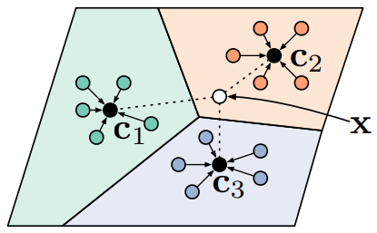

# Prototypical Network

Prototypical Network (PN) 利用支持集中每个类别提供的少量样本，
计算它们的嵌入中心，作为每一类样本的原型 (Prototype)，
接着基于这些原型学习一个度量空间，
使得新的样本通过计算自身嵌入与这些原型的距离实现最终的分类。

## 1 PN

在 few-shot 分类任务中，
假设有 $N$ 个标记的样本 $S=\left(x_{1}, y_{1}\right), \ldots,\left(x_{N}, y_{N}\right)$ ，
其中， $x_{i} \in$ $\mathbb{R}^{D}$ 是 $D$ 维的样本特征向量， 
$y \in 1, \ldots, K$ 是相应的标签。 
$S_{K}$ 表示第 $k$ 类样本的集合。

PN 计算每个类的 $M$ 维原型向量 $c_{k} \in \mathbb{R}^{M}$ ，
计算的函数为 $f_{\phi}: \mathbb{R}^{D} \rightarrow \mathbb{R}^{M}$ ，
其中 $\phi$ 为可学习参数。
原型向量 $c_{k}$ 即为嵌入空间中该类的所有 支持集样本点的均值向量

$$
c_{k}=\frac{1}{\left|S_{K}\right|} \sum_{\left(x_{i}, y_{i}\right) \in S_{K}} f_{\phi}\left(x_{i}\right)
$$

给定一个距离函数 $d: \mathbb{R}^{M} \times \mathbb{R}^{M} \rightarrow[0,+\infty)$ ，
不包含任何可训练的参数，
PN 通过在嵌入空间中对距离进行 softmax 计算，
得到一个针对 $x$ 的样本点的概率分布

$$
p_{\phi}(y=k \mid x)=\frac{\exp \left(-d\left(f_{\phi}(x), c_{k}\right)\right)}{\sum_{k^{\prime}} \exp \left(-d\left(f_{\phi}(x), c_{k^{\prime}}\right)\right)}
$$

新样本点的特征离类别中心点越近，
新样本点属于这个类别的概率越高；
新样本点的特征离类别中心点越远，
新样本点属于这个类别的概率越低。

通过在 SGD 中最小化第 $k$ 类的负对数似然函数 $J(\phi)$ 来推进学习

$$
J(\phi)= \underset{\phi}{\operatorname{argmin}}\left(\sum_{k=1}^{K}-\log \left(p_{\phi}\left(\boldsymbol{y}=k \mid \boldsymbol{x}_{k}\right)\right)\right)
$$

PN 示意图如图1所示。

图1	PN 示意图。

## 2 PN 算法流程

> Input: Training set $\mathcal{D}=\left\{\left(\mathbf{x}_{1}, y_{1}\right), \ldots,\left(\mathbf{x}_{N}, y_{N}\right)\right\}$, where each $y_{i} \in\{1, \ldots, K\}$. $\mathcal{D}_{k}$ denotes the subset of $\mathcal{D}$ containing all elements $\left(\mathbf{x}_{i}, y_{i}\right)$ such that $y_{i}=k$.

> Output: The loss $J$ for a randomly generated training episode.

> 1. select class indices for episode: $V \leftarrow \text { RANDOMSAMPLE }\left(\{1, \ldots, K\}, N_{C}\right)$
> 2. for $k$ in $\left\{1, \ldots, N_{C}\right\}$ do
>       1. select support examples: $S_{k} \leftarrow \text { RANDOMSAMPLE }\left(\mathcal{D}_{V_{k}}, N_{S}\right)$
>       2. select query examples: $Q_{k} \leftarrow \text { RANDOMSAMPLE }\left(\mathcal{D}_{V_{k}} \backslash S_{k}, N_{Q}\right)$
>       3. compute prototype from support examples: $c_k \leftarrow \frac{1}{N_{C}} \sum_{\left(\mathbf{x}_{i}, y_{i}\right) \in S_{k}} f_{\phi}\left(\mathbf{x}_{i}\right)$
> 3. end for
> 4. $J \leftarrow 0$
> 5. for $k$ in $\left\{1, \ldots, N_{C}\right\}$ do
>       1. for $x, y$ in $Q_{k}$ do
>       2. update loss $\left.J \leftarrow J+\frac{1}{N_{C} N_{Q}}\left[d\left(f_{\phi}(\mathbf{x}), \mathbf{c}_{k}\right)\right)+\log \sum_{k^{\prime}} \exp \left(-d\left(f_{\phi}(\mathbf{x}), \mathbf{c}_{k^{\prime}}\right)\right)\right]$
> 6. end for
> 7. end for

其中，
- $N$ 是训练集中的样本个数；
- $K$ 是训练集中的类个数;
- $N_{C} \leq K$ 是每个 episode 选出的类个数;
- $N_{S}$ 是每类中 support set 的样本个数;
- $N_{Q}$ 是每类中 query set 的样本个数;
- $\mathrm{RANDOMSAMPLE}(S, N)$ 表示从集合 $\mathrm{S}$ 中随机选出 $\mathrm{N}$ 个元素。

## 3 PN 分类结果

表1	PN 在 Omniglot 上的分类结果。

| Model | Dist. | Fine Tune | 5-way 1-shot | 5-way 5-shot | 20-way 1-shot | 20-way 5-shot |  
| :----: | :----: | :----: | :----: | :----: | :----: | :----: |
| MATCHING NETWORKS | Cosine | N | 98.1 $\%$ | 98.9 $\%$ | 93.8 $\%$ | 98.5 $\%$ |
| MATCHING NETWORKS | Cosine | Y | 97.9 $\%$ | 98.7 $\%$ | 93.5 $\%$ | 98.7 $\%$ |
| NEURAL STATISTICIAN | - | N | 98.1 $\%$ | 99.5 $\%$ | 93.2 $\%$ | 98.1 $\%$ |
| MAML | - | N | 98.7 $\%$ | **99.9** $\%$ | 95.8 $\%$ | **98.9** $\%$ |
| PROTOTYPICAL NETWORKS | Euclid. | N | **98.8** $\%$ |  99.7 $\%$ | **96.0** $\%$  | **98.9** $\%$ |

表1	PN 在 miniImageNet 上的分类结果。

| Model | Dist. | Fine Tune | 5-way 1-shot | 5-way 5-shot | 
| :----: | :----: | :----: | :----: | :----: |
| BASELINE NEAREST NEIGHBORS | Cosine | N | 28.86 $\pm$ 0.54 $\%$ | 49.79 $\pm$ 0.79 $\%$ |
| MATCHING NETWORKS | Cosine | N | 43.40 $\pm$ 0.78 $\%$ | 51.09 $\pm$ 0.71 $\%$ |
| MATCHING NETWORKS (FCE) | Cosine | N | 43.56 $\pm$ 0.84 $\%$ | 55.31 $\pm$ 0.73 $\%$ |
| META-LEARNER LSTM | - | N | 43.44 $\pm$ 0.77 $\%$ | 60.60 $\pm$ 0.71 $\%$ |
| MAML | - | N | **48.70 $\pm$ 1.84** $\%$ | 63.15 $\pm$ 0.91 $\%$ |
| PROTOTYPICAL NETWORKS | Euclid. | N | **49.42 $\pm$ 0.78** $\%$ | **68.20 $\pm$ 0.66** $\%$ |

## 参考文献

[1] [Prototypical Networks for Few-shot Learning](https://proceedings.neurips.cc/paper/2017/hash/cb8da6767461f2812ae4290eac7cbc42-Abstract.html)