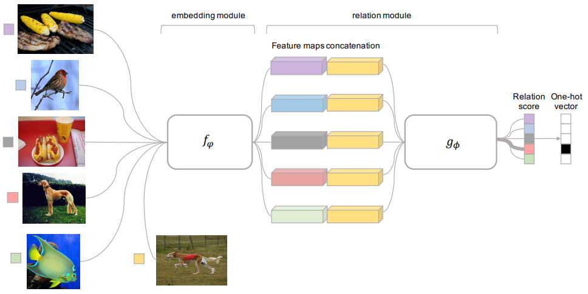
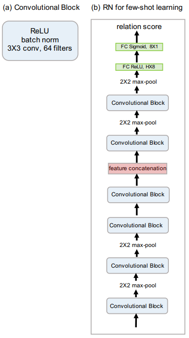

# Relation Network

Relation Network (RN) 使用有监督度量学习估计样本点之间的距离，
根据新样本点和过去样本点之间的距离远近，对新样本点进行分类。

## 1 RN

RN 包括两个组成部分：嵌入模块和关系模块，且两者都是通过有监督学习得到的。
嵌入模块从输入数据中提取特征，关系模块根据特征计算任务之间的距离，
判断任务之间的相似性，找到过去可借鉴的经验进行加权平均。
RN 结构如图1所示。

图1	RN 结构。

嵌入模块记为 $f_{\varphi}$，关系模块记为 $g_{\phi}$，
支持集中的样本记为 $\boldsymbol{x}_{i}$，
查询集中的样本记为 $\boldsymbol{x}_{j}$。

- 将 $\boldsymbol{x}_{i}$ 和 $\boldsymbol{x}_{j}$ 输入 $f_{\varphi}$ ，
产生特征映射 $f_{\varphi}\left(\boldsymbol{x}_{i}\right)$ 
和 $f_{\varphi}\left(\boldsymbol{x}_{j}\right)$ 。

- 通过运算器 $C(.,.)$ 将 $f_{\varphi}\left(\boldsymbol{x}_{i}\right)$ 
和 $f_{\varphi}\left(\boldsymbol{x}_{j}\right)$ 结合，
得到 $C(f_{\varphi}\left(\boldsymbol{x}_{i}\right),f_{\varphi}\left(\boldsymbol{x}_{j}\right))$ 。

- 将 $C(f_{\varphi}\left(\boldsymbol{x}_{i}\right),f_{\varphi}\left(\boldsymbol{x}_{j}\right))$ 输入 $g_{\phi}$，
得到 $[0, 1]$ 范围内的标量，
表示 $\boldsymbol{x}_{i}$ 和 $\boldsymbol{x}_{j}$ 之间的相似性，记为关系得分 $r_{i, j}$ 。 
$\boldsymbol{x}_{i}$ 和 $\boldsymbol{x}_{j}$ 相似度越高，$r_{i, j}$ 越大。

$$
r_{i, j}=g_{\phi}\left(C\left(f_{\varphi}\left(\boldsymbol{x}_{i}\right), f_{\varphi}\left(\boldsymbol{x}_{j}\right)\right)\right), \ 
i = 1, 2, ..., C
$$

## 2 RN 目标函数

$$
\phi, \varphi \leftarrow \underset{\phi, \varphi}{\arg \min } \sum_{i=1}^{m} \sum_{j=1}^{n}\left(r_{i, j}-1\left(\boldsymbol{y}_{i}==\boldsymbol{y}_{j}\right)\right)^{2}
$$

其中， $1\left(\boldsymbol{y}_{i}=\boldsymbol{y}_{j}\right)$ 用来判断 $\boldsymbol{x}_{i}$ 和 $\boldsymbol{x}_{j}$ 是否属于同一类别。
当 $\boldsymbol{y}_{i}=\boldsymbol{y}_{j}$ 时， $1\left(\boldsymbol{y}_{i}==\boldsymbol{y}_{j}\right)=1$，
当 $\boldsymbol{y}_{i} \neq \boldsymbol{y}_{j}$ 时，$1\left(\boldsymbol{y}_{i}==\boldsymbol{y}_{j}\right)=0$ 。

## 3 RN 网络结构

嵌入模块和关系模块的选取有很多种，包括卷积网络、残差网络等。

图2给出了 [1] 中使用的 RN 模型结构。

图2	RN 模型结构。

### 3.1 嵌入模块结构

- 每个卷积块分别包含 64 个 3 $\times$ 3 滤波器进行卷积，一个归一化层、一个 ReLU 非线性层。

- 总共有四个卷积块，前两个卷积块包含 2 $\times$ 2 的最大池化层，后边两个卷积块没有池化层。

### 3.2 关系模块结构 

- 有两个卷积块，每个卷积模块中都包含 2 $\times$ 2 的最大池化层。

- 两个全连接层，第一个全连接层是 ReLU 非线性变换，最后的全连接层使用 Sigmoid 非线性变换输出 $r_{i,j}$ 。

## 4 RN 分类结果

表1	RN 在 Omniglot 上的分类结果。

| Model | Fine Tune | 5-way 1-shot | 5-way 5-shot | 20-way 1-shot | 20-way 5-shot |  
| :----: | :----: | :----: | :----: | :----: | :----: |
| MANN | N | 82.8 $\%$ | 94.9 $\%$ | -- | -- |
| CONVOLUTIONAL SIAMESE NETS | N | 96.7 $\%$ | 98.4 $\%$ | 88.0 $\%$ | 96.5 $\%$ |
| CONVOLUTIONAL SIAMESE NETS | Y | 97.3 $\%$ | 98.4 $\%$ | 88.1 $\%$ | 97.0 $\%$ |
| MATCHING NETS | N | 98.1 $\%$ | 98.9 $\%$ | 93.8 $\%$ | 98.5 $\%$ |
| MATCHING NETS | Y | 97.9 $\%$ |  98.7 $\%$ | 93.5 $\%$  | 98.7 $\%$ |
| SIAMESE NETS WITH MEMORY | N | 98.4 $\%$ | 99.6 $\%$ | 95.0 $\%$ | 98.6 $\%$ |
| NEURAL STATISTICIAN | N | 98.1 $\%$ | 99.5 $\%$ | 93.2 $\%$ | 98.1 $\%$ |
| META NETS | N | 99.0 $\%$ | -- | 97.0 $\%$ | -- |
| PROTOTYPICAL NETS | N | 98.8 $\%$ | 99.7 $\%$ | 96.0 $\%$ | 98.9 $\%$ |
| MAML | Y | 98.7 $\pm$ 0.4 $\%$ | **99.9 $\pm$ 0.1** $\%$ | 95.8 $\pm$ 0.3 $\%$ | 98.9 $\pm$ 0.2 $\%$ |
| RELATION NET | N | **99.6 $\pm$ 0.2** $\%$ | **99.8 $\pm$ 0.1** $\%$ | **97.6 $\pm$ 0.2** $\%$ | **99.1 $\pm$ 0.1** $\%$ |

表1	RN 在 miniImageNet 上的分类结果。

| Model | FT | 5-way 1-shot | 5-way 5-shot | 
| :----: | :----: | :----: | :----: |
| MATCHING NETS | N | 43.56 $\pm$ 0.84 $\%$ | 55.31 $\pm$ 0.73 $\%$ |
| META NETS | N | 49.21 $\pm$ 0.96 $\%$ | -- |
| META-LEARN LSTM | N | 43.44 $\pm$ 0.77 $\%$ | 60.60 $\pm$ 0.71 $\%$ |
| MAML | Y | 48.70 $\pm$ 1.84 $\%$ | 63.11 $\pm$ 0.92 $\%$ |
| PROTOTYPICAL NETS | N | 49.42 $\pm$ 0.78 $\%$ | **68.20 $\pm$ 0.66** $\%$ |
| RELATION NET | N | **50.44 $\pm$ 0.82** $\%$ | 65.32 $\pm$ 0.70 $\%$ |

## 参考文献

[1] [Learning to Compare: Relation Network for Few-Shot Learning](https://openaccess.thecvf.com/content_cvpr_2018/html/Sung_Learning_to_Compare_CVPR_2018_paper.html)