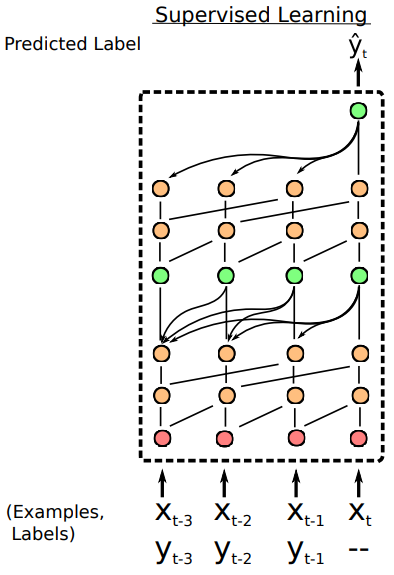
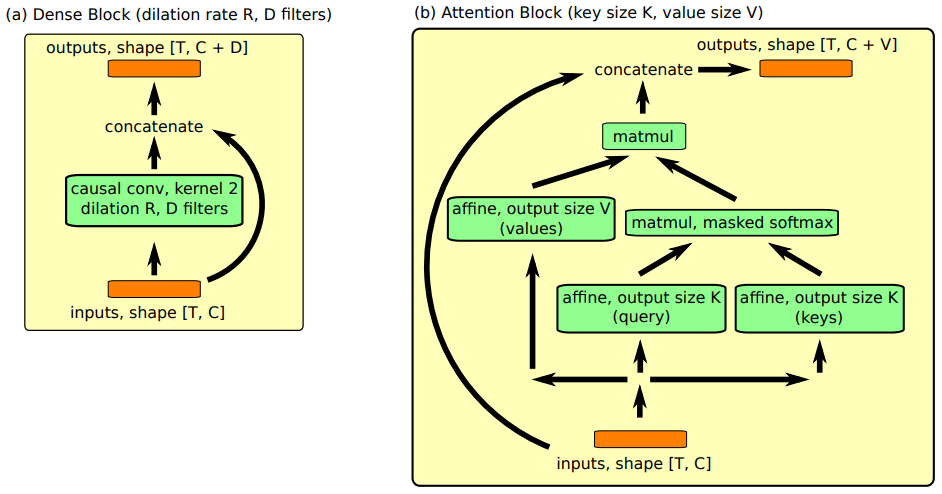

# Simple Neural Attentive Learner

元学习可以被定义为一种序列到序列的问题，
在现存的方法中，元学习器的瓶颈是如何去吸收同化利用过去的经验。
注意力机制可以允许在历史中精准摘取某段具体的信息。

Simple Neural Attentive Learner (SNAIL) 
组合时序卷积和 soft-attention，
前者从过去的经验整合信息，后者精确查找到某些特殊的信息。

## 1 Preliminaries

### 1.1 时序卷积和 soft-attention

**时序卷积 (TCN)** 是有因果前后关系的，即在下一时间步生成的值仅仅受之前的时间步影响。
TCN 可以提供更直接，高带宽的传递信息的方法，这允许它们基于一个固定大小的时序内容进行更复杂的计算。
但是，随着序列长度的增加，卷积膨胀的尺度会随之指数增加，需要的层数也会随之对数增加。
因此这种方法对于之前输入的访问更粗略，且他们的有限的能力和位置依赖并不适合元学习器，
因为元学习器应该能够利用增长数量的经验，而不是随着经验的增加，性能会被受限。

**soft-attention** 可以实现从超长的序列内容中获取准确的特殊信息。
它将上下文作为一种无序的关键值存储，这样就可以基于每个元素的内容进行查询。
但是，位置依赖的缺乏（因为是无序的）也是一个缺点。

**TCN 和 soft-attention 可以实现功能互补:**
前者提供高带宽的方法，代价是受限于上下文的大小，后者可以基于不确定的可能无限大的上下文提供精准的提取。
因此，SNAIL 的构建使用二者的组合：使用时序卷积去处理用注意力机制提取过的内容。
通过整合 TCN 和 attention，SNAIL 可以基于它过去的经验产出高带宽的处理方法且不再有经验数量的限制。
通过在多个阶段使用注意力机制，端到端训练的 SNAIL 可以学习从收集到的信息中如何摘取自己需要的信息并学习一个恰当的表示。

### 1.2 Meta-Learning

在元学习中每个任务 $\mathcal{T}_{i}$ 都是独立的，
其输入为 $x_{t}$ ，输出为 $a_{t}$ ，损失函数是 $\mathcal{L}_{i}\left(x_{t}, a_{t}\right)$ ，
一个转移分布 $P_{i}\left(x_{t} \mid x_{t-1}, a_{t-1}\right)$ ，和一个输出长度 $H_i$ 。
一个元学习器（由 $\theta$ 参数化）建模分布：

$$
\pi\left(a_{t} \mid x_{1}, \ldots, x_{t} ; \theta\right)
$$

给定一个任务的分布 $\mathcal{T}=P\left(\mathcal{T}_{i}\right)$ ，
元学习器的目标是最小化它的期待损失：

$$
\begin{aligned}
&\min _{\theta} \mathbb{E}_{\mathcal{T}_{i} \sim \mathcal{T}}\left[\sum_{t=0}^{H_{i}} \mathcal{L}_{i}\left(x_{t}, a_{t}\right)\right] \\
&\text { where } x_{t} \sim P_{i}\left(x_{t} \mid x_{t-1}, a_{t-1}\right), a_{t} \sim \pi\left(a_{t} \mid x_{1}, \ldots, x_{t} ; \theta\right)
\end{aligned}
$$

元学习器被训练去针对从 $\mathcal{T}$ 中抽样出来的任务 (或一个 mini-batches 的任务) 优化这个期望损失。
在测试阶段，元学习器在新任务分布 $\widetilde{\mathcal{T}}=P\left(\widetilde{\mathcal{T}}_{i}\right)$ 上被评估。

## 2 SNAIL

### 2.1 SNAIL 基础结构

两个时序卷积层（橙色）和一个因果关系层（绿色）的组合是 SNAIL 的基础结构，
如图1所示。
在监督学习设置中，
SNAIL 接收标注样本 $\left(x_{1}, y_{1}\right), \ldots,\left(x_{t-1}, y_{t-1}\right)$ 和末标注的 $\left(x_{t},-\right)$，
然后基于标注样本对 $y_{t}$ 进行预测。

图1	SNAIL 基础结构示意图。

### 2.2 Modular Building Blocks

对于构建 SNAIL 使用了两个主要模块：
Dense Block 和 Attention Block。

图1	SNAIL 中的 Dense Block 和 Attention Block。(a) Dense Block 应用因果一维卷积，然后将输出连接到输入。TC Block 应用一系列膨胀率呈指数增长的 Dense Block。(b) Attention Block 执行(因果)键值查找，并将输出连接到输入。

**Densen Block** 
用了一个简单的因果一维卷积（空洞卷积），
其中膨胀率 (dilation)为 $R$ 和卷积核数量 $D$ （[1] 对于所有的实验中设置卷积核的大小为2)，
最后合并结果和输入。
在计算结果的时候使用了一个门激活函数。
具体算法如下:

> 1. **function** DENSENBLOCK (inuts, dilation rate $R$, number of filers $D$):
>       1. xf, xg = CausalConv (inputs, $R$, $D$), CausalConv (inputs, $R$, $D$)
>       2. activations = tanh (xf) * sigmoid (xg)
>       3. **return** concat (inputs, activations)

**TC Block**
由一系列 dense block 组成，这些 dense block 的膨胀率$R$ 呈指数级增长，直到它们的接受域超过所需的序列长度。具体代码实现时，对序列是需要填充的为了保持序列长度不变。具体算法如下：

> 1. **function** TCBLOCK (inuts, sequence length $T$, number of filers $D$):
>       1. for i in $1, \ldots, \left[log_2T\right]$ do
>               1. inputs = DenseBlock (inputs, $2^i$, $D$)
>       2. **return** inputs

**Attention Block**
[1] 中设计成 soft-attention 机制，
公式为：

$$
\mathrm{ Attention }(Q, K, V)=\mathrm{softmax}\left(\frac{Q K^{T}}{\sqrt{d_{k}}}\right) V
$$

> 1. **function** ATTENTIONBLOCK (inuts, key size  $K$, value size $V$):
>       1. keys, query = affine (inputs, $K$), affine (inputs, $K$)
>       2. logits = matmul (query, transpose (keys))
>       3. probs = CausallyMaskedSoftmax ($\mathrm{logits} / \sqrt{K}$)
>       4. values = affine (inputs, $V$)
>       5. read = matmul (probs, values)
>       6. **return** concat (inputs, read)

## 3 SNAIL 分类结果

表1	SNAIL 在 Omniglot 上的分类结果。

| Method | 5-way 1-shot | 5-way 5-shot | 20-way 1-shot | 20-way 5-shot |  
| :----: | :----: | :----: | :----: | :----: |
| Santoro et al. (2016) | 82.8 $\%$ | 94.9 $\%$ | -- | -- |
| Koch (2015) | 97.3 $\%$ | 98.4 $\%$ | 88.2 $\%$ | 97.0 $\%$ |
| Vinyals et al. (2016) | 98.1 $\%$ | 98.9 $\%$ | 93.8 $\%$ | 98.5 $\%$ |
| Finn et al. (2017) | **98.7 $\pm$ 0.4** $\%$ | **99.9 $\pm$ 0.3** $\%$ | 95.8 $\pm$ 0.3 $\%$ | 98.9 $\pm$ 0.2 $\%$ |
| Snell et al. (2017) | 97.4 $\%$ | 99.3 $\%$ | 96.0 $\%$ | 98.9 $\%$ |
| Munkhdalai $\&$ Yu (2017) | 98.9 $\%$ | -- | 97.0 $\%$ | -- |
| SNAIL | **99.07 $\pm$ 0.16** $\%$ | **99.78 $\pm$ 0.09** $\%$ | **97.64 $\pm$ 0.30** $\%$ | **99.36 $\pm$ 0.18** $\%$ |

表1	SNAIL 在 miniImageNet 上的分类结果。

| Method | 5-way 1-shot | 5-way 5-shot |
| :----: | :----: | :----: |
| Vinyals et al. (2016) | 43.6 $\%$ | 55.3 $\%$ |
| Finn et al. (2017) | 48.7 $\pm$ 1.84 $\%$ | 63.1 $\pm$ 0.92 $\%$ |
| Ravi $\&$ Larochelle (2017) | 43.4 $\pm$ 0.77 $\%$ | 60.2 $\pm$ 0.71 $\%$ |
| Snell et al. (2017) | 46.61 $\pm$ 0.78 $\%$ | 65.77 $\pm$ 0.70 $\%$ |
| Munkhdalai $\&$ Yu (2017) | 49.21 $\pm$ 0.96 $\%$ | -- |
| SNAIL | **55.71 $\pm$ 0.99** $\%$ | **68.88 $\pm$ 0.92** $\%$ |

## 参考文献
[1] [A Simple Neural Attentive Meta-Learner](https://openreview.net/forum?id=B1DmUzWAW)