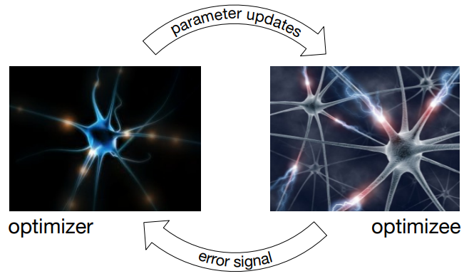
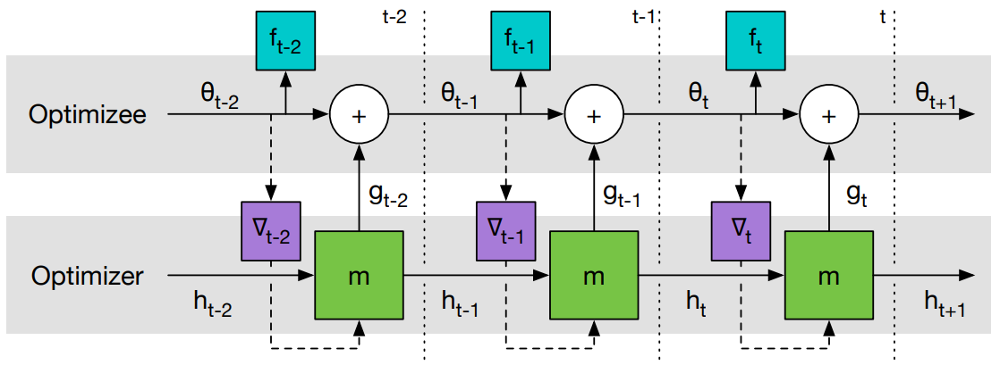
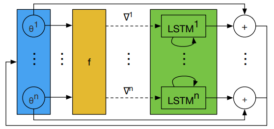

# Learning to Learn

Learning to Learn by Gradient Descent by Gradient Descent 
提出了一种全新的优化策略，
用 LSTM 替代传统优化方法学习一个针对特定任务的优化器。

## 1 问题提出

在机器学习中，通常把优化目标 $f(\theta)$ 表示成

$$
\theta^{*}=\operatorname{argmin}_{\theta \in \Theta} f(\theta)
$$

其中，参数 $\theta$ 的优化方式为

$$
\theta_{t+1}=\theta_{t}-\alpha \nabla f\left(\theta_{t}\right)
$$

上式是一种针对特定问题类别的、人为设定的更新规则，
常见于深度学习中，主要解决高维、非凸优化问题。

根据 No Free Lunch Theorems for Optimization 理论，
[1] 提出了一种 **基于学习的更新策略** 代替 **人为设定的更新策略**，
即，用一个可学习的梯度更新规则，替代人为设计的梯度更新规则。
其中，
optimizer 为 $g$ 由 $\phi$ 参数化；
optimizee 为 $f$ 由 $\theta$ 参数化。

此时， optimizee 的参数更新方式为

$$
\theta_{t+1}=\theta_{t}+g_{t}\left(\nabla f\left(\theta_{t}\right), \phi\right)
$$

optimizer $g$ 的更新则由 $f$, $\nabla f$ 及 $\phi$ 决定。

## 2 Learning to Learn

### 2.1 学习机制

图1是 Learning to Learn 中 optimizer 和 optimizee 的工作原理。

图1	Learning to Learn 中 optimizer 和 optimizee 工作原理。
optimizer 为 optimizee 提供更新策略，
optimizee 将损失信息反馈给 optimizer，协助 optimizer 更新。

给定目标函数 $f$ 的分布，那么经过 $T$ 次优化的 optimizer 的损失定义为整个优化过程损失的加权和：

$$
\mathcal{L}(\phi)=\mathbb{E}_{f}\left[\sum_{t=1}^{T} \omega_{t} f\left(\theta_{t}\right)\right]
$$

其中，

$$
\begin{aligned}
& \theta_{t+1}=\theta_{t}+g_{t} \\
& {\left[g_{t}, h_{t+1}\right]=\operatorname{LSTM}\left(\nabla_{t}, h_{t}, \phi\right)}
\end{aligned}
$$

$\omega_{t} \in \mathbb{R}_{\geq 0}$ 是各个优化时刻的任意权重，
$\nabla_{t}=\nabla_{\theta} f\left(\theta_{t}\right)$ 。

图2是 Learning to Learn 计算图。

图1	Learning to Learn 计算图。
梯度只沿实线传递，不沿虚线传递（因为 optimizee 的梯度不依赖于 optimizer 的参数，即
$\partial \nabla_{t} / \partial \phi = 0$ ），这样可以避免计算 $f$ 的二阶导。

[1] 中 optimizer 选用了 LSTM 。
从 LSTM 优化器的设计来看，
几乎没有加入任何先验的人为经验。
优化器本身的参数 $\phi$ 即 LSTM 的参数，
这个优化器的参数代表了更新策略。

### 2.2 Coordinatewise LSTM optimizer

LSTM 需要优化的参数相对较多。
因此，[1] 设计了一个优化器 $m$，它可以对目标函数的每个参数分量进行操作。
具体而言，每次只对 optimizee 的一个参数分量 $\theta_{i}$ 进行优化，
这样只需要维持一个很小的 optimizer 就可以完成工作。

对于每个参数分量 $\theta_{i}$ ，
optimizer 的参数 $\phi$ 共享，隐层状态 $h_{i}$ 不共享。
由于每个维度上的 optimizer 输入的 $h_{i}$ 和 $\nabla f\left(\theta_{i}\right)$ 是不同的，
所以即使它们的 $\phi$ 相同，它们的输出也不一样。

这样设计的 LSTM 变相实现了优化与维度无关，
这与 RMSprop 和 ADAM 的优化方式类似（为每个维度的参数施行同样的梯度更新规则）。

图3是 LSTM 优化器的一步更新过程。

图3	LSTM 优化器的一步更新过程。所有 LSTM 的 $\phi$ 共享，$h_{i}$ 不共享。

### 2.3 预处理和后处理

由于 optimizer 的输入是梯度，梯度的幅值变化相对较大，
而神经网络一般只对小范围的输入输出鲁棒，因此在实践中需要对 LSTM 的输入输出进行处理。
[1] 采用如下的方式：

$$
\nabla^{k} \rightarrow \begin{cases}\left(\frac{\log (|\nabla|)}{p}, \operatorname{sgn}(\nabla)\right) & \text { if }|\nabla| \geq e^{-p} \\ \left(-1, e^{p} \nabla\right) & \text { otherwise }\end{cases}
$$

其中， $p>0$ 为任意一个参数（[1] 取 $p=10$），用来裁剪梯度。
如果第一个参数的取值大于 $-1$ ，
那么它就代表梯度的 $\log$ ，第二个参数则是它的符号。 
如果第一个参数的取值等于 $-1$ ，
那么它将作为一个标记指引神经网络寻找第二个参数，此时第二个参数就是对梯度的缩放。

## 参考文献

[1] [Learning to Learn by Gradient Descent by Gradient Descent](https://proceedings.neurips.cc/paper/2016/hash/fb87582825f9d28a8d42c5e5e5e8b23d-Abstract.html)