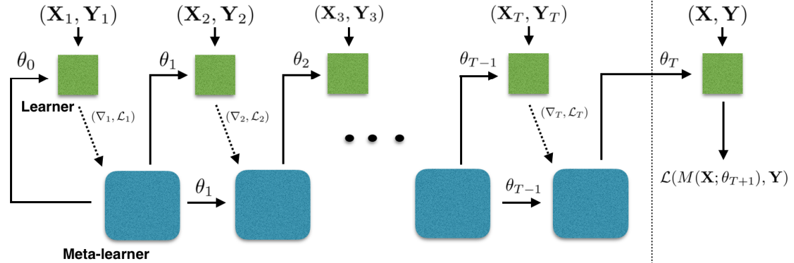

# Meta-Learner LSTM

元学习在处理 few-shot 问题时的学习机制如下：

- 基学习器在元学习器的引导下处理特定任务，发现任务特性；

- 元学习器总结所有任务共性。

基于小样本的梯度下降存在以下问题：

- 小样本意味着梯度下降的次数有限，在非凸的情况下，得到的模型必然性能很差；

- 对于每个单独的数据集，神经网络每次都是随机初始化，若干次迭代后也很难收敛到最佳性能。

因此，元学习可以为基于小样本的梯度下降提供一种提高模型泛化性能的策略。
Meta-Learner LSTM 使用单元状态表示 Learner 参数的更新。
训练 Meta-Learner 既能发现一个良好的 Learner 初始化参数，
又能将 Learner 的参数更新到一个给定的小训练集，以完成一些新任务。

## 1 Meta-Learner LSTM

### 1.1 梯度下降更新规则和 LSTM 单元状态更新规则的等价性

**一般的梯度下降更新规则**

$$
\theta_{t}=\theta_{t-1}-\alpha_{t} \nabla_{\theta_{t-1}} L_{t}
$$

其中，$\theta_{t}$ 是第 $t$ 次迭代更新时的参数值，$\alpha_{t}$ 是第 $t$ 次迭代更新时的学习率，$\nabla_{\theta_{t-1}} L_{t}$ 是损失函数在 $\theta_{t-1}$ 处的梯度值。

**LSTM 单元状态更新规则**

$$
c_{t}=f_{t} \cdot c_{t-1}+i_{t} \cdot \tilde{c}_{t}
$$

其中，$c_{t}$ 是 $t$ 时刻的细胞状态，$f_{t}\in[0,1]$ 是遗忘门，$i_{t}\in[0, 1]$ 是输入门。

当 $f_{t}=1,\ c_{t-1}=\theta_{t-1},\ i_{t}=\alpha_{t},\ \tilde{c}_{t}=-\nabla_{\theta_{t-1}} L_{t}$ 时，$\mathrm{Eq.\ (1)=Eq.\ (2)}$ 。

经过这样的替换，利用 LSTM 的状态更新替换学习器参数 $\theta$。

### 1.2 Meta-Learner LSTM 设计思路

Meta-Learner 的目标是学习 LSTM 的更新规则，并将其应用于更新 Learner 的参数上。

(1) 输入门

$$
\begin{align}
i_{t}=\sigma\left({W}_{I} \cdot\left[\nabla_{\theta_{t-1}} L_{t}, L_{t}, {\theta}_{t-1}, i_{t-1}\right]+{b}_{I}\right)
\end{align}
$$

其中，$W$ 是权重矩阵；$b$ 是偏差向量；$\sigma$ 是 Sigmoid 函数；
$\nabla_{\theta_{t-1}} L_{t}$ 和 $L_{t}$ 由 Learner 输入 Meta-Learner。

对于输入门参数 $i_t$ ，它的作用相当于学习率 $\alpha$ ，
在此学习率是一个关于 $\nabla_{\theta_{t-1}} L_{t}$ ， $L_{t}$ ，${\theta}_{t-1}$ ，$i_{t-1}$ 的函数。

(2) 遗忘门

$$
\begin{align}
f_{t}=\sigma\left(W_{F} \cdot\left[\nabla_{\theta_{t-1}} L_{t}, L_{t}, \theta_{t-1}, f_{t-1}\right]+b_{F}\right)
\end{align}
$$

对于遗忘门参数 $f_t$ ，它代表着 $\theta_{t-1}$ 所占的权重，这里将其固定为 1 ，但 1 不一定是它的最优值。

(3) 将学习单元初始状态 $c_0$ 视为 Meta-Learner 的一个参数，
正对应于 learner 的参数初始值。
这样当来一个新任务时， Meta-Learner 能给出一个较好的初始化值，从而进行快速学习。

(4) 参数共享

为了避免 Meta-Learner 发生参数爆炸，在 Learner 梯度的每一个 coordinate 上进行参数共享。
每一个 coordinate 都有自己的单元状态，但是所有 coordinate 在 LSTM 上的参数都是一样的。
每一个 coordinate 就相当于 Learner 中的每一层，
即对于相同一层的参数 $\theta_i$ ，
它们的更新规则是一样的，即 $W_I$ ， $b_I$ ， $W_I$ ， $b_I$ 是相同的。

## 2 Meta-Learner LSTM 单元状态更新过程

将 LSTM 单元状态更新过程作为随机梯度下降法的近似，实现 Meta-Learner 对 Leraner 参数更新的指导。

(1) 候选单元状态：$\tilde{c}_{t}=-\nabla_{\theta_{t-1}} L_{t}$，是 Meta-Learner 从 Leraner 得到的损失函数梯度值，直接输入 Meta-Learner ，作为 $t$ 时刻的候选单元状态。

(2) 上一时刻的单元状态：$c_{t-1}=\theta_{t-1}$，是 Learner 用第 $t-1$ 个批次训练数据更新后的参数。每个批次的数据训练完后，Leraner 将损失函数值和损失函数梯度值输入 Meta-Learner，Meta-Learner 更新一次参数，将更新后的参数回馈给 Leraner，Leraner 继续处理下一个批次的训练数据。

(3) 更新的单元状态：$c_{t}=\theta_{t}$，是 Learner 用第 $t$ 个批次训练数据更新后的参数。

(4) 输出门：不考虑。

(5) 初始单元状态：$c_{0}=\theta$，是 Learner 最早的参数初始值。LSTM 模型需要找到最好的初始细胞状态，使得每轮更新后的参数初始值更好地反映任务的共性，在 Learner 上只需要少量更新，就可以达到不错的精度。

## 3 Meta-Learner LSTM 算法流程

Meta-Learner LSTM 前向传递计算如图1所示，其中，
基学习器 $\mathrm{M}$，包含可训练参数 $\theta$；元学习器 $R$，包含可训练参数 $\Theta$。

图1	Meta-Learner LSTM 前向传递计算图。
Learner 计算损失函数值和损失函数梯度值，
Meta-Learner 使用 Learner 提供的信息，更新 Learner 中的参数和自身参数。
在任务中，每个批次的训练数据处理完成后，Meta-Learner 为 Learner 更新一次参数，
任务中所有批次的训练数据处理完成后，Meta-Learner 进行一次更新。

**Meta-Learner LSTM 算法流程**

> 1. $\Theta_{0}$ $\leftarrow$ random initialization 
>
> 2. for $d=1,...,n$ do: 
>       1. $D_{\mathrm{train}}$, $D_{\mathrm{test}}$ $\leftarrow$ random dataset from ${D}_{\mathrm{meta-train}}$ 
>       2. intialize learner parameters: $\theta_{0} \leftarrow c_{0}$ 
>
>       3. for $t=1,...,T$ do:
>           1. $\mathbf{X}_{t}$, $\mathbf{Y}_{t}$ $\leftarrow$ random batch from $D_{\mathrm{train}}$ 
>           2. get loss of learner on train batch: $\mathcal{L}_{t} \leftarrow \mathcal{L}\left(M\left(\mathbf{X}_{t} ; \theta_{t-1}\right), \mathbf{Y}_{t}\right)$ 
>           3. get output of meta-learner using Eq. (2): $c_{t} \leftarrow R\left(\left(\nabla_{\theta_{t-1}} \mathcal{L}_{t}, \mathcal{L}_{t}\right) ; \Theta_{d-1}\right)$ 
>           4. update learner parameters: $\theta_{t} \leftarrow c_{t}$ 
>       4. end for 
>
>       5. $\mathbf{X}, \mathbf{Y} \leftarrow D_{\mathrm{test}}$ 
>       6. get loss of learner on test batch: ${L}_\mathrm{test} \leftarrow {L}\left(M\left(\mathbf{X} ; \theta_{T}\right), \mathbf{Y}\right)$ 
>       7. update $\Theta_{d}$ using $\nabla_{\Theta_{d-1}} {L}_{\mathrm{test}}$ 
> 3. end for

- 对于第 $d$ 个任务，在训练集中随机抽取 $T$ 个批次的数据，记为 $\left(\boldsymbol{X}_{1}, \boldsymbol{Y}_{1}\right), \cdots, \left(\boldsymbol{X}_{T}, \boldsymbol{Y}_{T}\right)$。

- 对于第 $t$ 个批次的数据 $\left(\boldsymbol{X}_{t}, \boldsymbol{Y}_{t}\right)$，计算 learner 的损失函数值 $L_{t}=L\left[M\left(X_{t}; \theta_{t-1}\right), Y_{t}\right]$ 和损失函数梯度值 $\nabla_{\theta_{t-1}} L_{t}$，将损失函数和损失函数梯度输入 meta-learner ，更新细胞状态：${c}_{t}=\boldsymbol{R}\left[\left(\nabla_{\theta_{t-1}} L_{t}, L_{t}\right); \Theta_{d-1}\right]$，更新的参数值等于更新的细胞状态 $\theta_{t}=c_{t}$。

- 处理完第 $d$ 个任务中所有 $T$ 个批次的训练数据后，使用第 $d$ 个任务的验证集 $(X, Y)$, 计算验证集上的损失函数值 $L_{\mathrm{test}}=L\left[M\left(X; \theta_{T}\right), Y\right]$ 和损失函数梯度值 $\nabla_{\theta_{d-1}} L_{\mathrm{test}}$ ，更新 meta-learner 参数 $\boldsymbol{\Theta}_{d}$ 。

## 4 Meta-Learner LSTM 模型结构

Meta-Learner LSTM 是一个两层的 LSTM 网络，第一层是正常的 LSTM 模型，第二层是近似随机梯度的 LSTM 模型。
所有的损失函数值和损失函数梯度值经过预处理，输入第一层 LSTM 中，
计算学习率和遗忘门等参数，损失函数梯度值还要输入第二层 LSTM 中用于参数更新。

## 5 Meta-Learner LSTM 和 MAML 的区别

- 在 MAML 中，元学习器给基学习器提供参数初始值，基学习器给元学习器提供损失函数值；
在 Meta-Learner LSTM 中，元学习器给基学习器提供更新的参数，基学习器给元学习器提供每个批次数据上的损失函数值和损失函数梯度值。

- 在 MAML 中，基学习器的参数更新在基学习器中进行，元学习器的参数更新在元学习器中进行；
在 Meta-Learner LSTM 中，基学习器和元学习器的参数更新都在元学习器中进行。

- 在 MAML 中，元学习器使用 SGD 更新参数初始值，使得损失函数中存在高阶导数；
在 Meta-Learner LSTM 中，元学习器给基学习器提供修改的 LSTM 更新参数，元学习器自身的参数并不是基学习器中的参数初始值，元学习器自身的参数使用 SGD 进行更新，并不会出现损失函数高阶导数的计算。

- 在 MAML 中，元学习器和基学习器只在每个任务训练完成后才进行信息交流； 
在 Meta-Learner LSTM 中，元学习器和基学习器在每个任务的每个批次训练数据完成后就进行信息交流。

- MAML 适用于任意模型结构；
Meta-Learner LSTM 中的元学习器只能是 LSTM 结构，基学习器可以适用于任意模型结构。

## 6 Meta-Learner LSTM 分类结果

表1	Meta-Learner LSTM 在 miniImageNet 上的分类结果。

| Method | 5-way 1-shot | 5-way 5-shot |
| :----: | :----: | :----: |
| Baseline-finetune  | 28.86 $\pm$ 0.54 $\%$ | 49.79 $\pm$ 0.79 $\%$ |
| Baseline-nearest-neighbor | 41.08 $\pm$ 0.70 $\%$ | 51.04 $\pm$ 0.65 $\%$ |
| Matching Network | **43.40 $\pm$ 0.78** $\%$ | 51.09 $\pm$ 0.71 $\%$ |
| Matching Network FCE | **43.56 $\pm$ 0.84** $\%$ | 55.31 $\pm$ 0.73 $\%$ |
| Meta-Learner LSTM | **43.44 $\pm$ 0.77** $\%$ | **60.60 $\pm$ 0.71** $\%$ |

## 参考文献

[1] [Optimization as a Model for Few-Shot Learning](https://openreview.net/forum?id=rJY0-Kcll)

[2] [长短时记忆网络 LSTM](https://paddlepedia.readthedocs.io/en/latest/tutorials/sequence_model/lstm.html)
