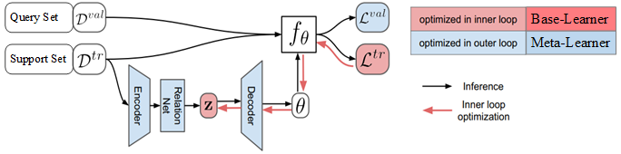
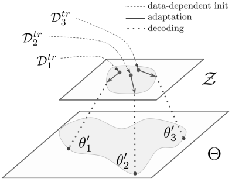

# Latent Embedding Optimization

Latent Embedding Optimization (LEO) 学习模型参数的低维潜在嵌入，并在这个低维潜在空间中执行基于优化的元学习，将基于梯度的自适应过程与模型参数的基础高维空间分离。

## 1 LEO

在元学习器中，使用 SGD 最小化任务验证集损失函数，
使得模型的泛化能力最大化，计算元参数，元学习器将元参数输入基础学习器，
继而，基础学习器最小化任务训练集损失函数，快速给出任务上的预测结果。
LEO 结构如图1所示。

图1	LEO 结构图。$D^{\mathrm{tr}}$ 是任务 $\varepsilon$ 的 support set，
$D^{\mathrm{val}}$ 是任务 $\varepsilon$ 的 query set，
$z$ 是通过编码器计算的 $N$ 个类别的类别特征，$f_{\theta}$ 是基学习器， 
$\theta$ 是基学习器参数， 
$L^{\mathrm{tr}}=f_{\theta}\left( D^{\mathrm{tr}}\right)$, $L^{\mathrm{val}}=f_{\theta}\left( D^{\mathrm{val}}\right)$。

LEO 包括基础学习器和元学习器，还包括编码器和解码器。
在基础学习器中，编码器将高维输入数据映射成特征向量，
解码器将输入数据的特征向量映射成输入数据属于各个类别的概率值，
基础学习器使用元学习器提供的元参数进行参数更新，给出数据标注的预测结果。
元学习器为基础学习器的编码器和解码器提供元参数，
元参数包括特征提取模型的参数、编码器的参数、解码器的参数等，
通过最小化所有任务上的泛化误差，更新元参数。

## 2 基础学习器

编码器和解码器都在基础学习器中，用于计算输入数据属于每个类别的概率值，
进而对输入数据进行分类。
元学习器提供编码器和解码器中的参数，基础学习器快速的使用编码器和解码器计算输入数据的分类。
任务训练完成后，基础学习器将每个类别数据的特征向量和任务 $\varepsilon$ 的基础学习器参数 $\boldsymbol{\theta}_{\varepsilon}$ 输入元学习器，
元学习器使用这些信息更新元参数。

### 2.1 编码器

编码器模型包括两个主要部分：编码器和关系网络。

**编码器** $g_{\phi_{e}}$ ，其中 $\phi_{e}$ 是编码器的可训练参数，
其功能是将第 $n$ 个类别的输入数据映射成第 $n$ 个类别的特征向量。

**关系网络** $g_{\phi_{r}}$ ，其中 $\phi_{r}$ 是关系网络的可训练参数，
其功能是计算特征之间的距离。

第 $n$ 个类别的输入数据的特征记为 $z_{n}$ 。
对于输入数据，首先，使用编码器 $g_{\phi_{e}}$ 对属于第 $n$ 个类别的输入数据进行特征提取；
然后，使用关系网络 $g_{\phi_r}$ 计算特征之间的距离，
综合考虑训练集中所有样本点之间的距离，计算这些距离的平均值和离散程度；
第 $n$ 个类别输入数据的特征 $z_{n}$ 服从高斯分布，
且高斯分布的期望是这些距离的平均值，高斯分布的方差是这些距离的离散程度，
具体的计算公式如下：

$$
\begin{aligned}
&\mu_{n}^{e}, \sigma_{n}^{e}=\frac{1}{N K^{2}} \sum_{k_{n}=1}^{K} \sum_{m=1}^{N} \sum_{k_{m}=1}^{K} g_{\phi_{r}}\left[g_{\phi_{e}}\left(x_{n}^{k_{n}}\right), g_{\phi_{e}}\left(x_{m}^{k_{m}}\right)\right] \\
&z_{n} \sim q\left(z_{n} \mid D_{n}^{\mathrm{tr}}\right)=N\left\{\mu_{n}^{e}, \operatorname{diag}\left(\sigma_{n}^{e}\right)^{2}\right\}
\end{aligned}
$$

其中，$N$ 是类别总数， $K$ 是每个类别的图片总数， 
${D}_{n}^{\mathrm{tr}}$ 是第 $n$ 个类别的训练数据集。
对于每个类别的输入数据，每个类别下有 $K$ 张图片，
计算这 $K$ 张图片和所有已知图片之间的距离。
总共有 $N$ 个类别，通过编码器的计算，形成所有类别的特征，
记为 $z=\left(z_{1}, \cdots, z_{N}\right)$。

### 2.2 解码器
解码器 $g_{\phi_{d}}$ ，其中 $\phi_{d}$ 是解码器的可训练参数，
其功能是将每个类别输入数据的特征向量 $z_{n}$ 
映射成属于每个类别的概率值 $\boldsymbol{w}_{n}$：

$$
\begin{aligned}
&\mu_{n}^{d}, \sigma_{n}^{d}=g_{\phi_{d}}\left(z_{n}\right) \\
&w_{n} \sim q\left(w \mid z_{n}\right)=N\left\{\mu_{n}^{d}, \operatorname{diag}\left(\sigma_{n}^{d}\right)^{2}\right\}
\end{aligned}
$$

其中，任务 $\varepsilon$ 的基础学习器参数记为 $\theta_{\varepsilon}$，
基础学习器参数由属于每个类别的概率值组成，
记为 $\theta_{\varepsilon}=\left(w_{1}, w_{2}, \cdots, w_{N}\right)$，
基础学习器参数 $\boldsymbol{w}_{n}$ 指的是输入数据属于第 $n$ 个类别的概率值，
$g_{\phi_{d}}$ 是从特征向量到基础学习器参数的映射。

图2	LEO 基础学习器工作原理图。

### 2.3  基础学习器更新过程
在基础学习器中，任务 $\varepsilon$ 的交叉熵损失函数是：

$$
L_{\varepsilon}^{\mathrm{tr}}\left(f_{\theta_{\varepsilon}}\right)=\sum_{(x, y) \in D_{\varepsilon}^{\mathrm{tr}}}\left[-w_{y} \boldsymbol{x}+\log \sum_{j=1}^{N} \mathrm{e}^{w_{j} x}\right]
$$

其中，$(x, y)$ 是任务 $\varepsilon$ 训练集 $D_{\varepsilon}^{\mathrm{tr}}$ 中的样本点，$f_{\theta_{\varepsilon}}$ 是任务 $\varepsilon$ 的基础学习器，
最小化任务 $\varepsilon$ 的损失函数更新任务专属参数 $\theta_{\varepsilon}$ 。
在解码器模型中，任务专属参数为 $w_{n} \sim q\left(w \mid z_{n}\right)$，
更新任务专属参数 $\theta_{\varepsilon}$ 意味着更新特征向量 $z_{n}$：

$$
z_{n}^{\prime}=z_{n}-\alpha \nabla_{z_{n}} L_{\varepsilon}^{t r}\left(f_{\theta_{\varepsilon}}\right),
$$

其中，$\boldsymbol{z}_{n}^{\prime}$ 是更新后的特征向量，
对应的是更新后的任务专属参数 $\boldsymbol{\theta}_{\varepsilon}^{\prime}$。
基础学习器使用 $\theta_{\varepsilon}^{\prime}$ 来预测任务验证集数据的标注，
将任务 $\varepsilon$ 的验证集 $\mathrm{D}_{\varepsilon}^{\mathrm{val}}$ 
损失函数 $L_{\varepsilon}^{\mathrm{val}}\left(f_{\theta_{\varepsilon}^{\prime}}\right)$ 、
更新后的特征向量 $z_{n}^{\prime}$、
更新后的任务专属参数 $\theta_{\varepsilon}^{\prime}$ 输入元学习器，
在元学习器中更新元参数。

## 3 元学习器更新过程
在元学习器中，最小化所有任务 $\varepsilon$ 的验证集的损失函数的求和，
最小化任务上的模型泛化误差：

$$
\min _{\phi_{e}, \phi_{r}, \phi_{d}} \sum_{\varepsilon}\left[L_{\varepsilon}^{\mathrm{val}}\left(f_{\theta_{\varepsilon}^{\prime}}\right)+\beta D_{\mathrm{KL}}\left\{q\left(z_{n} \mid {D}_{n}^{\mathrm{tr}}\right) \| p\left(z_{n}\right)\right\}+\gamma\left\|s\left(\boldsymbol{z}_{n}^{\prime}\right)-\boldsymbol{z}_{n}\right\|_{2}^{2}\right]+R
$$

其中， $L_{\varepsilon}^{\mathrm{val}}\left(f_{\theta_{\varepsilon}^{\prime}}\right)$ 是任务 $\varepsilon$ 验证集的损失函数，
衡量了基础学习器模型的泛化误差，损失函数越小，模型的泛化能力越好。 
$p\left(z_{n}\right)=N(0, I)$ 是高斯分布，$D_{\mathrm{KL}}\left\{q\left(z_{n} \mid {D}_{n}^{\mathrm{tr}}\right) \| p\left(z_{n}\right)\right\}$ 是近似后验分布 $q\left(z_{n} \mid D_{n}^{\text {tr }}\right)$ 与先验分布 $p\left(z_{n}\right)$ 之间的 KL 距离 (KL-Divergence)，
最小化 $\mathrm{KL}$ 距离可使后验分布 $q\left(z_{n} \mid {D}_{n}^{\text {tr}}\right)$ 的估计尽可能准确。
最小化距离 $\left\|s\left(z_{n}^{\prime}\right)-z_{n}\right\|$ 使得参数初始值 $z_{n}$ 和训练完成后的参数更新值 $z_{n}^{\prime}$ 距离最小，
使得参数初始值和参数最终值更接近。
$R$ 是正则项, 用于调控元参数的复杂程度，避免出现过拟合，正则项 $R$ 的计算公式如下：

$$
R=\lambda_{1}\left(\left\|\phi_{e}\right\|_{2}^{2}+\left\|\phi_{r}\right\|_{2}^{2}+\left\|\phi_{d}\right\|_{2}^{2}\right)+\lambda_{2}\left\|C_{d}-\mathbb{I}\right\|_{2}
$$

其中， $\left\|\phi_{r}\right\|_{2}^{2}$ 指的是调控元参数的个数和大小，
 ${C}_{d}$ 是参数 $\phi_{d}$ 的行和行之间的相关性矩阵，
 超参数 $\lambda_{1},\lambda_{2}>0$， 
 $\left\|C_{d}-\mathbb{I}\right\|_{2}$ 使得 $C_{d}$ 接近单位矩阵，
 使得参数 $\phi_{d}$ 的行和行之间的相关性不能太大，
 每个类别的特征向量之间的相关性不能太大，
 属于每个类别的概率值之间的相关性也不能太大，分类要尽量准确。

## 4 LEO 算法流程

**LEO 算法流程**
> 1. randomly initialize $\phi_{e}, \phi_{r}, \phi_{d}$
> 2. let $\phi=\left\{\phi_{e}, \phi_{r}, \phi_{d}, \alpha\right\}$
> 3. while not converged do:
>     1. for number of tasks in batch do:
>         1. sample task instance $\mathcal{T}_{i} \sim \mathcal{S}^{t r}$
>         2. let $\left(\mathcal{D}^{t r}, \mathcal{D}^{v a l}\right)=\mathcal{T}_{i}$
>         3. encode $\mathcal{D}^{t r}$ to z using $g_{\phi_{e}}$ and $g_{\phi_{r}}$
>         4. decode $\mathbf{z}$ to initial params $\theta_{i}$ using $g_{\phi_{d}}$ 
>         5. initialize $\mathbf{z}^{\prime}=\mathbf{z}, \theta_{i}^{\prime}=\theta_{i}$
>         6. for number of adaptation steps do:
>            1. compute training loss $\mathcal{L}_{\mathcal{T}_{i}}^{t r}\left(f_{\theta_{i}^{\prime}}\right)$
>            2. perform gradient step w.r.t. $\mathbf{z}^{\prime}$:
>            3. $\mathbf{z}^{\prime} \leftarrow \mathbf{z}^{\prime}-\alpha \nabla_{\mathbf{z}^{\prime}} \mathcal{L}_{\mathcal{T}_{i}}^{t r}\left(f_{\theta_{i}^{\prime}}\right)$
>            4. decode $\mathbf{z}^{\prime}$ to obtain $\theta_{i}^{\prime}$ using $g_{\phi_{d}}$ 
>          7. end for
>          8. compute validation loss $\mathcal{L}_{\mathcal{T}_{i}}^{v a l}\left(f_{\theta_{i}^{\prime}}\right)$ 
>      2. end for
>      3. perform gradient step w.r.t $\phi$：$\phi \leftarrow \phi-\eta \nabla_{\phi} \sum_{\mathcal{T}_{i}} \mathcal{L}_{\mathcal{T}_{i}}^{v a l}\left(f_{\theta_{i}^{\prime}}\right)$ 
> 4. end while

(1) 初始化元参数：编码器参数 $\phi_{e}$、关系网络参数 $\phi_{r}$、解码器参数 $\phi_{d}$, 
在元学习器中更新的元参数包括 $\phi=\left\{\phi_e, \phi_r,\phi_d \right\}$。

(2) 使用片段式训练模式，
随机抽取任务 $\varepsilon$, ${D}_{\varepsilon}^{\mathrm{tr}}$ 是任务 $\varepsilon$ 的训练集， 
${D}_{\varepsilon}^{\mathrm{val}}$ 是任务 $\varepsilon$ 的验证集。

(3) 使用编码器 $g_{\phi_{e}}$ 和关系网络 $g_{\phi_{r}}$ 将任务 $\varepsilon$ 的训练集 $D_{\varepsilon}^{\mathrm{tr}}$ 编码成特征向量 $z$，
使用 解码器 $g_{\phi_{d}}$ 从特征向量映射到任务 $\varepsilon$ 的基础学习器参数 ${\theta}_{\varepsilon}$，
基础学习器参数指的是输入数据属于每个类别的概率值向量；
计算任务 $\varepsilon$ 的训练集的损失函数 $L_{\varepsilon}^{\mathrm{tr}}\left(f_{\theta_{\varepsilon}}\right)$，
最小化任务 $\varepsilon$ 的损失函数，更新每个类别的特征向量：

$$
z_{n}^{\prime}=z_{n}-\alpha \nabla_{z_{n}} L_{\varepsilon}^{\mathrm{tr}}\left(f_{\theta_{\varepsilon}}\right)
$$

使用解码器 $g_{\phi_{d}}$ 从更新后的特征向量映射到更新后的任务 $\varepsilon$ 的基础学习器参数 ${\theta}_{\varepsilon}^{\prime}$；
计算任务 $\varepsilon$ 的验证集的损失函数 $L_{\varepsilon}^{\text {val}}\left(f_{\theta_{s}^{\prime}}\right)$；
基础学习器将更新后的参数和验证集损失函数值输入元学习器。

(4) 更新元参数, $\phi \leftarrow \phi-\eta \nabla_{\phi} \sum_{\varepsilon} L_{\varepsilon}^{\text {val}}\left(f_{\theta_{\varepsilon}^{\prime}}\right)$，
最小化所有任务 $\varepsilon$ 的验证集的损失和，
将更新后的元参数输人基础学习器，继续处理新的分类任务。

## 5 LEO 模型结构

LEO 是一种与模型无关的元学习，[1] 中给出的各部分模型结构及参数如表1所示。

表1	LEO 各部分模型结构及参数。

| Part of the model | Architecture | Hiddenlayer | Shape of the output |
| :----: | :----: | :----: | :----: |
| Inference model ($f_{\theta}$) | 3-layer MLP with ReLU | 40 | (12, 5, 1) |
| Encoder | 3-layer MLP with ReLU | 16 | (12, 5, 16) |
| Relation Network | 3-layer MLP with ReLU | 32 | (12, $2\times 16$) |
| Decoder | 3-layer MLP with ReLU | 32 | (12, $2\times 1761$) |

## 6 LEO 分类结果

表1	LEO 在 miniImageNet 上的分类结果。

| Model | 5-way 1-shot | 5-way 5-shot |
| :----: | :----: | :----: |
| Matching networks (Vinyals et al., 2016) | 43.56 $\pm$ 0.84 $\%$ |  55.31 $\pm$ 0.73 $\%$ |
| Meta-learner LSTM (Ravi & Larochelle, 2017) | 43.44 $\pm$ 0.77 $\%$ | 60.60 $\pm$ 0.71 $\%$ |
| MAML (Finn et al., 2017) | 48.70 $\pm$ 1.84 $\%$ |  63.11 $\pm$ 0.92 $\%$ |
| LLAMA (Grant et al., 2018) | 49.40 $\pm$ 1.83 $\%$ | -- |
| REPTILE (Nichol & Schulman, 2018) | 49.97 $\pm$ 0.32 $\%$ | 65.99 $\pm$ 0.58 $\%$ |
| PLATIPUS (Finn et al., 2018) | 50.13 $\pm$ 1.86 $\%$ | -- |
| Meta-SGD (our features) | 54.24 $\pm$ 0.03 $\%$ |  70.86 $\pm$ 0.04 $\%$ |
| SNAIL (Mishra et al., 2018) | 55.71 $\pm$ 0.99 $\%$ | 68.88 $\pm$ 0.92 $\%$ |
| (Gidaris & Komodakis, 2018) | 56.20 $\pm$ 0.86 $\%$ |  73.00 $\pm$ 0.64 $\%$ |
| (Bauer et al., 2017) | 56.30 $\pm$ 0.40 $\%$ | 73.90 $\pm$ 0.30 $\%$ |
| (Munkhdalai et al., 2017) | 57.10 $\pm$ 0.70 $\%$ |  70.04 $\pm$ 0.63 $\%$ |
| DEML+Meta-SGD (Zhou et al., 2018) | 58.49 $\pm$ 0.91 $\%$ | 71.28 $\pm$ 0.69 $\%$ |
| TADAM (Oreshkin et al., 2018)  | 58.50 $\pm$ 0.30 $\%$ | 76.70 $\pm$ 0.30 $\%$ |
| (Qiao et al., 2017) | 59.60 $\pm$ 0.41 $\%$ | 73.74 $\pm$ 0.19 $\%$ |
| LEO | **61.76 $\pm$ 0.08** $\%$ | **77.59 $\pm$ 0.12** $\%$ |

表1	LEO 在 tieredImageNet 上的分类结果。

| Model | 5-way 1-shot | 5-way 5-shot |
| :----: | :----: | :----: |
| MAML (deeper net, evaluated in Liu et al. (2018)) | 51.67 $\pm$ 1.81 $\%$ |  70.30 $\pm$ 0.08 $\%$ |
| Prototypical Nets (Ren et al., 2018) | 53.31 $\pm$ 0.89 $\%$ |  72.69 $\pm$ 0.74 $\%$ |
| Relation Net (evaluated in Liu et al. (2018)) | 54.48 $\pm$ 0.93 $\%$ | 71.32 $\pm$ 0.78 $\%$ |
| Transductive Prop. Nets (Liu et al., 2018) | 57.41 $\pm$ 0.94 $\%$ | 71.55 $\pm$ 0.74 $\%$ |
| Meta-SGD (our features) | 62.95 $\pm$ 0.03 $\%$ | 79.34 $\pm$ 0.06 $\%$ |
| LEO | **66.33 $\pm$ 0.05** $\%$ | **81.44 $\pm$ 0.09** $\%$ |

## 7 LEO 的优点

- 新任务的初始参数以训练数据为条件，这使得任务特定的适应起点成为可能。
通过将关系网络结合到编码器中，该初始化可以更好地考虑所有输入数据之间的联合关系。

- 通过在低维潜在空间中进行优化，该方法可以更有效地适应模型的行为。
此外，通过允许该过程是随机的，可以表达在少数数据状态中存在的不确定性和模糊性。

## 参考文献
[1] [Meta-Learning with Latent Embedding Optimization](https://openreview.net/forum?id=BJgklhAcK7)

