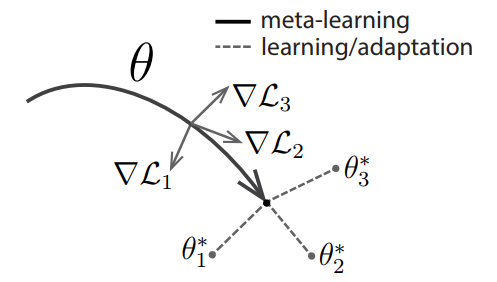

# Model-Agnostic Meta-Learning

Model-Agnostic Meta-Learning (MAML)： 
与模型无关的元学习，可兼容于任何一种采用梯度下降算法的模型。
MAML 通过少量的数据寻找一个合适的初始值范围，从而改变梯度下降的方向，
找到对任务更加敏感的初始参数，
使得模型能够在有限的数据集上快速拟合，并获得一个不错的效果。
该方法可以用于回归、分类以及强化学习。

该模型的Paddle实现请参考链接：[PaddleRec版本](https://github.com/PaddlePaddle/PaddleRec/tree/master/models/multitask/maml)

该模型的Paddle实现请参考链接：[PaddleRec版本](https://github.com/PaddlePaddle/PaddleRec/tree/master/models/multitask/maml)

## 1 MAML 

MAML 是典型的双层优化结构，其内层和外层的优化方式如下：

### 1.1 MAML 内层优化方式

内层优化涉及到基学习器，从任务分布 $p(T)$ 中随机采样第 $i$ 个任务 $T_{i}$。任务 $T_{i}$ 上，基学习器的目标函数是：

$$ 
\min _{\phi} L_{T_{i}}\left(f_{\phi}\right) 
$$

其中，$f_{\phi}$ 是基学习器，$\phi$ 是基学习器参数，$L_{T_{i}}\left(f_{\phi}\right)$ 是基学习器在 $T_{i}$ 上的损失。更新基学习器参数：

$$
\theta_{i}^{N}=\theta_{i}^{N-1}-\alpha\left[\nabla_{\phi}
L_{T_{i}}\left(f_{\phi}\right)\right]_{\phi=\theta_{i}^{N-1}} 
$$

其中，$\theta$ 是元学习器提供给基学习器的参数初始值 $\phi=\theta$，在任务 $T_{i}$ 上更新 $N$ 后 $\phi=\theta_{i}^{N-1}$.

### 1.2 MAML 外层优化方式

外层优化涉及到元学习器，将 $\theta_{i}^{N}$ 反馈给元学匀器，此时元目标函数是：

$$ 
\min _{\theta} \sum_{T_{i}\sim p(T)} L_{T_{i}}\left(f_{\theta_{i}^{N}}\right) 
$$

元目标函数是所有任务上验证集损失和。更新元学习器参数：

$$
\theta \leftarrow \theta-\beta \sum_{T_{i} \sim p(T)} \nabla_{\theta}\left[L_{T_{i}}\left(f_{\phi}\right)\right]_{\phi=\theta_{i}^{N}} 
$$

## 2 MAML 算法流程

>1. randomly initialize $\theta$
>2. while not done do:
>   1. sample batch of tasks $T_i \sim p(T)$
>   2. for all $T_i$ do：
>       1. evaluate $\nabla_{\phi}L_{T_{i}}\left(f_{\phi}\right)$ with respect to K examples
>       2. compute adapted parameters with gradient descent: $\theta_{i}^{N}=\theta_{i}^{N-1}   -\alpha\left[\nabla_{\phi}L_{T_{i}}\left(f_{\phi}\right)\right]_{\phi=\theta_{i}^{N-1}} $
>   3. end for
>   4. update $\theta \leftarrow \theta-\beta \sum_{T_{i} \sim p(T)} \nabla_{\theta}\left[L_{T_{i}}\left(f_{\phi}\right)\right]_{\phi=\theta_{i}^{N}} $
>3. end while

MAML 中执行了两次梯度下降 (gradient by gradient)，分别作用在基学习器和元学习器上。图1给出了 MAML 中特定任务参数 $\theta_{i}^{*}$ 和元级参数 $\theta$ 的更新过程。

图1	MAML 示意图。灰色线表示特定任务所产生的梯度值（方向）；黑色线表示元级参数选择更新的方向（黑色线方向是几个特定任务产生方向的平均值）；虚线代表快速适应，不同的方向代表不同任务更新的方向。

## 3 MAML 模型结构

MAML 是一种与模型无关的元学习方法，可以适用于任何基于梯度优化的模型结构。

基准模型：4 modules with a 3  $\times$ 3 convolutions and 64 filters, 
followed by batch normalization, 
a ReLU nonlinearity, 
and 2 $\times$ 2 max-pooling。

## 4 MAML 分类结果

表1	MAML 在 Omniglot 上的分类结果。

| Method | 5-way 1-shot | 5-way 5-shot | 20-way 1-shot | 20-way 5-shot |  
| :----: | :----: | :----: | :----: | :----: |
| MANN, no conv (Santoro et al., 2016) | 82.8 $\%$ | 94.9 $\%$ | -- | -- |
| MAML, no conv | **89.7 $\pm$ 1.1** $\%$ | 97.5 $\pm$ 0.6 $\%$ | -- | -- |
| Siamese nets (Koch, 2015) | 97.3 $\%$ | 98.4 $\%$ | 88.2 $\%$ | 97.0 $\%$ |
| matching nets (Vinyals et al., 2016) | 98.1 $\%$ | 98.9 $\%$ | 93.8 $\%$ | 98.5 $\%$ |
| neural statistician (Edwards & Storkey, 2017) | 98.1 $\%$ | 99.5 $\%$ | 93.2 $\%$ | 98.1 $\%$ |
| memory mod. (Kaiser et al., 2017) | 98.4 $\%$ | 99.6 $\%$ | 95.0 $\%$ | 98.6 $\%$ |
| MAML | **98.7 $\pm$ 0.4** $\%$ | **99.9 $\pm$ 0.1** $\%$ | **95.8 $\pm$ 0.3** $\%$ | **98.9 $\pm$ 0.2** $\%$ |

表1	MAML 在 miniImageNet 上的分类结果。

| Method | 5-way 1-shot | 5-way 5-shot |
| :----: | :----: | :----: |
| fine-tuning baseline | 28.86 $\pm$ 0.54 $\%$ | 49.79 $\pm$ 0.79 $\%$ |
| nearest neighbor baseline | 41.08 $\pm$ 0.70 $\%$ | 51.04 $\pm$ 0.65 $\%$ |
| matching nets (Vinyals et al., 2016) | 43.56 $\pm$ 0.84 $\%$ | 55.31 $\pm$ 0.73 $\%$ |
| meta-learner LSTM (Ravi & Larochelle, 2017) | 43.44 $\pm$ 0.77 $\%$ | 60.60 $\pm$ 0.71 $\%$ |
| MAML, first order approx. | **48.07 $\pm$ 1.75** $\%$ | **63.15 $\pm$ 0.91** $\%$ |
| MAML | **48.70 $\pm$ 1.84** $\%$ | **63.11 $\pm$ 0.92** $\%$ |

## 5 MAML 的优缺点

**优点**

- 适用于任何基于梯度优化的模型结构。

- 双层优化结构，提升模型精度和泛化能力，避免过拟合。

**缺点**

- 存在二阶导数计算

## 6 对 MAML 的探讨

- 每个任务上的基学习器必须是一样的，对于差别很大的任务，最切合任务的基学习器可能会变化，那么就不能用 MAML 来解决这类问题。

- MAML 适用于所有基于随机梯度算法求解的基学习器，这意味着参数都是连续的，无法考虑离散的参数。对于差别较大的任务，往往需要更新网络结构。使用 MAML 无法完成这样的结构更新。

- MAML 使用的损失函数都是可求导的，这样才能使用随机梯度算法来快速优化求解，损失函数中不能有不可求导的奇异点，否则会导致优化求解不稳定。

- MAML 中考虑的新任务都是相似的任务，所以没有对任务进行分类，也没有计算任务之间的距离度量。对每一类任务单独更新其参数初始值，每一类任务的参数初始值不同，这些在 MAML 中都没有考虑。

## 参考文献

[1] [Model-Agnostic Meta-Learning for Fast Adaptation of Deep Networks.](http://proceedings.mlr.press/v70/finn17a.html)

