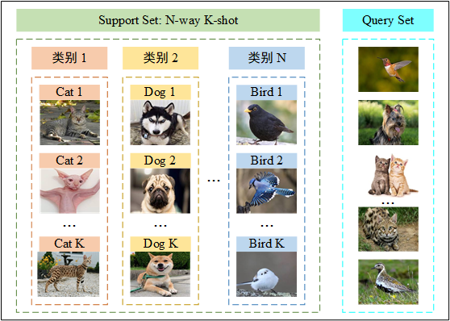
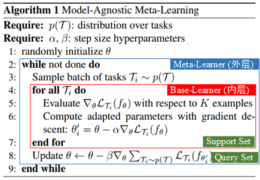
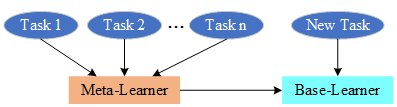
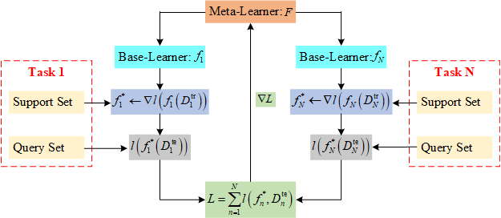

# 元学习

## 1 元学习概念

元学习 (Meta-Learning) 通常被理解为“学会学习 (Learning-to-Learn)”，
指的是在多个学习阶段改进学习算法的过程。
在基础学习过程中，
内部（或下层/基础）学习算法解决由数据集和目标定义的任务。
在元学习过程中，外部（或上层/元）算法更新内部学习算法，使其学习的模型改进外部目标。
因此，元学习的核心想法是学习一个先验知识 (prior)。

## 2 元学习含义

元学习的含义有两层，
第一层是让机器学会学习，使其具备分析和解决问题的能力，
机器通过完成任务获取经验，提高完成任务的能力; 
第二层是让机器学习模型可以更好地泛化到新领域中，
从而完成差异很大的新任务。

Few-Shot Learning 是 Meta-Learning 在监督学习领域的应用。
在 Meta-training 阶段，
将数据集分解为不同的任务，去学习类别变化的情况下模型的泛化能力。
在 Meta-testing 阶段，
面对全新的类别，不需要变动已有的模型，只需要通过一部或者少数几步训练，就可以完成需求。

## 3 元学习单位

元学习的基本单元是任务，任务结构如图1所示。
元训练集 (Meta-Training Data)、元验证集 (Meta-Validation Data) 和元测试集 (Meta-Testing Data) 都是由抽样任务组成的任务集合。
元训练集和元验证集中的任务用来训练元学习模型，
元测试集中的任务用来衡量元学习模型完成任务的效果。

在元学习中，之前学习的任务称为元训练任务 (meta-train task)，
遇到的新任务称为元测试任务 (meta-test task)。
每个任务都有自己的训练集和测试集，
内部的训练集和测试集一般称为支持集 (Support Set) 和查询集 (Query Set)。
支持集又是一个 N-Way K-Shot 问题，即有 N 个类别，每个类有 K 个样例。 

图1 任务结构。

## 4 基学习器和元学习器

元学习本质上是层次优化问题 (双层优化问题 Bilevel Optimization Problem)，
其中一个优化问题嵌套在另一个优化问题中。
外部优化问题和内部优化问题通常分别称为上层优化问题和下层优化问题，
如图2所示的MAML。

图2 双层优化元学习 MAML。

两层优化问题涉及两个参与器：
1) 上层的参与者是元学习器，
2) 下层的参与者是基学习器。
元学习器的最优决策依赖于基学习器的反应，基学习器自身会优化自己内部的决策。
这两个层次有各自不同的目标函数、约束条件和决策变量。
基学习器和元学习器的作用对象及功能如图3所示。

图3 基学习器和元学习器。元学习器总结任务经验进行任务之间的共性学习，同时指导基学习器对新任务进行特性学习。 

### 4.1 基学习器

基学习器 (Base-Learner)，是基础层中的模型，
每次训练基础学习器时，考虑的是单个任务上的数据集，其基本功能如下：

- 在单个任务上训练模型，学习任务特性，找到规律，回答任务需要解决的问题。

- 从元学习器获取对完成单个任务有帮助的经验，包括初始模型和初始参数等。

- 使用单个任务中的训练数据集，构建合适的目标函数，
设计需要求解的优化问题，从初始模型和初始参数开始进行迭代更新。

- 在单个任务上训练完成后，将训练的模型和参数都反馈给元学习器。

### 4.2 元学习器

元学习器 (Meta-Learner)，是元层中的模型，对所有任务上的训练经验进行归纳总结。
每次训练基础学习器后，元学习器都会综合新的经验，更新元学习器中的参数，其基本功能如下：

- 综合多个任务上基学习器训练的结果。

- 对多个任务的共性进行归纳，在新任务上进行快速准确的推理，
并且将推理输送给基学习器，作为初始模型和初始参数值，
或者是其他可以加速基学习器训练的参数。

- 指引基学习器的最优行为或探索某个特定的新任务。

- 提取任务上与模型和训练相关的特征。

## 5 元学习工作原理

元学习的主要目的是寻找元学习器 $F$, 
在 $F$ 的指导下基学习器 $f$ 在支持集 (support set) $D^{\mathrm{tr}}$ 的作用下经过几步微调就可以得到适应当前新任务的最优状态 $f^{*}$。而 $F$ 的优化需要当前所有任务损失的累计和，
即 $\nabla\sum_{n=1}^{N} l \left( f_{n}^{*}, D_{n}^{\mathrm{te}} \right)$。
元学习工作原理如图4所示。

图4 元学习工作原理。 

### 5.1 元学习训练过程

以分类任务为例，元学习中 N-Way K-Shot 问题的具体训练过程:

首先提供一个 few-shot 的数据集，该数据集一般包含了很多的类别，
每个类别中又包含了很多个样本。
对训练集进行划分，随机选出若干类别作为训练集，剩余类别作为测试集。

**meta-train 阶段：**

- 在训练集中随机抽取 N 个类，每个类 K 个样本，为支持集 (support set)，
剩余样本为查询集 (query set)；
support set 和 query set 构成一个 task。

- 每次采样一个 task 进行训练，称为一个 episode；
一次性选取若干个 task，构成一个 batch；

- 一次 meta-train 可以训练多个 batch；

- 遍历所有 batch 后完成训练。

**meta-test 阶段：**

- 在测试集中随机抽取 N 个类别，每个类别 K 个样本，作为 train set，
剩余样本作为 test set。

- 用 support set 来 fine-tune 模型；

- 用 test set 来测试模型（这里的 test set 就是真正希望模型能够用于分类的数据）。

上述训练过程中，每次训练 (episode) 都会采样得到不同 task，
所以总体来看，训练包含了不同的类别组合，
这种机制使得模型学会不同 task 中的共性部分，
比如如何提取重要特征及比较样本相似等，忘掉 task 中 task 相关部分。
通过这种学习机制学到的模型，在面对新的未见过的 task 时，也能较好地进行分类。

## 6 元学习关键

元学习的关键在于发现不同问题之间的普适规律，通过推广普适规律解决末知难题。普适规律需要达到对问题共性和特性表示力的均衡。普适规律的寻找主要依赖于以下几点：

- 发现已经解决的问题和新问题之间联系密切的部分，提取已经解决的问题的普适规律，用于新问题的解决；

- 将新问题分解，化繁为简，在已经解决的问题中找到与新问题各个子任务联系紧密的普适规律，以及这些规律的适用范围；

- 在新问题中学习推理逻辑，使用推理逻辑来对新问题进行表示，在这些表示中寻找规律，通过新问题自身各个部分之间的推理逻辑，找到解决新问题的办法。

## 7 元学习分类

- 基于优化的元学习：如 MAML, Reptile, LEO, ...

- 基于度量的元学习：如 SNAIL, RN, PN, MN, ...

- 基于模型的元学习：如 Learning to learn, Meta-learner LSTM, ...
