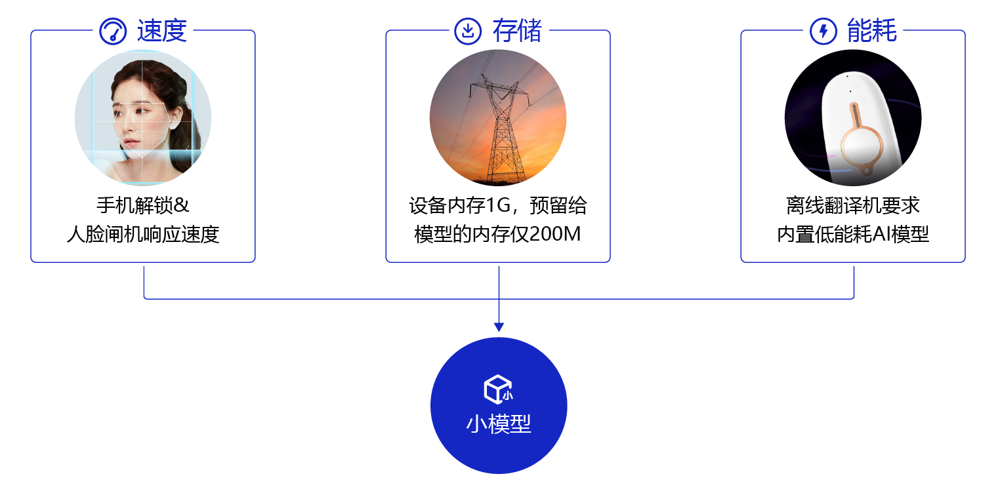
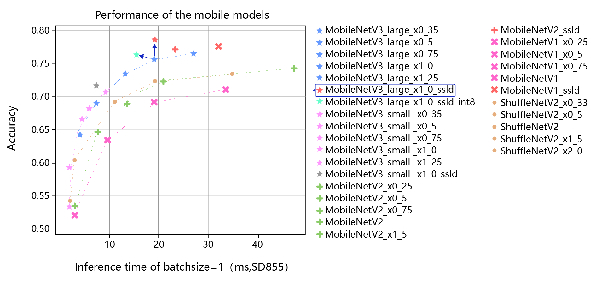
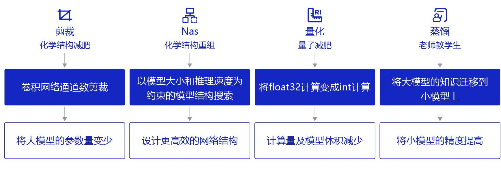

# 模型压缩概述

## 1. 为什么需要模型压缩

理论上来说，深度神经网络模型越深，非线性程度也就越大，相应的对现实问题的表达能力越强，但相应的代价是，训练成本和模型大小的增加。同时，在部署时，大模型预测速度较低且需要更好的硬件支持。但随着深度学习越来越多的参与到产业中，很多情况下，需要将模型在手机端、IoT端部署，这种部署环境受到能耗和设备体积的限制，端侧硬件的计算能力和存储能力相对较弱，突出的诉求主要体现在以下三点：

* 首先是速度，比如像人脸闸机、人脸解锁手机等应用，对响应速度比较敏感，需要做到实时响应。
* 其次是存储，比如电网周边环境监测这个应用场景中，要图像目标检测模型部署在可用内存只有200M的监控设备上，且当监控程序运行后，剩余内存会小于30M。
* 最后是耗能，离线翻译这种移动设备内置AI模型的能耗直接决定了它的续航能力。 

  

以上三点诉求都需要我们根据终端环境对现有模型进行小型化处理，在不损失精度的情况下，让模型的体积更小、速度更快，能耗更低。

但如何能产出小模型呢？常见的方式包括设计更高效的网络结构、将模型的参数量变少、将模型的计算量减少，同时提高模型的精度。 可能有人会提出疑问，为什么不直接设计一个小模型？ 要知道，实际业务子垂类众多，任务复杂度不同，在这种情况下，人工设计有效小模型难度非常大，需要非常强的领域知识。而模型压缩可以在经典小模型的基础上，稍作处理就可以快速拔高模型的各项性能，达到“多快好省”的目的。

  

上图是分类模型使用了蒸馏和量化的效果图，横轴是推理耗时，纵轴是模型准确率。 图中最上边红色的星星对应的是在MobileNetV3_large model基础上，使用蒸馏后的效果，相比它正下方的蓝色星星，精度有明显的提升。 图中所标浅蓝色的星星，对应的是在MobileNetV3_large model基础上，使用了蒸馏和量化的结果，相比原始模型，精度和推理速度都有明显的提升。 可以看出，在人工设计的经典小模型基础上，经过蒸馏和量化可以进一步提升模型的精度和推理速度。

## 2. 模型压缩的基本方法

模型压缩可以通过以下几种方法实现：

  

- 剪裁：类似“化学结构式的减肥”，将模型结构中对预测结果不重要的网络结构剪裁掉，使网络结构变得更加 ”瘦身“。比如，在每层网络，有些神经元节点的权重非常小，对模型加载信息的影响微乎其微。如果将这些权重较小的神经元删除，则既能保证模型精度不受大影响，又能减小模型大小。
- 量化：类似“量子级别的减肥”，神经网络模型的参数一般都用float32的数据表示，但如果我们将float32的数据计算精度变成int8的计算精度，则可以牺牲一点模型精度来换取更快的计算速度。
- 蒸馏：类似“老师教学生”，使用一个效果好的大模型指导一个小模型训练，因为大模型可以提供更多的软分类信息量，所以会训练出一个效果接近大模型的小模型。
- 神经网络架构搜索（NAS）：类似“化学结构式的重构”，以模型大小和推理速度为约束进行模型结构搜索，从而获得更高效的网络结构。

除此以外，还有权重共享、低秩分解等技术也可实现模型压缩。