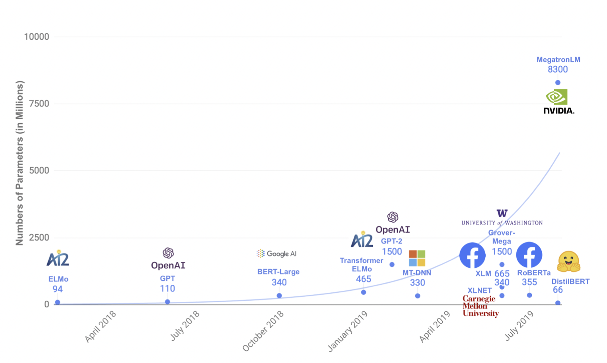
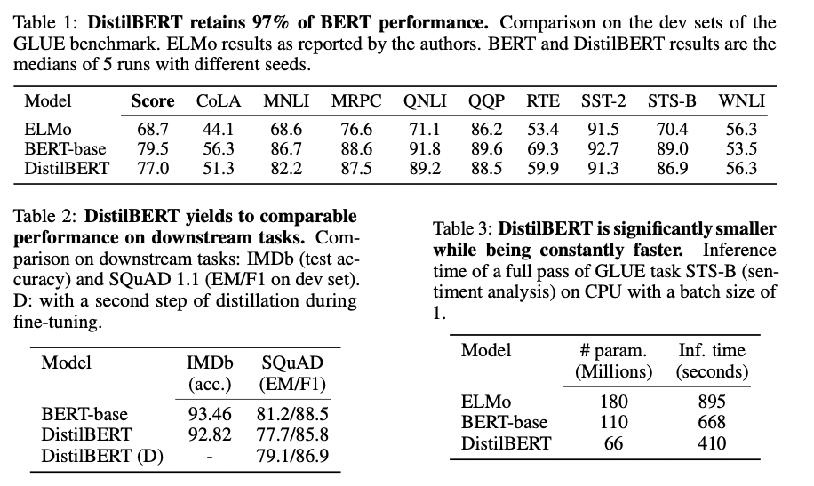

# DistilBERT

## 1. DistilBERT 简介

论文地址：[DistilBERT, a distilled version of BERT: smaller, faster, cheaper and lighter](https://arxiv.org/pdf/1910.01108.pdf)

图1: 几个预训练模型的参数量统计
  

近年来，大规模预训练语言模型成为NLP任务的基本工具，虽然这些模型带来了显著的改进，但它们通常拥有数亿个参数（如图1所示），而这会引起两个问题。首先，大型预训练模型需要的计算成本很高。其次，预训练模型不断增长的计算和内存需求可能会阻碍语言处理应用的广泛落地。因此，作者提出DistilBERT，它表明小模型可以通过知识蒸馏从大模型中学习，并可以在许多下游任务中达到与大模型相似的性能，从而使其在推理时更轻、更快。

## 2. 模型实现

**学生网络结构**

学生网络DistilBERT具有与BERT相同的通用结构，但token-type embedding和pooler层被移除，层数减半。学生网络通过从教师网络中每两层抽取一层来进行初始化。

**Training loss**

$L_{ce}$ 训练学生模仿教师模型的输出分布：

$$
L_{ce} = \sum_i t_i * log(s_i)
$$
其中，$t_i$和$s_i$分别是教师网络和学生网络的预测概率。

同时使用了Hinton在2015年提出的*softmax-temperature*：

$$
p_i = \frac{exp(z_i/T)}{\sum_j exp(z_j/T)}
$$
其中，$T$控制输出分布的平滑度，当T变大时，类别之间的差距变小；当T变小时，类别间的差距变大。$z_i$代表分类$i$的模型分数。在训练时对学生网络和教师网络使用同样的temperature $T$，在推理时，设置$T=1$，恢复为标准的softmax
最终的loss函数为$L_{ce}$、*Mask language model loss* $L_{mlm}$（参考BERT）和 *cosine embedding loss* $L_{cos}$（student和teacher隐藏状态向量的cos计算）的线性组合。

## 3. 实验结果

图2：在GLUE数据集上的测试结果、下游任务测试和参数量对比<
  

根据上图我们可以看到，DistilBERT与BERT相比减少了40%的参数，同时保留了BERT 97%的性能，但提高了60%的速度。