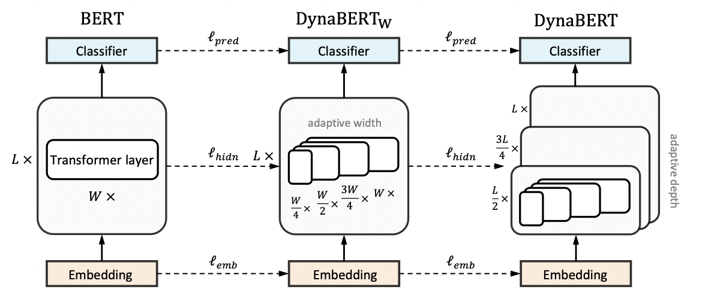
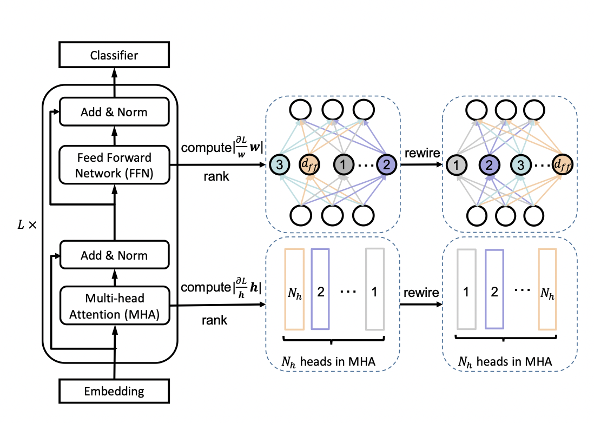
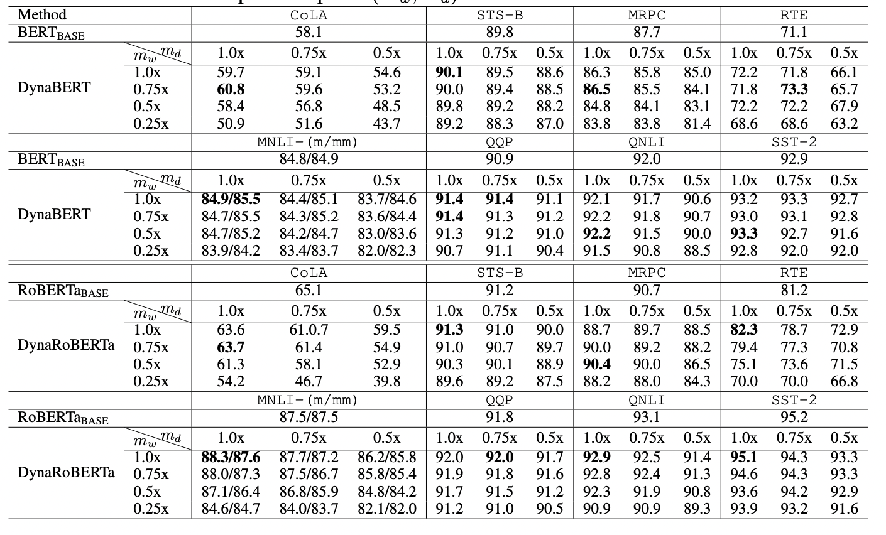
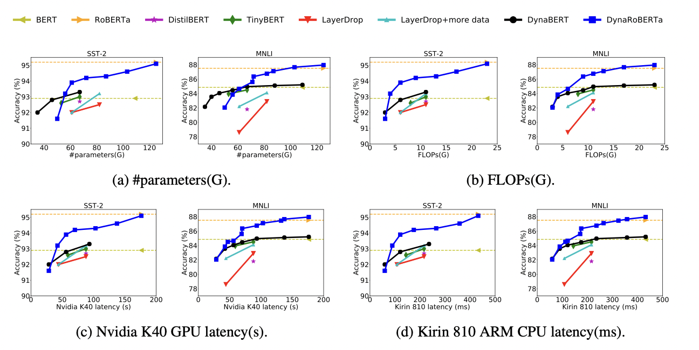

# DynaBERT

## 1. DynaBERT 简介

论文地址：[DynaBERT: Dynamic BERT with Adaptive Width and Depth](https://arxiv.org/pdf/2004.04037.pdf)

预训练模型，如BERT，在自然语言处理任务中的强大之处是毫无疑问，但是由于模型参数量较多、模型过大等问题，在部署方面对设备的运算速度和内存大小都有着极高的要求。因此，面对实际产业应用时，比如将模型部署到手机上时，就需要对模型进行瘦身压缩。近年的模型压缩方式基本上都是将大型的BERT网络压缩到一个固定的小尺寸网络。而实际工作中，不同的任务对推理速度和精度的要求不同，有的任务可能需要四层的压缩网络而有的任务会需要六层的压缩网络。DynaBERT（dynamic BERT）提出一种不同的思路，它可以通过选择自适应宽度和深度来灵活地调整网络大小，从而得到一个尺寸可变的网络。

## 2. 模型实现

DynaBERT的训练阶段包括两部分，首先通过知识蒸馏的方法将teacher BERT的知识迁移到有自适应宽度的子网络student $DynaBERT_W$中，然后再对 $DynaBERT_W$ 进行知识蒸馏得到同时支持深度自适应和宽度自适应的子网络 DynaBERT。训练过程流程图如图1所示。

图1： DynaBERT的训练过程
  

**宽度自适应 Adaptive Width**

一个标准的transfomer中包含一个多头注意力（MHA）模块和一个前馈网络（FFN）。在论文中，作者通过变换注意力头的个数 $N_h$ 和前馈网络中中间层的神经元个数 $d_{ff}$ 来更改transformer的宽度。同时定义一个缩放系数 $m_w$ 来进行剪枝，保留MHA中最左边的 $[m_wN_H]$ 个注意力头和 FFN中 $[m_wd_{ff}]$ 个神经元。

为了充分利用网络的容量，更重要的头部或神经元应该在更多的子网络中共享。因此，在训练宽度自适应网络前，作者在 fine-tuned BERT网络中根据注意力头和神经元的重要性对它们进行了排序，然后在宽度方向上以降序进行排列。这种选取机制被称为 **Network Rewiring**。

图2: Network Rewiring
  

那么，要如何界定注意力头和神经元的重要性呢？作者参考 [P. Molchanov et al., 2017](https://arxiv.org/pdf/1611.06440.pdf) 和 [E. Voita et al., 2019](https://arxiv.org/pdf/1804.07461.pdf) 两篇论文提出，去掉某个注意力头或神经元前后的loss变化，就是该注意力头或神经元的重要程度，变化越大则越重要。

**训练宽度自适应网络**

首先，将BERT网络作为固定的教师网络，并初始化 $DynaBERT_W$。然后通过知识蒸馏将知识从教师网络迁移到 $DynaBERT_W$ 中不同宽度的学生子网络。其中，$m_w = [1.0, 0.75, 0.5, 0.25]$。

模型蒸馏的loss定义为：

$$
L = \lambda_1l_{pred}(y^{(m_w)}, y) + \lambda_2(l_{emb}(E^{(m_w)},E) + l_{hidn}(H^{(m_w)}, H))
$$

其中， $\lambda_1, \lambda_2$ 是控制不同损失函数权重的参数， $l_{pred}, l_{emb}, l_{hidn}$ 分别定义为：

$$
\begin{align}
l_{pred}(y^{(m_w)}, y) &= SCE(y^{(m_w)}, y), \\
l_{emb}(E^{(m_w)}, E) &= MSE(E^{(m_w)}, E), \\
l_{hidn}(H^{(m_w)}, H) &= \sum^{L}_{l=1} MSE(H^{(m_w)}_l, H_l) \\
\end{align}
$$

$l_{pred}$ 代表预测层的loss，SCE 代表交叉熵损失函数。$l_{emb}$ 代表嵌入层的loss，MSE代表均方差损失函数。$l_{hidn}$ 则为隐藏层的loss。

**训练深度自适应网络**

训练好宽度自适应的$DynaBERT_W$后，就可以将其作为教师网络训练同时具备宽度自适应和深度自适应的DynaBERT了。为了避免宽度方向上的灾难性遗忘，在每一轮训练中，仍对不同宽度进行训练。深度调节系数 $m_d$ 对网络层数进行调节，在训练中定义 $m_d = [1.0, 0.75, 0.5]$。深度方向上的剪枝根据 $mod(d+1, \frac{1}{m_d}) = 0$ 来去掉特定层。

模型蒸馏的loss定义为：

$$
L = \lambda_1l^{'}_{pred}(y^{(m_w,m_d)},y^{(m_w)}) + \lambda_2(l^{'}_{emb}(E^{(m_w,m_d)},E^{(m_w)}+l^{'}_{hidn}(H^{(m_w,m_d)},H^{(m_w)}))
$$

## 3. 实验结果

根据不同的宽度和深度剪裁系数，作者最终得到12个大小不同的DyneBERT模型，其在GLUE上的效果如下：

图3: results on GLUE benchmark
  

图4:Comparison of #parameters, FLOPs, latency on GPU and CPU between DynaBERT and DynaRoBERTa and other methods.
  

 可以看到论文中提出的DynaBERT和DynaRoBERTa可以达到和 $BERT_{BASE}$ 及 $DynaRoBERTa$ 相当的精度，但是通常包含更少的参数，FLOPs或更低的延迟。在相同效率的约束下，从DynaBERT中提取的子网性能优于DistilBERT和TinyBERT。

