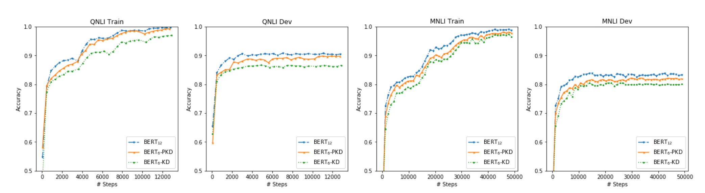
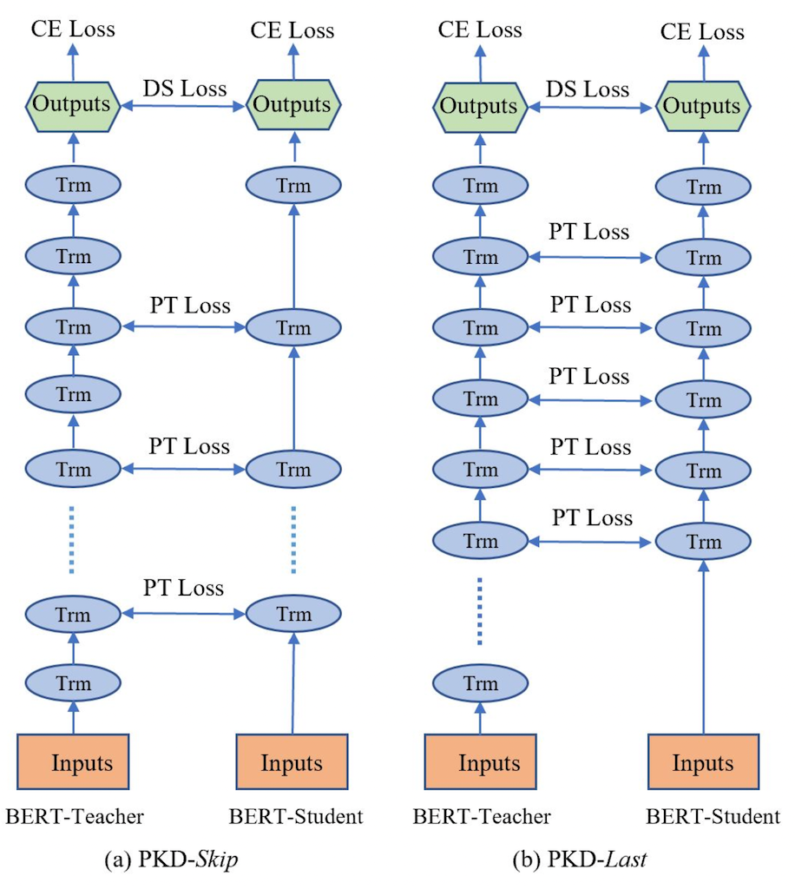
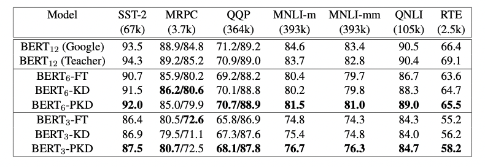
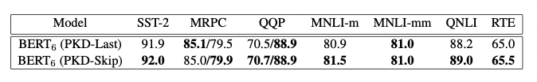
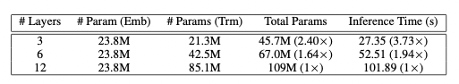

# Patient-KD

## 1. Patient-KD 简介

论文地址：[Patient Knowledge Distillation for BERT Model Compression](https://www.aclweb.org/anthology/D19-1441.pdf)

图1: Vanilla KD和PKD比较
  

BERT预训练模型对资源的高需求导致其很难被应用在实际问题中，为缓解这个问题，论文中提出了Patient Knowledge Distillation（Patient KD）方法，将原始大模型压缩为同等有效的轻量级浅层网络。同时，作者对以往的知识蒸馏方法进行了调研，如图1所示，vanilla KD在QNLI和MNLI的训练集上可以很快的达到和teacher model相媲美的性能，但在测试集上则很快达到饱和。对此，作者提出一种假设，在知识蒸馏的过程中过拟合会导致泛化能力不良。为缓解这个问题，论文中提出一种“耐心”师生机制，即让Patient-KD中的学生模型从教师网络的多个中间层进行知识提取，而不是只从教师网络的最后一层输出中学习。

## 2. 模型实现

Patient-KD中提出如下两个知识蒸馏策略：

1. PKD-Skip: 从每k层学习，这种策略是假设网络的底层包含重要信息，需要被学习到（如图2a所示）
2. PKD-last: 从最后k层学习，假设教师网络越靠后的层包含越丰富的知识信息（如图2b所示）

图2a: PKD-Skip 学生网络学习教师网络每两层的输出 图2b: PKD-Last 学生网络从教师网络的最后六层学习
  

因为在BERT中仅使用最后一层的[CLS] token的输出来进行预测，且在其他BERT的变体模型中，如SDNet，是通过对每一层的[CLS] embedding的加权平均值进行处理并预测。由此可以推断，如果学生模型可以从任何教师网络中间层中的[CLS]表示中学习，那么它就有可能获得类似教师网络的泛化能力。

因此，Patient-KD中提出特殊的一种损失函数的计算方式：

$$
L_{PT} = \sum_{i=1}^{N}\sum_{j=1}^{M} \left \| \frac{h_{i,j}^s}{\left \| h_{i,j}^s \right \|_{2}} - \frac{h_{i, I_{pt}(j)}^t}{\left \| h_{i, I_{pt}(j)}^t \right \|_2}\right \|_2^2
$$

其中，对于输入$x_i$，所有层的[CLS]的输出表示为：

$$
h_i = [h_{i,1}, h_{i,2},..., h_{i,k}] = BERT_{k}(x_i) \in \mathbb{R}^{k\times d}​
$$
$I_{pt}$表示要从中提取知识的一组中间层，以从$BERT_{12}$压缩到$BERT_6$为例，对于PKD-Skip策略，$I_{pt} = {2,4,6,8,10}$；对于PKD-Last策略，$I_{pt} = {7,8,9,10,11}$。M表示学生网络的层数，N是训练样本的数量，上标s和t分别代表学生网络和教师网络。

同时，Patient-KD中也使用了$L_{DS}$和$L_{CE}^S$两种损失函数用来衡量教师和学生网络的预测值的距离和学生网络在特定下游任务上的交叉熵损失。

$$
L_{DS}=-\sum_{i \in [N]} \sum_{c \in C}[P^t(y_i = c|x_i;\hat{\theta}^t)\cdot log P^s(y_i = c |x_i; \theta^s)]
$$

$$
L_{CE}^s=-\sum_{i \in [N]} \sum_{c \in C}\mathbb{1}[y_i=c]\cdot log P^s(y_i = c|x_i;\theta^s)]
$$

最终的目标损失函数可以表示为：

$$
L_{PKD} = (1-\alpha)L_{CE}^S+\alpha L_{DS} + \beta L_{PT}
$$

## 3. 实验结果

图3: results from the GLUE test server
  

作者将模型预测提交到GLUE并获得了在测试集上的结果，如图3所示。与fine-tuning和vanilla KD这两种方法相比，使用PKD训练的$BERT_3$和$BERT_6$在除MRPC外的几乎所有任务上都表现良好。其中，PKD代表Patient-KD-Skip方法。对于MNLI-m和MNLI-mm，六层模型比微调（FT）基线提高了1.1%和1.3%，

我们将模型预测提交给官方 GLUE 评估服务器以获得测试数据的结果。 结果总结在表 1 中。 与直接微调和普通 KD 相比，我们使用 BERT3 和 BERT6 学生的 Patient-KD 模型在除 MRPC 之外的几乎所有任务上都表现最好。 此外，6层的$BERT_{6}-PKD$在7个任务中有5个都达到了和BERT-Base相似的性能，其中，SST-2（与 BERT-Base 教师相比为-2.3%）、QQP（-0.1%）、MNLI-m（-2.2%）、MNLI-mm（-1.8%）和 QNLI (-1.4%))，这五个任务都有超过6万个训练样本，这表明了PKD在大数据集上的表现往往更好。

图4: PKD-Last 和 PKD-Skip 在GLUE基准上的对比 
  

尽管这两种策略都比vanilla KD有所改进，但PKD-Skip的表现略好于PKD-Last。作者推测，这可能是由于每k层的信息提炼捕获了从低级到高级的语义，具备更丰富的内容和更多不同的表示，而只关注最后k层往往会捕获相对同质的语义信息。

图5: 参数量和推理时间对比
  

图5展示了$BERT_3$、$BERT_6$、$BERT_12$的推理时间即参数量, 实验表明Patient-KD方法实现了几乎线性的加速，$BERT_6$和$BERT_3$分别提速1.94倍和3.73倍。

